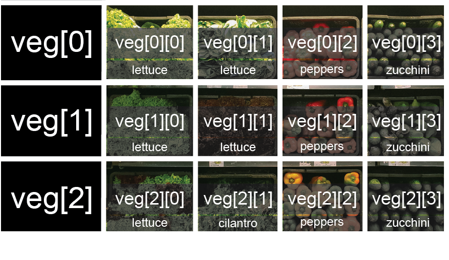

::: callout-outcomes

## Learning Outcomes

- Assign values to variables.
- Explain what a list is.
- Create and index lists of simple values.
- Change the values of individual elements
- Append values to an existing list
- Reorder and slice list elements
- Create and manipulate nested lists
:::

::: callout-questions

## Questions

- What basic data types can I work with in Python?
- How can I create a new variable in Python?
- How do I use a function?
- Can I change the value associated with a variable after I create it?
- How can I get help while learning to program?
- How can I store many values together?
:::

## Structure & Agenda

1. Variables and data types (`int`, `float`, `str`) (~20 min)  
2. Built-in functions and basic debugging (~20 min)  
3. Lists, mutability, and nested data (~20 min)  
4. Slicing patterns and operator behavior (~20 min)  

> 🔧 Activities spaced throughout the session  

## Variables and Data Types

Any Python interpreter can be used as a calculator:

```{python}
3 + 5 * 4
```

This is great but not very interesting.

## Variables

To do anything useful with data, we need to assign its value to a *variable*. In Python, we can [assign](../learners/reference.qmd#assign) a value to a [variable](../learners/reference.qmd#variable), using the equals sign `=`. For example, we can track the weight of a patient who weighs 60 kilograms by assigning the value `60` to a variable `weight_kg`:

```{python}
weight_kg = 60
```

From now on, whenever we use `weight_kg`, Python will substitute the value we assigned to it. In layperson's terms, **a variable is a name for a value**.

## Naming Variables

In Python, variable names:

- can include letters, digits, and underscores
- cannot start with a digit
- are [case sensitive](../learners/reference.qmd#case-sensitive).

This means that, for example:

- `weight0` is a valid variable name, whereas `0weight` is not
- `weight` and `Weight` are different variables

## Types of Data

Python knows various types of data. Three common ones are:

- integer numbers
- floating point numbers, and
- strings.

In the example above, variable `weight_kg` has an integer value of `60`.

If we want to more precisely track the weight of our patient, we can use a floating point value by executing:

```{python}
weight_kg = 60.3
```

To create a string, we add single or double quotes around some text. To identify and track a patient throughout our study, we can assign each person a unique identifier by storing it in a string:

```{python}
patient_id = '001'
```

## Using Variables

Once we have data stored with variable names, we can make use of it in calculations. We may want to store our patient's weight in pounds as well as kilograms:

```{python}
weight_lb = 2.2 * weight_kg
```

We might decide to add a prefix to our patient identifier:

```{python}
patient_id = 'inflam_' + patient_id
```

## Built-in Functions

To carry out common tasks with data and variables in Python, the language provides us with several built-in [functions](../learners/reference.qmd#function). To display information to the screen, we use the `print` function:

```{python}
print(weight_lb)
print(patient_id)
```

When we want to make use of a function, referred to as **calling** the function, we follow its name by parentheses. The parentheses are important: if you leave them off, the function doesn't actually run!

Sometimes you will include values or variables inside the parentheses for the function to use. In the case of `print`, we use the parentheses to tell the function what value we want to display. We will learn more about how functions work and how to create our own in later episodes.

We can display multiple things at once using only one `print` call:

```{python}
print(patient_id, 'weight in kilograms:', weight_kg)
```

> 🧪 Try changing the values in parentheses.

We can also call a function inside of another [function call](../learners/reference.qmd#function-call). For example, Python has a built-in function called `type` that tells you a value's data type:

```{python}
print(type(60.3))
print(type(patient_id))
```

Use `type()` when you are unsure what kind of value a variable holds. This can be used to investigate subtle bugs.

:::: {.callout-task}
#### Challenge: Inspecting Types

::: {.panel-tabset}
##### Task
What are the data types of the following variables?

```{python}
planet = 'Earth'
apples = 5
distance = 10.5
```

##### Solution
```{python}
planet = 'Earth'
apples = 5
distance = 10.5

print(type(planet))
print(type(apples))
print(type(distance))
```
:::
:::: 


We can also do arithmetic with variables right inside the `print` function:

```{python}
# There are 2.2 pounds per kilogram
print('weight in pounds:', 2.2 * weight_kg)
```

> 🧪 Try changing the arithmetic formula.

::: {.callout-tip}
Everything in a line of code following the '#' symbol is a [comment](../learners/reference.qmd#comment) that is ignored by Python. Comments allow programmers to leave explanatory notes for other programmers or their future selves.
:::

The above command, however, did not change the value of `weight_kg`:

```{python}
print(weight_kg)
```

To change the value of the `weight_kg` variable, we have to **assign** `weight_kg` a new value using the equals `=` sign:

```{python}
weight_kg = 65.0
print('weight in kilograms is now:', weight_kg)
```

> 🧪 Try changing the value of `weight_kg`.

## Getting Help

Use the built-in function `help` to get help for a function. Every built-in function has extensive [documentation that can also be found online](https://docs.python.org/3/library/index.html).

```{python}
help(print)
```
This help message (the function's "docstring") includes a usage statement, a list of parameters accepted by the function, and their default values if they have them.

::: {.callout-tip}
`help()` and documentation are useful when syntax or parameters are unclear.
:::

:::: {.callout-note appearance="simple"}
## Variables as Sticky Notes

A variable in Python is analogous to a sticky note with a name written on it: assigning a value to a variable is like putting that sticky note on a particular value.

{alt='Value of 65.0 with weight\_kg label stuck on it'}

::: {.callout-tip}
Assignment links a name to a value stored in memory.
:::

Using this analogy, we can investigate how assigning a value to one variable does **not** change values of other, seemingly related, variables. For example, let's store the subject's weight in pounds in its own variable:

```{python}
weight_lb = 2.2 * weight_kg
print('weight in kilograms:', weight_kg, 'and in pounds:', weight_lb)
```

{alt='Value of 65.0 with weight\_kg label stuck on it, and value of 143.0 with weight\_lb label stuck on it'}

`weight_lb` stores a value that was computed at a moment in time. It does not keep a link to the expression `2.2 * weight_kg`. This is a common pitfall worth emphasizing. Let’s now change `weight_kg`:

```{python}
weight_kg = 100.0
print('weight in kilograms is now:', weight_kg, 'and weight in pounds is still:', weight_lb)
```

{alt='Value of 100.0 with label weight_kg stuck on it, and value of 143.0 with label weight_lb stuck on it'}

::: {.callout-tip}
Reassigning one variable does not automatically recalculate other variables.
:::

::::

:::: {.callout-task}
#### Challenge: Predict Variable Values

::: {.panel-tabset}
##### Task
Before running this code, try to predict the values of `mass` and `age` when each line is run.

```{python}
mass = 47.5
age = 122
mass = mass * 2.0
age = age - 20
```


##### Hints

On each line, the right-hand side is evaluated first, then the variable is updated.

Run one line at a time and track each variable.


##### Solution

`mass` holds a value of 47.5, `age` does not exist

`mass` still holds a value of 47.5, `age` holds a value of 122

`mass` now has a value of 95.0, `age`'s value is still 122

`mass` still has a value of 95.0, `age` now holds 102

:::
::::


## Multiple Assignments

Python can assign multiple variables in one line. This may be useful for swapping values without introducing an extra variable.

```{python}
first, second = 'Grace', 'Hopper'
print(first, second)
```

```{python}
first, second = second, first
print(first, second)
```

## Lists

A [list](../learners/reference.qmd#list) lets you store many related values in one variable. Use lists when order matters and values belong together. For example, daily temperatures, sample IDs, or repeated measurements from one experiment.

We create a list by putting values inside square brackets and separating the values with commas:

```{python}
odds = [1, 3, 5, 7]
print('odds are:', odds)
```

## Read List Elements by Position

We can access elements of a list using indices. Indices are positions of elements in the list. In Python indices start at `0`, so the first element has an index of `0` and the fourth has an index of `3`.

```{python}
print('first element:', odds[0])
print('last element:', odds[3])
print('last element with -1:', odds[-1])
print('second to last element:', odds[-2])
```

> 💡 Negative indices count from the end of a sequence.

Programming languages like Fortran, MATLAB and R start counting at 1 because that's what human beings have done for thousands of years. Languages in the C family (including C++, Java, Perl, and Python) count from 0 because it represents an offset from the first value in the array (the second value is offset by one index from the first value). This is closer to the way that computers represent arrays (if you are interested in the historical reasons behind counting indices from zero, you can read [Mike Hoye's blog post](https://exple.tive.org/blarg/2013/10/22/citation-needed/)).

## Update List Elements In Place

Lists are [mutable](../learners/reference.qmd#mutable), so single elements can be edited. The change happens directly in the existing list object.

```{python}
names = ['Curie', 'Darwing', 'Turing']  # typo in Darwin's name
print('before:', names)
names[1] = 'Darwin'  # correct the name
print('after:', names)
```

## Why Strings Behave Differently

Strings are [immutable](../learners/reference.qmd#immutable) in Python. You can replace a whole string with a new one, but you cannot change individual characters of an existing string in place. This distinction between mutable and immutable types appears throughout Python.

```{python}
name = 'Darwin'
name[0] = 'd'
```

::: {.callout-caution}
This raises a `TypeError` because strings do not support item assignment.
:::

## Mutability and Side Effects

- Strings and numbers are immutable.
- Lists are mutable.

Mutable types can have surprising side effects when multiple variables refer to the same object.

```{python}
mild_salsa = ['peppers', 'onions', 'cilantro', 'tomatoes']
hot_salsa = mild_salsa
hot_salsa[0] = 'hot peppers'
print('mild salsa:', mild_salsa)
print('hot salsa:', hot_salsa)
```

::: {.callout-note}
Both variables changed because they refer to the same list in memory.
:::

## Copy Before Editing

Create an explicit copy when you need independent lists.

```{python}
mild_salsa = ['peppers', 'onions', 'cilantro', 'tomatoes']
hot_salsa = list(mild_salsa)
hot_salsa[0] = 'hot peppers'
print('mild salsa:', mild_salsa)
print('hot salsa:', hot_salsa)
```

This is often the safest default when learners are still building confidence with references because code which modifies data in place can be more difficult to understand. However it is often more efficient to modify large data structures in place than to create a modified copy for every change.

::: {.callout-note}
Mutability is a key idea for debugging surprising state changes.
:::

## Nested Lists

A list can contain any Python variables, including other lists.

For example, you could represent the products on the shelves of a small grocery shop as a nested list called `veg`:

{alt='veg is represented as a shelf full of produce. There are three rows of vegetables on the shelf, and each row contains baskets of vegetables.'}

To store the contents of the shelf in a nested list, you write it this way:

```{python}
veg = [
    ['lettuce', 'lettuce', 'peppers', 'zucchini'],
    ['lettuce', 'lettuce', 'peppers', 'zucchini'],
    ['lettuce', 'cilantro', 'peppers', 'zucchini']
]
```

You can reference each row on the shelf as a separate list. For example, `veg[2]` represents the bottom row.

```{python}
veg = [
    ['lettuce', 'lettuce', 'peppers', 'zucchini'],
    ['lettuce', 'lettuce', 'peppers', 'zucchini'],
    ['lettuce', 'cilantro', 'peppers', 'zucchini']
]

print(veg[2])
print(veg[0])
```

Use two indices for nested lists. Think of the first index as selecting a row and the second as selecting a position inside that row.

```{python}
print(veg[0][0])
print(veg[1][2])
```

{alt='Nested list index map where first index selects row and second index selects basket in that row.'}

::: {.callout-tip}
Pattern: `nested_list[row][column]`.
:::

## Lists Can Hold Mixed Types

Lists can contain values of different data types.

```{python}
sample_ages = [10, 12.5, 'Unknown']
print(sample_ages)
```

::: {.callout-caution}
This flexibility is useful, but if not intentional, can make debugging harder.
:::

## Modifying Lists in Place

Common methods to modify lists in place include `append`, `pop`, `reverse`, and `sort`. Use `append` to add one item, `pop` to remove and return an item, `reverse` to flip the order, and `sort` to sort the list in place.

```{python}
odds = [1, 3, 5, 7]
odds.append(11)
print('odds after appending a value:', odds)
removed_element = odds.pop(0)
print('odds after popping an element:', odds)
print('popped element:', removed_element)
odds.reverse()
print('odds after reversing:', odds)
odds.append(9)
print('odds after appending a value:', odds)
odds.sort()
print('odds after sorting:', odds)
```

## Method Calls Follow the Same Reference Rules

If two names refer to one list, method calls through either name change that shared list.

```{python}
odds = [3, 5, 7]
primes = odds
primes.append(2)
print('primes:', primes)
print('odds:', odds)
```

## Make an Independent Copy First

```{python}
odds = [3, 5, 7]
primes = list(odds)
primes.append(2)
print('primes:', primes)
print('odds:', odds)
```

::: {.callout-tip}
Copy first whenever one list should change and the other should stay unchanged.
:::

## Slicing

## Slice Sequences with `start:stop`

A section of a list or string is called a [slice](../learners/reference.qmd#slice). To slice a list or string, we use a `start` index and a `stop` index. The start index is included, but the stop index is excluded. This \"include start, exclude stop\" rule is consistent across strings, lists, and other data types that can be sliced.

```{python}
binomial_name = 'Drosophila melanogaster'
group = binomial_name[0:10]
species = binomial_name[11:23]

chromosomes = ['X', 'Y', '2', '3', '4']
autosomes = chromosomes[2:5]
last = chromosomes[-1]

print(group, species, autosomes, last)
```

## Implied Bounds

If you want to take a slice from the beginning of a sequence, you can omit the first index in the range.

```{python}
date = 'Monday 4 January 2016'
day = date[:6]
print(day)
```

And similarly, you can omit the ending index in the range to take a slice to the very end of the sequence:
```{python}
months = ['jan', 'feb', 'mar', 'apr', 'may', 'jun', 'jul', 'aug', 'sep', 'oct', 'nov', 'dec']
sond = months[8:]
print(sond)
```

::: {.callout-tip}
Use `[:stop]` for "from the beginning" and `[start:]` for "to the end".
:::

:::: {.callout-task}
#### Challenge: Slicing strings

::: {.panel-tabset}
##### Task

```{python}
element = 'oxygen'
print('first three characters:', element[0:3])
print('last three characters:', element[3:6])
```

- What is the value of `element[:4]`?
- What about `element[4:]`?
- Or `element[:]`?
- What is `element[-1]`?
- What is `element[-2]`?
- Explain what `element[1:-1]` does.

##### Solution

```{python}
element = 'oxygen'
print(element[:4])
print(element[4:])
print(element[:])
print(element[-1])
print(element[-2])
print(element[1:-1])
```

`element[1:-1]` creates a substring from index 1 up to (not including) the final index, effectively removing the first and last letters from 'oxygen'
:::
::::

:::: {.callout-task}
#### Challenge: Slicing strings from the end

::: {.panel-tabset}
##### Task

```{python}
element = 'oxygen'
print('last three characters:', element[3:6])
```

How can we rewrite the slice for getting the last three characters of `element`, so that it works even if we assign a different string to `element`?

Test your solution with the following strings: `carpentry`, `clone`, `hi`.

##### Solution

```{python}
element = 'oxygen'
print('last three characters:', element[-3:])
element = 'carpentry'
print('last three characters:', element[-3:])
element = 'clone'
print('last three characters:', element[-3:])
element = 'hi'
print('last three characters:', element[-3:])
```

:::
::::

:::: {.callout-task}
#### Challenge: Slicing lists from the end

::: {.panel-tabset}
##### Task

Select the last 2 rows of the list. Aim for a solution that still works if the list length changes.

```{python}
list_for_slicing = [
    ['fluorine', 'F'],
    ['chlorine', 'Cl'],
    ['bromine', 'Br'],
    ['iodine', 'I'],
    ['astatine', 'At']
]
```

##### Solution

```{python}
list_for_slicing[-2:]
```

:::
::::

## Add a `step` for non-continuous slices

Use `start:stop:step` to sample at regular intervals. The third value `step` controls the spacing between selected elements.

```{python}
primes = [2, 3, 5, 7, 11, 13, 17, 19, 23, 29, 31, 37]
subset = primes[0:12:3]
print(subset)
```

We can keep the same `step` but set the `start` index later to select a different pattern.

```{python}
primes = [2, 3, 5, 7, 11, 13, 17, 19, 23, 29, 31, 37]
subset = primes[2:12:3]
print(subset)
```

:::: {.callout-task}
#### Challenge: Every other character

::: {.panel-tabset}
##### Task

Create a slice that returns every second character:

```{python}
beatles = "In an octopus's garden in the shade"
```

##### Solution

```{python}
beatles[0:35:2]
beatles[::2]
```

`::2` is a concise way to take every second value across the full sequence.

:::
::::


## Operator overloading

For numbers, the `+` and `*` operators perform arithmetic.
However, for lists and strings, they perform different operations: `+` concatenates and `*` repeats.

```{python}
odds = [1, 3]
evens = [2, 4]
print("odds + evens:", odds + evens)
print("odds * 3:", odds * 3)
```

::: {.callout-tip}
The same operator symbol can implement different behavior for different data types.
:::

:::: {.callout-task}
#### Challenge: Operator Overloading

::: {.panel-tabset}
##### Task

```{python}
counts = [2, 4, 6, 8, 10]
```

Which output matches `counts * 2`?

1. `[2, 4, 6, 8, 10, 2, 4, 6, 8, 10]`
2. `[4, 8, 12, 16, 20]`
3. `[[2, 4, 6, 8, 10], [2, 4, 6, 8, 10]]`
4. `[2, 4, 6, 8, 10, 4, 8, 12, 16, 20]`


##### Solution

`counts * 2` replicates elements of the list and concatenates them together:

```{python}
counts = [2, 4, 6, 8, 10]
print(counts * 2)
```

It is equivalent to `counts + counts`::

```{python}
counts + counts
```

:::
::::


# Further Information

::: callout-keypoints

## 📚 Keypoints

- Assignment binds names to values; reassignment updates a name, not every derived variable.
- Lists are ordered and mutable; strings are ordered and immutable.
- Shared references to mutable values can cause unintended side effects.
- Use `list(existing_list)` when you need an independent copy.
- Use slices (`start:stop:step`) to select continuous and patterned subsets efficiently.
- Operators like `+` and `*` are overloaded and behave by type.

> 🔑 Readable, testable code comes from checking assumptions often and keeping state changes explicit.

:::

::: callout-hints

## 🔦 Hints

- Predict outputs before you run code, then explain any mismatch.
- Use `print(type(value))` and `len(...)` to inspect data as you go.
- Prefer short, descriptive variable names that reflect real meaning.

:::

## Module Summary

This module builds the foundations of Python: variables, core data types, indexing, slicing, and basic operators. By the end, learners can trace how values move through code and write small, readable snippets with confidence.

## Additional Learning

The concepts in this module connect directly to practical data handling and exploration in Python.

| Submodule | Python Connection | Why It Matters |
| --- | --- | --- |
| Variables and Assignment | [Simple statements](https://docs.python.org/3/reference/simple_stmts.html) | Correct assignment is essential for tracking program state. |
| Built-in Data Types | [Built-in Types](https://docs.python.org/3/library/stdtypes.html) | Choosing the right type improves correctness and readability. |
| Indexing and Slicing | [Sequence Types](https://docs.python.org/3/library/stdtypes.html#sequence-types-list-tuple-range) | Slicing is a core pattern for selecting and reshaping data. |


::: {.callout-note appearance="minimal"}
## Attribution
This lesson is derived from materials developed by the [Software Carpentry](https://software-carpentry.org) project.

The original content is licensed under the Creative Commons Attribution 4.0 International (CC BY 4.0) license: [https://github.com/swcarpentry/python-novice-inflammation/blob/main/LICENSE.md](https://github.com/swcarpentry/python-novice-inflammation/blob/main/LICENSE.md)
:::
