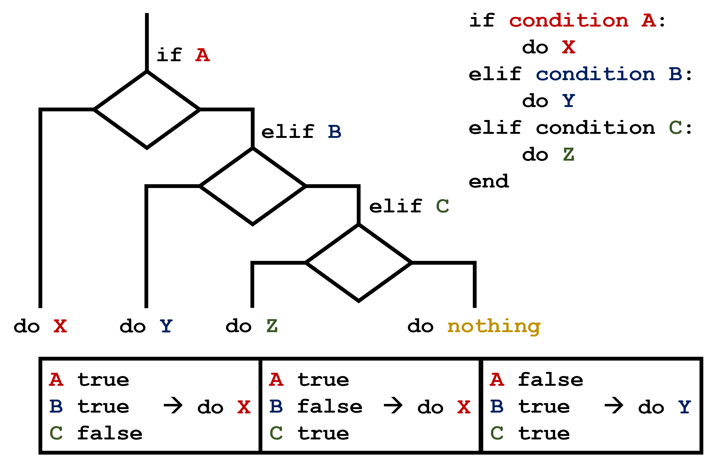
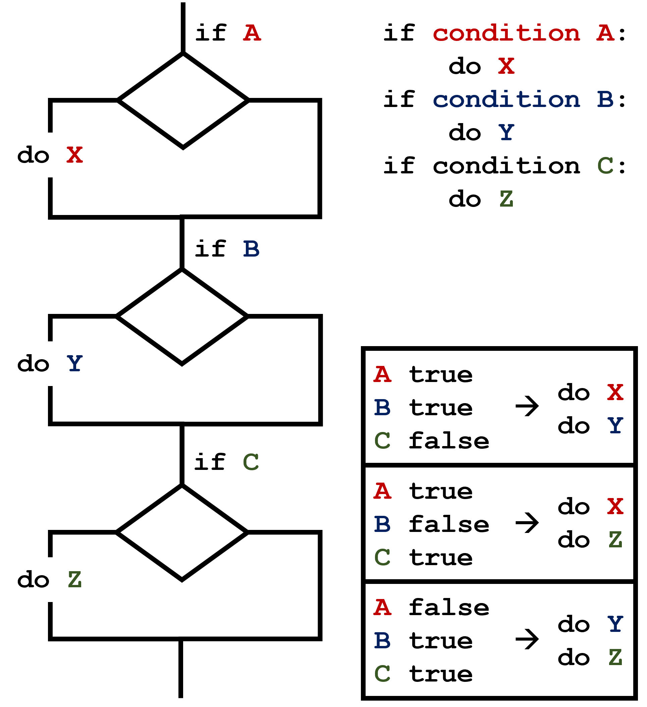

::: callout-outcomes

## Learning Outcomes

- Explain what a `for` loop does.
- Correctly write `for` loops to repeat simple calculations.
- Trace changes to a loop variable as the loop runs.
- Trace changes to other variables as they are updated by a `for` loop.
- Write conditional statements including `if`, `elif`, and `else` branches.
- Correctly evaluate expressions containing `and` and `or`.

:::

::: callout-questions

## Questions

- How can I do the same operations on many different values?
- How can my programs do different things based on data values?

:::

## Structure & Agenda

1. Loop syntax and loop variable behavior (~25 min)  
2. Iteration tools (`range`, `enumerate`) and worked problems (~25 min)  
3. Conditional branches with `if`, `elif`, and `else` (~25 min)  
4. Logical operators and practical mini-challenges (~25 min)  

> 🔧 Activities spaced throughout the session  

# Loop Fundamentals

## Why Repetition Matters

In this episode, we teach the computer how to repeat actions reliably.

We start with a simple goal: print each value in a list.

```{python}
odds = [1, 3, 5, 7]
```

> 🎯 We want one approach that works for short and long lists without rewriting code.

## Manual Repetition Example

A list has ordered positions (indices), so we can print items one by one:

```{python}
print(odds[0])
print(odds[1])
print(odds[2])
print(odds[3])
```

> 🔍 Notice the pattern: the action stays the same and only the index changes.

## Why Manual Repetition Breaks Down

1. Not scalable e.g. for lists with hundreds of elements.
2. Hard to maintain e.g. when print output format changes.
3. Fragile e.g. when list length changes to become shorter or longer.

```{python}
odds = [1, 3, 5]
print(odds[0])
print(odds[1])
print(odds[2])
print(odds[3])
```

> ⚠️ Hard-coded indices are brittle; loops adapt automatically to collection length.

## Introducing a `for` Loop

A [for loop](../learners/reference.qmd#for-loop) applies the same action to every item:

```{python}
odds = [1, 3, 5, 7]
for num in odds:
    print(num)
```

This is more concise. It is also more robust for different list lengths:

```{python}
odds = [1, 3, 5, 7, 9, 11]
for num in odds:
    print(num)
```

> 🔁 A `for` loop means: for each value in order, run the same block once.

## General Loop Template

```{python}
for variable in collection:
    # do things using variable, such as print
```

> 💡 Loops remove repetition by moving "what changes" into a loop variable.

## Reading the Loop Diagram

{alt="Loop variable 'num' being assigned the value of each element in the list odds in turn and then being printed"}

In each cycle, `num` moves to point at the next value in `odds` and the loop body runs once.

> 👀 Read loop diagrams as execution order: pick value, run body, repeat.

## Loop Syntax Rules

- The `for` line must end with a colon.
- The loop body must be indented.
- Indented lines after `for` belong to that loop body.

> 🧱 Correct loop syntax needs both a colon (`:`) and indentation; missing either raises an error.

## Loop Variable Names

In the example above, the loop variable was given the name `num` as a mnemonic; it is short for 'number'. We can choose any name we want for variables. We might just as easily have chosen the name `banana` for the loop variable, as long as we use the same name when we invoke the variable inside the loop:

```{python}
odds = [1, 3, 5, 7, 9, 11]
for banana in odds:
    print(banana)
```

It is a good idea to choose variable names that are meaningful, otherwise it would be more difficult to understand what the loop is doing.

> ✍️ Prefer using meaningful names to make traces and debugging much easier.

## Counting with a Loop

Here's another loop that repeatedly updates a variable:

```{python}
length = 0
names = ['Curie', 'Darwin', 'Turing']
for value in names:
    length = length + 1
print('There are', length, 'names in the list.')
```

It's worth tracing the execution of this little program step by step. Since there are three names in `names`, the statement on line 4 will be executed three times:
- The first time around, `length` is zero (the value assigned to it on line 1) and `value` is `Curie`. The statement adds 1 to the old value of `length`, producing 1, and updates `length` to refer to that new value.
- The next time around, `value` is `Darwin` and `length` is 1, so `length` is updated to be 2. 
- After one more update, `length` is 3; since there is nothing left in `names` for Python to process, the loop finishes and the `print` function on line 5 tells us our final answer.

> 🧠 Trace one iteration at a time to verify how each variable changes.

## Loop Variable Scope

Note that a loop variable is a variable that is being used to record progress in a loop. It still exists after the loop is over, and we can re-use variables previously defined as loop variables as well:

```{python}
name = 'Rosalind'
for name in ['Curie', 'Darwin', 'Turing']:
    print(name)
print('after the loop, name is', name)
```

## Counting with `len`

Note also that finding the length of an object is such a common operation that Python actually has a built-in function to do it called `len`:

```{python}
print(len([0, 1, 2, 3]))
```

## Why Built-In Functions are Preferred

For example, `len` is much faster than any function we could write ourselves, and much easier to read than a two-line loop; it will also give us the length of many other things that we haven't met yet, so we should always use it when we can.

## Looping Over `range`s

Python has a built-in function called `range` that generates a sequence of numbers. `range` can accept 1, 2, or 3 parameters.

- If one parameter is given, i.e. `range(stop)`, it generates a sequence of that length, starting at zero and incrementing by one. For example, `range(3)` produces the numbers `0, 1, 2`.
- If two parameters are given, i.e. `range(start, stop)`, it starts at the first and ends just before the second, incrementing by one. For example, `range(2, 5)` produces `2, 3, 4`.
- If three parameters are given, i.e. `range(start, stop, step)`, it starts at the first one, ends just before the second one, and increments by the third one. For example, `range(3, 10, 2)` produces `3, 5, 7, 9`.

## Challenge: From 1 to N

Using `range`, write a loop that prints the first 3 natural numbers:

```
1
2
3
```

## Solution: From 1 to N

```{python}
for number in range(1, 4):
    print(number)
```

> 🔁 `range(1, 4)` produces `1, 2, 3`; the `stop` value is not included.

## Challenge: Understanding Loops

Given the following loop:

```{python}
word = 'oxygen'
for letter in word:
    print(letter)
```

How many times is the body of the loop executed?
- 3 times
- 4 times
- 5 times
- 6 times

## Solution: Understanding Loops

The body of the loop is executed 6 times.

## Challenge: Computing Powers With Loops

Exponentiation is built into Python with the `**` operator:

```{python}
print(5 ** 3)
```

## Challenge: Computing Powers With Loops

Write a loop that calculates the same result as `5 ** 3` using multiplication (and without exponentiation).

## Solution: Computing Powers With Loops

```{python}
result = 1
for number in range(0, 3):
    result = result * 5
print(result)
```

## Challenge: Summing a List

Write a loop that calculates the sum of elements in a list by adding each element and printing the final value, so `[124, 402, 36]` prints 562

> ➕ Summation loops use an accumulator variable that updates each iteration.

## Solution: Summing a List

```{python}
numbers = [124, 402, 36]
summed = 0
for num in numbers:
    summed = summed + num
print(summed)
```

## Challenge: Computing the Value of a Polynomial

The built-in function `enumerate` takes a sequence (e.g. a [list](01-types_variables_and_basic_operations.qmd)) and generates a new sequence of the same length. Each element of the new sequence is a pair composed of the index (0, 1, 2,...) and the value from the original sequence:

```{python}
for idx, val in enumerate(a_list):
    # Do something using idx and val
```

The code above loops through `a_list`, assigning the index to `idx` and the value to `val`.

> 🔢 `enumerate` provides both index and value, which fits polynomial calculations.

### Polynomial Problem Setup

Suppose you have encoded a polynomial as a list of coefficients in the following way: the first element is the constant term, the second element is the coefficient of the linear term, the third is the coefficient of the quadratic term, where the polynomial is of the form $ax^0 + bx^1 + cx^2$.

### Direct Computation

```{python}
x = 5
coefs = [2, 4, 3]
y = coefs[0] * x**0 + coefs[1] * x**1 + coefs[2] * x**2
print(y)
```

### Generalize with `enumerate`

Write a loop using `enumerate(coefs)` which computes the value `y` of any polynomial, given `x` and `coefs`.

## Solution: Computing the Value of a Polynomial

```{python}
y = 0
for idx, coef in enumerate(coefs):
    y = y + coef * x**idx
```


# Conditional Logic

In this lesson, we'll learn how to write code that runs only when certain conditions are true.

We can ask Python to take different actions, depending on a condition, with an `if` / `else` statement:

```{python}
num = 37
if num > 100:
    print('greater')
else:
    print('not greater')
print('done')
```

## Branch Execution Flow

The second line of this code uses the keyword `if` to tell Python that we want to make a choice. If the test that follows the `if` statement is true, the body of the `if` (i.e., the set of lines indented underneath it) is executed, and "greater" is printed. If the test is false, the body of the `else` is executed instead, and "not greater" is printed. Only one or the other is ever executed before continuing on with program execution to print "done":

{alt='A flowchart diagram of the if-else construct that tests if variable num is greater than 100'}

## `if` Without `else`

Conditional statements don't have to include an `else`. If there isn't one, Python simply does nothing if the test is false:

```{python}
num = 53
print('before conditional...')
if num > 100:
    print(num, 'is greater than 100')
print('...after conditional')
```

## Chaining with `elif`

We can also chain several tests together using `elif`, which is short for "else if". The following Python code uses `elif` to print the sign of a number.

```{python}
num = -3

if num > 0:
    print(num, 'is positive')
elif num == 0:
    print(num, 'is zero')
else:
    print(num, 'is negative')
```

## Comparison Operators

Note that to test for equality we use a double equals sign `==` rather than a single equals sign `=` which is used to assign values.

Along with the `>` and `==` operators we have already used for comparing values in our conditionals, there are a few more options to know about:

- `>`: greater than
- `<`: less than
- `==`: equal to
- `!=`: does not equal
- `>=`: greater than or equal to
- `<=`: less than or equal to

We can also combine tests using the logical operator keywords `and` and `or`. Using the `and` operator only produces a `True` result if both parts are true:

```{python}
if (1 > 0) and (-1 > 0):
    print('both parts are true')
else:
    print('at least one part is false')
```

Using the `or` operator produces a `True` result if at least one part is true:

```{python}
if (1 > 0) or (-1 > 0):
    print('at least one part is true')
else:
    print('both parts are false')
```

## `True` and `False`

`True` and `False` are special keywords in Python which represent boolean truth values and are of type `bool`. A statement such as `1 > 0` returns the value `True`, while `-1 > 0` returns the value `False`.

> ✅ Every `if` condition must evaluate to either `True` or `False`.

## Challenge: How Many Paths?

Consider this code:

```{python}
if 4 > 5:
    print('A')
elif 4 == 5:
    print('B')
elif 4 < 5:
    print('C')
```

Which of the following would be printed if you were to run this code? Why did you pick this answer?

1. A
2. B
3. C
4. B and C

## Solution: How Many Paths?

C gets printed because the first two conditions, `4 > 5` and `4 == 5`, are not true, but `4 < 5` is true. In this case only one of these conditions can be true at a time, but in other scenarios multiple `elif` conditions could be met. In these scenarios only the action associated with the first true `elif` condition will occur, starting from the top of the conditional section. {alt='A flowchart diagram of a conditional section with multiple elif conditions and some possible outcomes.'} This contrasts with the case of multiple `if` statements, where every action can occur as long as their condition is met. {alt='A flowchart diagram of a conditional section with multiple if statements and some possible outcomes.'}

## Challenge: What Is Truth?

`True` and `False` booleans are not the only values in Python that are true and false. In fact, *any* value can be used in an `if` or `elif`. After reading and running the code below, explain what the rule is for which values are considered true and which are considered false.

```{python}
if '':
    print('empty string is true')
if 'word':
    print('word is true')
if []:
    print('empty list is true')
if [1, 2, 3]:
    print('non-empty list is true')
if 0:
    print('zero is true')
if 1:
    print('one is true')
```

## Challenge: That's Not Not What I Meant

Sometimes it is useful to check whether some condition is not true. The Boolean operator `not` can do this explicitly. After reading and running the code below, write some `if` statements that use `not` to test the rule that you formulated in the previous challenge.

> ↔️ `not` flips a condition, so test both the original and negated forms.

```{python}
if not '':
    print('empty string is not true')
if not 'word':
    print('word is not true')
if not not True:
    print('not not True is true')
```

## Challenge: Close Enough

Write some conditions that print `True` if the variable `a` is within 10% of the variable `b` and `False` otherwise. Compare your implementation with your partner's: do you get the same answer for all possible pairs of numbers?

> 📏 Hint: There is a [built-in function `abs`][abs-function] that returns the absolute value of a number:

```{python}
print(abs(-12))
```

## Solution 1: Close Enough

```{python}
a = 5
b = 5.1

if abs(a - b) <= 0.1 * abs(b):
    print('True')
else:
    print('False')
```

## Solution 2: Close Enough

```{python}
print(abs(a - b) <= 0.1 * abs(b))
```

This works because the Booleans `True` and `False` have string representations which can be printed.

> 🧹 Printing the boolean directly avoids the extra `if`/`else` output code.

## Challenge: In-Place Operators

Python (and most other languages in the C family) provides [in-place operators](../learners/reference.qmd#in-place-operators) that work like this:

```{python}
x = 1   # original value
x += 1  # add one to x, assigning result back to x
x *= 3  # multiply x by 3
print(x)
```

Write some code that sums the positive and negative numbers in a list separately, using in-place operators.

Do you think the result is more or less readable than writing the same without in-place operators?

## Solution: In-Place Operators

```{python}
positive_sum = 0
negative_sum = 0
test_list = [3, 4, 6, 1, -1, -5, 0, 7, -8]
for num in test_list:
    if num > 0:
        positive_sum += num
    elif num == 0:
        pass
    else:
        negative_sum += num
print(positive_sum, negative_sum)
```

### The `pass` Keyword

Here `pass` means "don't do anything". In this particular case, it's not actually needed, since if `num == 0` neither sum needs to change, but it illustrates the use of `elif` and `pass`.

## Challenge: Sorting a List Into Buckets

In our `data` folder, large data sets are stored in files whose names start with "inflammation-" and small data sets are stored in files whose names start with "small-". We also have some other files that we do not care about at this point. We'd like to break all these files into three lists called `large_files`, `small_files`, and `other_files`, respectively.

Add code to the template below to do this. Note that the string method [`startswith`](https://docs.python.org/3/library/stdtypes.html#str.startswith) returns `True` if and only if the string it is called on starts with the string passed as an argument, that is:

```{python}
'String'.startswith('Str')
```

Because `startswith` is case sensitive,

```{python}
'String'.startswith('str')
```

### Starter Code

Use the following Python code as your starting point:

```{python}
filenames = ['inflammation-01.csv',
         'myscript.py',
         'inflammation-02.csv',
         'small-01.csv',
         'small-02.csv']
large_files = []
small_files = []
other_files = []
```

### Success Criteria

Your solution should:

1. loop over the names of the files
2. figure out which group each filename belongs in
3. append the filename to that list

In the end the three lists should be:

```{python}
large_files = ['inflammation-01.csv', 'inflammation-02.csv']
small_files = ['small-01.csv', 'small-02.csv']
other_files = ['myscript.py']
```

## Solution: Sorting a List Into Buckets

```{python}
for filename in filenames:
    if filename.startswith('inflammation-'):
        large_files.append(filename)
    elif filename.startswith('small-'):
        small_files.append(filename)
    else:
        other_files.append(filename)

print('large_files:', large_files)
print('small_files:', small_files)
print('other_files:', other_files)
```

## Challenge: Counting Vowels

1. Write a loop that counts the number of vowels in a character string.
2. Test it on a few individual words and full sentences.
3. Once you are done, compare your solution to your neighbor's.
  Did you make the same decisions about how to handle the letter 'y'
  (which some people think is a vowel, and some do not)?

## Solution: Counting Vowels

```{python}
vowels = 'aeiouAEIOU'
sentence = 'Mary had a little lamb.'
count = 0
for char in sentence:
    if char in vowels:
        count += 1

print('The number of vowels in this string is ' + str(count))
```

[abs-function]: https://docs.python.org/3/library/functions.html#abs

# Further Information

::: callout-keypoints

## 📚 Keypoints

- Use `for variable in sequence` to process the elements of a sequence one at a time.
- The body of a `for` loop must be indented.
- Use `len(thing)` to determine the length of something that contains other values.
- Use `if condition` to start a conditional statement, `elif condition` to provide additional tests, and `else` to provide a default.
- The bodies of the branches of conditional statements must be indented.
- Use `==` to test for equality.
- `X and Y` is only true if both `X` and `Y` are true.
- `X or Y` is true if either `X` or `Y`, or both, are true.
- Zero, the empty string, and the empty list are considered false; all other numbers, strings, and lists are considered true.
- `True` and `False` represent truth values.

:::

::: callout-hints

## 🔦 Hints

- Trace one loop iteration at a time before generalizing behavior.
- Test both `True` and `False` paths for every conditional.
- Use small sample lists first, then scale up once logic is correct.

:::

## Module Summary

This module introduces the control-flow tools that make Python programs dynamic: loops for repetition and conditionals for decision-making. Learners practice translating repetitive tasks into clear, maintainable logic.

## Additional Learning

The concepts in this module connect directly to practical data handling and exploration in Python.

| Submodule | Python Connection | Why It Matters |
| --- | --- | --- |
| `for` Loops and Iteration | [The `for` statement](https://docs.python.org/3/reference/compound_stmts.html#the-for-statement) | Loops remove duplication and scale operations across datasets. |
| Numeric Ranges | [`range`](https://docs.python.org/3/library/stdtypes.html#range) | `range` is central for controlled numeric iteration. |
| Conditional Logic | [Boolean operations and comparisons](https://docs.python.org/3/library/stdtypes.html#boolean-operations-and-or-not) | Branching lets code respond safely to changing data. |

::: {.callout-note appearance="minimal"}
### Attribution
This lesson is derived from materials developed by the [Software Carpentry](https://software-carpentry.org) project.

The original content is licensed under the Creative Commons Attribution 4.0 International (CC BY 4.0) license: [https://github.com/swcarpentry/python-novice-inflammation/blob/main/LICENSE.md](https://github.com/swcarpentry/python-novice-inflammation/blob/main/LICENSE.md)
:::
