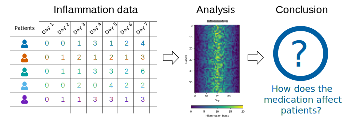
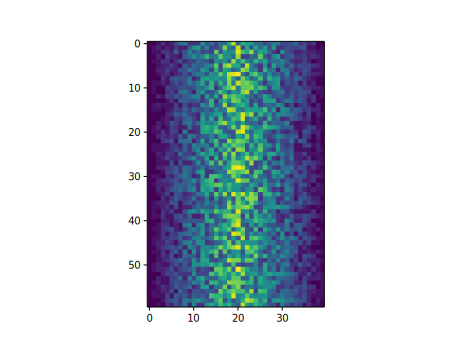
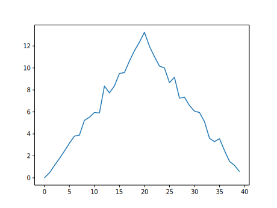
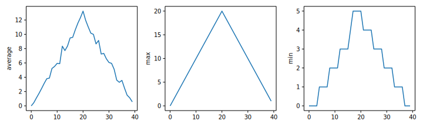
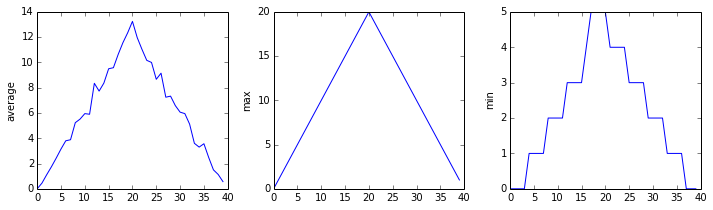
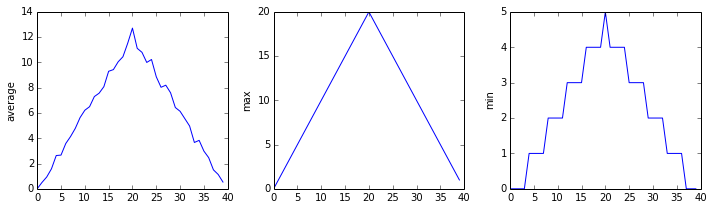
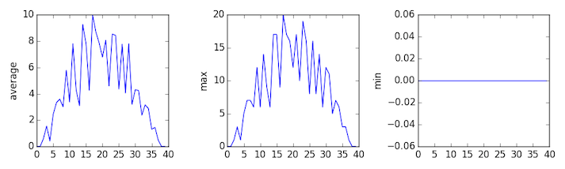
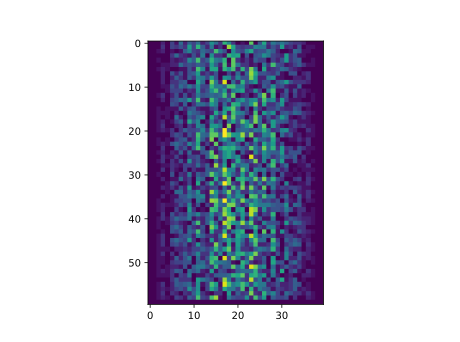

::: callout-outcomes

## Learning Outcomes

- Explain what a library is and what libraries are used for.
- Import a Python library and use the functions it contains.
- Read tabular data from a file into a program.
- Select individual values and subsections from data.
- Perform operations on arrays of data.
- Plot simple graphs from data.
- Plot multiple graphs in a single figure.
- Use a library function to get a list of filenames that match a wildcard pattern.
- Write a `for` loop to process multiple files.

:::

::: callout-questions

## Questions

- How can I process tabular data files in Python?
- How can I visualize tabular data in Python?
- How can I group several plots together?
- How can I do the same operations on many different files?

:::

## Structure & Agenda

1. Load and inspect tabular data with NumPy (~25 min)  
2. Slice arrays and compute summary statistics (~30 min)  
3. Build informative plots with `matplotlib` (~30 min)  
4. Scale analysis across multiple data files (~25 min)  

> 🔧 Activities spaced throughout the session  

## Data Overview

The best way to learn how to program is to do something useful,
so this introduction to Python is built around a common scientific task:
**data analysis**.

### Scenario: A Miracle Arthritis Inflammation Cure

Our imaginary colleague "Dr. Maverick" has invented a new miracle drug that promises to
cure arthritis inflammation flare-ups after only 3 weeks since initially taking the
medication! Naturally, we wish to see the clinical trial data, and after months of asking
for the data they have finally provided us with a CSV spreadsheet containing the clinical
trial data.

The CSV file contains the number of inflammation flare-ups per day for the 60 patients
in the initial clinical trial, with the trial lasting 40 days. Each row corresponds to a
patient, and each column corresponds to a day in the trial. Once a patient has their first
inflammation flare-up they take the medication and wait a few weeks for it to take effect
and reduce flare-ups.

To see how effective the treatment is we would like to:

1. Calculate the average inflammation per day across all patients.
2. Plot the result to discuss and share with colleagues.

{alt='3-step flowchart shows inflammation data records for patients moving to the Analysis step where a heat map of provided data is generated moving to the Conclusion step that asks the question, How does the medication affect patients?'}


### Data Format

The data sets are stored in
[comma-separated values](../learners/reference.qmd#comma-separated-values) (CSV) format:

- each row holds information for a single patient,
- columns represent successive days.

The first three rows of our first file look like this:

```source
0,0,1,3,1,2,4,7,8,3,3,3,10,5,7,4,7,7,12,18,6,13,11,11,7,7,4,6,8,8,4,4,5,7,3,4,2,3,0,0
0,1,2,1,2,1,3,2,2,6,10,11,5,9,4,4,7,16,8,6,18,4,12,5,12,7,11,5,11,3,3,5,4,4,5,5,1,1,0,1
0,1,1,3,3,2,6,2,5,9,5,7,4,5,4,15,5,11,9,10,19,14,12,17,7,12,11,7,4,2,10,5,4,2,2,3,2,2,1,1
```

Each number represents the number of inflammation bouts that a particular patient experienced on a
given day.

For example, value "6" at row 3 column 7 of the data set above means that the third
patient was experiencing inflammation six times on the seventh day of the clinical study.


## Analyzing data with numpy

Words are useful, but what's more useful are the sentences and stories we build with them. Similarly, while a lot of powerful, general tools are built into Python, specialized tools built up from these basic units live in [libraries](../learners/reference.qmd#library) that can be called upon when needed.

### Importing a Python library

To begin processing the clinical trial inflammation data, we need to load it into Python. We can do that using a library called [NumPy](https://numpy.org/doc/stable "NumPy Documentation"), which stands for Numerical Python. In general, you should use this library when you want to do fancy things with lots of numbers, especially if you have matrices or arrays. To tell Python that we'd like to start using NumPy, we need to [import](../learners/reference.qmd#import) it:

```{python}
import numpy
```

Importing a library is like getting a piece of lab equipment out of a storage locker and setting it up on the bench. Libraries provide additional functionality to the basic Python package, much like a new piece of equipment adds functionality to a lab space. Just like in the lab, importing too many libraries can sometimes complicate and slow down your programs - so we only import what we need for each program.

### Loading data with numpy

Once we've imported the library, we can ask the library to read our data file for us:

```{python}
numpy.loadtxt(fname='inflammation-01.csv', delimiter=',')
```

The expression `numpy.loadtxt(...)` is a [function call](../learners/reference.qmd#function-call) that asks Python to run the [function](../learners/reference.qmd#function) `loadtxt` which belongs to the `numpy` library. The dot notation in Python is used most of all as an object attribute/property specifier or for invoking its method. `object.property` will give you the object.property value, `object_name.method()` will invoke on object\_name method.

As an example, John Smith is the John that belongs to the Smith family. We could use the dot notation to write his name `smith.john`, just as `loadtxt` is a function that belongs to the `numpy` library.

`numpy.loadtxt` has two [parameters](../learners/reference.qmd#parameter): the name of the file we want to read and the [delimiter](../learners/reference.qmd#delimiter) that separates values on a line. These both need to be [strings](../learners/reference.qmd#string), so we put them in quotes.

Since we haven't told it to do anything else with the function's output, the [notebook](../learners/reference.qmd#notebook) displays it. In this case, that output is the data we just loaded. By default, only a few rows and columns are shown (with `...` to omit elements when displaying big arrays). Note that, to save space when displaying NumPy arrays, Python does not show us trailing zeros, so `1.0` becomes `1.`.

Our call to `numpy.loadtxt` read our file but didn't save the data in memory. To do that, we need to assign the array to a variable. In a similar manner to how we assign a single value to a variable, we can also assign an array of values to a variable using the same syntax. Let's re-run `numpy.loadtxt` and save the returned data:

```{python}
data = numpy.loadtxt(fname='inflammation-01.csv', delimiter=',')
```

This statement doesn't produce any output because we've assigned the output to the variable `data`. If we want to check that the data have been loaded, we can print the variable's value:

```{python}
print(data)
```

### Data type and attributes

Now that the data are in memory, we can manipulate them. First, let's ask what [type](../learners/reference.qmd#type) of thing `data` refers to:

```{python}
print(type(data))
```

The output tells us that `data` currently refers to an N-dimensional array, the functionality for which is provided by the NumPy library. These data correspond to arthritis patients' inflammation. The rows are the individual patients, and the columns are their daily inflammation measurements.

A Numpy array contains one or more elements of the same type. The `type` function will only tell you that a variable is a NumPy array but won't tell you the type of thing inside the array. We can find out the type of the data contained in the NumPy array.

```{python}
print(data.dtype)
```

This tells us that the NumPy array's elements are [floating-point numbers](../learners/reference.qmd#floating-point-number).

With the following command, we can see the array's [shape](../learners/reference.qmd#shape):

```{python}
print(data.shape)
```

The output tells us that the `data` array variable contains 60 rows and 40 columns. When we created the variable `data` to store our arthritis data, we did not only create the array; we also created information about the array, called [members](../learners/reference.qmd#member) or attributes. This extra information describes `data` in the same way an adjective describes a noun. `data.shape` is an attribute of `data` which describes the dimensions of `data`. We use the same dotted notation for the attributes of variables that we use for the functions in libraries because they have the same part-and-whole relationship.

### Indexing numpy arrays

If we want to get a single number from the array, we must provide an [index](../learners/reference.qmd#index) in square brackets after the variable name, just as we do in math when referring to an element of a matrix. Our inflammation data has two dimensions, so we will need to use two indices to refer to one specific value:

```{python}
print('first value in data:', data[0, 0])
```

```{python}
print('middle value in data:', data[29, 19])
```

In Python indices start at `0`, so the expression `data[29, 19]` accesses the element at row 30, column 20, while the expression `data[0, 0]` accesses the element at row 1, column 1. 

As a result, if we have an M×N array in Python, its indices go from 0 to M-1 on the first axis and 0 to N-1 on the second. It takes a bit of getting used to, but one way to remember the rule is that the index is how many steps we have to take from the start to get the item we want.

{alt="'data' is a 3 by 3 numpy array containing row 0: \['A', 'B', 'C'\], row 1: \['D', 'E', 'F'\], androw 2: \['G', 'H', 'I'\]. Starting in the upper left hand corner, data\[0, 0\] = 'A', data\[0, 1\] = 'B',data\[0, 2\] = 'C', data\[1, 0\] = 'D', data\[1, 1\] = 'E', data\[1, 2\] = 'F', data\[2, 0\] = 'G',data\[2, 1\] = 'H', and data\[2, 2\] = 'I', in the bottom right hand corner."}

What may also surprise you is that when Python displays an array, it shows the element with index `[0, 0]` in the upper left corner rather than the lower left. This is consistent with the way mathematicians draw matrices but different from the Cartesian coordinates. The indices are (row, column) instead of (column, row) for the same reason, which can be confusing when plotting data.

::: {.callout-tip appearance="simple"}
Check shape and type before drawing conclusions from data.
:::


### Slicing numpy arrays

An index like `[30, 20]` selects a single element of an array, but we can select whole sections as well. For example, we can select the first ten days (columns) of values for the first four patients (rows) like this:

```{python}
print(data[0:4, 0:10])
```

The [slice](../learners/reference.qmd#slice) `0:4` means, "Start at index `0` and go up to, but not including, index `4`". Again, the up-to-but-not-including takes a bit of getting used to, but the rule is that the difference between the upper and lower bounds is the number of values in the slice.

We don't have to start slices at 0:

```{python}
print(data[5:10, 0:10])
```

We also don't have to include the upper and lower bound on the slice. If we don't include the lower bound, Python uses 0 by default; if we don't include the upper, the slice runs to the end of the axis, and if we don't include either (i.e., if we use ':' on its own), the slice includes everything:

```{python}
small = data[:3, 36:]
print('small is:')
print(small)
```

The above example selects rows 0 through 2 and columns 36 through to the end of the array.


:::: {.callout-task}
## Challenge: Thin slices

::: {.panel-tabset}
##### Task

The expression `element[3:3]` produces an [empty string](../learners/reference.qmd#empty-string), i.e., a string that contains no characters. If `data` holds our array of patient data, 

- What does `data[3:3, 4:4]` produce?
- What about `data[3:3, :]`?

##### Solution
```
array([], shape=(0, 0), dtype=float64)
array([], shape=(0, 40), dtype=float64)
```

:::
::::


:::: {.callout-task}
## Challenge: Stacking arrays

::: {.panel-tabset}
##### Task

Arrays can be concatenated and stacked on top of one another, using NumPy's `vstack` and `hstack` functions for vertical and horizontal stacking, respectively.

```{python}
import numpy

A = numpy.array([[1, 2, 3], [4, 5, 6], [7, 8, 9]])
print('A = ')
print(A)

B = numpy.hstack([A, A])
print('B = ')
print(B)

C = numpy.vstack([A, A])
print('C = ')
print(C)
```

Write some additional code that slices the first and last columns of `A`, and stacks them into a 3x2 array. Make sure to `print` the results to verify your solution.

##### Solution

A 'gotcha' with array indexing is that singleton dimensions are dropped by default. That means `A[:, 0]` is a one dimensional array, which won't stack as desired. To preserve singleton dimensions, the index itself can be a slice or array. For example, `A[:, :1]` returns a two dimensional array with one singleton dimension (i.e. a column vector).

```{python}
D = numpy.hstack((A[:, :1], A[:, -1:]))
print('D = ')
print(D)
```

An alternative way to achieve the same result is to use Numpy's delete function to remove the second column of A. If you're not sure what the parameters of numpy.delete mean, use the help files.

```{python}
D = numpy.delete(arr=A, obj=1, axis=1)
print('D = ')
print(D)
```

Another alternative is to supply a list of indices to individually select the first and last columns of A.

```{python}
D = A[:, [0, 2]]
print(D)
```

:::
::::


### Analyzing data

NumPy has several useful functions that take an array as input to perform operations on its values. If we want to find the average inflammation for all patients on all days, for example, we can ask NumPy to compute `data`'s mean value:

```{python}
print(numpy.mean(data))
```

`mean` is a [function](../learners/reference.qmd#function) that takes an array as an [argument](../learners/reference.qmd#argument).

### Not all functions have input

Generally, a function uses inputs to produce outputs. However, some functions produce outputs without needing any input. For example, checking the current time doesn't require any input.

```{python}
import time
print(time.ctime())
```

For functions that don't take in any arguments, we still need parentheses (`()`) to tell Python to go and do something for us.

Let's use three other NumPy functions to get some descriptive values about the dataset. We'll also use multiple assignment, a convenient Python feature that will enable us to do this all in one line.

```{python}
maxval, minval, stdval = numpy.amax(data), numpy.amin(data), numpy.std(data)

print('maximum inflammation:', maxval)
print('minimum inflammation:', minval)
print('standard deviation:', stdval)
```

Here we've assigned the return value from `numpy.amax(data)` to the variable `maxval`, the value from `numpy.amin(data)` to `minval`, and so on.

### Discovering functions

How did we know what functions NumPy has and how to use them?

If you are working in a Jupyter Notebook or in IPython, there is an easy way to find out. If you type the name of something followed by a dot, then you can use [tab completion](../learners/reference.qmd#tab-completion) (e.g. type `numpy.` and then press <kbd>Tab</kbd>) to see a list of all functions and attributes that you can use. After selecting one, you can also add a question mark (e.g. `numpy.cumprod?`) and it will return an explanation of the method. This is the same as doing `help(numpy.cumprod)`.

Similarly, if you are using the \"plain vanilla\" Python interpreter, you can type `numpy.` and press the <kbd>Tab</kbd> key twice for a listing of what is available. You can then use the `help()` function to see an explanation of the function you're interested in, for example: `help(numpy.cumprod)`.

### Confusing function names

One might wonder why the functions are called `amax` and `amin` and not `max` and `min` or why the other is called `mean` and not `amean`. The package `numpy` does provide functions `max` and `min` that are fully equivalent to `amax` and `amin`, but they share a name with standard library functions `max` and `min` that come with Python itself. Referring to the functions like we did above, that is `numpy.max` for example, does not cause problems, but there are other ways to refer to them that could. In addition, text editors might highlight (color) these functions like standard library function, even though they belong to NumPy, which can be confusing and lead to errors. Since there is no function called `mean` in the standard library, there is no function called `amean`.

### Operations across an axis

When analyzing data, though, we often want to look at variations in statistical values, such as the maximum inflammation per patient or the average inflammation per day. One way to do this is to create a new temporary array of the data we want, then ask it to do the calculation:

```{python}
patient_0 = data[0, :] # 0 on the first axis (rows), everything on the second (columns)
print('maximum inflammation for patient 0:', numpy.amax(patient_0))
```

We don't actually need to store the row in a variable of its own. Instead, we can combine the selection and the function call:

```{python}
print('maximum inflammation for patient 2:', numpy.amax(data[2, :]))
```

### Choosing the correct axis

What if we need the maximum inflammation for each patient over all days (as in the next diagram on the left) or the average for each day (as in the diagram on the right)? As the diagram below shows, we want to perform the operation across an axis:

{alt="Per-patient maximum inflammation is computed row-wise across all columns usingnumpy.amax(data, axis=1). Per-day average inflammation is computed column-wise across all rows usingnumpy.mean(data, axis=0)."}

To find the **maximum inflammation reported for each patient**, you would apply the `max` function moving across the columns (axis 1).

To find the **daily average inflammation reported across patients**, you would apply the `mean` function moving down the rows (axis 0).

To support this functionality, most array functions allow us to specify the axis we want to work on. If we ask for the max across axis 1 (columns in our 2D example), we get:

```{python}
print(numpy.max(data, axis=1))
```

As a quick check, we can ask this array what its shape is. We expect 60 patient maximums:

```{python}
print(numpy.max(data, axis=1).shape)
```

The expression `(60,)` tells us we have an `60×1` vector, so this is the maximum inflammation per day for each patient.

If we ask for the average across/down axis 0 (rows in our 2D example), we get:

```{python}
print(numpy.mean(data, axis=0))
```

Check the array shape. We expect 40 averages, one for each day of the study:

```{python}
print(numpy.mean(data, axis=0).shape)
```

Similarly, we can apply the `mean` function to axis 1 to get the patient's average inflammation over the duration of the study (60 values).

```{python}
print(numpy.mean(data, axis=1))
```


:::: {.callout-task}
## Challenge: Change in inflammation I

::: {.panel-tabset}
##### Task

The patient data is *longitudinal* in the sense that each row represents a series of observations relating to one individual. This means that the change in inflammation over time is a meaningful concept. Let's find out how to calculate changes in the data contained in an array with NumPy.

The `numpy.diff()` function takes an array and returns the differences between two successive values. Let's use it to examine the changes each day across the first week of patient 3 from our inflammation dataset.

```{python}
patient3_week1 = data[3, :7]
print(patient3_week1)
```

Calling `numpy.diff(patient3_week1)` would do the following calculations

```{python}
[ 0 - 0, 2 - 0, 0 - 2, 4 - 0, 2 - 4, 2 - 2 ]
```

and return the 6 difference values in a new array.

```{python}
numpy.diff(patient3_week1)
```

Note that the array of differences is shorter by one element (length 6).

When calling `numpy.diff` with a multi-dimensional array, an `axis` argument may be passed to the function to specify which axis to process. When applying `numpy.diff` to our 2D inflammation array `data`, which axis would we specify?

##### Solution

Since the row axis (0) is patients, it does not make sense to get the difference between two arbitrary patients. The column axis (1) is in days, so the difference is the change in inflammation -- a meaningful concept.

```{python}
numpy.diff(data, axis=1)
```

:::
::::


:::: {.callout-task}
## Challenge: Change in inflammation II

::: {.panel-tabset}
##### Task

If the shape of an individual data file is `(60, 40)` (60 rows and 40 columns), what would the shape of the array be after you run the `diff()` function and why?

##### Solution

The shape will be `(60, 39)` because there is one fewer difference between columns than there are columns in the data.

:::
::::


:::: {.callout-task}
## Challenge: Change in inflammation III

::: {.panel-tabset}
##### Task

How would you find the largest change in inflammation for each patient? Does it matter if the change in inflammation is an increase or a decrease?

##### Solution

By using the `numpy.amax()` function after you apply the `numpy.diff()` function, you will get the largest difference between days.

```{python}
numpy.amax(numpy.diff(data, axis=1), axis=1)
```

If inflammation values *decrease* along an axis, then the difference from one element to the next will be negative. If you are interested in the **magnitude** of the change and not the direction, the `numpy.absolute()` function will provide that.

Notice the difference if you get the largest *absolute* difference between readings.

```{python}
numpy.amax(numpy.absolute(numpy.diff(data, axis=1)), axis=1)
```

:::
::::


## Visualizing Data

The mathematician Richard Hamming once said, "The purpose of computing is insight, not numbers," and the best way to develop insight is often to visualize data. Visualization deserves an entire lecture of its own, but we can explore a few features of Python's `matplotlib` library here. While there is no official plotting library, `matplotlib` is the *de facto* standard.

### Prerequisites

If you are continuing in the same notebook from the previous episode, you already have a `data` variable and have imported `numpy`. If you are starting a new notebook at this point, you need the following two lines:

```{python}
import numpy
data = numpy.loadtxt(fname='inflammation-01.csv', delimiter=',')
```

### Creating a heat map with matplotlib

First, we will import the `pyplot` module from `matplotlib` and use two of its functions to create and display a [heat map](../learners/reference.qmd#heat-map) of our data:

```{python}
import matplotlib.pyplot
image = matplotlib.pyplot.imshow(data)
matplotlib.pyplot.colorbar(image)
matplotlib.pyplot.show()
```

{alt='Heat map representing the data variable. Each cell is colored by value along a color gradient from blue to yellow.'}

Each row in the heat map corresponds to a patient in the clinical trial dataset, and each column corresponds to a day in the dataset. Blue pixels in this heat map represent low values, while yellow pixels represent high values. As we can see, the general number of inflammation flare-ups for the patients rises and falls over a 40-day period.

So far so good as this is in line with our knowledge of the clinical trial and Dr. Maverick's claims:
- the patients take their medication once their inflammation flare-ups begin
- it takes around 3 weeks for the medication to take effect and begin reducing flare-ups
- and flare-ups appear to drop to zero by the end of the clinical trial.

Now let's take a look at the average inflammation over time:

```{python}
ave_inflammation = numpy.mean(data, axis=0)
ave_plot = matplotlib.pyplot.plot(ave_inflammation)
matplotlib.pyplot.show()
```

{alt='A line graph showing the average inflammation across all patients over a 40-day period.'}

Here, we have put the average inflammation per day across all patients in the variable `ave_inflammation`, then asked `matplotlib.pyplot` to create and display a line graph of those values. The result is a reasonably linear rise and fall, in line with Dr. Maverick's claim that the medication takes 3 weeks to take effect. But a good data scientist doesn't just consider the average of a dataset, so let's have a look at two other statistics:

```{python}
max_plot = matplotlib.pyplot.plot(numpy.amax(data, axis=0))
matplotlib.pyplot.show()
```

{alt='A line graph showing the maximum inflammation across all patients over a 40-day period.'}

```{python}
min_plot = matplotlib.pyplot.plot(numpy.amin(data, axis=0))
matplotlib.pyplot.show()
```

{alt='A line graph showing the minimum inflammation across all patients over a 40-day period.'}

The maximum value rises and falls linearly, while the minimum seems to be a step function. Neither trend seems particularly likely, so either there's a mistake in our calculations or something is wrong with our data. This insight would have been difficult to reach by examining the numbers themselves without visualization tools.

### Grouping plots

You can group similar plots in a single figure using subplots. This script below uses a number of new commands. The function `matplotlib.pyplot.figure()` creates a space into which we will place all of our plots. The parameter `figsize` tells Python how big to make this space. Each subplot is placed into the figure using its `add_subplot` [method](../learners/reference.qmd#method). The `add_subplot` method takes 3 parameters. The first denotes how many total rows of subplots there are, the second parameter refers to the total number of subplot columns, and the final parameter denotes which subplot your variable is referencing (left-to-right, top-to-bottom). Each subplot is stored in a different variable (`axes1`, `axes2`, `axes3`). Once a subplot is created, the axes can be titled using the `set_xlabel()` command (or `set_ylabel()`). Here are our three plots side by side:

```{python}
import numpy
import matplotlib.pyplot

data = numpy.loadtxt(fname='inflammation-01.csv', delimiter=',')

fig = matplotlib.pyplot.figure(figsize=(10.0, 3.0))

axes1 = fig.add_subplot(1, 3, 1)
axes2 = fig.add_subplot(1, 3, 2)
axes3 = fig.add_subplot(1, 3, 3)

axes1.set_ylabel('average')
axes1.plot(numpy.mean(data, axis=0))

axes2.set_ylabel('max')
axes2.plot(numpy.amax(data, axis=0))

axes3.set_ylabel('min')
axes3.plot(numpy.amin(data, axis=0))

fig.tight_layout()

matplotlib.pyplot.savefig('inflammation.png')
matplotlib.pyplot.show()
```

{alt='Three line graphs showing the daily average, maximum and minimum inflammation over a 40-day period.'}

The [call](../learners/reference.qmd#function-call) to `loadtxt` reads our data, and the rest of the program tells the plotting library how large we want the figure to be, that we're creating three subplots, what to draw for each one, and that we want a tight layout. (If we leave out that call to `fig.tight_layout()`, the graphs will actually be squeezed together more closely.)

The call to `savefig` stores the plot as a graphics file. This can be a convenient way to store your plots for use in other documents, web pages etc. The graphics format is automatically determined by Matplotlib from the file name ending we specify; here PNG from 'inflammation.png'. Matplotlib supports many different graphics formats, including SVG, PDF, and JPEG.

### Importing libraries with shortcuts

In this lesson we use the `import matplotlib.pyplot` [syntax](../learners/reference.qmd#syntax) to import the `pyplot` module of `matplotlib`. However, shortcuts such as `import matplotlib.pyplot as plt` are frequently used. Importing `pyplot` this way means that after the initial import, rather than writing `matplotlib.pyplot.plot(...)`, you can now write `plt.plot(...)`. Another common convention is to use the shortcut `import numpy as np` when importing the NumPy library. We then can write `np.loadtxt(...)` instead of `numpy.loadtxt(...)`, for example.

Some people prefer these shortcuts as it is quicker to type and results in shorter lines of code - especially for libraries with long names! You will frequently see Python code online using a `pyplot` function with `plt`, or a NumPy function with `np`, and it's because they've used this shortcut. It makes no difference which approach you choose to take, but you must be consistent as if you use `import matplotlib.pyplot as plt` then `matplotlib.pyplot.plot(...)` will not work, and you must use `plt.plot(...)` instead. Because of this, when working with other people it is important you agree on how libraries are imported.

:::: {.callout-task}
#### Challenge: Plot scaling

::: {.panel-tabset}
##### Task

All of our plots stop just short of the upper end of our graph because matplotlib normally sets x and y axes limits to the min and max of our data (depending on data range)

If we want to change this, we can use the `set_ylim(min, max)` method of each 'axes', for example:

```{python}
axes3.set_ylim(0, 6)
```

Update your plotting code to automatically set a more appropriate scale. (Hint: you can make use of the `max` and `min` methods to help.)

##### Solution

```{python}
# One method
axes3.set_ylabel('min')
axes3.plot(numpy.amin(data, axis=0))
axes3.set_ylim(0, 6)
```

```{python}
# A more automated approach
min_data = numpy.amin(data, axis=0)
axes3.set_ylabel('min')
axes3.plot(min_data)
axes3.set_ylim(numpy.amin(min_data), numpy.amax(min_data) * 1.1)
```
:::
::::


:::: {.callout-task}
#### Challenge: Drawing straight lines

::: {.panel-tabset}
##### Task

In the center and right subplots above, we expect all lines to look like step functions because non-integer values are not realistic for the minimum and maximum values. However, you can see that the lines are not always vertical or horizontal, and in particular the step function in the subplot on the right looks slanted. Why is this?

##### Solution

Because matplotlib interpolates (draws a straight line) between the points. One way to do avoid this is to use the Matplotlib `drawstyle` option:

```{python}
import numpy
import matplotlib.pyplot

data = numpy.loadtxt(fname='inflammation-01.csv', delimiter=',')

fig = matplotlib.pyplot.figure(figsize=(10.0, 3.0))

axes1 = fig.add_subplot(1, 3, 1)
axes2 = fig.add_subplot(1, 3, 2)
axes3 = fig.add_subplot(1, 3, 3)

axes1.set_ylabel('average')
axes1.plot(numpy.mean(data, axis=0), drawstyle='steps-mid')

axes2.set_ylabel('max')
axes2.plot(numpy.amax(data, axis=0), drawstyle='steps-mid')

axes3.set_ylabel('min')
axes3.plot(numpy.amin(data, axis=0), drawstyle='steps-mid')

fig.tight_layout()

matplotlib.pyplot.show()
```

{alt='Three line graphs, with step lines connecting the points, showing the daily average, maximumand minimum inflammation over a 40-day period.'}
:::
::::


:::: {.callout-task}
#### Challenge: Make your own plot

::: {.panel-tabset}
##### Task

Create a plot showing the standard deviation (`numpy.std`) of the inflammation data for each day across all patients.

##### Solution

```{python}
std_plot = matplotlib.pyplot.plot(numpy.std(data, axis=0))
matplotlib.pyplot.show()
```
:::
::::


:::: {.callout-task}
#### Challenge: Moving plots around

::: {.panel-tabset}
##### Task

Modify the program to display the three plots on top of one another instead of side by side.

##### Solution

```{python}
import numpy
import matplotlib.pyplot

data = numpy.loadtxt(fname='inflammation-01.csv', delimiter=',')

# change figsize (swap width and height)
fig = matplotlib.pyplot.figure(figsize=(3.0, 10.0))

# change add_subplot (swap first two parameters)
axes1 = fig.add_subplot(3, 1, 1)
axes2 = fig.add_subplot(3, 1, 2)
axes3 = fig.add_subplot(3, 1, 3)

axes1.set_ylabel('average')
axes1.plot(numpy.mean(data, axis=0))

axes2.set_ylabel('max')
axes2.plot(numpy.amax(data, axis=0))

axes3.set_ylabel('min')
axes3.plot(numpy.amin(data, axis=0))

fig.tight_layout()

matplotlib.pyplot.show()
```
:::
::::


## Analyzing Data from Multiple Files

In the previous episode, we analyzed a single file of clinical trial inflammation data. However, after finding some peculiar and potentially suspicious trends in the trial data we ask Dr. Maverick if they have performed any other clinical trials. Surprisingly, they say that they have and provide us with 11 more CSV files for a further 11 clinical trials they have undertaken since the initial trial.

Our goal now is to process all the inflammation data we have, which means that we still have eleven more files to go!

### Using `glob`

The natural first step is to collect the names of all the files that we have to process. As a final piece to processing our inflammation data, we need a way to get a list of all the files in our `data` directory whose names start with `inflammation-` and end with `.csv`. The following library will help us to achieve this:

```{python}
import glob
```

The `glob` library contains a function, also called `glob`, that finds files and directories whose names match a pattern. We provide those patterns as strings: the character `*` matches zero or more characters, while `?` matches any one character. We can use this to get the names of all the CSV files in the current directory:

```{python}
print(glob.glob('inflammation*.csv'))
```

As these examples show, `glob.glob`'s result is a list of file and directory paths in arbitrary order. This means we can loop over it to do something with each filename in turn. In our case, the "something" we want to do is generate a set of plots for each file in our inflammation dataset.

### Plotting data from multiple files

In the episode about visualizing data, we wrote Python code that plots values of interest from our first inflammation dataset (`inflammation-01.csv`), which revealed some suspicious features in it.

{alt="Line graphs showing average, maximum and minimum inflammation across all patients over a 40-day period."}

We have a dozen data sets right now and potentially more on the way if Dr. Maverick can keep up their surprisingly fast clinical trial rate. We want to create plots for all of our data sets with a single statement.

If we want to start by analyzing just the first three files in alphabetical order, we can use the `sorted` built-in function to generate a new sorted list from the `glob.glob` output:

```{python}
import glob
import numpy
import matplotlib.pyplot

filenames = sorted(glob.glob('inflammation*.csv'))
filenames = filenames[0:3]
for filename in filenames:
    print(filename)

    data = numpy.loadtxt(fname=filename, delimiter=',')

    fig = matplotlib.pyplot.figure(figsize=(10.0, 3.0))

    axes1 = fig.add_subplot(1, 3, 1)
    axes2 = fig.add_subplot(1, 3, 2)
    axes3 = fig.add_subplot(1, 3, 3)

    axes1.set_ylabel('average')
    axes1.plot(numpy.mean(data, axis=0))

    axes2.set_ylabel('max')
    axes2.plot(numpy.amax(data, axis=0))

    axes3.set_ylabel('min')
    axes3.plot(numpy.amin(data, axis=0))

    fig.tight_layout()
    matplotlib.pyplot.show()
```

{alt='Output from the first iteration of the for loop. Three line graphs showing the daily average, maximum and minimum inflammation over a 40-day period for all patients in the first dataset.'}

{alt='Output from the second iteration of the for loop. Three line graphs showing the daily average, maximum and minimum inflammation over a 40-day period for all patients in the second dataset.'}

{alt='Output from the third iteration of the for loop. Three line graphs showing the daily average, maximum and minimum inflammation over a 40-day period for all patients in the third dataset.'}

The plots generated for the second clinical trial file look very similar to the plots for the first file: their average plots show similar "noisy" rises and falls; their maxima plots show exactly the same linear rise and fall; and their minima plots show similar staircase structures.

The third dataset shows much noisier average and maxima plots that are far less suspicious than the first two datasets, however the minima plot shows that the third dataset minima is consistently zero across every day of the trial. If we produce a heat map for the third data file we see the following:

{alt='Heat map of the third inflammation dataset. Note that there are sporadic zero values throughout the entire dataset, and the last patient only has zero values over the 40 day study.'}

We can see that there are zero values sporadically distributed across all patients and days of the clinical trial, suggesting that there were potential issues with data collection throughout the trial. In addition, we can see that the last patient in the study didn't have any inflammation flare-ups at all throughout the trial, suggesting that they may not even suffer from arthritis!

### Checking data from multiple files

How can we use Python to automatically recognize the different features we saw, and take a different action for each?

We can use conditionals to check for the suspicious features we saw in our inflammation data. We are about to use functions provided by the `numpy` module again. Therefore, if you're working in a new Python session, make sure to load the module and data with:

```{python}
import numpy
data = numpy.loadtxt(fname='inflammation-01.csv', delimiter=',')
```

From the first couple of plots, we saw that maximum daily inflammation exhibits a strange behavior and raises one unit a day. Wouldn't it be a good idea to detect such behavior and report it as suspicious? Let's do that! However, instead of checking every single day of the study, let's merely check if maximum inflammation in the beginning (day 0) and in the middle (day 20) of the study are equal to the corresponding day numbers.

```{python}
max_inflammation_0 = numpy.amax(data, axis=0)[0]
max_inflammation_20 = numpy.amax(data, axis=0)[20]

if max_inflammation_0 == 0 and max_inflammation_20 == 20:
    print('Suspicious looking maxima!')
```

We also saw a different problem in the third dataset; the minima per day were all zero (looks like a healthy person snuck into our study). We can also check for this with an `elif` condition:

```{python}
elif numpy.sum(numpy.amin(data, axis=0)) == 0:
    print('Minima add up to zero!')
```

And if neither of these conditions are true, we can use `else` to give the all-clear:

```{python}
else:
    print('Seems OK!')
```

Let's test that out for the first dataset:

```{python}
data = numpy.loadtxt(fname='inflammation-01.csv', delimiter=',')

max_inflammation_0 = numpy.amax(data, axis=0)[0]
max_inflammation_20 = numpy.amax(data, axis=0)[20]

if max_inflammation_0 == 0 and max_inflammation_20 == 20:
    print('Suspicious looking maxima!')
elif numpy.sum(numpy.amin(data, axis=0)) == 0:
    print('Minima add up to zero!')
else:
    print('Seems OK!')
```

and the third dataset:

```{python}
data = numpy.loadtxt(fname='inflammation-03.csv', delimiter=',')

max_inflammation_0 = numpy.amax(data, axis=0)[0]
max_inflammation_20 = numpy.amax(data, axis=0)[20]

if max_inflammation_0 == 0 and max_inflammation_20 == 20:
    print('Suspicious looking maxima!')
elif numpy.sum(numpy.amin(data, axis=0)) == 0:
    print('Minima add up to zero!')
else:
    print('Seems OK!')
```

In this way, we have asked Python to do something different depending on the condition of our data. Here we printed messages in all cases, but we could also imagine not using the `else` catch-all so that messages are only printed when something is wrong, freeing us from having to manually examine every plot for features we've seen before.

We can repeat this process for the remaining files:

```{python}
import glob
import numpy

filenames = sorted(glob.glob('inflammation*.csv'))
filenames = filenames[0:3]
for filename in filenames:
    print(filename)

    data = numpy.loadtxt(fname=filename, delimiter=',')

    if numpy.amax(data, axis=0)[0] == 0 and numpy.amax(data, axis=0)[20] == 20:
        print('Suspicious looking maxima!')
    elif numpy.sum(numpy.amin(data, axis=0)) == 0:
        print('Minima add up to zero!')
    else:
        print('Seems OK!')
```

:::: {.callout-task}
## Challenge: Plotting differences

::: {.panel-tabset}
##### Task

Plot the difference between the average inflammations reported in the first and second datasets (stored in `inflammation-01.csv` and `inflammation-02.csv`, correspondingly), i.e., the difference between the leftmost plots of the first two figures.

##### Solution

```{python}
import glob
import numpy
import matplotlib.pyplot

filenames = sorted(glob.glob('inflammation*.csv'))

data0 = numpy.loadtxt(fname=filenames[0], delimiter=',')
data1 = numpy.loadtxt(fname=filenames[1], delimiter=',')

fig = matplotlib.pyplot.figure(figsize=(10.0, 3.0))

matplotlib.pyplot.ylabel('Difference in average')
matplotlib.pyplot.plot(numpy.mean(data0, axis=0) - numpy.mean(data1, axis=0))

fig.tight_layout()
matplotlib.pyplot.show()
```

:::
::::


:::: {.callout-task}
## Challenge: Generate composite statistics

::: {.panel-tabset}
##### Task

Use each of the files once to generate a dataset containing values averaged over all patients by completing the code inside the loop given below:

```{python}
filenames = glob.glob('inflammation*.csv')
composite_data = numpy.zeros((60, 40))
for filename in filenames:
    # sum each new file's data into composite_data as it's read
    #
# and then divide the composite_data by number of samples
composite_data = composite_data / len(filenames)
```

Then use pyplot to generate average, max, and min for all patients.

##### Solution

```{python}
import glob
import numpy
import matplotlib.pyplot

filenames = glob.glob('inflammation*.csv')
composite_data = numpy.zeros((60, 40))

for filename in filenames:
    data = numpy.loadtxt(fname = filename, delimiter=',')
    composite_data = composite_data + data

composite_data = composite_data / len(filenames)

fig = matplotlib.pyplot.figure(figsize=(10.0, 3.0))

axes1 = fig.add_subplot(1, 3, 1)
axes2 = fig.add_subplot(1, 3, 2)
axes3 = fig.add_subplot(1, 3, 3)

axes1.set_ylabel('average')
axes1.plot(numpy.mean(composite_data, axis=0))

axes2.set_ylabel('max')
axes2.plot(numpy.amax(composite_data, axis=0))

axes3.set_ylabel('min')
axes3.plot(numpy.amin(composite_data, axis=0))

fig.tight_layout()

matplotlib.pyplot.show()
```

:::
::::


## Conclusion of data analysis

After spending some time investigating the heat map and statistical plots, as well as doing the above exercises to plot differences between datasets and to generate composite patient statistics, we gain some insight into the twelve clinical trial datasets.

The datasets appear to fall into two categories:
- seemingly "ideal" datasets that agree excellently with Dr. Maverick's claims,
  but display suspicious maxima and minima (such as `inflammation-01.csv` and `inflammation-02.csv`)
- "noisy" datasets that somewhat agree with Dr. Maverick's claims, but show concerning
  data collection issues such as sporadic missing values and even an unsuitable candidate making it into the clinical trial.

In fact, it appears that all three of the "noisy" datasets (`inflammation-03.csv`, `inflammation-08.csv`, and `inflammation-11.csv`) are identical down to the last value. Armed with this information, we confront Dr. Maverick about the suspicious data and duplicated files.

Dr. Maverick has admitted to fabricating the clinical data for their drug trial. They did this after discovering that the initial trial had several issues, including unreliable data recording and poor participant selection. In order to prove the efficacy of their drug, they created fake data. When asked for additional data, they attempted to generate more fake datasets, and also included the original poor-quality dataset several times in order to make the trials seem more realistic.

Congratulations! We've investigated the inflammation data and proven that the datasets have been synthetically generated.

# Further Information

::: callout-keypoints

## 📚 Keypoints

- Import a library into a program using `import libraryname`.
- Use the `numpy` library to work with arrays in Python.
- The expression `array.shape` gives the shape of an array.
- Use `array[x, y]` to select a single element from a 2D array.
- Array indices start at 0, not 1.
- Use `low:high` to specify a `slice` that includes the indices from `low` to `high-1`.
- Use `# some kind of explanation` to add comments to programs.
- Use `numpy.mean(array)`, `numpy.amax(array)`, and `numpy.amin(array)` to calculate simple statistics.
- Use `numpy.mean(array, axis=0)` or `numpy.mean(array, axis=1)` to calculate statistics across the specified axis.
- Use the `pyplot` module from the `matplotlib` library for creating simple visualizations.
- Use `glob.glob(pattern)` to create a list of files whose names match a pattern.
- Use `*` in a pattern to match zero or more characters, and `?` to match any single character.
- Compare multiple summary plots before trusting any single trend line.
- Keep analysis code modular so the same checks can run across many files.

:::

::: callout-hints

## 🔦 Hints

- Check array shape early (`data.shape`) before plotting or aggregating.
- Compare average, min, and max views before trusting a trend.
- Automate repeated file operations instead of copying code blocks.

:::

## Module Summary

This module develops practical NumPy and plotting workflows for data inspection. Learners load multiple files, compute summaries, and visualize patterns to evaluate data quality and identify anomalies.

## Additional Learning

The concepts in this module connect directly to practical data handling and exploration in Python.

| Submodule | Python Connection | Why It Matters |
| --- | --- | --- |
| Reading Structured Data | [`numpy.loadtxt`](https://numpy.org/doc/stable/reference/generated/numpy.loadtxt.html) | Reliable ingestion is the first step in reproducible analysis. |
| Array Aggregation | [NumPy statistics routines](https://numpy.org/doc/stable/reference/routines.statistics.html) | Aggregations turn raw values into interpretable summaries. |
| Visualization Basics | [Matplotlib `pyplot` tutorial](https://matplotlib.org/stable/tutorials/pyplot.html) | Visual checks reveal trends and suspicious patterns quickly. |

::: {.callout-note appearance="minimal"}
### Attribution
This lesson is derived from materials developed by the [Software Carpentry](https://software-carpentry.org) project.

The original content is licensed under the Creative Commons Attribution 4.0 International (CC BY 4.0) license: [https://github.com/swcarpentry/python-novice-inflammation/blob/main/LICENSE.md](https://github.com/swcarpentry/python-novice-inflammation/blob/main/LICENSE.md)
:::
