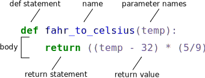

::: callout-outcomes

## Learning Outcomes

- Define a function that takes parameters.
- Return a value from a function.
- Test and debug a function.
- Set default values for function parameters.
- Explain why we should divide programs into small, single-purpose functions.
- Use the values of command-line arguments in a program.
- Handle flags and files separately in a command-line program.
- Read data from standard input in a program so that it can be used in a pipeline.

:::

::: callout-questions

## Questions

- How can I define new functions?
- What's the difference between defining and calling a function?
- What happens when I call a function?
- How can I write Python programs that will work like Unix command-line tools?

:::

## Structure & Agenda

1. Define and compose reusable Python functions (~20 min)  
2. Understand scope, testing, and documentation (~15 min)  
3. Use defaults and readable function interfaces (~15 min)  
4. Build command-line style Python scripts (~20 min)  

> 🔧 Activities spaced throughout the session  

# Function Design and Testing

## Overview

At this point, we've seen that code can have Python make decisions about what it sees in our data. What if we want to convert some of our data, like taking a temperature in Fahrenheit and converting it to Celsius. We could write something like this for converting a single number

```{python}
fahrenheit_val = 99
celsius_val = ((fahrenheit_val - 32) * (5/9))
```

and for a second number we could just copy the line and rename the variables

```{python}
fahrenheit_val = 99
celsius_val = ((fahrenheit_val - 32) * (5/9))

fahrenheit_val2 = 43
celsius_val2 = ((fahrenheit_val2 - 32) * (5/9))
```

But we would be in trouble as soon as we had to do this more than a couple times.
Cutting and pasting it is going to make our code get very long and very repetitive,
very quickly.
We'd like a way to package our code so that it is easier to reuse,
a shorthand way of re-executing longer pieces of code. In Python we can use 'functions'.
Let's start by defining a function `fahr_to_celsius` that converts temperatures
from Fahrenheit to Celsius:

```{python}
def explicit_fahr_to_celsius(temp):
    # Assign the converted value to a variable
    converted = ((temp - 32) * (5/9))
    # Return the value of the new variable
    return converted

def fahr_to_celsius(temp):
    # Return converted value more efficiently using the return
    # function without creating a new variable. This code does
    # the same thing as the previous function but it is more explicit
    # in explaining how the return command works.
    return ((temp - 32) * (5/9))
```

{alt='Labeled parts of a Python function definition'}

The function definition opens with the keyword `def` followed by the
name of the function (`fahr_to_celsius`) and a parenthesized list of parameter names (`temp`). The
[body](../learners/reference.qmd#body) of the function --- the
statements that are executed when it runs --- is indented below the
definition line.  The body concludes with a `return` keyword followed by the return value.

When we call the function,
the values we pass to it are assigned to those variables
so that we can use them inside the function.
Inside the function,
we use a [return statement](../learners/reference.qmd#return-statement) to send a result
back to whoever asked for it.

Let's try running our function.

```{python}
fahr_to_celsius(32)
```

This command should call our function, using "32" as the input and return the function value.

In fact, calling our own function is no different from calling any other function:

```{python}
print('freezing point of water:', fahr_to_celsius(32), 'C')
print('boiling point of water:', fahr_to_celsius(212), 'C')
```

We've successfully called the function that we defined,
and we have access to the value that we returned.

> 🧭 Keep the goal of this section visible while you run each example.

## Composing Functions

Now that we've seen how to turn Fahrenheit into Celsius,
we can also write the function to turn Celsius into Kelvin:

```{python}
def celsius_to_kelvin(temp_c):
    return temp_c + 273.15

print('freezing point of water in Kelvin:', celsius_to_kelvin(0.))
```

> 🧩 Keep functions small, explicit, and focused on one task.

## Fahrenheit to Kelvin Conversion

What about converting Fahrenheit to Kelvin?
We could write out the formula,
but we don't need to.
Instead,
we can [compose](../learners/reference.qmd#compose) the two functions we have already created:

## Code Example

```{python}
def fahr_to_kelvin(temp_f):
    temp_c = fahr_to_celsius(temp_f)
    temp_k = celsius_to_kelvin(temp_c)
    return temp_k

print('boiling point of water in Kelvin:', fahr_to_kelvin(212.0))
```

## Why Composition Helps Scale

This is our first taste of how larger programs are built:
we define basic operations,
then combine them in ever-larger chunks to get the effect we want.
Real-life functions will usually be larger than the ones shown here --- typically half a dozen
to a few dozen lines --- but they shouldn't ever be much longer than that,
or the next person who reads it won't be able to understand what's going on.

## Variable Scope

In composing our temperature conversion functions, we created variables inside of those functions,
`temp`, `temp_c`, `temp_f`, and `temp_k`.
We refer to these variables as [local variables](../learners/reference.qmd#local-variable)
because they no longer exist once the function is done executing.
If we try to access their values outside of the function, we will encounter an error:

```{python}
print('Again, temperature in Kelvin was:', temp_k)
```

> 🧩 Keep each function focused on one job and test it with small inputs.

## Reusing Values Across Functions

If you want to reuse the temperature in Kelvin after you have calculated it with `fahr_to_kelvin`,
you can store the result of the function call in a variable:

```{python}
temp_kelvin = fahr_to_kelvin(212.0)
print('temperature in Kelvin was:', temp_kelvin)
```

## Local vs Global Variables

The variable `temp_kelvin`, being defined outside any function,
is said to be [global](../learners/reference.qmd#global-variable).

Inside a function, one can read the value of such global variables:

## Code Example

```{python}
def print_temperatures():
    print('temperature in Fahrenheit was:', temp_fahr)
    print('temperature in Kelvin was:', temp_kelvin)

temp_fahr = 212.0
temp_kelvin = fahr_to_kelvin(temp_fahr)

print_temperatures()
```

## Tidying up

Now that we know how to wrap bits of code up in functions,
we can make our inflammation analysis easier to read and easier to reuse.
First, let's make a `visualize` function that generates our plots:

> 🧩 Keep each function focused on one job and test it with small inputs.

## Code Example

```{python}
def visualize(filename):

    data = numpy.loadtxt(fname=filename, delimiter=',')

    fig = matplotlib.pyplot.figure(figsize=(10.0, 3.0))

    axes1 = fig.add_subplot(1, 3, 1)
    axes2 = fig.add_subplot(1, 3, 2)
    axes3 = fig.add_subplot(1, 3, 3)

    axes1.set_ylabel('average')
    axes1.plot(numpy.mean(data, axis=0))

    axes2.set_ylabel('max')
    axes2.plot(numpy.amax(data, axis=0))

    axes3.set_ylabel('min')
    axes3.plot(numpy.amin(data, axis=0))

    fig.tight_layout()
    matplotlib.pyplot.show()
```

## Add a detect_problems Function

We'll add another function called `detect_problems` that checks for those systematics
we noticed:

## Code Example

```{python}
def detect_problems(filename):

    data = numpy.loadtxt(fname=filename, delimiter=',')

    if numpy.amax(data, axis=0)[0] == 0 and numpy.amax(data, axis=0)[20] == 20:
        print('Suspicious looking maxima!')
    elif numpy.sum(numpy.amin(data, axis=0)) == 0:
        print('Minima add up to zero!')
    else:
        print('Seems OK!')
```

## Missing Function Parameters

Wait! Didn't we forget to specify what both of these functions should return? Well, we didn't.
In Python, functions are not required to include a `return` statement and can be used for
the sole purpose of grouping together pieces of code that conceptually do one thing. In such cases,
function names usually describe what they do, *e.g.* `visualize`, `detect_problems`.

Notice that rather than jumbling this code together in one giant `for` loop,
we can now read and reuse both ideas separately.
We can reproduce the previous analysis with a much simpler `for` loop:

## Code Example

```{python}
filenames = sorted(glob.glob('inflammation*.csv'))

for filename in filenames[:3]:
    print(filename)
    visualize(filename)
    detect_problems(filename)
```

## Why Naming Improves Readability

By giving our functions human-readable names,
we can more easily read and understand what is happening in the `for` loop.
Even better, if at some later date we want to use either of those pieces of code again,
we can do so in a single line.

## Testing and Documenting

Once we start putting things in functions so that we can re-use them,
we need to start testing that those functions are working correctly.
To see how to do this,
let's write a function to offset a dataset so that it's mean value
shifts to a user-defined value:

> 🛡️ Assertions and tests catch mistakes early and make code safer.

## Code Example

```{python}
def offset_mean(data, target_mean_value):
    return (data - numpy.mean(data)) + target_mean_value
```

## Test with Real Data

We could test this on our actual data,
but since we don't know what the values ought to be,
it will be hard to tell if the result was correct.
Instead,
let's use NumPy to create a matrix of 0's
and then offset its values to have a mean value of 3:

## Code Example

```{python}
z = numpy.zeros((2, 2))
print(offset_mean(z, 3))
```

## That looks right

That looks right,
so let's try `offset_mean` on our real data:

```{python}
data = numpy.loadtxt(fname='inflammation-01.csv', delimiter=',')
print(offset_mean(data, 0))
```

## Improve Test Output Readability

It's hard to tell from the default output whether the result is correct,
but there are a few tests that we can run to reassure us:

## Code Example

```{python}
print('original min, mean, and max are:', numpy.amin(data), numpy.mean(data), numpy.amax(data))
offset_data = offset_mean(data, 0)
print('min, mean, and max of offset data are:',
      numpy.amin(offset_data),
      numpy.mean(offset_data),
      numpy.amax(offset_data))
```

## That seems almost right

That seems almost right:
the original mean was about 6.1,
so the lower bound from zero is now about -6.1.
The mean of the offset data isn't quite zero, but it's pretty close.
We can even go further and check that the standard deviation hasn't changed:

```{python}
print('std dev before and after:', numpy.std(data), numpy.std(offset_data))
```

## Those values look the same

Those values look the same,
but we probably wouldn't notice if they were different in the sixth decimal place.
Let's do this instead:

## Code Example

```{python}
print('difference in standard deviations before and after:',
      numpy.std(data) - numpy.std(offset_data))
```

## Everything looks good

Everything looks good,
and we should probably get back to doing our analysis.
We have one more task first, though:
we should write some [documentation](../learners/reference.qmd#documentation) for our function
to remind ourselves later what it's for and how to use it.

The usual way to put documentation in software is
to add [comments](../learners/reference.qmd#comment) like this:

## Code Example

```{python}
# offset_mean(data, target_mean_value):
# return a new array containing the original data with its mean offset to match the desired value.
def offset_mean(data, target_mean_value):
    return (data - numpy.mean(data)) + target_mean_value
```

## Parameterize Reusable Tests

There's a better way, though.
If the first thing in a function is a string that isn't assigned to a variable,
that string is attached to the function as its documentation:

## offset_mean(data, target_mean_value)

```{python}
def offset_mean(data, target_mean_value):
    """Return a new array containing the original data
       with its mean offset to match the desired value."""
    return (data - numpy.mean(data)) + target_mean_value
```

This is better because we can now ask Python's built-in help system to show us
the documentation for the function:

## Code Example

```{python}
help(offset_mean)
```

## Add a Docstring

A string like this is called a [docstring](../learners/reference.qmd#docstring).
We don't need to use triple quotes when we write one,
but if we do,
we can break the string across multiple lines:

## Code Example

```{python}
def offset_mean(data, target_mean_value):
    """Return a new array containing the original data
       with its mean offset to match the desired value.

    Examples
    --------
    >>> offset_mean([1, 2, 3], 0)
    array([-1.,  0.,  1.])
    """
    return (data - numpy.mean(data)) + target_mean_value

help(offset_mean)
```

## Defining Defaults

We have passed parameters to functions in two ways:
directly, as in `type(data)`,
and by name, as in `numpy.loadtxt(fname='something.csv', delimiter=',')`.
In fact,
we can pass the filename to `loadtxt` without the `fname=`:

```{python}
numpy.loadtxt('inflammation-01.csv', delimiter=',')
```

> 🧩 Keep each function focused on one job and test it with small inputs.

## Why Defaults Help

but we still need to say `delimiter=`:

```{python}
numpy.loadtxt('inflammation-01.csv', ',')
```

## Challenge: Predict Default Parameter Behavior

To understand what's going on,
and make our own functions easier to use,
let's re-define our `offset_mean` function like this:

## Code Example

```{python}
def offset_mean(data, target_mean_value=0.0):
    """Return a new array containing the original data
       with its mean offset to match the desired value, (0 by default).

    Examples
    --------
    >>> offset_mean([1, 2, 3])
    array([-1.,  0.,  1.])
    """
    return (data - numpy.mean(data)) + target_mean_value
```

## Add a Default Parameter

The key change is that the second parameter is now written `target_mean_value=0.0`
instead of just `target_mean_value`.
If we call the function with two arguments,
it works as it did before:

```{python}
test_data = numpy.zeros((2, 2))
print(offset_mean(test_data, 3))
```

## Call with Explicit Delimiter

But we can also now call it with just one parameter,
in which case `target_mean_value` is automatically assigned
the [default value](../learners/reference.qmd#default-value) of 0.0:

## Code Example

```{python}
more_data = 5 + numpy.zeros((2, 2))
print('data before mean offset:')
print(more_data)
print('offset data:')
print(offset_mean(more_data))
```

## Call Using the Default Delimiter

This is handy:
if we usually want a function to work one way,
but occasionally need it to do something else,
we can allow people to pass a parameter when they need to
but provide a default to make the normal case easier.
The example below shows how Python matches values to parameters:

## Code Example

```{python}
def display(a=1, b=2, c=3):
    print('a:', a, 'b:', b, 'c:', c)

print('no parameters:')
display()
print('one parameter:')
display(55)
print('two parameters:')
display(55, 66)
```

## Rule: Defaults Come Last

As this example shows,
parameters are matched up from left to right,
and any that haven't been given a value explicitly get their default value.
We can override this behavior by naming the value as we pass it in:

```{python}
print('only setting the value of c')
display(c=77)
```

## Combine Defaults with Clear Calls

With that in hand,
let's look at the help for `numpy.loadtxt`:

## Code Example

```{python}
help(numpy.loadtxt)
```

## Reading loadtxt Documentation

There's a lot of information here,
but the most important part is the first couple of lines:

## Required vs Optional Parameters

This tells us that `loadtxt` has one parameter called `fname` that doesn't have a default value,
and eight others that do.
If we call the function like this:

```{python}
numpy.loadtxt('inflammation-01.csv', ',')
```

## How Arguments Bind to Parameters

then the filename is assigned to `fname` (which is what we want),
but the delimiter string `','` is assigned to `dtype` rather than `delimiter`,
because `dtype` is the second parameter in the list. However `','` isn't a known `dtype` so
our code produced an error message when we tried to run it.
When we call `loadtxt` we don't have to provide `fname=` for the filename because it's the
first item in the list, but if we want the `','` to be assigned to the variable `delimiter`,
we *do* have to provide `delimiter=` for the second parameter since `delimiter` is not
the second parameter in the list.

## Readable Functions

Consider these two functions:

> 🧩 Keep functions small, explicit, and focused on one task.

## Code Example

```{python}
def s(p):
    a = 0
    for v in p:
        a += v
    m = a / len(p)
    d = 0
    for v in p:
        d += (v - m) * (v - m)
    return numpy.sqrt(d / (len(p) - 1))

def std_dev(sample):
    sample_sum = 0
    for value in sample:
        sample_sum += value

    sample_mean = sample_sum / len(sample)

    sum_squared_devs = 0
    for value in sample:
        sum_squared_devs += (value - sample_mean) * (value - sample_mean)

    return numpy.sqrt(sum_squared_devs / (len(sample) - 1))
```

## Same Computation, Different Readability

The functions `s` and `std_dev` are computationally equivalent (they
both calculate the sample standard deviation), but to a human reader,
they look very different. You probably found `std_dev` much easier to
read and understand than `s`.

## Readability and Documentation Matter

As this example illustrates, both documentation and a programmer's
*coding style* combine to determine how easy it is for others to read
and understand the programmer's code. Choosing meaningful variable
names and using blank spaces to break the code into logical "chunks"
are helpful techniques for producing *readable code*. This is useful
not only for sharing code with others, but also for the original
programmer. If you need to revisit code that you wrote months ago and
haven't thought about since then, you will appreciate the value of
readable code!

## Practice Prompt

## Combining Strings

"Adding" two strings produces their concatenation:
`'a' + 'b'` is `'ab'`.
Write a function called `fence` that takes two parameters called `original` and `wrapper`
and returns a new string that has the wrapper character at the beginning and end of the original.
A call to your function should look like this:

```{python}
print(fence('name', '*'))
```

> 💡 State one concrete behavior you expect before running the next code block.

## Worked Solution

```{python}
def fence(original, wrapper):
    return wrapper + original + wrapper
```

> 💡 State one concrete behavior you expect before running the next code block.

## Return vs Print

Note that `return` and `print` are not interchangeable.
`print` is a Python function that *prints* data to the screen.
It enables us, *users*, see the data.
`return` statement, on the other hand, makes data visible to the program.
Let's have a look at the following function:

> 💡 State one concrete behavior you expect before running the next code block.

## add(a, b) Example

```{python}
def add(a, b):
    print(a + b)
```

**Question**: What will we see if we execute the following commands?

## Code Example

```{python}
A = add(7, 3)
print(A)
```

## Worked Solution

Python will first execute the function `add` with `a = 7` and `b = 3`,
and, therefore, print `10`. However, because function `add` does not have a
line that starts with `return` (no `return` "statement"), it will, by default, return
nothing which, in Python world, is called `None`. Therefore, `A` will be assigned to `None`
and the last line (`print(A)`) will print `None`. As a result, we will see:

## Selecting Characters From Strings

If the variable `s` refers to a string,
then `s[0]` is the string's first character
and `s[-1]` is its last.
Write a function called `outer`
that returns a string made up of just the first and last characters of its input.
A call to your function should look like this:

> 💡 State one concrete behavior you expect before running the next code block.

## Code Example

```{python}
print(outer('helium'))
```

## Worked Solution Code

```{python}
def outer(input_string):
    return input_string[0] + input_string[-1]
```

## Rescaling an Array

Write a function `rescale` that takes an array as input
and returns a corresponding array of values scaled to lie in the range 0.0 to 1.0.
(Hint: If `L` and `H` are the lowest and highest values in the original array,
then the replacement for a value `v` should be `(v-L) / (H-L)`.)

> 📊 Check shape and indexing first before interpreting numerical results.

## Worked Solution Code

```{python}
def rescale(input_array):
    L = numpy.amin(input_array)
    H = numpy.amax(input_array)
    output_array = (input_array - L) / (H - L)
    return output_array
```

## Worked Solution Prompt

## Testing and Documenting Your Function

Run the commands `help(numpy.arange)` and `help(numpy.linspace)`
to see how to use these functions to generate regularly-spaced values,
then use those values to test your `rescale` function.
Once you've successfully tested your function,
add a docstring that explains what it does.

> 🧩 Keep functions small, explicit, and focused on one task.

## Worked Solution Code

```{python}
"""Takes an array as input, and returns a corresponding array scaled so
that 0 corresponds to the minimum and 1 to the maximum value of the input array.

Examples:
>>> rescale(numpy.arange(10.0))
array([ 0.        ,  0.11111111,  0.22222222,  0.33333333,  0.44444444,
       0.55555556,  0.66666667,  0.77777778,  0.88888889,  1.        ])
>>> rescale(numpy.linspace(0, 100, 5))
array([ 0.  ,  0.25,  0.5 ,  0.75,  1.  ])
"""
```

## Worked Solution Prompt

## Challenge: Rewrite `rescale` with Defaults

Rewrite the `rescale` function so that it scales data to lie between `0.0` and `1.0` by default,
but will allow the caller to specify lower and upper bounds if they want.
Compare your implementation to your neighbor's:
do the two functions always behave the same way?

## Worked Solution Code

```{python}
def rescale(input_array, low_val=0.0, high_val=1.0):
    """rescales input array values to lie between low_val and high_val"""
    L = numpy.amin(input_array)
    H = numpy.amax(input_array)
    intermed_array = (input_array - L) / (H - L)
    output_array = intermed_array * (high_val - low_val) + low_val
    return output_array
```

## Worked Solution Prompt

## Variables Inside and Outside Functions

What does the following piece of code display when run --- and why?

> 🧩 Keep functions small, explicit, and focused on one task.

## Code Example

```{python}
f = 0
k = 0

def f2k(f):
    k = ((f - 32) * (5.0 / 9.0)) + 273.15
    return k

print(f2k(8))
print(f2k(41))
print(f2k(32))

print(k)
```

## Practice Prompt

## Worked Solution

`k` is 0 because the `k` inside the function `f2k` doesn't know
about the `k` defined outside the function. When the `f2k` function is called,
it creates a [local variable](../learners/reference.qmd#local-variable)
`k`. The function does not return any values
and does not alter `k` outside of its local copy.
Therefore the original value of `k` remains unchanged.
Beware that a local `k` is created because `f2k` internal statements
*affect* a new value to it. If `k` was only `read`, it would simply retrieve the
global `k` value.

## Worked Solution Prompt

## Mixing Default and Non-Default Parameters

Given the following code:

```{python}
def numbers(one, two=2, three, four=4):
    n = str(one) + str(two) + str(three) + str(four)
    return n

print(numbers(1, three=3))
```

> 💡 State one concrete behavior you expect before running the next code block.

## Predict the Output

What do you expect will be printed?  What is actually printed?
What rule do you think Python is following?

1. `1234`
2. `one2three4`
3. `1239`
4. `SyntaxError`

Given that, what does the following piece of code display when run?

## Code Example

```{python}
def func(a, b=3, c=6):
    print('a: ', a, 'b: ', b, 'c:', c)

func(-1, 2)
```

## Challenge: Mixed Default and Non-Default Calls

1. `a: b: 3 c: 6`
2. `a: -1 b: 3 c: 6`
3. `a: -1 b: 2 c: 6`
4. `a: b: -1 c: 2`

## Worked Solution

Attempting to define the `numbers` function results in `4. SyntaxError`.
The defined parameters `two` and `four` are given default values. Because
`one` and `three` are not given default values, they are required to be
included as arguments when the function is called and must be placed
before any parameters that have default values in the function definition.

The given call to `func` displays `a: -1 b: 2 c: 6`. -1 is assigned to
the first parameter `a`, 2 is assigned to the next parameter `b`, and `c` is
not passed a value, so it uses its default value 6.

## Worked Solution Prompt

## Readable Code

Revise a function you wrote for one of the previous exercises to try to make
the code more readable. Then, collaborate with one of your neighbors
to critique each other's functions and discuss how your function implementations
could be further improved to make them more readable.

> 🧩 Keep each function focused on one job and test it with small inputs.

## Function Definition Checklist

- Define a function using `def function_name(parameter)`.
- The body of a function must be indented.
- Call a function using `function_name(value)`.
- Numbers are stored as integers or floating-point numbers.
- Variables defined within a function can only be seen and used within the body of the function.
- Variables created outside of any function are called global variables.
- Within a function, we can access global variables.
- Variables created within a function override global variables if their names match.
- Put docstrings in functions to provide help for that function.
- Specify default values for parameters when defining a function using `name=value` in the parameter list.
- Parameters can be passed by matching based on name, by position, or by omitting them (in which case the default value is used).
- Put code whose parameters change frequently in a function, then call it with different parameter values to customize its behavior.

## Use Help Tools for Quick Docs

The Jupyter Notebook and other interactive tools are great for prototyping code and exploring data,
but sooner or later we will want to use our program in a pipeline
or run it in a shell script to process thousands of data files.
In order to do that in an efficient way,
we need to make our programs work like other Unix command-line tools.
For example,
we may want a program that reads a dataset
and prints the average inflammation per patient.

## Practice Prompt

# Command-Line Tools in Python

## Switching to Shell Commands

In this lesson we are switching from typing commands in a Python interpreter to typing
commands in a shell terminal window (such as bash). When you see a `$` in front of a
command that tells you to run that command in the shell rather than the Python interpreter.

This program does exactly what we want - it prints the average inflammation per patient
for a given file.

> 💡 State one concrete behavior you expect before running the next code block.

## Practice: Run readings_04.py with --mean

```bash
$ python ../code/readings_04.py --mean inflammation-01.csv
```

## Script Goals

We might also want to look at the minimum of the first four lines

```bash
$ head -4 inflammation-01.csv | python ../code/readings_06.py --min
```

or the maximum inflammations in several files one after another:

```bash
$ python ../code/readings_04.py --max inflammation-*.csv
```

## Desired Script Behavior

Our scripts should do the following:

1. If no filename is given on the command line, read data from
  [standard input](../learners/reference.qmd#standard-input).
2. If one or more filenames are given, read data from them and report statistics for each file
  separately.
3. Use the `--min`, `--mean`, or `--max` flag to determine what statistic to print.

## Implementation Strategy

To make this work,
we need to know how to handle command-line arguments in a program,
and understand how to handle standard input.
We'll tackle these questions in turn below.

## Command-Line Arguments

We are going to create a file with our python code in, then use the bash shell to run the code. Using the text editor of your choice,
save the following in a text file called `sys_version.py`:

```{python}
import sys
print('version is', sys.version)
```

> 🖥️ Design scripts to work with arguments and standard input.

## Import sys for CLI Arguments

The first line imports a library called `sys`,
which is short for "system".
It defines values such as `sys.version`,
which describes which version of Python we are running.
We can run this script from the command line like this:

```bash
$ python sys_version.py
```

## Build argv_list.py

Create another file called `argv_list.py` and save the following text to it.

## Code Example

```{python}
import sys
print('sys.argv is', sys.argv)
```

## What argv Means

The strange name `argv` stands for "argument values".
Whenever Python runs a program,
it takes all of the values given on the command line
and puts them in the list `sys.argv`
so that the program can determine what they were.
If we run this program with no arguments:

```bash
$ python argv_list.py
```

## argv with No Extra Arguments

the only thing in the list is the full path to our script,
which is always `sys.argv[0]`.
If we run it with a few arguments, however:

```bash
$ python argv_list.py first second third
```

## argv with Additional Arguments

then Python adds each of those arguments to that magic list.

## Build the Multi-File Version

With this in hand, let's build a version of `readings.py` that always prints
the per-patient mean of a single data file.
The first step is to write a function that outlines our implementation,
and a placeholder for the function that does the actual work.
By convention this function is usually called `main`,
though we can call it whatever we want:

## Practice: Inspect readings_01.py

```bash
$ cat ../code/readings_01.py
```

## Code Example

```{python}
import sys
import numpy

def main():
    script = sys.argv[0]
    filename = sys.argv[1]
    data = numpy.loadtxt(filename, delimiter=',')
    for row_mean in numpy.mean(data, axis=1):
        print(row_mean)
```

## Loop Through Provided Filenames

This function gets the name of the script from `sys.argv[0]`,
because that's where it's always put,
and the name of the file to process from `sys.argv[1]`.
Here's a simple test:

```bash
$ python ../code/readings_01.py inflammation-01.csv
```

## Why No Output Yet

There is no output because we have defined a function,
but haven't actually called it.
Let's add a call to `main`:

```bash
$ cat ../code/readings_02.py
```

## Code Example

```{python}
import sys
import numpy

def main():
    script = sys.argv[0]
    filename = sys.argv[1]
    data = numpy.loadtxt(filename, delimiter=',')
    for row_mean in numpy.mean(data, axis=1):
        print(row_mean)

if __name__ == '__main__':
    main()
```

## Practice: Run the Script

and run that:

```bash
$ python ../code/readings_02.py inflammation-01.csv
```

## Practice Prompt

## Running Versus Importing

Running a Python script in bash is very similar to
importing that file in Python.
The biggest difference is that we don't expect anything
to happen when we import a file,
whereas when running a script, we expect to see some
output printed to the console.

> 💡 State one concrete behavior you expect before running the next code block.

## Main-Guard Pattern

In order for a Python script to work as expected
when imported or when run as a script,
we typically put the part of the script
that produces output in the following if statement:

```{python}
if __name__ == '__main__':
    main()  # Or whatever function produces output
```

## How __name__ Changes on Import

When you import a Python file, `__name__` is the name
of that file (e.g., when importing `readings.py`,
`__name__` is `'readings'`). However, when running a
script in bash, `__name__` is always set to `'__main__'`
in that script so that you can determine if the file
is being imported or run as a script.

## Practice Prompt

## A Better CLI Pattern

If our programs can take complex parameters or multiple filenames,
we shouldn't handle `sys.argv` directly.
Instead,
we should use Python's `argparse` library,
which handles common cases in a systematic way,
and also makes it easy for us to provide sensible error messages for our users.
We will not cover this module in this lesson
but you can go to Tshepang Lekhonkhobe's
[Argparse tutorial](https://docs.python.org/3/howto/argparse.html)
that is part of Python's Official Documentation.

> 💡 State one concrete behavior you expect before running the next code block.

## Why Use argparse-like Libraries

We can also use the `argh` library, a wrapper around the `argparse` library that simplifies
its usage (see [the argh documentation](https://pythonhosted.org/argh/) for more information).

## Handling Multiple Files

The next step is to teach our program how to handle multiple files.
Since 60 lines of output per file is a lot to page through,
we'll start by using three smaller files,
each of which has three days of data for two patients:

```bash
$ ls small-*.csv
```

> 📁 Automate multi-file workflows to avoid copy-paste analysis.

```bash
$ cat small-01.csv
```

```bash
$ python ../code/readings_02.py small-01.csv
```

## Why Small Test Files Help

Using small data files as input also allows us to check our results more easily:
here,
for example,
we can see that our program is calculating the mean correctly for each line,
whereas we were really taking it on faith before.
This is yet another rule of programming:
*test the simple things first*.

## Process Multiple Input Files

We want our program to process each file separately,
so we need a loop that executes once for each filename.
If we specify the files on the command line,
the filenames will be in `sys.argv`,
but we need to be careful:
`sys.argv[0]` will always be the name of our script,
rather than the name of a file.
We also need to handle an unknown number of filenames,
since our program could be run for any number of files.

## Loop Over Filenames

The solution to both problems is to loop over the contents of `sys.argv[1:]`.
The '1' tells Python to start the slice at location 1,
so the program's name isn't included;
since we've left off the upper bound,
the slice runs to the end of the list,
and includes all the filenames.
Here's our changed program
`readings_03.py`:

## Practice: Inspect readings_03.py

```bash
$ cat ../code/readings_03.py
```

## Code Example

```{python}
import sys
import numpy

def main():
    script = sys.argv[0]
    for filename in sys.argv[1:]:
        data = numpy.loadtxt(filename, delimiter=',')
        for row_mean in numpy.mean(data, axis=1):
            print(row_mean)

if __name__ == '__main__':
    main()
```

## Example Run Output

and here it is in action:

```bash
$ python ../code/readings_03.py small-01.csv small-02.csv
```

## Why This Matters for CLI Design

At this point,
we have created three versions of our script called `readings_01.py`,
`readings_02.py`, and `readings_03.py`.
We wouldn't do this in real life:
instead,
we would have one file called `readings.py` that we committed to version control
every time we got an enhancement working.
For teaching,
though,
we need all the successive versions side by side.

## Practice Prompt

## Handling Command-Line Flags

The next step is to teach our program to pay attention to the `--min`, `--mean`, and `--max` flags.
These always appear before the names of the files,
so we could do this:

```bash
$ cat ../code/readings_04.py
```

> 🖥️ Design scripts to work with arguments and standard input.

## Code Example

```{python}
import sys
import numpy

def main():
    script = sys.argv[0]
    action = sys.argv[1]
    filenames = sys.argv[2:]

    for filename in filenames:
        data = numpy.loadtxt(filename, delimiter=',')

        if action == '--min':
            values = numpy.amin(data, axis=1)
        elif action == '--mean':
            values = numpy.mean(data, axis=1)
        elif action == '--max':
            values = numpy.amax(data, axis=1)

        for val in values:
            print(val)

if __name__ == '__main__':
    main()
```

## Why This Version Works

This works:

```bash
$ python ../code/readings_04.py --max small-01.csv
```

## Remaining Design Problems

but there are several things wrong with it:

1. `main` is too large to read comfortably.

2. If we do not specify at least two additional arguments on the
  command-line, one for the **flag** and one for the **filename**, but only
  one, the program will not throw an exception but will run. It assumes that the file
  list is empty, as `sys.argv[1]` will be considered the `action`, even if it
  is a filename. [Silent failures](../learners/reference.qmd#silence-failure)  like this
  are always hard to debug.

## Challenge: Validate Flag Inputs

3. The program should check if the submitted `action` is one of the three recognized flags.

This version pulls the processing of each file out of the loop into a function of its own.
It also checks that `action` is one of the allowed flags
before doing any processing,
so that the program fails fast:

```bash
$ cat ../code/readings_05.py
```

## Code Example

```{python}
import sys
import numpy

def main():
    script = sys.argv[0]
    action = sys.argv[1]
    filenames = sys.argv[2:]
    assert action in ['--min', '--mean', '--max'], \
           'Action is not one of --min, --mean, or --max: ' + action
    for filename in filenames:
        process(filename, action)

def process(filename, action):
    data = numpy.loadtxt(filename, delimiter=',')

    if action == '--min':
        values = numpy.amin(data, axis=1)
    elif action == '--mean':
        values = numpy.mean(data, axis=1)
    elif action == '--max':
        values = numpy.amax(data, axis=1)

    for val in values:
        print(val)

if __name__ == '__main__':
    main()
```

## Why the Extra Lines Are Worth It

This is four lines longer than its predecessor,
but broken into more digestible chunks of 8 and 12 lines.

## Handling Standard Input

The next thing our program has to do is read data from standard input if no filenames are given
so that we can put it in a pipeline,
redirect input to it,
and so on.
Let's experiment in another script called `count_stdin.py`:

```bash
$ cat ../code/count_stdin.py
```

> 🖥️ Run scripts with different arguments to verify robust CLI behavior.

## Code Example

```{python}
import sys

count = 0
for line in sys.stdin:
    count += 1

print(count, 'lines in standard input')
```

## Reading from sys.stdin

This little program reads lines from a special "file" called `sys.stdin`,
which is automatically connected to the program's standard input.
We don't have to open it --- Python and the operating system
take care of that when the program starts up ---
but we can do almost anything with it that we could do to a regular file.
Let's try running it as if it were a regular command-line program:

## Run with File Redirection

```bash
$ python ../code/count_stdin.py < small-01.csv
```

A common mistake is to try to run something that reads from standard input like this:

## Practice: Run count_stdin.py

```bash
$ python ../code/count_stdin.py small-01.csv
```

## Common Redirection Mistake

i.e., to forget the `<` character that redirects the file to standard input.
In this case,
there's nothing in standard input,
so the program waits at the start of the loop for someone to type something on the keyboard.
Since there's no way for us to do this,
our program is stuck,
and we have to halt it using the `Interrupt` option from the `Kernel` menu in the Notebook.

## Support Files and stdin

We now need to rewrite the program so that it loads data from `sys.stdin`
if no filenames are provided.
Luckily,
`numpy.loadtxt` can handle either a filename or an open file as its first parameter,
so we don't actually need to change `process`.
Only `main` changes:

## Practice: Inspect readings_06.py

```bash
$ cat ../code/readings_06.py
```

## Code Example

```{python}
import sys
import numpy

def main():
    script = sys.argv[0]
    action = sys.argv[1]
    filenames = sys.argv[2:]
    assert action in ['--min', '--mean', '--max'], \
           'Action is not one of --min, --mean, or --max: ' + action
    if len(filenames) == 0:
        process(sys.stdin, action)
    else:
        for filename in filenames:
            process(filename, action)

def process(filename, action):
    data = numpy.loadtxt(filename, delimiter=',')

    if action == '--min':
        values = numpy.amin(data, axis=1)
    elif action == '--mean':
        values = numpy.mean(data, axis=1)
    elif action == '--max':
        values = numpy.amax(data, axis=1)

    for val in values:
        print(val)

if __name__ == '__main__':
    main()
```

## Practice: Try It Out

Let's try it out:

```bash
$ python ../code/readings_06.py --mean < small-01.csv
```

## Improved stdin Handling

That's better.
In fact,
that's done:
the program now does everything we set out to do.

## Arithmetic on the Command Line

Write a Python program that adds, subtracts, multiplies, or divides two numbers provided on the command line:

```bash
$ python arith.py --add 1 2
```

> 💡 State one concrete behavior you expect before running the next code block.

```bash
$ python arith.py --subtract 3 4
```

## Worked Solution Code

```{python}
import sys

def main():
    assert len(sys.argv) == 4, 'Need exactly 3 arguments'

    operator = sys.argv[1]
    assert operator in ['--add', '--subtract', '--multiply', '--divide'], \
        'Operator is not one of --add, --subtract, --multiply, or --divide: bailing out'
    try:
        operand1, operand2 = float(sys.argv[2]), float(sys.argv[3])
    except ValueError:
        print('cannot convert input to a number: bailing out')
        return

    do_arithmetic(operand1, operator, operand2)

def do_arithmetic(operand1, operator, operand2):

    if operator == 'add':
        value = operand1 + operand2
    elif operator == 'subtract':
        value = operand1 - operand2
    elif operator == 'multiply':
        value = operand1 * operand2
    elif operator == 'divide':
        value = operand1 / operand2
    print(value)

main()
```

## Worked Solution Prompt

## Finding Particular Files

Using the `glob` module introduced [earlier](03-data_manipulation_and_visualization.qmd),
write a simple version of `ls` that shows files in the current directory
with a particular suffix.
A call to this script should look like this:

```bash
$ python my_ls.py py
```

> 📁 Automate multi-file workflows to avoid copy-paste analysis.

## Worked Solution Code

```{python}
import sys
import glob

def main():
    """prints names of all files with sys.argv as suffix"""
    assert len(sys.argv) >= 2, 'Argument list cannot be empty'
    suffix = sys.argv[1] # NB: behaviour is not as you'd expect if sys.argv[1] is *
    glob_input = '*.' + suffix # construct the input
    glob_output = sorted(glob.glob(glob_input)) # call the glob function
    for item in glob_output: # print the output
        print(item)
    return

main()
```

## Worked Solution Prompt

## Changing Flags

Rewrite `readings.py` so that it uses `-n`, `-m`, and `-x`
instead of `--min`, `--mean`, and `--max` respectively.
Is the code easier to read?
Is the program easier to understand?

> 🖥️ Run scripts with different arguments to verify robust CLI behavior.

## Worked Solution Code

```{python}
# this is code/readings_07.py
import sys
import numpy

def main():
    script = sys.argv[0]
    action = sys.argv[1]
    filenames = sys.argv[2:]
    assert action in ['-n', '-m', '-x'], \
           'Action is not one of -n, -m, or -x: ' + action
    if len(filenames) == 0:
        process(sys.stdin, action)
    else:
        for filename in filenames:
            process(filename, action)

def process(filename, action):
    data = numpy.loadtxt(filename, delimiter=',')

    if action == '-n':
        values = numpy.amin(data, axis=1)
    elif action == '-m':
        values = numpy.mean(data, axis=1)
    elif action == '-x':
        values = numpy.amax(data, axis=1)

    for val in values:
        print(val)

main()
```

## Worked Solution Prompt

## Adding a Help Message

Separately,
modify `readings.py` so that if no parameters are given
(i.e., no action is specified and no filenames are given),
it prints a message explaining how it should be used.

> 💡 State one concrete behavior you expect before running the next code block.

## Worked Solution Code

```{python}
# this is code/readings_08.py
import sys
import numpy

def main():
    script = sys.argv[0]
    if len(sys.argv) == 1:  # no arguments, so print help message
        print("Usage: python readings_08.py action filenames\n"
              "Action:\n"
              "    Must be one of --min, --mean, or --max.\n"
              "Filenames:\n"
              "    If blank, input is taken from standard input (stdin).\n"
              "    Otherwise, each filename in the list of arguments is processed in turn.")
        return

    action = sys.argv[1]
    filenames = sys.argv[2:]
    assert action in ['--min', '--mean', '--max'], (
        'Action is not one of --min, --mean, or --max: ' + action)
    if len(filenames) == 0:
        process(sys.stdin, action)
    else:
        for filename in filenames:
            process(filename, action)

def process(filename, action):
    data = numpy.loadtxt(filename, delimiter=',')

    if action == '--min':
        values = numpy.amin(data, axis=1)
    elif action == '--mean':
        values = numpy.mean(data, axis=1)
    elif action == '--max':
        values = numpy.amax(data, axis=1)

    for val in values:
        print(val)

if __name__ == '__main__':
    main()

```

## Worked Solution Prompt

## Adding a Default Action

Separately,
modify `readings.py` so that if no action is given
it displays the means of the data.

> 💡 State one concrete behavior you expect before running the next code block.

## Worked Solution Code

```{python}
# this is code/readings_09.py
import sys
import numpy

def main():
    script = sys.argv[0]
    action = sys.argv[1]
    if action not in ['--min', '--mean', '--max']: # if no action given
        action = '--mean'    # set a default action, that being mean
        filenames = sys.argv[1:] # start the filenames one place earlier in the argv list
    else:
        filenames = sys.argv[2:]

    if len(filenames) == 0:
        process(sys.stdin, action)
    else:
        for filename in filenames:
            process(filename, action)

def process(filename, action):
    data = numpy.loadtxt(filename, delimiter=',')

    if action == '--min':
        values = numpy.amin(data, axis=1)
    elif action == '--mean':
        values = numpy.mean(data, axis=1)
    elif action == '--max':
        values = numpy.amax(data, axis=1)

    for val in values:
        print(val)

main()
```

## Worked Solution Prompt

## A File-Checker

Write a program called `check.py` that takes the names of one or more
inflammation data files as arguments
and checks that all the files have the same number of rows and columns.
What is the best way to test your program?

> 📁 Automate multi-file workflows to avoid copy-paste analysis.

## Worked Solution Code

```{python}
import sys
import numpy

def main():
    script = sys.argv[0]
    filenames = sys.argv[1:]
    if len(filenames) <=1: #nothing to check
        print('Only 1 file specified on input')
    else:
        nrow0, ncol0 = row_col_count(filenames[0])
        print('First file %s: %d rows and %d columns' % (filenames[0], nrow0, ncol0))
        for filename in filenames[1:]:
            nrow, ncol = row_col_count(filename)
            if nrow != nrow0 or ncol != ncol0:
                print('File %s does not check: %d rows and %d columns' % (filename, nrow, ncol))
            else:
                print('File %s checks' % filename)
        return

def row_col_count(filename):
    try:
        nrow, ncol = numpy.loadtxt(filename, delimiter=',').shape
    except ValueError:
        # 'ValueError' error is raised when numpy encounters lines that
        # have different number of data elements in them than the rest of the lines,
        # or when lines have non-numeric elements
        nrow, ncol = (0, 0)
    return nrow, ncol

main()
```

## Worked Solution Prompt

## Counting Lines

Write a program called `line_count.py` that works like the Unix `wc` command:

- If no filenames are given, it reports the number of lines in standard input.
- If one or more filenames are given, it reports the number of lines in each,
  followed by the total number of lines.

> 💡 State one concrete behavior you expect before running the next code block.

## Worked Solution Code

```{python}
import sys

def main():
    """print each input filename and the number of lines in it,
       and print the sum of the number of lines"""
    filenames = sys.argv[1:]
    sum_nlines = 0 #initialize counting variable

    if len(filenames) == 0: # no filenames, just stdin
        sum_nlines = count_file_like(sys.stdin)
        print('stdin: %d' % sum_nlines)
    else:
        for filename in filenames:
            nlines = count_file(filename)
            print('%s %d' % (filename, nlines))
            sum_nlines += nlines
        print('total: %d' % sum_nlines)

def count_file(filename):
    """count the number of lines in a file"""
    f = open(filename, 'r')
    nlines = len(f.readlines())
    f.close()
    return(nlines)

def count_file_like(file_like):
    """count the number of lines in a file-like object (eg stdin)"""
    n = 0
    for line in file_like:
        n = n+1
    return n

main()

```

## Worked Solution Prompt

## Generate an Error Message

Write a program called `check_arguments.py` that prints usage
then exits the program if no arguments are provided.
(Hint: You can use `sys.exit()` to exit the program.)

```bash
$ python check_arguments.py
```

> 🧭 Read tracebacks from bottom to top to find the real failure point.

```bash
$ python check_arguments.py filename.txt
```

# Further Information

::: callout-keypoints

## 📚 Keypoints

- The `sys` library connects a Python program to the system it is running on.
- The list `sys.argv` contains the command-line arguments that a program was run with.
- Avoid silent failures.
- The pseudo-file `sys.stdin` connects to a program's standard input.

:::

::: callout-hints

## 🔦 Hints

- Keep each function focused on one job with a clear input/output contract.
- Test functions with tiny, known inputs before wiring them into scripts.
- Use informative error messages to make failures easier to debug.

:::

## Module Summary

This module shows how to package logic into reusable functions and scripts. Learners practice parameter design, return values, command-line arguments, and modular decomposition for cleaner analytical workflows.

## Additional Learning

The concepts in this module connect directly to practical data handling and exploration in Python.

| Submodule | Python Connection | Why It Matters |
| --- | --- | --- |
| Function Definitions | [Defining functions](https://docs.python.org/3/tutorial/controlflow.html#defining-functions) | Functions reduce duplication and improve maintainability. |
| Variable Scope and Parameters | [Python execution model](https://docs.python.org/3/reference/executionmodel.html) | Scope awareness prevents subtle state bugs. |
| Command-Line Scripts | [`sys.argv`](https://docs.python.org/3/library/sys.html#sys.argv) | CLI scripts make analyses repeatable and automatable. |
