::: callout-outcomes

## 💡 Learning Outcomes

- Explain what Power Automate is useful for, and where it is a poor fit.
- Identify the main connector types Power Automate can handle.
- Build a simple cloud flow that passes data between Microsoft 365 services.
- Use expressions and internal functions to clean, format, and route values.
- Add an approval step and handle approval and rejection outcomes.
- Design a personalised email workflow using Excel rows and Word template content.

:::

::: callout-questions

## ❓ Questions

1. What kinds of business processes are good candidates for automation?
2. How do triggers and connectors shape what a flow can do?
3. How can expressions make flows more reliable without making them unreadable?
4. How should approvals be recorded and communicated?
5. How can we send personalised emails without creating an unsafe bulk-mail process?

:::

## Structure & Agenda

1. Automating business processes with Power Automate (~10+10 min)
2. Triggers and flow start points (~10+15 min)
3. Connectors and data movement (~10+15 min)
4. Expressions, functions, and routing (~10+15 min)
5. Approvals, Excel tables, and template emails (~10+15 min)

> 🔧 5 activities spaced throughout the session.

# Automating Business Processes with Power Automate

## What is Power Automate?

Power Automate is Microsoft’s workflow automation tool for connecting apps, data, documents, and people.

It lets you build **flows** that respond to an event and then carry out a sequence of actions. 

For example, a flow might:

- capture a request from a form;
- add the request to a tracker;
- ask someone to approve it;
- send an email or Teams message;
- update a record when the work is complete.

> 💬 Think of Power Automate as a way to turn a repeatable administrative process into a visible, testable workflow.

## Where Power Automate Fits

Power Automate is one part of the wider Power Platform.

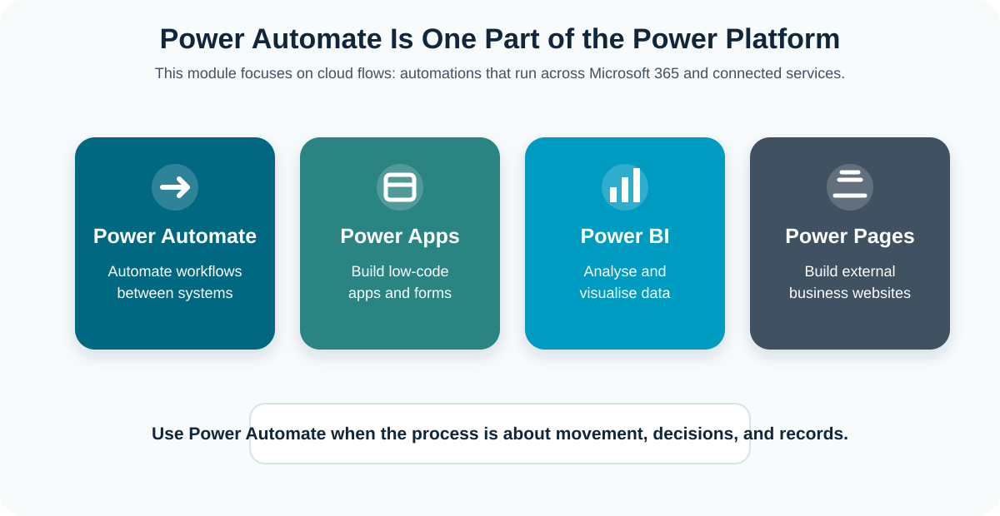{fig-align="center" width="88%"}

> 🧩 The key distinction is that Power Automate moves work between systems.

## Main Parts of a Flow

Most flows follow the same basic shape.

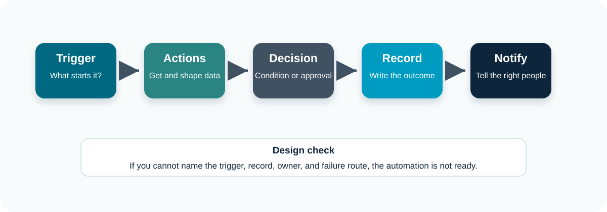{fig-align="center" width="88%"}

> 🔁 When debugging, inspect the flow in this order: trigger, data, decision, output.

## Decide Whether Automation Fits

Power Automate is a workflow automation tool. It is useful when a process has a repeatable pattern, a clear start point, and predictable next steps.

::: {.two-col-grid}
::: {.item}

**Good fit**

- Repeatable steps
- Clear start event
- Structured data
- Predictable decisions
- Known record location
- Named owner

:::
::: {.item}

**Poor fit**

- Complex judgement every time
- Messy or unstructured inputs
- No official record
- Very high transaction volume
- No owner after launch
- No access to the source system

:::
:::

## Should I automate it!

A useful first question is not "can this be automated?" but "what decision, record, or communication should happen every time this event occurs?"

Before building, test the idea against four questions:

1. What event starts the work?
2. Is the input data structured enough to trust?
3. Where will the outcome be written?
4. Who fixes it when it fails?

> 💬 If one of those answers is unclear, do a smaller manual or semi-automated version first.

## Understand Triggers

The trigger controls the first assumptions the flow makes.

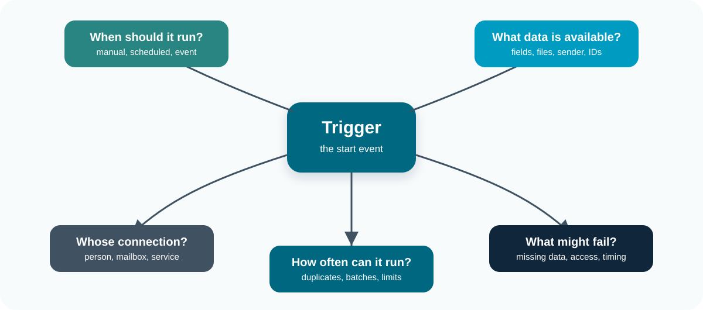{fig-align="center" width="88%"}

> 🚦 Choose the trigger that matches the real-world start of the process.

## Types of Triggers

| Trigger pattern | Example | Useful when |
|---|---|---|
| Manual | Manually trigger a flow | A person chooses when the process starts |
| Scheduled | Recurrence | Work should happen at a known time |
| Event-based | When a file / form response is created | A system event should start the work |
| Email-based | When a new email arrives | Requests arrive in a mailbox |

> 🧪 The safest first build is usually manual. Once the logic works, you can replace the trigger with a form, email, SharePoint, or scheduled trigger.

## Questions Before Choosing a Trigger

**Before choosing a trigger, ask:**

- What exact event should start the process?
- Does the event contain all data the flow needs?
- Could the same event happen twice?
- Should the flow run immediately, or is a scheduled batch acceptable?
- Does the trigger use a personal connection, shared mailbox, service account, or system connection?
- What happens when the person who created the flow leaves the team?

> 🧩 Trigger choice is a governance choice. It affects permissions, ownership, auditability, and support.

---

::: callout-task

#### Task 1: Build a Triggered Request Flow (10 min)

**Objective:** Create a manually triggered flow and inspect the data made available by the trigger.

::: panel-tabset

##### Exercise

1. Open [Power Automate](https://make.powerautomate.com/) and create an **Instant cloud flow**.
2. Name the flow `Test flow - your initials`.
3. Choose **Manually trigger a flow**.
4. Add trigger inputs for requester name, requester email, request type, requested-by date, and notes.
5. Add a **Compose** action called `Request summary`.
6. Build a short readable summary from the trigger fields.
7. Save and test the flow

##### Check

Your run should show:

- a successful trigger step;
- the values entered in the test panel;
- one successful compose step;
- a readable request summary in the compose output.

:::

:::

# Connect Power Automate to Other Services

## What Connectors Do

A connector is the integration between Power Automate and another service.

Connectors provide:

- triggers, which start flows;
- actions, which do work after the flow has started;
- authentication, which controls what the flow is allowed to access;
- dynamic content, which exposes values from one step to later steps.

> 📬 For example, the Outlook connector can trigger a flow when an email arrives and can also send an email later in the same flow.

## What Power Automate Can Connect To

Connectors are what let a flow work across services.

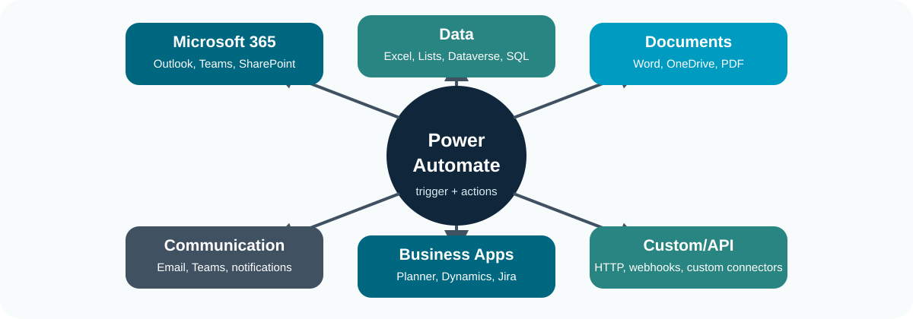{fig-align="center" width="88%"}

> 🔌 A connector is useful only if the connection has the right permissions.

## Types of Connectors

Power Automate can handle many connector types.

| Connector type | Examples | Common use |
|---|---|---|
| Microsoft 365 | Outlook, Teams, SharePoint, OneDrive | Everyday collaboration workflows |
| Data | Excel Online, SharePoint lists, Dataverse, SQL Server | Reading and writing structured records |
| Documents | Word Online, OneDrive, SharePoint, PDF services | Creating, moving, and converting files |
| Communication | Outlook, Teams, notifications | Sending messages and alerts |
| AI and a lot more! | AI Builder, text analysis, document processing, external services | Extracting or transforming and disseminating content |

> 💳 Licensing can affect availability. Premium connectors may not be available to everyone.

## Connector Permissions

Each connector action uses a connection. A connection is the signed-in identity that Power Automate uses to access a service.

**This matters because:**

- a flow may stop working when the owner's password changes;
- a flow may lose access when the owner leaves;
- a personal mailbox connection may send messages from the wrong person;
- a shared mailbox may be more appropriate than a personal mailbox;
- a team-owned SharePoint site may be more maintainable than a personal OneDrive folder.

> 🧩 For any flow that matters, document who owns it, which connections it uses, and where its official records are stored.

## Service Accounts

For important workflows, avoid relying on one person's account where possible.

Better options may include:

- a shared mailbox for team email;
- a team-owned SharePoint site for files and lists;
- a dedicated service account where your organisation allows it;
- a named flow owner group rather than one individual.

> 🔐 Service accounts need governance. They should have only the access the flow needs, an owner, a support route, and a documented password or credential process.

---

::: callout-task

#### Task 2: Connector Triage and First Notification (15 min)

**Objective:** Add an Outlook action 

::: panel-tabset

##### Exercise

1. Open the flow from Task 1.
2. Add **Send an email** after `Request summary`.
3. Choose the Office 365 Outlook action if it is available.
4. Send the email to yourself, using `Request summary` as the message body.
5. Save and test the flow.
6. Confirm that the email arrived.
7. Open run history and inspect the Outlook action inputs.
8. Sketch a connector map with one row per flow step.

##### Discussion

- Which connector creates the biggest maintenance or data protection risk?
- Who should own the connection used to send email?

:::
:::

# Cleaning and Routing Data

## What Are Expressions?

Expressions are small formulas inside Power Automate.

They are used when dynamic content needs to be changed before the next step uses it.

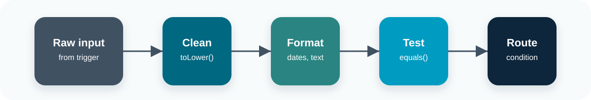{fig-align="center" width="88%"}

> 🧮 Use expressions when dynamic content is close, but not quite in the shape you need.

## Text and Date Functions

| Function | Use | Example pattern |
|---|---|---|
| `concat()` | Join text | `concat('Request: ', variables('Title'))` |
| `formatDateTime()` | Format a date | `formatDateTime(utcNow(), 'dd MMM yyyy')` |
| `toLower()` | Standardise text | `toLower(triggerBody()?['text'])` |
| `replace()` | Replace text | `replace(value, '/', '-')` |
| `split()` | Split text into parts | `split(value, ';')` |
> 🧹 Text and date functions are usually used to make messy input consistent before the next step uses it.

## Logic and List Functions

| Function | Use | Example pattern |
|---|---|---|
| `coalesce()` | Fallback for blanks | `coalesce(triggerBody()?['text'], 'Not provided')` |
| `if()` | Return one of two values | `if(equals(x, y), 'Yes', 'No')` |
| `equals()` | Compare values | `equals(toLower(value), 'urgent')` |
| `contains()` | Check whether text includes a value | `contains(toLower(value), 'urgent')` |
| `length()` | Count characters or items | `length(outputs('List_rows')?['body/value'])` |

> 🔎 Logic and list functions help the flow choose a path, check for missing data, or count what came back from a connector.

## Keep Expressions Readable

Keeping expressions maintainable:

- use a separate compose action for important transformations;
- rename compose actions after what they produce;
- avoid nesting too many functions in one expression;
- test one expression at a time;
- inspect outputs in run history;
- add a short note in the action name if the logic is not obvious.

> 🏷️ For example, `Compose normalise request type` is clearer than `Compose 2`.

## Handle Missing Values

User input is often incomplete. A flow should not assume that every value exists.

Common defensive patterns include:

- using required fields in the trigger or form where possible;
- using `coalesce()` to provide safe fallback text;
- using a condition to stop or redirect incomplete requests;
- sending a correction email rather than continuing with bad data;
- writing validation failures to the run history.

> 💬 Validation is part of automation. A flow that quietly sends bad data faster is not an improvement over a manual process. 

## Common Conditions

Typical conditions include:

- if request type contains `urgent`;
- if amount is greater than a threshold;
- if requester email ends with an institutional domain;
- if status equals `Ready`;
- if approval outcome equals `Approve`;
- if a list of rows has length greater than zero.

> 🧭 Conditions should be readable. If the condition is hard to read, create a compose action immediately before it and test the compose output.

## Branching

Branching means sending a flow down different paths depending on a test.

In Power Automate this is usually done with a **Condition** action.

For example:

- urgent requests can go to a faster route;
- incomplete requests can stop and ask for correction;
- approved and rejected requests can send different messages.

> 🛤️ Each branch should have a clear purpose and a clear end point.

## Branching with Conditions

Conditions let the flow choose between routes.

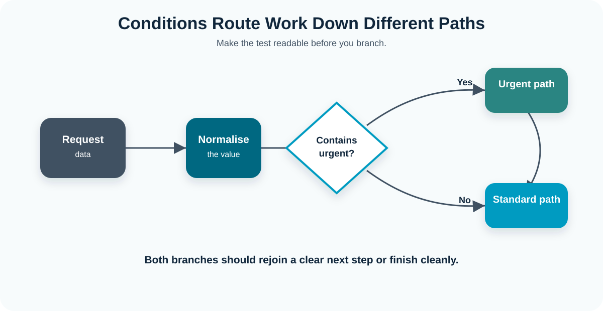{fig-align="center" width="88%"}

> 🔀 Keep condition tests readable so the run history explains the decision.

---

::: callout-task

#### Task 3: Clean, Format, and Route Request Data (15 min)

**Objective:** Use expressions to normalise request data, format a date, handle blank notes, and route urgent requests.

::: panel-tabset

##### Exercise

1. Open the flow from Task 2.
2. Add a **Compose** action called `Formatted requested date` and use `formatDateTime()` on the requested-by date.
3. Add a **Condition** using `contains()` so if the request text containing `urgent` the response is true. 
4. In each branch, add a compose action returning either `Urgent` or `Standard`.
5. Test the flow twice: once with an urgent request and once with a standard request.

##### Check

Use run history to confirm:

- `Formatted requested date` produces a readable date;
- urgent and standard requests follow different branches.

:::

:::

# Add Human Approvals

## What Approvals Do

Approvals add a deliberate human pause.

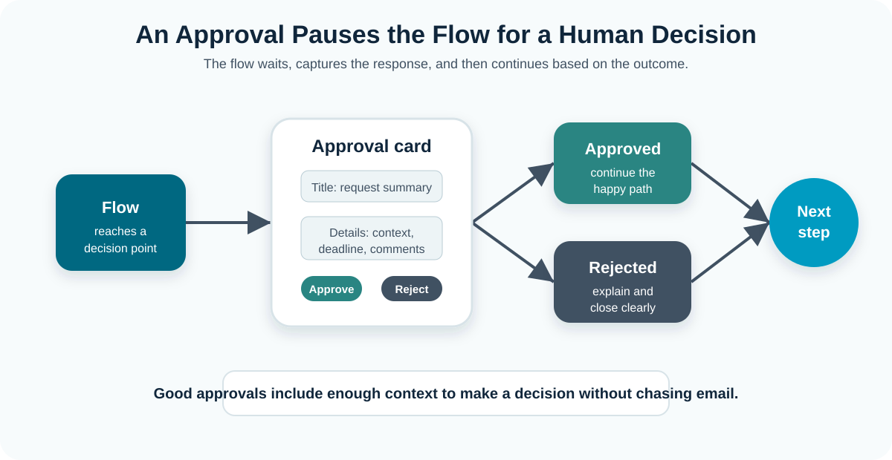{fig-align="center" width="88%"}

> ✅ Use approvals when judgement or accountability matters.

## When to Use Approvals

Approval flows can support:

- requests that need authorisation;
- sign-off for documents;
- controlled access to shared resources;
- purchasing or travel decisions;
- publication or communication checks;
- exceptions to a standard process.

## Choose an Approval Type

| Pattern | Meaning | Use when |
|---|---|---|
| Approve/Reject - First to respond | Any one approver can decide | A named role handles the queue |
| Approve/Reject - Everyone must approve | All approvers must agree | The decision needs multiple sign-offs |
| Custom responses | More than approve/reject | You need options such as revise, defer, or escalate |
| Create approval only | Approval is created but not awaited | Another flow or process manages waiting |
| Start and wait | The flow pauses until a response | The next step depends on the decision |

> ⏸️ In this session we will use **Start and wait for an approval** because the flow needs to branch after the decision.

## Give Approvers Enough Context

Before adding the action, define:

- who the approver is;
- what information they need;
- what decision options they have;
- whether comments are required;
- where the decision is recorded;
- what message goes back to the requester;
- what happens if the approval is not answered.

> 📝 An approval without enough context produces poor decisions. An approval without a record produces poor auditability.

## Branch on the Approval Outcome

The approval result should drive the next step.

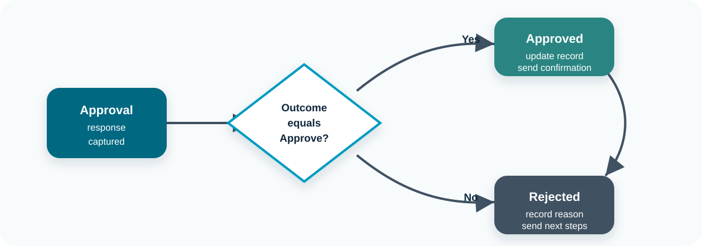{fig-align="center" width="88%"}

> 🛤️ A rejection is still a valid outcome, not a broken flow.

## Handle Rejected Requests

**A good rejection branch should:**

- tell the requester what happened;
- include comments or next steps where appropriate;
- update the tracker;
- avoid sending confusing success messages;
- make it easy for the requester to resubmit if allowed.

> 🚫 Do not treat rejection as failure. A rejected request is a successful flow outcome.

---

::: callout-task

#### Task 4: Add an Approval Step (15 min)

**Objective:** Add a human approval decision and handle both approved and rejected outcomes.

::: panel-tabset

##### Exercise

1. Open the flow from Task 3.
2. Add **Start and wait for an approval** after the request has been summarised and prioritised.
3. Choose **Approve/Reject - First to respond**. Set the title to include requester name and request type. Put the request summary, priority, requested date, and notes in the approval details.
4. Assign the approval to your partner, table lead, test account, or yourself.
5. Add a **Condition** based on the approval outcome: In the approved branch, send a confirmation email to yourself and in the rejected branch, send a rejection email to yourself.
6. Save, test, complete the approval, and inspect run history.

##### Check

Use run history to confirm:

- the flow paused at the approval step;
- the approval went to the expected person;
- the approval outcome was captured;
- the correct branch ran;
- approver comments were available for later steps.

:::
:::

# Use Excel Tables and Send Emails

## From Rows to Actions

Many business processes start as a spreadsheet. Power Automate can turn each row into an action:

- read a request from a table;
- check whether it is ready;
- create a document or message;
- send a personalised email;
- update the row so it is not processed twice.

> 🧱 The key is structure. The workbook must behave like a small data source, not like a visual report.

## Use Excel as a Tracker

Excel is often used as a lightweight tracker. Power Automate can work with Excel, but only if the workbook is structured correctly.

::: {.callout-note}

The most important rule is that: Power Automate works with Excel **tables**, not arbitrary ranges of cells.*

:::

> 📊 An Excel file full of values may look like data to a person, but the connector needs a named table so it can identify rows and columns reliably.

## Prepare Excel Tables

When using Excel online you need to set up the document correctly: 

::: {.two-col-grid}
::: {.item}

**Set up the table**

- Save as `.xlsx`
- Store in OneDrive for Business or SharePoint
- Format the range as a table
- Name the table clearly
- Use one row per record
- Use simple column names

:::
::: {.item}

**Avoid**

- Merged cells
- Blank headers
- Subtotals inside the table
- Decorative layout inside the data
- Very large row volumes
- Editing during update-heavy runs

:::
:::

> 💡 Basically, keep it simple!

## Send Emails from Table Rows

Excel mailouts work best when the table controls who is ready to receive a message.

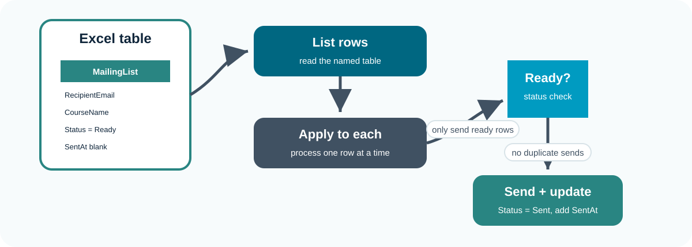{fig-align="center" width="88%"}

> 📧 Always test mailouts with safe addresses before using real recipients.

## Read Rows from Excel

The **List rows present in a table** action reads rows from an Excel table.

Important details:

- choose the correct location;
- choose the correct document library;
- select the exact workbook;
- select the named table;
- use filters carefully;
- remember that each row can be processed in an **Apply to each** loop.

> 🔎 If the table does not appear, check that the workbook is saved in the right place and the range is actually formatted as a table.

## Use Flags to Track Actions

Status flags stop the same row being processed repeatedly.

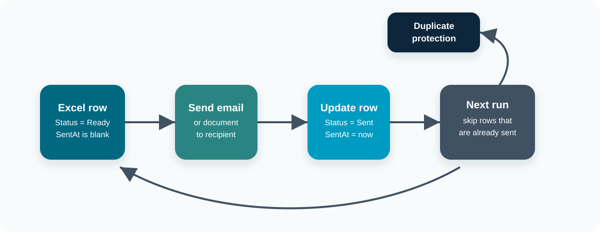{fig-align="center" width="88%"}

> 🧾 A tracker is only trustworthy if the flow writes back what happened.

## Incorporating Word Templates

Word templates turn each Excel row into a personalised document.

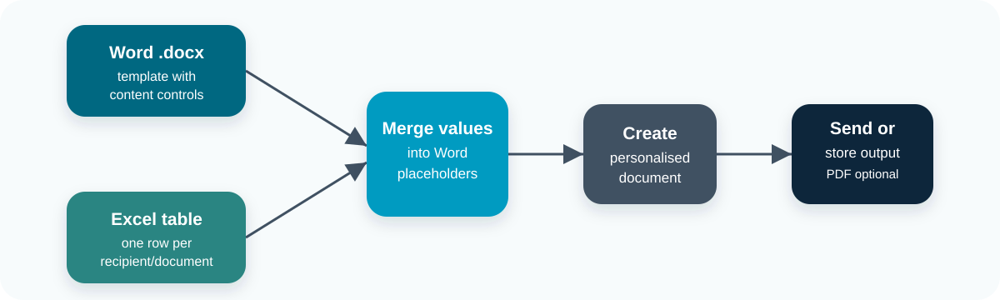{fig-align="center" width="88%"}

> 📄 This pattern is useful for certificates, letters, confirmations, and notices.

## Word Template Steps

A typical pattern is:

1. Create a Word `.docx` template.
2. Add content controls for fields such as name, course, date, and message.
3. Save the template in OneDrive or SharePoint.
4. Use **Populate a Microsoft Word template** in Power Automate.
5. Save the populated document.
6. Optionally convert it to PDF.
7. Attach it to an email or store it in a document library.

> 📨 If the Word template action is not available, the fallback is to build a personalised email body directly from Excel row values.

## Download the Practice Files

Use the provided examples for Task 5, or create your own files with the same structure.

- [Download the example Excel table](data/Example_table.xlsx)
- [Download the example Word template](data/Example_template.docx)

> 📁 Upload copies to your own OneDrive or SharePoint area before using them in Power Automate.

---

::: callout-task

#### Task 5: Build an Excel-to-Email Workflow (15 min)

**Objective:** Use an Excel table as a small mailing tracker and send personalised test emails from table rows.

::: panel-tabset

##### Setup

1. Download [Example_table.xlsx](data/Example_table.xlsx) and [Example_template.docx](data/Example_template.docx), or create your own files with the same structure.
2. Upload the Excel workbook to OneDrive or SharePoint.
3. Confirm the workbook contains a table named `Table1`.
4. Check the columns: `First Name`, `Last Name`, and `Email`.
5. Use only your own email or a test mailbox in the example rows.
6. Upload the Word template to the same working area if Word template actions are available in your tenant.

##### Exercise

1. Using our **Instant cloud flow** 
2. Before our ••send an email••, add **List rows present in a table**, find the xls via its path and select `Table1`.
3. Add a **Apply to each** to itterate over the returned rows.
4. Add a **Populate a Microsoft Word template** and select our Word template path. Set the variables. 
5. Move our ••send an email•• within the for loop and add the popultated template as an attachement.
6. Test by triggering the flow! 

##### Hints

- There is also an email column in the xls
- You could use that to dynamically set who the message is being sent to! 

:::

:::

# Review the Power Automate Workflow

## What You Built

The final flow brings the main patterns together.

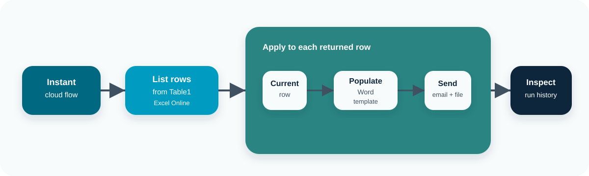{fig-align="center" width="88%"}

> 🏁 The same structure can be adapted to many admin workflows.

## Summary of the Module

In this module you built and inspected small Power Automate flows that:

- started from a manual trigger;
- passed request details between steps;
- used connectors to send notifications;
- used expressions to clean and format values;
- routed work through conditions;
- paused for an approval decision;
- read rows from an Excel table;
- sent personalised test emails;
- updated a tracker after sending.

> 🧠 The technical steps matter, but the design choices matter more. A useful automation has a clear trigger, appropriate connectors, maintainable logic, a durable record, and an owner.

:::: callout-keypoints

## 📚 Keypoints

- Triggers define when a flow starts and what data is available.
- Connectors define which systems a flow can read from or write to.
- Connections define whose permissions the flow uses.
- Expressions are useful for small, inspectable transformations.
- Conditions should be readable and testable.
- Approvals should create a decision record, not just send a notification.
- Excel data must be in a named table for reliable Power Automate use.
- Bulk email workflows need test mode, status fields, and duplicate-send protection.
- Run history is the main debugging tool.
- Production flows need ownership, documentation, and a support route.

::::

:::: callout-hints

## 🔦 Hints

- Build manually first, then replace the trigger once the logic works.
- Use one or two test records before trying a full list.
- Rename actions as soon as their purpose is clear.
- Prefer SharePoint lists or Dataverse when the record is important.
- Keep approval messages short but complete enough to support a decision.
- Use a shared mailbox when messages should come from a team rather than a person.
- Add a `Status` column before sending repeated or bulk messages.

::::

## Further Learning

Useful next topics include SharePoint lists as workflow records, Dataverse, solution-aware flows, error handling with scopes, reminders and escalation, custom connectors, data loss prevention policies, and Power Automate Desktop.
