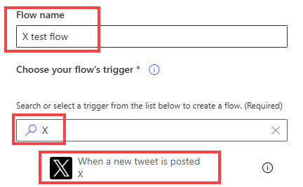
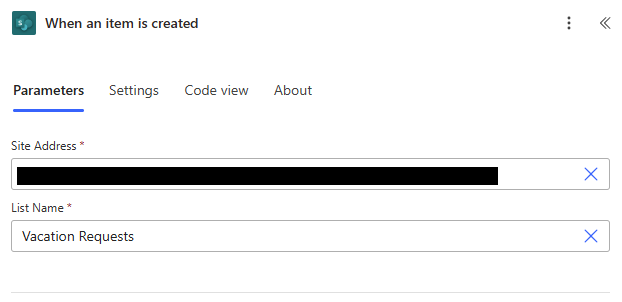
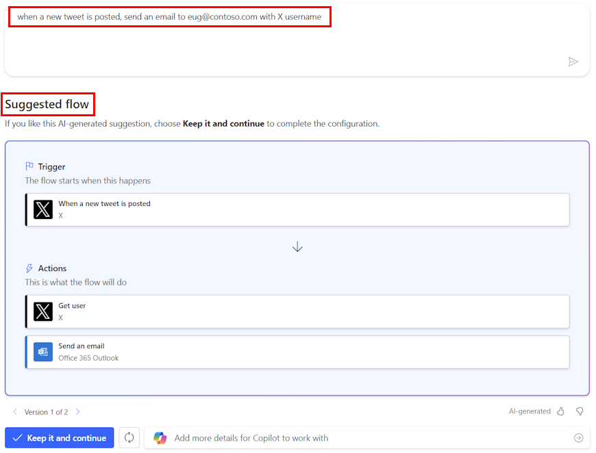
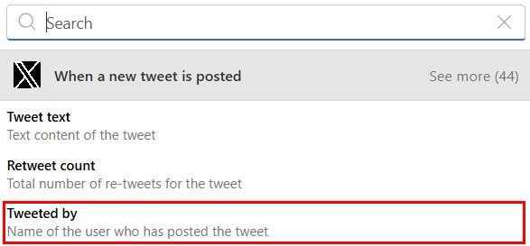
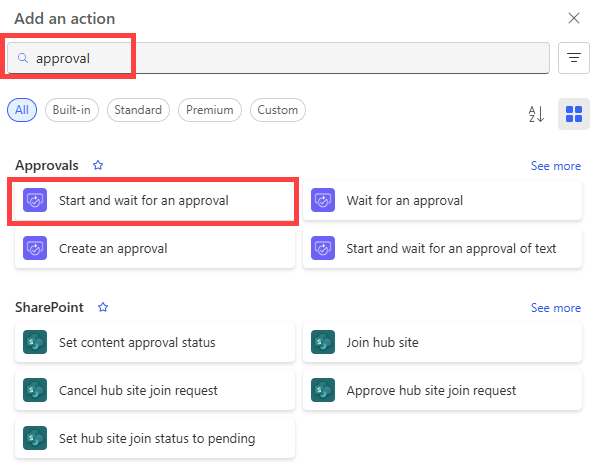
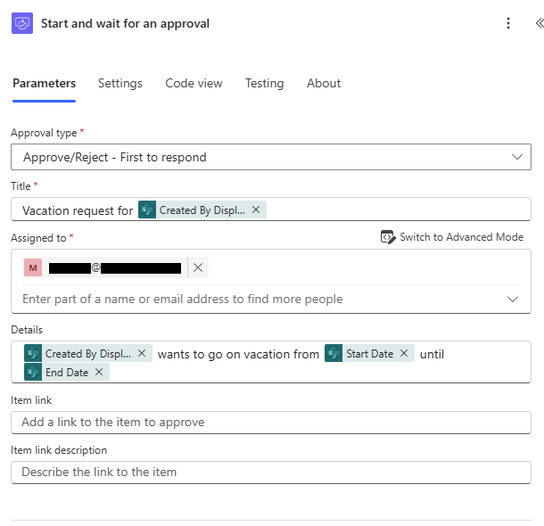
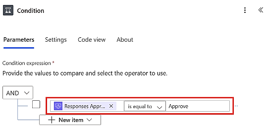
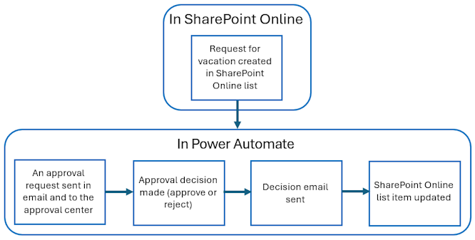
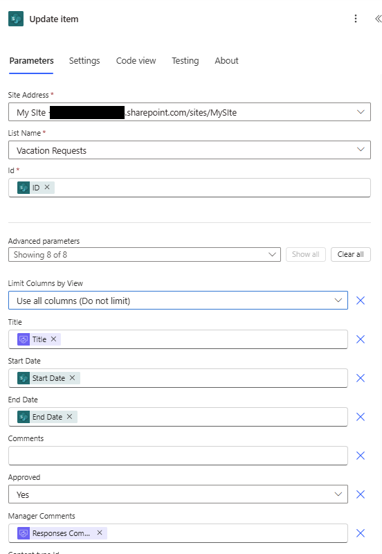
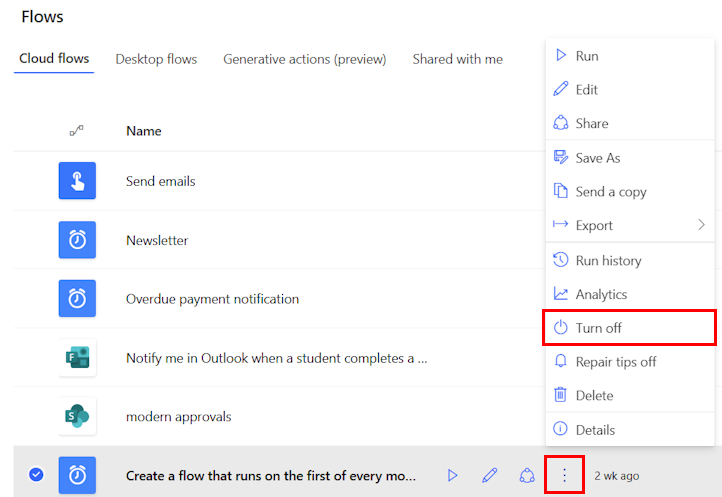

# Additional Material

This page gives extra examples for learners who want to recognise more Power Automate screens after the workshop.

The aim is not to memorise every button. The aim is to understand what each screen is asking you to decide.

## How to Read a Flow Screen

Most Power Automate screens are asking one of five questions:

1. What starts the flow?
2. Which system does this step connect to?
3. What data came from earlier steps?
4. What should happen when a decision is made?
5. How can I check what happened after the flow ran?

> 🧭 If you feel lost in the designer, name the step, identify the connector, and ask what data is going in and coming out.

## Choosing a Trigger

{fig-align="center" width="70%"}

> 🚦 The trigger is the start line. Choose it based on how the real work begins, not based on the final action you want to perform.

Examples:

- Use a **manual trigger** when a person should decide when the flow starts.
- Use a **scheduled trigger** when work should happen every day, week, or month.
- Use an **event trigger** when a form response, file, item, or email should start the work.

## Trigger Settings

{fig-align="center" width="82%"}

> 📍 Trigger settings tell Power Automate where to watch for the event.

For a SharePoint trigger, this usually means:

- which site to watch;
- which list or library to watch;
- whether the flow should start when an item is created, modified, or both.

A common mistake is choosing the right connector but the wrong location. If a flow never starts, check the site, list, library, and permissions before rebuilding the whole flow.

## Suggested Flows

{fig-align="center" width="78%"}

> 🧪 Suggested flows can be useful starting points, but they still need checking.

Treat generated or suggested flows like a draft:

- check the trigger matches the real process;
- check every connector uses the right account;
- check where records are written;
- test with safe data before using real recipients or live records.

## Connectors in Plain English

A connector is the bridge between Power Automate and another service.

| Connector family | Examples | Plain-English role |
|---|---|---|
| Microsoft 365 | Outlook, Teams, SharePoint, OneDrive | Work with messages, files, sites, and collaboration tools |
| Data | Excel, Microsoft Lists, Dataverse, SQL | Read or update structured records |
| Documents | Word Online, PDF services | Create or transform documents |
| Approvals | Approvals, Teams | Ask a person to make a decision |
| Custom or premium | HTTP, custom connectors, third-party apps | Connect to systems outside standard Microsoft 365 |

> 🔌 The connector decides which system you are touching. The connection decides whose permissions you are using.

Useful Microsoft references:

- [Power Automate connector reference](https://learn.microsoft.com/en-us/connectors/connector-reference/)
- [Excel Online Business connector](https://learn.microsoft.com/en-us/connectors/excelonlinebusiness/)
- [Word Online Business connector](https://learn.microsoft.com/en-us/connectors/wordonlinebusiness/)

## Dynamic Content

{fig-align="center" width="78%"}

> 🧩 Dynamic content is data from earlier steps that you can reuse later in the flow.

For example:

- a form trigger might provide `Responder email`;
- an Excel row might provide `First Name`;
- an approval action might provide `Outcome`;
- an Outlook trigger might provide `Subject` and `From`.

Dynamic content is powerful, but it can also be confusing. If you are not sure what a value contains, run the flow once and inspect the run history.

## Approvals

{fig-align="center" width="70%"}

> ✅ Approval actions pause the flow until a person responds.

Use approvals when the next step depends on a human decision. Do not use them just to notify someone. If no decision is needed, send an email or Teams message instead.

## Approval Details

{fig-align="center" width="68%"}

> 📝 A good approval gives the approver enough context to decide without opening five other systems.

Include:

- what is being requested;
- who requested it;
- the key dates or deadlines;
- links to useful documents or records;
- what approve and reject mean;
- where comments or reasons will be recorded.

## Branching After an Approval

{fig-align="center" width="72%"}

> 🔀 Approval is not the end of the flow. The outcome should route the next action.

Typical pattern:

- if approved, update the record and send a confirmation;
- if rejected, update the record and tell the requester what happened;
- if the approval times out, escalate or mark it for manual follow-up.

Rejection is not a technical error. It is a valid business outcome.

## Approval Overview

{fig-align="center" width="78%"}

> 🧾 Approvals are useful because they create both a message and a decision record.

For important flows, think about where the official decision record should live:

- approval history;
- an Excel tracker;
- a SharePoint list;
- a Dataverse table;
- a case management system.

## Updating an Item or Record

{fig-align="center" width="55%"}

> ✍️ Update actions write the result back to the system of record.

This is what turns a notification flow into a process flow. A useful automation should usually leave a record behind:

- status changed from `Ready` to `Sent`;
- approval outcome recorded as `Approved` or `Rejected`;
- sent date written into `SentAt`;
- owner or reviewer assigned;
- comments stored somewhere findable.

## Run History

{fig-align="center" width="78%"}

> 🔎 Run history is the first place to look when a flow behaves unexpectedly.

Use run history to check:

- whether the flow started;
- which step failed;
- what data each step received;
- what each step returned;
- whether the wrong branch was followed;
- whether a connector account had permission.

Do not debug by guessing. Run history shows the evidence.

## Practice Files

These are the same files used in the workshop:

- [Download the example Excel table](../episodes/data/Example_table.xlsx)
- [Download the example Word template](../episodes/data/Example_template.docx)

Use test rows and your own email address before trying any real process.

## Further Microsoft Learning

These Microsoft Learn pages are useful follow-up reading:

- [Get started with Power Automate](https://learn.microsoft.com/en-us/power-automate/getting-started)
- [Use expressions in conditions](https://learn.microsoft.com/en-us/power-automate/use-expressions-in-conditions)
- [Modern approvals in Power Automate](https://learn.microsoft.com/en-us/power-automate/modern-approvals)
- [Power Automate connector reference](https://learn.microsoft.com/en-us/connectors/connector-reference/)

> 🎯 Read these as examples of patterns, not as scripts to copy blindly. Your flow still needs the right owner, permissions, test data, and record location.
