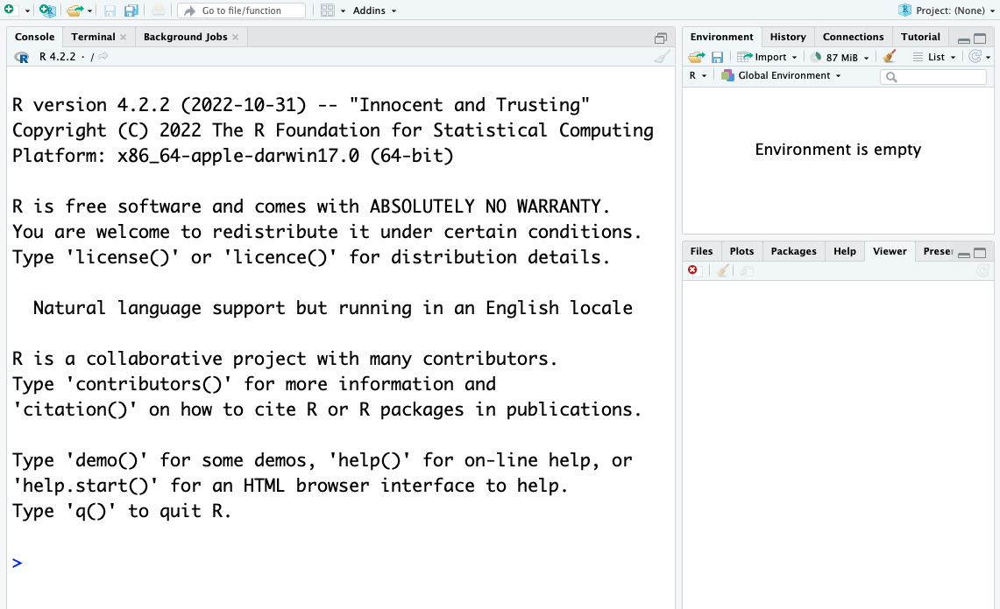
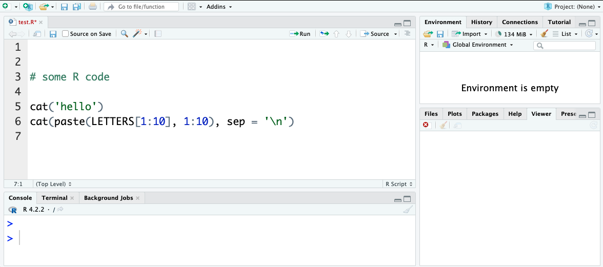
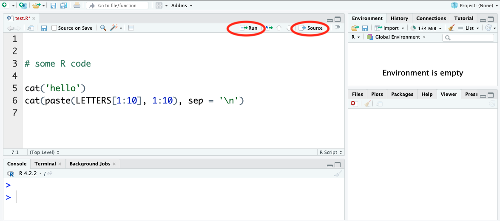
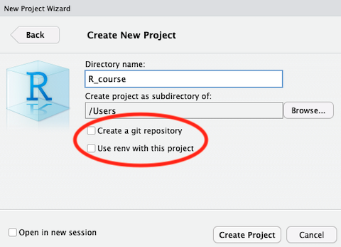
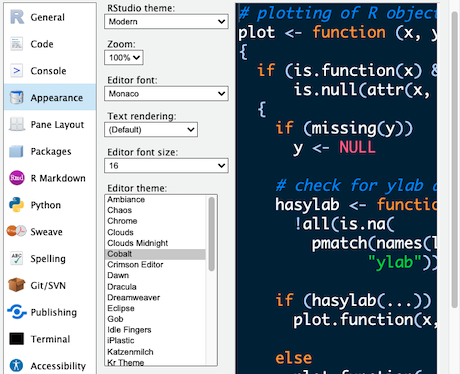

::: callout-outcomes
## 💡 Learning Outcomes

- Create a project and save a script that can be rerun.
- Assign values with units and predict arithmetic and logical results.
- Inspect and select vector values without losing their order.
- Read help, diagnose an error and check a fresh-session run.
:::

::: callout-questions
## ❓ Questions

1. What lives on disk and what exists only in memory?
2. How do types, indices and arithmetic affect a result?
3. Which checks make a saved calculation understandable?
:::

## Structure & Agenda

| Block | Teaching | Activity | Output to keep |
|---|---:|---:|---|
| Workspace and scripts | 10 min | 5 min | A project and script |
| Calculations and assignment | 10 min | 5 min | A calculation with units |
| Types and vectors | 10 min | 5 min | Checked selections |
| **Break** | — | **10 min break** | — |
| Packages and help | 10 min | 5 min | An annotated command |
| Errors and debugging | 10 min | 5 min | A diagnosed failure |
| Save and rerun | 10 min | 5 min | A checked script |
| **Total** | **60 min** | **30 min** | **100 min including the break** |

This is **lesson 1 of eight**. Each five-minute activity includes a room response and debrief. Save work before the ten-minute break; use a practice copy and keep original inputs unchanged.

## Starting Point and Preparation

Complete [Setup](../learners/setup.qmd). Open the `applied_R` project and use the existing panel screenshots. No data import is required until lesson 2; the examples here use explicitly fictional values.

# A Research Workspace in RStudio

## Begin with a Saved Research Task

Imagine that a collaborator needs to rerun a small calculation next week. Commands typed only into a console are easy to lose; save the steps in a script and keep the related files in a project.

R is the language and computing environment. RStudio is the interface used here to edit scripts, inspect objects, manage files and view help. Its [official user guide](https://docs.posit.co/ide/user/) describes the interface and supported workflows.

**Room check:** ask pairs where their current spreadsheet, calculation or analysis script lives and what a collaborator would need to repeat it.

## Find the Panels

{fig-alt="RStudio shows the console on the left, an environment panel at the upper right and files, plots, packages and help at the lower right. Opening a script adds an editor panel." width="90%"}

- **Console:** execute commands and inspect their printed output.
- **Environment:** inspect objects held in the current R session.
- **Files, Plots, Packages and Help:** locate files, inspect figures and read documentation.
- **Editor:** appears when a script is opened; retain the commands you want to rerun.

The screenshots illustrate the established panel layout; menu wording and appearance may differ in the installed version.

## Create and Run a Script

Choose **File > New File > R Script**. Save it as `test.R` in your `applied_R` folder. Add:

```{r}
cat("hello\n")
cat(paste(LETTERS[1:10], 1:10), sep = "\n")
```

{fig-alt="A script editor above the R console holds saved commands that can be selected and run." width="80%"}

**Run** executes the selected code or current line. **Source** executes the complete script. Saving the script retains the instructions; the Environment panel shows objects in memory and is not a substitute for that script.

{fig-alt="The editor has controls for running selected lines or sourcing the whole script, with output visible in the console." width="80%"}

## Keep Related Files in a Project

If you completed setup, open the existing `applied_R` project. Otherwise choose **File > New Project > Existing Directory**, select the folder containing your script and create the project. For a fresh folder, use **New Directory > New Project**.

{fig-alt="The New Project dialogue provides options to create a new directory or use an existing directory for related R files." width="75%"}

Opening the `.Rproj` file starts the project. Use paths relative to its folder, such as `data/gapminder_data.csv`, and use `getwd()` to check the working directory. The options to create a Git repository or use `renv` are useful extensions, not requirements for this session. See the [Projects guide](https://docs.posit.co/ide/user/ide/guide/code/projects.html).

## Task 1: Make a Workspace a Partner Can Find (5 min)

::: callout-task
**Goal:** save a project and script that a partner can locate and run. **Input:** the `applied_R` folder and the two `cat()` commands above. Work in pairs.

::: panel-tabset
##### Do the Task

1. **1 min:** open or create the project and locate its folder.
2. **2 min:** save `test.R`; compare Run on one line with Source on the full script.
3. **1 min:** the partner identifies the saved script and the current working directory.
4. **1 min:** two pairs tell the room what was saved on disk and what was shown only in the console.

**Keep:** the project and script. **If access fails:** annotate the instructor's panel screenshot and write the intended folder and filename.

##### Debrief

The script retains the instructions; printed console output and objects in memory serve different purposes. A project makes file locations easier to explain, but a repeatable analysis still needs complete saved commands and checks.
:::
:::

## Make the Interface Readable

Text size, layout and editor themes can be changed in **Tools > Global Options > Appearance**, or the equivalent Preferences menu on your system. Choose a theme and text size that you can read; a dark theme is optional. See the [Themes guide](https://docs.posit.co/ide/user/ide/guide/ui/appearance.html).

{fig-alt="Appearance settings offer editor themes and text choices so the interface can be made readable." width="70%"}

# Calculations, Comparisons and Variables

## Use the Console as a Calculator

```{r}
1 + 100
2 * (1:100)
3 + 5 * 2
(3 + 5) * 2
2 / 10000
```

The printed `[1]` marks the index of the first value on that output line. Parentheses change the order of evaluation. R uses the usual arithmetic precedence: parentheses, exponentiation (`^`), multiplication/division and addition/subtraction. Very small or large values may print in scientific notation.

```{r}
log(1)       # Natural logarithm
log10(10)    # Base-10 logarithm
sin(1)       # The angle is in radians
```

Do not memorise every function. Use help and tab completion, then check the function's arguments and units.

## Recover from an Incomplete Command

An unfinished expression gives the continuation prompt `+`. Try `18 *` **in the console**, then enter `2` to complete it. Press Esc in RStudio, or Ctrl+C in a terminal, to cancel an expression when needed. The incomplete line is intentionally shown as text rather than an executable lesson chunk.

## Compare Values without Losing Precision

```{r}
1 == 1
1 != 2
1 >= -9
isTRUE(all.equal(0.1 + 0.2, 0.3))
```

Comparisons return logical values. Exact equality is appropriate for identifiers and exact values, but calculated floating-point values can differ by a small rounding error. `all.equal()` compares with a tolerance; `isTRUE()` converts its answer to a single logical result. Do not convert measurements to integers to make a comparison pass: that would discard their fractional part.

## Assign Values with Units

```{r}
weight_kg <- 55
weight_kg
2.2 * weight_kg
weight_kg <- 57.5
weight_lb <- 2.2 * weight_kg
print(weight_lb)
```

These fictional teaching values use the original example's approximate conversion factor, **2.2 pounds per kilogram**. Assignment with `<-` gives a value a name; updating `weight_kg` does not automatically rerun an earlier calculation of `weight_lb`. Use `=` for named arguments when calling a function and follow the lesson's `<-` assignment convention.

## Task 2: Predict, Run and Check a Calculation (5 min)

::: callout-task
**Goal:** explain when a derived value is updated. **Input:** the weight calculation above. Work in pairs, swapping operator and checker.

::: panel-tabset
##### Do the Task

1. **1 min:** predict the output of `3 + 5 * 2` and `(3 + 5) * 2`.
2. **2 min:** assign `weight_kg <- 55`, calculate `weight_lb`, then update only `weight_kg`. Inspect both objects.
3. **1 min:** rerun the conversion and record why its result changed.
4. **1 min:** vote on whether changing the input automatically changed the previously stored output; two pairs explain the evidence.

**Keep:** the saved calculation and a note about rerunning derived steps. **If access fails:** trace the assignments on paper.

##### Debrief

The arithmetic results are 13 and 16. A derived variable stores the result computed at that time; rerun its assignment after changing an input. Retaining units in names helps a collaborator recognise the conversion and its approximation.
:::
:::

# Objects and Data Structures


## Inspect the Type before Operating on It

| Type | Example | What it represents |
|---|---|---|
| Double/numeric | `3`, `6.7` | Numerical values, including fractional values |
| Integer | `2L`, `42L` | Whole numbers explicitly stored as integers |
| Logical | `TRUE`, `FALSE` | Results of tests or logical conditions |
| Character | `"sample_01"`, `"666"` | Text, even when it contains digits |
| Factor | `factor(c("control", "treated"))` | Categories with defined levels |

Use `typeof()`, `class()` and `str()` to inspect objects. Factors occur in both base R and tidyverse workflows; inspect their levels and ordering rather than assuming a category is plain text. The [R introduction](https://cran.r-project.org/doc/manuals/r-release/R-intro.html) explains these structures.

## Vectors and Indexing

An atomic vector holds ordered values of one type. R indexing begins at **1**.

```{r}
a <- 1:5
b <- c(1, 2, 3, 4, 5)
character_numbers <- c("1", "2", "3", "4", "5")
animals <- c("mouse", "rat", "dog", "cat", "ape")
typeof(a)
str(character_numbers)
animals[2]
animals[c(3, 2)]
animals[2:4]
animals[c(TRUE, FALSE, TRUE, FALSE, TRUE)]
```

The logical selection has one entry per animal. In later analyses, these logical values are often generated by a comparison. The selected order follows the indices supplied.

## Task 3: Trace a Vector Selection (5 min)

::: callout-task
**Goal:** preserve values, names and order **Input:** `animals` and the numeric vectors above Work in pairs: one operates and one checks; swap roles between tasks.

::: panel-tabset
##### Do the Task

1. **1 min:** Predict `animals[c(3, 2)]` and state where indexing starts.
2. **2 min:** Run the selection and make a logical selection of the numeric values greater than 2.
3. **1 min:** Compare the selected positions and types with the input.
4. **1 min:** Two pairs explain why an index is different from its value.

**Keep:** the selections and one annotated index example. **If access fails:** annotate the instructor's displayed input and output with the same decisions and checks.

##### Debrief

R indexes from one. A supplied index order controls the output order; a logical selection should account for every input position.
:::
:::

## Break (10 min)

Save your script before continuing.

# Packages, Help and Reuse

## Install Once, Load in Each Session

Packages add reusable functions and datasets. See [Setup](../learners/setup.qmd) for the packages used in this course.

```r
install.packages("gapminder")  # Run only if installation is needed.
library(gapminder)             # Load for the current R session.
```

Use `installed.packages()` to inspect installations, `update.packages()` to review updates and `remove.packages("package_name")` to remove an installation deliberately. RStudio's Packages tab and **Tools > Install Packages** provide interface routes. An installed package is not necessarily loaded in the current session.

CRAN is the main package repository used here. Specialist packages may come from [Bioconductor](https://bioconductor.org/install/), GitHub or package archives. Check the source and installation instructions before using these; Bioconductor uses `BiocManager`. No additional repository is required for this foundations session.

## Read Help and Tidy a Script

Use `?paste`, `?getwd` or `help("paste")`. Use `??topic` for a wider help search when you do not know the exact function. Read the description, arguments and examples before adapting a command.

RStudio also offers **Code > Reindent Lines**, **Reformat Code** and **Comment/Uncomment**. Its Help menu and the [Posit cheatsheets](https://rstudio.github.io/cheatsheets/) provide compact reminders.

## Task 4: Explain a Command Using Its Help (5 min)

::: callout-task
**Goal:** make one unfamiliar command understandable to a collaborator. **Input:** `paste()` and `getwd()` in the saved script. Work in pairs.

::: panel-tabset
##### Do the Task

1. **1 min:** open the help for `paste()`.
2. **2 min:** find `sep`, change it in one small example and predict the output before running it.
3. **1 min:** use `getwd()` to explain where a relative data path starts.
4. **1 min:** two pairs give the room one useful argument and the check that established its behaviour.

**Keep:** an annotated example and a link or help command. **If access fails:** use the instructor's displayed help page and write the predicted result.

##### Debrief

Help connects the syntax to its meaning. `sep` controls the separator in `paste()`; a relative path is resolved from the working directory. A code snippet from another source still needs checking against your input and environment.
:::
:::

# Read and Diagnose an Error

## Inspect the First Failing Step

A misspelt object name is different from a scientifically unsupported calculation. Read the error and inspect the inputs before changing anything.

```{r}
weights_kg <- c(55, 57.5)
weights_lb <- 2.2 * weights_kg
stopifnot(length(weights_lb) == length(weights_kg))
```

The factor is the original approximate teaching conversion, 2.2 pounds per kilogram. In the console, try the deliberately misspelt `2.2 * wieghts_kg`; it should report that the object cannot be found. Correct the name, then check a known calculation rather than suppressing the error.

## Check a Small Result

```{r}
stopifnot(isTRUE(all.equal(weights_lb[1], 121)))
stopifnot(isTRUE(all.equal(0.1 + 0.2, 0.3)))
```

Use exact checks for identifiers and an appropriate tolerance for calculated floating-point values. Do not discard decimals to make a comparison succeed. Lessons 3 and 4 develop input contracts and explicit failure handling.

## Task 5: Diagnose before Changing (5 min)

::: callout-task
**Goal:** correct one cause and verify the result **Input:** the weight calculation and deliberate misspelling Work in pairs: one operates and one checks; swap roles between tasks.

::: panel-tabset
##### Do the Task

1. **1 min:** Predict which name exists in the Environment.
2. **2 min:** Try the misspelling in the console, read the message and correct that name.
3. **1 min:** Check the first converted value and retained vector length.
4. **1 min:** Two pairs report what the error established and what the numerical check added.

**Keep:** the corrected code and checks. **If access fails:** annotate the instructor's displayed input and output with the same decisions and checks.

##### Debrief

The name error identifies an unavailable object; a known-value check then establishes that the calculation uses the intended input and approximation.
:::
:::

# Save and Rerun from a Fresh Session

## Disk and Memory Have Different Roles

Save `weights.R`, restart R and source it. A saved `.R` script stores instructions; the current workspace stores objects. A collaborator needs all necessary assignments in the script, not your previously typed console commands.

```{r}
weights_kg <- c(55, 57.5)
weights_lb <- 2.2 * weights_kg
stopifnot(isTRUE(all.equal(weights_lb, c(121, 126.5))))
data.frame(weight_kg = weights_kg, weight_lb = weights_lb)
```

## Prepare for Research Tables {#load-and-check-a-research-table}

[Lesson 2](02-R_variables_intro.qmd) develops lists, matrices, data frames, importing and observation-level checks. The original objects-and-data material remains there; keep the saved project for that work.

## Task 6: Hand Over a Saved Calculation (5 min)

::: callout-task
**Goal:** make a calculation independent of earlier console work **Input:** the complete `weights.R` script Work in pairs: one operates and one checks; swap roles between tasks.

::: panel-tabset
##### Do the Task

1. **1 min:** Save the assignments, conversion and known-value checks in one file.
2. **2 min:** Restart R after saving and source the file with the project open.
3. **1 min:** The checker traces one output to its input and units.
4. **1 min:** Two pairs name a hidden dependency that the fresh-session run would expose.

**Keep:** a rerunnable script and a source check. **If access fails:** annotate the instructor's displayed input and output with the same decisions and checks.

##### Debrief

Fresh execution exposes missing setup steps. The known-value comparison checks meaning as well as execution; record the approximation and units.
:::
:::

# Further Information

::: callout-keypoints
## 📚 Key Points

- Retain the question, source, units and decisions with the result.
- Compare at least one output with an independent known value or source record.
- A successful run is one check; interpretation and limitations still need review.
:::

::: callout-hints
## 🔦 Hints

- Save before restarting R and rerun from the beginning.
- Keep original inputs separate from derived outputs.
- Record unresolved questions instead of silently changing data to obtain an answer.
:::

## Module Summary

You have a project, saved calculations and checked vector selections. Next, import and inspect research tables.

## Additional Learning


- [Learner Additional Material](../learners/additional_material.qmd): practice, the shared project and official references.
- [Reference](../learners/reference.qmd): terms and checking reminders.

[Course Overview](../index.qmd) · [Previous](../learners/setup.qmd) · [Next](02-R_variables_intro.qmd)
