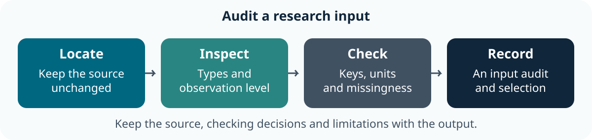

::: callout-outcomes
## 💡 Learning Outcomes

- Choose an object structure and inspect its dimensions and types.
- Import a table without changing the source or losing its header.
- Identify observation level, keys, units and recorded years.
- Retain missing values and trace a selected record back to its source.
:::

::: callout-questions
## ❓ Questions

1. What does one row represent?
2. Which fields identify an observation and which are measurements?
3. What changes when a value is missing or a column has the wrong type?
:::

## Structure & Agenda

| Block | Teaching | Activity | Output to keep |
|---|---:|---:|---|
| Structures and columns | 10 min | 5 min | An object choice |
| Read and inspect | 10 min | 5 min | An import record |
| Identifiers and units | 10 min | 5 min | A source check |
| **Break** | — | **10 min break** | — |
| Select observations | 10 min | 5 min | A checked subset |
| Types and missingness | 10 min | 5 min | A missing-value record |
| Save the import workflow | 10 min | 5 min | A rerunnable input audit |
| **Total** | **60 min** | **30 min** | **100 min including the break** |

This is **lesson 2 of eight**. Each five-minute activity includes a room response and debrief. Save work before the ten-minute break; use a practice copy and keep original inputs unchanged.

## Starting Point and Preparation

Complete [lesson 1](01-Rstudio_intro.qmd), open the course project and download `data/gapminder_data.csv` using [Setup](../learners/setup.qmd). The file is historical country-year data, not individual measurements.

{fig-alt="Locate the input, inspect its types and observation level, check identifiers and units, then retain an audit record with the selected data." fig-align="center" width="90%"}

# Choose a Structure for the Information {#objects-and-data-structures}

## Lists Preserve Different Kinds of Information

```{r}
stuff <- list("a", 1L, 3.14, LETTERS[3:9])
str(stuff)
stuff[4]
stuff[[4]]
```

A list can contain different types and nested objects. `stuff[4]` returns a one-element list; `stuff[[4]]` returns the element inside it. Distinguish those results before passing them to a function.

## Matrices Have Two Dimensions and One Type

```{r}
mx <- matrix(1:9, nrow = 3, ncol = 3, byrow = TRUE)
rownames(mx) <- c("a", "b", "c")
colnames(mx) <- c("c", "d", "e")
mx[2, 3]
mx[2, ]
mx[, 3]
```

`matrix()` accepts data, `nrow`, `ncol`, `byrow` and optional dimension names. A matrix stores one type of value. Use `[row, column]`; omitting one index selects the whole row or column. Check dimensions before applying a calculation along an axis.

## Data Frames Keep Columns with Different Types

```{r}
samples <- data.frame(
    sample_id = c("sample_01", "sample_02"),
    mass_g = c(2.1, 2.4),
    checked = c(TRUE, FALSE)
)
str(samples)
samples[1, ]
samples$mass_g
```

This small example is fictional. Columns can have different types, while each column has a consistent structure. A [tibble](https://tibble.tidyverse.org/) is a data-frame variant used in the tidyverse. A data-frame row can contain both text and measurements: do not blindly convert it to numeric values or average every column.

## Task 1: Choose an Object and Retain Identity (5 min)

::: callout-task
**Goal:** distinguish a list, matrix and data frame **Input:** `stuff`, `mx` and the fictional `samples` table Work in pairs: one operates and one checks; swap roles between tasks.

::: panel-tabset
##### Do the Task

1. **1 min:** Predict the difference between `stuff[4]` and `stuff[[4]]`.
2. **2 min:** Inspect the objects and select the `sample_id` and `mass_g` columns.
3. **1 min:** Check retained IDs, order and measurement units.
4. **1 min:** Two pairs explain why averaging a whole mixed-type row would be inappropriate.

**Keep:** the selected table and object explanation. **If access fails:** annotate the instructor's displayed input and output with the same decisions and checks.

##### Debrief

A list can hold unlike objects; a matrix has one type; a data frame preserves text identifiers beside measurements. The structure affects valid operations.
:::
:::

# Import a Table without Editing Its Source

## Read an Input without Changing It

The downloaded CSV contains historical country–year records from Gapminder. Read it into a named object rather than editing the input file. `read.csv()` uses a header row by default; checking the column names confirms that the header was interpreted as intended.

```{r}
input_path <- "data/gapminder_data.csv"
stopifnot(file.exists(input_path))
gapminder_csv <- read.csv(input_path, stringsAsFactors = FALSE)
head(gapminder_csv)
names(gapminder_csv)
dim(gapminder_csv)
str(gapminder_csv)
```

The explicit `stringsAsFactors = FALSE` retains text columns as character values for this import. Inspect the actual types rather than assuming that the CSV retains an R object's metadata.

## Check the Header and Types

```{r}
stopifnot(all(c("country", "year", "lifeExp", "pop") %in% names(gapminder_csv)))
stopifnot(is.character(gapminder_csv$country), is.numeric(gapminder_csv$lifeExp))
```

A CSV stores text, not all the metadata of an R object. Compare names, dimensions and a source row. If importing Excel later, record the sheet, range, header and missing-value conventions; the file extension alone cannot establish them.

## Task 2: Inspect an Import (5 min)

::: callout-task
**Goal:** verify an imported table before selecting records **Input:** the original Gapminder CSV and `read.csv()` example Work in pairs: one operates and one checks; swap roles between tasks.

::: panel-tabset
##### Do the Task

1. **1 min:** Identify the file path and expected header.
2. **2 min:** Read the table and inspect names, dimensions and types.
3. **1 min:** Compare the first observation with the source CSV; retain its identifiers.
4. **1 min:** Two pairs explain a check that catches a header or type problem.

**Keep:** an input record and saved import code. **If access fails:** annotate the instructor's displayed input and output with the same decisions and checks.

##### Debrief

The first observation must remain data rather than become a column name. A readable file still needs observation-level and type checks.
:::
:::

# Check Observation Level, Identifiers and Units


```{r}
range(gapminder_csv$year)
anyDuplicated(gapminder_csv[c("country", "year")])
gapminder_csv[1, c("country", "year", "lifeExp")]
```

The country–year combination identifies an observation. Check the available years before answering a question about a particular date. Life expectancy is measured in years and population in people; confirm definitions in the [Gapminder documentation](https://jennybc.github.io/gapminder/).

**Room prediction:** ask whether two rows for the same country in different years are duplicates. The country alone repeats; the combination of country and year represents distinct observations.

## Task 3: Explain the Key and Units (5 min)

::: callout-task
**Goal:** define what makes an observation distinct **Input:** `gapminder_csv` and its data documentation Work in pairs: one operates and one checks; swap roles between tasks.

::: panel-tabset
##### Do the Task

1. **1 min:** Predict whether country alone identifies each row.
2. **2 min:** Check country-year uniqueness and the recorded year range.
3. **1 min:** Record units for life expectancy and population.
4. **1 min:** Two pairs explain why two years for one country are distinct observations.

**Keep:** the key, source coverage and units. **If access fails:** annotate the instructor's displayed input and output with the same decisions and checks.

##### Debrief

Country-year identifies these records. Available years and aggregate measurement units constrain the questions this source can answer.
:::
:::

## Break (10 min)

Save your import record and script.

# Select Observations and Keep Their Keys

## Make the Condition Visible

```{r}
selected <- gapminder_csv[
    gapminder_csv$country %in% c("Ireland", "Brazil") & gapminder_csv$year == 2007,
    c("country", "year", "lifeExp", "pop"), drop = FALSE
]
stopifnot(nrow(selected) == 2L, !anyDuplicated(selected[c("country", "year")]))
selected
```

`%in%` tests membership; `&` combines conditions for each row. Keep IDs alongside measurements and compare retained values with their original records. An empty selection is a cue to investigate coverage or spelling, not substitute observations silently.

## Task 4: Check a Selected Comparison (5 min)

::: callout-task
**Goal:** select exactly the intended country-year records **Input:** the two-country selection above Work in pairs: one operates and one checks; swap roles between tasks.

::: panel-tabset
##### Do the Task

1. **1 min:** State the intended countries and year before running the code.
2. **2 min:** Select the rows and retain identifiers and units.
3. **1 min:** Compare both observations with the original table.
4. **1 min:** Two pairs explain what an empty selection would require them to check.

**Keep:** a checked subset and its selection rule. **If access fails:** annotate the instructor's displayed input and output with the same decisions and checks.

##### Debrief

A correct row count is helpful but insufficient: identifiers, year and values must also agree with the intended source records.
:::
:::

# Missing Values and Type Decisions

## Preserve the Uncertainty

The following is a **fictional altered copy**, used to practise missingness; it does not change the source data.

```{r}
missing_example <- gapminder_csv[1:3, c("country", "year", "lifeExp")]
missing_example$lifeExp[2] <- NA_real_
is.na(missing_example$lifeExp)
mean(missing_example$lifeExp)
observed_count <- sum(!is.na(missing_example$lifeExp))
mean(missing_example$lifeExp, na.rm = TRUE)
```

The first mean is missing. The second uses only observed values and needs its denominator recorded. That is a stated calculation choice, not evidence that replacing or omitting missing data is appropriate for a real study. Do not turn a category into numbers merely to make a function accept it.

## Task 5: Explain a Missing Result (5 min)

::: callout-task
**Goal:** record a missing-value choice explicitly **Input:** the fictional altered copy Work in pairs: one operates and one checks; swap roles between tasks.

::: panel-tabset
##### Do the Task

1. **1 min:** Predict the two means and count the observed values.
2. **2 min:** Run the examples and inspect the retained country-year rows.
3. **1 min:** Write a sentence identifying the denominator and what remains missing.
4. **1 min:** Two pairs explain why replacing the missing value with zero would change the question.

**Keep:** the missing-value record and checked counts. **If access fails:** annotate the instructor's displayed input and output with the same decisions and checks.

##### Debrief

The source cannot supply an invented measurement. Describe what the chosen calculation includes and retain the missing observation for review.
:::
:::

# Save the Import and Audit

## Assemble the Workflow

Save the path, import, structure checks, selection and source comparison in one script. Rerun it from a fresh session with the project open. Keep the fictional missingness example separate from the original source object.

## Task 6: Rerun an Input Audit (5 min)

::: callout-task
**Goal:** make an import and selection repeatable **Input:** the saved script and unchanged CSV Work in pairs: one operates and one checks; swap roles between tasks.

::: panel-tabset
##### Do the Task

1. **1 min:** Save the input path, import, checks and selection together.
2. **2 min:** Restart R and source the script with the project open.
3. **1 min:** The checker locates a selected observation in the original file.
4. **1 min:** Two pairs identify which checks establish execution and which establish the intended selection.

**Keep:** the input audit, script and unresolved questions. **If access fails:** annotate the instructor's displayed input and output with the same decisions and checks.

##### Debrief

Fresh execution checks dependencies; a source-record comparison checks the selection. Neither establishes a causal or present-day interpretation.
:::
:::

# Further Information

::: callout-keypoints
## 📚 Key Points

- Retain the question, source, units and decisions with the result.
- Compare at least one output with an independent known value or source record.
- A successful run is one check; interpretation and limitations still need review.
:::

::: callout-hints
## 🔦 Hints

- Save before restarting R and rerun from the beginning.
- Keep original inputs separate from derived outputs.
- Record unresolved questions instead of silently changing data to obtain an answer.
:::

## Module Summary

You can inspect structures, import a table and preserve keys, units and missingness. Use those input expectations when writing functions in lesson 3.

## Additional Learning

- [R data import/export manual](https://cran.r-project.org/doc/manuals/r-release/R-data.html): file formats and explicit import decisions.
- [Learner Additional Material](../learners/additional_material.qmd): practice, the shared project and official references.
- [Reference](../learners/reference.qmd): terms and checking reminders.

[Course Overview](../index.qmd) · [Previous](01-Rstudio_intro.qmd) · [Next](03-R_functions.qmd)

::: {.content-visible when-format="revealjs"}

## Feedback and Register

{fig-alt="Scan the QR code to give feedback on Digital Skills training."}

:::
