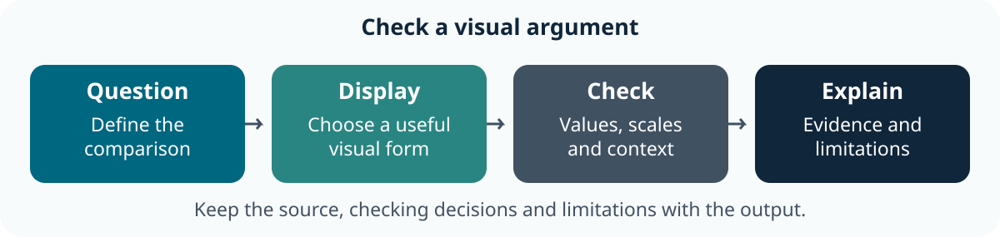

::: callout-outcomes
## 💡 Learning Outcomes

- Choose a display that fits the question and observation level.
- Inspect distributions, relationships and subgroup comparisons.
- Check plotted values, scales, missingness and labels against the source.
- Save figures with captions, provenance and qualified interpretations.
:::

::: callout-questions
## ❓ Questions

1. What comparison should a viewer make?
2. Which design choice could hide records or mislead interpretation?
3. What can these historical aggregate data actually establish?
:::

## Structure & Agenda

| Block | Teaching | Activity | Output to keep |
|---|---:|---:|---|
| Question and source | 10 min | 5 min | A plot specification |
| Distributions | 10 min | 5 min | A checked display |
| Relationships | 10 min | 5 min | A scoped comparison |
| **Break** | — | **10 min break** | — |
| Groups and facets | 10 min | 5 min | A subgroup display |
| Scales and missingness | 10 min | 5 min | An audited figure |
| Save and interpret | 10 min | 5 min | A figure and caption |
| **Total** | **60 min** | **30 min** | **100 min including the break** |

This is **lesson 6 of eight**. Each five-minute activity includes a room response and debrief. Save work before the ten-minute break; use a practice copy and keep original inputs unchanged.

## Starting Point and Preparation

Open the shared project from [Additional Material](../learners/additional_material.qmd), complete [lesson 5](05-the_tidyverse.qmd) and load the existing `gapminder` and `ggplot2` packages. Use the public historical data and retain the same year, units and keys in comparisons.

{fig-alt="Define the question, choose a display, compare plotted values and scale choices with the data, then explain the result and its limits." fig-align="center" width="90%"}

# Start with the Question and Source

## One Recorded Year Is a Different Comparison from a Time Series

```{r}
library(gapminder)
library(ggplot2)
plot_data <- as.data.frame(gapminder)
year_data <- plot_data[plot_data$year == 2007, ]
stopifnot(!anyDuplicated(year_data$country), all(year_data$year == 2007))
```

Each row in `year_data` is a country in one recorded year. The full data repeat countries over time. State which level is plotted; a country-level association cannot establish individual outcomes or causation.

## Specify What a Viewer Should Learn

| Question | Useful starting display | Check |
|---|---|---|
| How are country values distributed? | Histogram, box plot or individual-value display | Observed count and bin/group choices |
| How do two quantities vary together? | Scatter plot | Paired observations, units and axes |
| How do groups differ descriptively? | Facets or grouped distributions | Comparable scales and denominators |
| How do selected countries change over time? | Labelled lines | Country identity and recorded years |

## Task 1: Specify a Visual Comparison (5 min)

::: callout-task
**Goal:** match a display to a defined question **Input:** the 2007 table and the full dataset Work in pairs: one operates and one checks; swap roles between tasks.

::: panel-tabset
##### Do the Task

1. **1 min:** Choose a question and state the observation level.
2. **2 min:** Sketch a suitable plot and name its variables and units.
3. **1 min:** Identify one denominator, missingness or repeated-observation check.
4. **1 min:** Two pairs explain why their plot fits their question.

**Keep:** a plot specification. **If access fails:** annotate the instructor's displayed input and output with the same decisions and checks.

##### Debrief

The chart type follows the intended comparison. Define the source and level before using an attractive plotting template.
:::
:::

# Inspect Distributions

## Bins Are a Presentation Choice

```{r}
life_histogram <- ggplot(year_data, aes(x = lifeExp)) +
    geom_histogram(binwidth = 5, boundary = 0, fill = "#006781") +
    labs(x = "Life expectancy (years)", y = "Number of countries",
         title = "Recorded country life expectancy in 2007")
life_histogram
stopifnot(sum(ggplot_build(life_histogram)$data[[1]]$count) == nrow(year_data))
```

Compare a different bin width and an individual-value or box-plot display. Changing bins changes appearance, not the measurements. Disclose missing observations if present; do not remove an extreme value simply because it changes the shape.

## Task 2: Check a Distribution Display (5 min)

::: callout-task
**Goal:** connect displayed counts to observed records **Input:** the histogram and one alternative bin width Work in pairs: one operates and one checks; swap roles between tasks.

::: panel-tabset
##### Do the Task

1. **1 min:** Predict what a wider bin will change.
2. **2 min:** Build both views using the same records.
3. **1 min:** Compare the total displayed count with the input count.
4. **1 min:** Two pairs describe a feature that appears differently without a data change.

**Keep:** the two views and count check. **If access fails:** annotate the instructor's displayed input and output with the same decisions and checks.

##### Debrief

A presentation change can alter perceived shape. The denominator and data selection must remain visible.
:::
:::

# Explore a Relationship with Context

```{r}
relationship <- ggplot(year_data, aes(x = gdpPercap, y = lifeExp)) +
    geom_point(alpha = 0.6, colour = "#006781") +
    labs(x = "GDP per capita (US dollars, inflation-adjusted)",
         y = "Life expectancy (years)", title = "A historical country-level comparison")
relationship
```

Read the [data documentation](https://jennybc.github.io/gapminder/) for the economic measure's definition. A log scale can help display a wide range, but must be labelled and appropriate for the observed values. A fitted smooth is an exploratory summary, not an explanation of cause.

## Task 3: Trace a Point to Its Record (5 min)

::: callout-task
**Goal:** verify that the two plotted measurements are paired **Input:** the 2007 relationship plot Work in pairs: one operates and one checks; swap roles between tasks.

::: panel-tabset
##### Do the Task

1. **1 min:** Choose one country and identify both source values.
2. **2 min:** Locate its point and compare a linear/logarithmic x-axis display.
3. **1 min:** Record what the scale changes and what it leaves unchanged.
4. **1 min:** Two pairs provide an interpretation that retains the aggregate and historical scope.

**Keep:** a checked point and qualified interpretation. **If access fails:** annotate the instructor's displayed input and output with the same decisions and checks.

##### Debrief

A scale affects visual spacing. It does not alter the source values or establish a causal mechanism.
:::
:::

## Break (10 min)

Save the plot specification and source checks.

# Compare Groups without Hiding Context

```{r}
set.seed(42)
group_plot <- ggplot(year_data, aes(x = continent, y = lifeExp)) +
    geom_boxplot() +
    geom_jitter(width = 0.1, height = 0, alpha = 0.5) +
    labs(x = "Continent", y = "Life expectancy (years)",
         title = "Observed country values by continent, 2007")
group_plot
```

Set a seed before saving a plot that uses random jitter when exact reproduction matters. Labels and position identify groups without depending only on colour. Groups contain different numbers of countries; an unweighted country comparison is not a population-weighted one.

## Task 4: Compare Groups Responsibly (5 min)

::: callout-task
**Goal:** retain values, grouping and denominators **Input:** the grouped display Work in pairs: one operates and one checks; swap roles between tasks.

::: panel-tabset
##### Do the Task

1. **1 min:** Identify the observation level and group sizes.
2. **2 min:** Compare the grouped view with a faceted display using comparable scales.
3. **1 min:** Check one group's records and state the weighting.
4. **1 min:** Two pairs name a comparison the plot supports and one it cannot establish.

**Keep:** a subgroup display and caveat. **If access fails:** annotate the instructor's displayed input and output with the same decisions and checks.

##### Debrief

Grouping clarifies structure but can hide within-group variation. A named continent is not a causal explanation.
:::
:::

# Audit Scales, Missingness and Labels

## Zooming and Removing Data Have Different Consequences

The original axis-limit examples in the reference bank are retained. Scale limits can remove observations before a statistic such as smoothing is computed; visual zooming with `coord_cartesian()` serves a different purpose. Inspect warnings and compare the input and plotted records.

```{r}
zoomed <- relationship + coord_cartesian(xlim = c(0, 30000))
zoomed
stopifnot(nrow(ggplot_build(zoomed)$data[[1]]) == nrow(year_data))
```

The range is a declared teaching display choice, not a rule for excluding research observations. Check units, sources, dates, legend labels and missingness in the caption.

## Task 5: Audit a Plot Specification (5 min)

::: callout-task
**Goal:** identify whether a display choice removes information **Input:** the full plot, zoomed view and retained limit examples Work in pairs: one operates and one checks; swap roles between tasks.

::: panel-tabset
##### Do the Task

1. **1 min:** Predict whether visual zooming changes the source rows.
2. **2 min:** Compare the views and inspect warnings from a scale-limited example.
3. **1 min:** Record which values remain available and what the viewer cannot see.
4. **1 min:** Two pairs explain a revision that improves context rather than hiding a valid value.

**Keep:** an audit note and revised caption. **If access fails:** annotate the instructor's displayed input and output with the same decisions and checks.

##### Debrief

A plot must disclose its selection and presentation choices. Inspect warnings rather than suppressing them to obtain a tidy image.
:::
:::

# Save, Check and Interpret a Figure

## Reuse the Project's Checked Selection

Run these commands from the extracted shared project folder, which contains `analysis.R` and its `data` directory.

```{r}
#| label: shared-project-render-start
#| include: false
# Render this example in the supplied project, as learners do after extraction.
lesson_render_root <- knitr::opts_knit$get("root.dir")
project_dir <- normalizePath(file.path(dirname(knitr::current_input(dir = TRUE)),
                                       "../learners/files/research-project"),
                             mustWork = TRUE)
knitr::opts_knit$set(root.dir = project_dir)
```

```{r}
source("analysis.R")
research_data <- read_research_data()
selection <- select_observations(research_data, c("Ireland", "Brazil"), 2007)
comparison <- make_comparison(selection)
comparison
```

```{r}
#| label: shared-project-render-end
#| include: false
# Keep the other lesson examples at their original rendering location.
knitr::opts_knit$set(root.dir = lesson_render_root)
```

Use `ggsave()` with a named practice destination, explicit width/height and units. Inspect the saved file, compare one value with its source and write an interpretation containing the year, units, observation level and limitation. [Lesson 7](07-digital_research_notebooks.qmd) places this output in a computational research notebook.

## Task 6: Save a Figure a Colleague Can Inspect (5 min)

::: callout-task
**Goal:** produce a checked figure and explanatory caption **Input:** the shared project selection and plot Work in pairs: one operates and one checks; swap roles between tasks.

::: panel-tabset
##### Do the Task

1. **1 min:** Specify the question, countries and recorded year.
2. **2 min:** Save a figure in a separate output folder with explicit dimensions.
3. **1 min:** The checker compares a plotted value and reads the caption without the author's explanation.
4. **1 min:** Two pairs report one change that made the figure easier to interpret.

**Keep:** the figure, source check and caption. **If access fails:** annotate the instructor's displayed input and output with the same decisions and checks.

##### Debrief

An exported image needs context to travel beyond its author. Keep the code and source selection with it.
:::
:::

# Optional Plot Reference Bank

These retained extensions use `gridExtra` and `ggExtra`; prepare them using [Setup](../learners/setup.qmd) before choosing those examples. Save only to a practice output folder and inspect destinations before rerunning exports.

```{r}
library(gridExtra)
library(ggExtra)
dir.create("output", showWarnings = FALSE)
set.seed(42)
```

The existing plotting variants are preserved below for further practice, outside the core plan. They use the full `gapminder` table and sometimes pool repeated country observations. Inspect that scope and all warnings before interpretation. The original data manipulations and worked exercise bank remain in [lesson 5](05-the_tidyverse.qmd).

## Additional Plotting Styles

## Bar plot with ggplot2

```{r}
# Bar plot
ggplot(data = gapminder, aes(x = continent)) +
  geom_bar()
```

## Histogram plot with ggplot2

```{r}
# Histogram
ggplot(data = gapminder, aes(x = lifeExp)) +
  geom_histogram()
```

## Box plot with ggplot2

```{r ggplot24}
# Box plot
ggplot(gapminder, aes(x = continent, y = lifeExp)) +
  geom_boxplot()
```

## Violin plot with ggplot2

```{r}
# Violin plot
ggplot(gapminder, aes(x = continent, y = gdpPercap)) +
  geom_violin()
```

## Scatter plot with color aesthetic with ggplot2

```{r}
# Scatter plot with color aesthetic
ggplot(data = gapminder, aes(x = lifeExp, y = gdpPercap, color = continent)) +
  geom_point()
```

## Scatter plot with custom color

```{r}
# Scatter plot with custom color
ggplot(data = gapminder, aes(x = lifeExp, y = gdpPercap)) +
  geom_point(color = "red")
```

## Scatter plot with smooth line

```{r}
# Scatter plot with smooth line
ggplot(data = gapminder, aes(x = lifeExp, y = gdpPercap)) +
  geom_point() +
  geom_smooth(alpha = 0.5)
```

## Faceted plot in ggplot2

```{r}
# Faceted plot
ggplot(data = gapminder, aes(x = lifeExp, y = gdpPercap)) +
  geom_point() +
  geom_smooth(alpha = 0.5) +
  facet_wrap(~continent)
```

## Customised Axes

The existing scale limits below remove out-of-range values before statistical layers are calculated. This can change a smooth as well as the visible points. Inspect warnings and exclusions. If you intend only to zoom the view, the [ggplot2 coordinate documentation](https://ggplot2.tidyverse.org/reference/coord_cartesian.html) explains `coord_cartesian()`; the example limits are retained here so this distinction is visible.

```{r}
# Customized axes
ggplot(data = gapminder, aes(x = lifeExp, y = gdpPercap)) +
  geom_point() +
  geom_smooth(alpha = 0.5) +
  xlab("Life Expectancy") +
  ylab("GDP Per Capita") +
  xlim(0, 70) +
  ylim(0, 100000)
```

## Box plot with customized y-axis

```{r}
# Box plot with customized y-axis
ggplot(gapminder, aes(x = continent, y = lifeExp)) +
  geom_boxplot() +
  scale_y_continuous(name = "Life Expectancy (Years)",
                     limits = c(10, 90),
                     breaks = c(10, 20, 30, 40, 50, 60, 70, 80, 90))
```

## Box plot with customized x-axis

```{r}
# Box plot with customized x-axis
ggplot(gapminder, aes(x = continent, y = lifeExp)) +
  geom_boxplot() +
  scale_x_discrete(name = "Continent",
                   labels = c("Africa" = "AF", "Americas" = "AM",
                              "Asia" = "AS", "Europe" = "EU", "Oceania" = "OC"))
```

## Color gradient scale

```{r}
# Color gradient scale
ggplot(data = gapminder, aes(x = gdpPercap, y = lifeExp, color = pop)) +
  geom_point() +
  scale_color_gradient(low = "blue", high = "red")
```

## Discrete color scale

```{r}
# Discrete color scale
ggplot(data = gapminder, aes(x = gdpPercap, y = lifeExp, color = continent)) +
  geom_point() +
  scale_color_manual(values = c("#1f78b4", "#33a02c", "#e31a1c", "#ff7f00", "#6a3d9a"))
```

## Plot with color palette

```{r}
# Plot with color palette
ggplot(data = gapminder, aes(x = lifeExp, y = gdpPercap)) +
  geom_point(aes(fill = continent), size = 5, shape = 21) +
  geom_smooth(alpha = 0.5) +
  scale_fill_brewer(palette = "Set2") +
  theme_minimal()
```

## Box plot with theme_classic

```{r}
# Box plot with theme_classic
ggplot(gapminder, aes(x = continent, y = lifeExp)) +
  geom_boxplot() +
  theme_classic()
```

## Box plot with jitter

```{r}
# Box plot with jitter
ggplot(gapminder, aes(x = continent, y = lifeExp)) +
  geom_boxplot(outlier.colour = "hotpink") +
  geom_jitter(position = position_jitter(width = 0.1, height = 0), alpha = 1/4)
```

## Combined violin and box plot

```{r}
# Combined violin and box plot
ggplot(gapminder) +
  geom_violin(aes(x = continent, y = gdpPercap), scale = "width") +
  geom_boxplot(aes(x = continent, y = gdpPercap), width = 0.1)
```

## Multiple plots with gridExtra

```{r}
# Multiple plots with gridExtra
p1 <- ggplot(gapminder) + geom_boxplot(aes(x = continent, y = gdpPercap, fill = continent))
p2 <- ggplot(gapminder) + geom_violin(aes(x = continent, y = gdpPercap, fill = continent))
grid.arrange(p1, p2, nrow = 1)
```

## Marginal histogram

```{r}
# Marginal histogram
p <- ggplot(data = gapminder, aes(x = lifeExp, y = gdpPercap, fill = continent)) +
  geom_point() +
  theme(legend.position = "none")
ggMarginal(p, type = "histogram")
```

## Saving Plots

Save a plot to a file using `ggsave`.

```{r}
p1 <- ggplot(data = gapminder, aes(x = lifeExp, y = gdpPercap)) +
  geom_point(aes(fill = continent), size = 5, shape = 21) +
  geom_smooth(alpha = 0.5) +
  scale_fill_brewer(palette = "Set2") +
  theme_minimal()
print(getwd())
ggsave("output/myplot.png", plot = p1)
```

# Further Information

::: callout-keypoints
## 📚 Key Points

- Retain the question, source, units and decisions with the result.
- Compare at least one output with an independent known value or source record.
- A successful run is one check; interpretation and limitations still need review.
:::

::: callout-hints
## 🔦 Hints

- Save before restarting R and rerun from the beginning.
- Keep original inputs separate from derived outputs.
- Record unresolved questions instead of silently changing data to obtain an answer.
:::

## Module Summary

You can specify, inspect and save figures with source checks and limitations. Next, keep narrative, code and results together in a notebook.

## Additional Learning

- [ggplot2 documentation](https://ggplot2.tidyverse.org/): layers, scales and labels.
- [Learner Additional Material](../learners/additional_material.qmd): practice, the shared project and official references.
- [Reference](../learners/reference.qmd): terms and checking reminders.

[Course Overview](../index.qmd) · [Previous](05-the_tidyverse.qmd) · [Next](07-digital_research_notebooks.qmd)

::: {.content-visible when-format="revealjs"}

## Feedback and Register

{fig-alt="Scan the QR code to give feedback on Digital Skills training."}

:::
