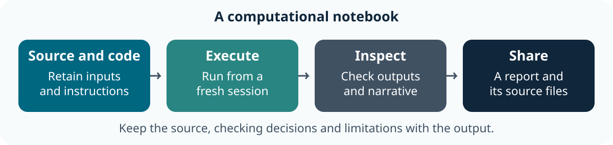

::: callout-outcomes
## 💡 Learning Outcomes

- Combine a question, saved code, results and decisions in a computational notebook.
- Render tables, figures and inline values from a fresh R session.
- Change a declared parameter and check that all outputs agree.
- Share a report with the input, code, environment record and limitations needed to rerun it.
:::

::: callout-questions
## ❓ Questions

1. Can a reader trace a claim to its source and calculation?
2. Which notebook results depend on hidden interactive state?
3. What must travel with a rendered report?
:::

## Structure & Agenda

| Block | Teaching | Activity | Output to keep |
|---|---:|---:|---|
| Notebook purpose and structure | 10 min | 5 min | An evidence map |
| Code and execution | 10 min | 5 min | A fresh render |
| Tables and figures | 10 min | 5 min | A checked result |
| **Break** | — | **10 min break** | — |
| Parameters and inline values | 10 min | 5 min | An updated question |
| Validation and failures | 10 min | 5 min | A recorded failure check |
| Sharing and peer review | 10 min | 5 min | A reproducible notebook handover |
| **Total** | **60 min** | **30 min** | **100 min including the break** |

This is **lesson 7 of eight**. Each five-minute activity includes a room response and debrief. Save work before the ten-minute break; use a practice copy and keep original inputs unchanged.

## Starting Point and Preparation

Complete [Visualisation](06-exploration_and_visualisation.qmd). Download and extract the [shared project](../learners/files/research-project.zip), open it as the RStudio project and prepare Quarto using [Setup](../learners/setup.qmd). The supplied `report.qmd` is a complete working notebook, not an empty template. Run R commands in that local project; the code excerpts below show notebook/source structure and do not run a second notebook inside this lesson.

{fig-alt="A computational notebook retains source material and saved code, executes from a fresh session, checks generated outputs and shares the report with its source files." fig-align="center" width="90%"}

# Define What the Notebook Records

## An Inspectable Research Record

A computational notebook records the question, input, code, outputs, interpretation and changes made. A saved rendered page shows a result; the source notebook and its supporting files explain how that result was made.

The course uses Quarto `.qmd` documents in RStudio. Markdown supplies narrative and structure; executable R cells supply computations. Keep reading notes, exploratory decisions and final interpretations distinguishable. See the [official computational-document tutorial](https://quarto.org/docs/get-started/computations/rstudio.html).

## Read the Supplied Document

The project includes:

| File | Role |
|---|---|
| `data/gapminder_data.csv` | Original historical country-year input |
| `analysis.R` | Shared validation, selection, summary and plotting functions |
| `report.qmd` | Question, parameters, code, results and interpretation |
| `tests.R` | Known-value, identity, failure and reactive checks |
| `app.R` | The dashboard developed in lesson 8 |

The shared functions preserve source records. The mean is unweighted across selected observed countries; the report discloses that choice and missing-value counts.

## Task 1: Map a Claim to Its Evidence (5 min)

::: callout-task
**Goal:** identify how a notebook supports a statement **Input:** the supplied `report.qmd` and input file Work in pairs: one operates and one checks; swap roles between tasks.

::: panel-tabset
##### Do the Task

1. **1 min:** Choose one reported quantity and identify its units.
2. **2 min:** Locate its source, selection and calculation in the notebook/helper.
3. **1 min:** Record what a reader could check and one interpretation the data cannot support.
4. **1 min:** Two pairs explain why a screenshot of the result is not enough to rerun the work.

**Keep:** an evidence map from claim to source and calculation. **If access fails:** annotate the instructor's displayed input and output with the same decisions and checks.

##### Debrief

The notebook connects narrative and computation. The source files and explicit selection are needed to reproduce and inspect the result.
:::
:::

# Run Saved Code in a Defined Order

## Cells, Output and a Fresh Session

Open `report.qmd` in RStudio. Its Render button runs the document's saved computation. Running a cell interactively is useful during development; rendering the whole document checks whether saved steps establish all required objects.

The report begins with this complete setup, shown as an excerpt:

```text
source("analysis.R")
research_data <- read_research_data()
selection <- select_observations(research_data, params$countries, params$year)
stopifnot(nrow(selection) > 0L)
summary <- summarise_selection(selection)
```

## Make the File Location Explicit

Open the extracted project folder and render from it. The CSV path is relative to that project. Keep a saved source file; do not depend on an object left in the console from a previous session.

```bash
quarto render report.qmd
```

The notebook keeps computation errors visible (`error: false` stops rendering). A failed render is information about the workflow, not a reason to paste yesterday's output into a new report.

## Task 2: Render from a Fresh Session (5 min)

::: callout-task
**Goal:** expose dependence on unsaved interactive work **Input:** the unchanged project and report Work in pairs: one operates and one checks; swap roles between tasks.

::: panel-tabset
##### Do the Task

1. **1 min:** Save the notebook and locate `analysis.R` and the CSV.
2. **2 min:** Restart R after saving, then use Render or the displayed CLI command.
3. **1 min:** Compare the selected year, observations and table with the saved inputs.
4. **1 min:** Two pairs name a missing setup step that rendering would reveal.

**Keep:** the rendered HTML and a fresh-session check. **If access fails:** annotate the instructor's displayed input and output with the same decisions and checks.

##### Debrief

A successful render establishes saved execution in that environment. Check the resulting selection and interpretation separately.
:::
:::

# Check Generated Tables, Figures and Narrative

## One Selection Supports Several Views

The report renders the selected records, a summary and a figure from the same `selection` object. It uses a figure caption, alternative text and a cross-reference so that a reader can locate the item being discussed.

The source contains the following real cell options:

```text
#| label: fig-comparison
#| fig-cap: "Life expectancy for the selected historical country-year observations."
#| fig-alt: "A column chart comparing the selected countries' recorded life expectancy in years. Missing values, if present, are disclosed and excluded from the chart only."
make_comparison(selection)
```

A caption explains scope and context; alternative text describes the visual relationship. Check one plotted value against the selected record and then the original CSV. Keep the code used to produce the figure, not just the exported image.

## Describe the Limitations beside the Result

The source is historical aggregate data. The displayed comparison cannot establish present-day conditions, individual outcomes or cause. The report's summary explicitly identifies observed/missing counts and its unweighted mean.

## Task 3: Review the Three Views Together (5 min)

::: callout-task
**Goal:** check that table, figure and explanation refer to the same data **Input:** the rendered report and original CSV Work in pairs: one operates and one checks; swap roles between tasks.

::: panel-tabset
##### Do the Task

1. **1 min:** Select one country-year observation to inspect.
2. **2 min:** Compare its value in the CSV, table and figure.
3. **1 min:** Revise one sentence or caption to retain the year, units and limitation.
4. **1 min:** Two pairs explain a misleading claim that their check would reject.

**Keep:** a checked result and revised narrative. **If access fails:** annotate the instructor's displayed input and output with the same decisions and checks.

##### Debrief

Consistent outputs still need a defensible interpretation. Figure numbering and a polished layout do not establish evidential support.
:::
:::

## Break (10 min)

Save the notebook and review note before continuing.

# Declare Parameters and Update Inline Values

## Change the Question in One Place

The notebook's header declares countries and one recorded year:

```yaml
params:
  countries: ["Ireland", "Brazil"]
  year: 2007
```

Change the year to another recorded year, such as 1952, and re-render. The selected records, figure, summary and inline year should all change together. Read the [parameter guidance](https://quarto.org/docs/computations/parameters.html) for additional interfaces.

The starter uses `embed-resources: true` for HTML snapshots. Each saved HTML report keeps its own figure, so a later parameter run cannot replace the image referenced by an earlier report. This snapshot still needs the notebook, helper and input files for a fresh computation.

```bash
quarto render report.qmd -P year:1952
```

The source also uses inline R expressions for row counts and the selected year. Those are computed from the current selection instead of manually copied numbers. Do not replace them with prose that becomes stale after changing a parameter.

## Task 4: Change a Recorded Question (5 min)

::: callout-task
**Goal:** keep every displayed output aligned with a parameter **Input:** the report and a recorded year such as 1952 Work in pairs: one operates and one checks; swap roles between tasks.

::: panel-tabset
##### Do the Task

1. **1 min:** Predict which parts of the report should change.
2. **2 min:** Change the parameter and render the report again.
3. **1 min:** Check the year, table, figure and inline counts together.
4. **1 min:** Two pairs identify a manually typed value that would be fragile.

**Keep:** the revised report and parameter record. **If access fails:** annotate the instructor's displayed input and output with the same decisions and checks.

##### Debrief

A parameter makes a deliberate choice visible. It does not choose a scientifically appropriate comparison on the researcher's behalf.
:::
:::

# Keep Validation and Failure Checks Visible

## Reject an Unsupported Request

The helper refuses years absent from the source and unknown country identifiers. Try an invalid year only in a practice copy; read the error, restore a recorded value and render again. Do not substitute another year silently.

The project has a repeatable check script:

```bash
Rscript tests.R
```

It checks keys, unchanged source objects, known selections, empty/invalid inputs, missing-value counts, plotted values and the app's reactive selection. Read what those checks establish; passing them is not proof of every possible scientific claim.

## Separate Tool Failure from Data Absence

A missing input file, an invalid parameter and an observed measurement that is missing require different responses. Record which failure occurred and the correction, keeping the original source unchanged.

## Task 5: Explain an Expected Failure (5 min)

::: callout-task
**Goal:** diagnose a parameter problem without masking it **Input:** a practice report with year changed to 2012 Work in pairs: one operates and one checks; swap roles between tasks.

::: panel-tabset
##### Do the Task

1. **1 min:** Predict whether the source can answer the request.
2. **2 min:** Render the practice copy and inspect the reported failure.
3. **1 min:** Restore a recorded year, rerun the tests and render again.
4. **1 min:** Two pairs explain why substituting a nearby year would change the question.

**Keep:** the error, correction and successful recheck. **If access fails:** annotate the instructor's displayed input and output with the same decisions and checks.

##### Debrief

An explicit failure is preferable to a confident report for an unsupported selection. The correction must remain a recorded research decision.
:::
:::

# Share a Notebook a Colleague Can Rerun

## Retain the Source and Environment Record

Share the notebook, helper, permitted input, checks and README as a coherent project. The report records `sessionInfo()` to identify the R/package environment actually used. A rendered HTML file is useful for readers; it does not contain every file needed to rerun the source.

For a real project, check what can be shared and keep sensitive inputs in their approved location. Use a small public or fictional example for classroom exchange. Git and a package-lock workflow are optional extensions; do not add them without explaining the team's process.

## Peer Review the Handover

Ask a partner to find the question, parameter values, input, known check, uncertainty and instructions to render. If they cannot rerun locally, they can still identify missing information by inspecting the files.

## Task 6: Exchange a Notebook Handover (5 min)

::: callout-task
**Goal:** make the project understandable to another researcher **Input:** the report, code, checks and permitted source Work in pairs: one operates and one checks; swap roles between tasks.

::: panel-tabset
##### Do the Task

1. **1 min:** List the files needed to rerun the result.
2. **2 min:** Exchange the practice project and follow its README.
3. **1 min:** Record one successful check and one unresolved question.
4. **1 min:** Two pairs report the missing detail that most hindered reuse.

**Keep:** a reviewed notebook and handover note. **If access fails:** annotate the instructor's displayed input and output with the same decisions and checks.

##### Debrief

Reproducibility includes sources, decisions and environment context. Keep uncertainty visible rather than treating a reproducible calculation as an automatically valid interpretation.
:::
:::

# Further Information

::: callout-keypoints
## 📚 Key Points

- Retain the question, source, units and decisions with the result.
- Compare at least one output with an independent known value or source record.
- A successful run is one check; interpretation and limitations still need review.
:::

::: callout-hints
## 🔦 Hints

- Save before restarting R and rerun from the beginning.
- Keep original inputs separate from derived outputs.
- Record unresolved questions instead of silently changing data to obtain an answer.
:::

## Module Summary

You have a computational research notebook whose question, code, outputs and limits can be inspected and rerun. Next, expose the same checked analysis through an interactive dashboard.

## Additional Learning


- [Learner Additional Material](../learners/additional_material.qmd): practice, the shared project and official references.
- [Reference](../learners/reference.qmd): terms and checking reminders.

[Course Overview](../index.qmd) · [Previous](06-exploration_and_visualisation.qmd) · [Next](08-interactive_research_dashboards.qmd)
