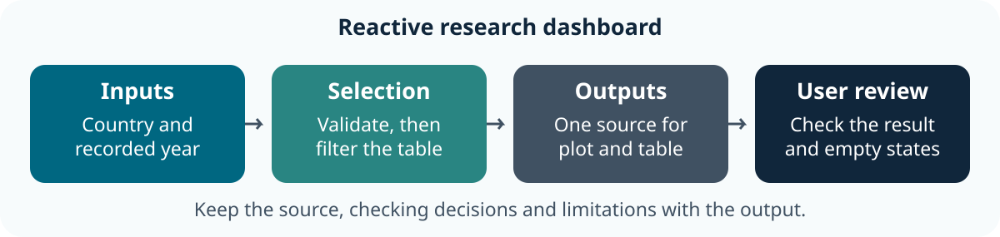

::: callout-outcomes
## 💡 Learning Outcomes

- Explain the relationship between an input, reactive selection and displayed output.
- Run and adapt a small Shiny app using the same checked analysis as the notebook.
- Check that plot, table and download agree after changing an input.
- Handle empty or invalid selections and describe the runtime/ownership needed for sharing.
:::

::: callout-questions
## ❓ Questions

1. Which calculation should run when the user changes a control?
2. How can several outputs stay connected to one checked selection?
3. What happens when the requested selection cannot support a result?
:::

## Structure & Agenda

| Block | Teaching | Activity | Output to keep |
|---|---:|---:|---|
| Purpose and app structure | 10 min | 5 min | An input/output map |
| UI controls and identifiers | 10 min | 5 min | A working control |
| Reactive data and outputs | 10 min | 5 min | A checked update |
| **Break** | — | **10 min break** | — |
| Validation and empty states | 10 min | 5 min | A failure check |
| Download and peer testing | 10 min | 5 min | A reviewed output |
| Sharing and handover | 10 min | 5 min | An app and ownership record |
| **Total** | **60 min** | **30 min** | **100 min including the break** |

This is **lesson 8 of eight**. Each five-minute activity includes a room response and debrief. Save work before the ten-minute break; use a practice copy and keep original inputs unchanged.

## Starting Point and Preparation

Complete [lesson 7](07-digital_research_notebooks.qmd) and use the same [project download](../learners/files/research-project.zip). Prepare Shiny before class using [Setup](../learners/setup.qmd). Run the complete `app.R` in local RStudio; these excerpts explain its code and do not start a server inside the course page. A shared-screen demonstration is a valid fallback.

{fig-alt="The recorded country/year inputs are validated before one reactive data selection supplies the plot and table. User review checks the outputs and empty states." fig-align="center" width="90%"}

# Decide What the Dashboard Should Help Someone Do

## A Narrow Research Question

The starter lets a colleague compare recorded life expectancy for chosen countries in one year. It shows the selected records and discloses missingness. The app uses the same `analysis.R` helper and original CSV as the notebook, so a user can trace the result to a checked calculation.

A dashboard is an interface to an analysis. Define the intended audience, task, units, source and limitations before adding controls. This historical aggregate example does not establish current conditions, individual outcomes or cause.

## Inspect the App's Parts

| Part | Purpose in the starter |
|---|---|
| Input and helper | Read the original CSV and check its keys/types |
| `ui` | Declare controls and places to display outputs |
| `server` | Validate inputs, select data and render outputs |
| `shinyApp(ui, server)` | Create the application from those two parts |

Open the extracted project and run:

```text
shiny::runApp(".")
```

Keep that R process running while using the app. Use Stop/Esc in RStudio to stop it. The [official Shiny introduction](https://shiny.posit.co/r/getstarted/) provides a further walkthrough.

## Task 1: Map the App before Editing (5 min)

::: callout-task
**Goal:** identify the user question and its code path **Input:** the complete starter app and public CSV Work in pairs: one operates and one checks; swap roles between tasks.

::: panel-tabset
##### Do the Task

1. **1 min:** State the user question and identify the observation level.
2. **2 min:** Run the app and locate its UI, server and shared helper.
3. **1 min:** Trace one displayed observation back to the original source.
4. **1 min:** Two pairs explain which responsibilities belong to the interface and which to the analysis.

**Keep:** an input-to-output map. **If access fails:** annotate the instructor's displayed input and output with the same decisions and checks.

##### Debrief

The app presents a bounded comparison. UI code is not a substitute for input checks, source context or scientific interpretation.
:::
:::

# Give Controls and Outputs Consistent Identifiers

## Read the User Interface

The starter creates a multiple-country selector and a recorded-year selector:

```text
selectInput("countries", "Countries", choices = country_choices,
            selected = c("Ireland", "Brazil"), multiple = TRUE)
selectInput("year", "Recorded year", choices = year_choices,
            selected = max(year_choices))
plotOutput("comparison")
tableOutput("observations")
```

Control IDs connect to `input$countries` and `input$year`. Output IDs connect to the corresponding `output$...` names in the server. Labels help users understand the choice; an identifier connects code. A missing/mismatched output ID can leave a valid server calculation undisplayed.

Use choices derived from the data rather than inventing unavailable years. The two controls describe a country-year selection; they do not ask users to enter arbitrary paths or upload research files.

## Task 2: Find a Missing Output Connection (5 min)

::: callout-task
**Goal:** diagnose a mismatched UI/server identifier **Input:** a practice copy of `app.R` Work in pairs: one operates and one checks; swap roles between tasks.

::: panel-tabset
##### Do the Task

1. **1 min:** Predict what happens if the UI's `observations` ID changes but the server does not.
2. **2 min:** Make that one change, rerun and inspect the app.
3. **1 min:** Restore the matched ID and check the table appears.
4. **1 min:** Two pairs distinguish an undisplayed output from an empty dataset.

**Keep:** the restored app and connection explanation. **If access fails:** annotate the instructor's displayed input and output with the same decisions and checks.

##### Debrief

A correct calculation can be absent from the interface. Check the ID contract before changing the underlying data.
:::
:::

# Reuse One Reactive Selection

## Changes Travel through Dependencies

`reactive()` defines a calculation whose result can be reused by dependent outputs. In this app, a change to the selected countries or year invalidates the selection; the plot, table and coverage text use the updated result.

```text
selected_data <- reactive({
    # Validate the controls first, as the full starter does.
    select_observations(research_data, input$countries, as.numeric(input$year))
})
output$observations <- renderTable({
    selected_data()[c("country", "year", "lifeExp", "pop")]
})
```

This abbreviated excerpt explains the dependency; use the complete starter's validation when running the app. Calling `selected_data()` reads the reactive result. Copying separate filter code into every output risks inconsistent selections. See the [reactive-flow guide](https://shiny.posit.co/r/getstarted/build-an-app/reactive-flow/reactive-flow.html).

## Task 3: Check a Reactive Change (5 min)

::: callout-task
**Goal:** verify that every output uses the same updated selection **Input:** the restored app and CSV Work in pairs: one operates and one checks; swap roles between tasks.

::: panel-tabset
##### Do the Task

1. **1 min:** Predict the rows for Ireland and Brazil in 2007.
2. **2 min:** Change one country and then choose 1952.
3. **1 min:** Compare the updated table, plot and coverage with the corresponding original records.
4. **1 min:** Two pairs describe the dependency that caused the outputs to update.

**Keep:** two checked selections and an input/output record. **If access fails:** annotate the instructor's displayed input and output with the same decisions and checks.

##### Debrief

Reactivity repeats the linked calculation. Verify its values and scope; an updating chart alone does not show that the right records were selected.
:::
:::

## Break (10 min)

Save the practice app before continuing.

# Make Empty and Invalid States Understandable

## Validate before Calculating

The complete starter supplies specific messages with `validate()` and `need()`:

```text
validate(need(length(input$countries) > 0L, "Choose at least one country."))
validate(need(all(input$countries %in% country_choices),
              "Choose countries from the recorded list."))
```

It also validates the year before converting the selector's text to a numeric value. Converting a GUI choice deliberately is different from silently converting an input data column. The shared helper separately rejects invalid years, unknown identifiers and repeated country-year keys.

## Keep Data Absence Distinct from Tool Failure

An empty choice should display a useful message. A missing source file should fail during loading with the path identified. Missing life-expectancy measurements remain in the table and are counted; the plot uses only observed measurements with an explicit caption. Do not invent a zero or swallow an unexpected error to keep the dashboard looking complete.

[Shiny validation guidance](https://shiny.posit.co/r/reference/shiny/latest/validate.html)

## Task 4: Test an Empty Selection (5 min)

::: callout-task
**Goal:** produce a useful state instead of a misleading result **Input:** the app and its validation code Work in pairs: one operates and one checks; swap roles between tasks.

::: panel-tabset
##### Do the Task

1. **1 min:** Predict the response to clearing all country choices.
2. **2 min:** Clear the selection and inspect the messages; then restore a recorded country.
3. **1 min:** Compare the restored result with its source and record the expected state.
4. **1 min:** Two pairs explain why an empty selection is not evidence that a country's value is zero.

**Keep:** an empty-state check and restored result. **If access fails:** annotate the instructor's displayed input and output with the same decisions and checks.

##### Debrief

Validation explains why a result cannot be displayed. It preserves the distinction between selection, missingness and an actual calculation failure.
:::
:::

# Check a Download and Review with a Colleague

## Export the Data behind the View

The download uses the same reactive selection, a fixed safe filename and an explicit blank representation for missing values. It retains the country/year identifiers and all selected source columns. Rounding in the displayed table is presentation only; the downloaded numeric values retain their precision.

```text
output$download <- downloadHandler(
    filename = function() "country-year-selection.csv",
    content = function(file) write.csv(selected_data(), file, row.names = FALSE, na = "")
)
```

Read the downloaded file and compare keys, row count and measurements with the selected original records. Include the source context when sharing; a CSV alone does not explain units or interpretation.

## A Small Test Matrix

| Case | Expected check |
|---|---|
| Two recorded countries/year | Plot, table and download agree |
| Another recorded year | All outputs update together |
| No country selected | Clear message; no fabricated result |
| Unknown year/identifier in tests | Validation rejects it |
| Missing source file in a practice copy | A useful loading error |

## Task 5: Review the View and Download (5 min)

::: callout-task
**Goal:** check that an exported file represents the same selection **Input:** the app and a downloaded CSV Work in pairs: one operates and one checks; swap roles between tasks.

::: panel-tabset
##### Do the Task

1. **1 min:** Agree a two-country/year selection and expected row count.
2. **2 min:** Download it, read it back and compare identifiers and values.
3. **1 min:** A partner repeats one different selection and records its check.
4. **1 min:** Two pairs identify one test case that a screenshot would miss.

**Keep:** a checked CSV and small test matrix. **If access fails:** annotate the instructor's displayed input and output with the same decisions and checks.

##### Debrief

Test the data behind the presentation. Formatting and a plausible figure do not establish consistency between views and exports.
:::
:::

# Share the App with a Clear Runtime and Owner

## A Report and a Live App Travel Differently

A rendered HTML notebook/dashboard can be shared as an artefact. A conventional Shiny application needs a running R process to react to inputs; copying `app.R` to a static website does not provide that runtime. Use an approved hosting route for a live service and retain the app, helper, dependencies and data permissions with its owner. See [Shiny sharing guidance](https://shiny.posit.co/r/getstarted/shiny-basics/lesson7/).

Classroom work ends with a checked local app and handover. Publishing, authentication and production operations need a separate deployment plan. The starter reads public historical data and provides no upload facility; do not adapt it to confidential inputs without agreeing the appropriate access and hosting arrangement.

## Preserve the Research Decisions

Use the project README and test script to document controls, data coverage, calculations, missingness and failures. Keep the notebook's qualified interpretation alongside the dashboard so that users understand its limits.

## Task 6: Hand Over the Research Dashboard (5 min)

::: callout-task
**Goal:** make the app usable and inspectable by a colleague **Input:** the notebook, app, helper, checks and source Work in pairs: one operates and one checks; swap roles between tasks.

::: panel-tabset
##### Do the Task

1. **1 min:** Identify the runtime, files and ownership needed to run the app.
2. **2 min:** Exchange a practice copy and follow its README.
3. **1 min:** Check one selection, one failure and the interpretation against the notebook.
4. **1 min:** Two pairs report a maintenance or research question that remains unresolved.

**Keep:** a checked app, test matrix and handover record. **If access fails:** annotate the instructor's displayed input and output with the same decisions and checks.

##### Debrief

The final project connects original inputs, validated functions, figures, narrative and interactive outputs. A working interface still needs an owner and defensible research judgement.
:::
:::

# Further Information

::: callout-keypoints
## 📚 Key Points

- Retain the question, source, units and decisions with the result.
- Compare at least one output with an independent known value or source record.
- A successful run is one check; interpretation and limitations still need review.
:::

::: callout-hints
## 🔦 Hints

- Save before restarting R and rerun from the beginning.
- Keep original inputs separate from derived outputs.
- Record unresolved questions instead of silently changing data to obtain an answer.
:::

## Module Summary

You have a small reactive research dashboard whose inputs, outputs, validation and source can be explained and checked. Keep the complete notebook/app project for reuse and peer review.

## Additional Learning


- [Learner Additional Material](../learners/additional_material.qmd): practice, the shared project and official references.
- [Reference](../learners/reference.qmd): terms and checking reminders.

[Course Overview](../index.qmd) · [Previous](07-digital_research_notebooks.qmd) · [Next](../learners/additional_material.qmd)

::: {.content-visible when-format="revealjs"}

## Feedback and Register

{fig-alt="Scan the QR code to give feedback on Digital Skills training."}

:::
