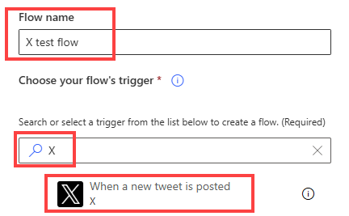
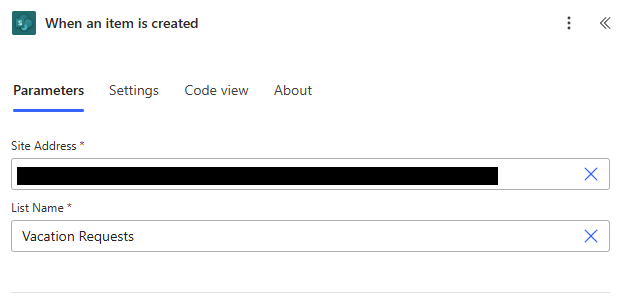
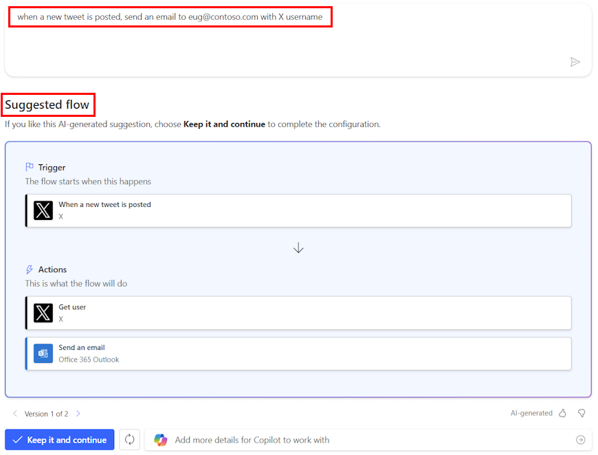
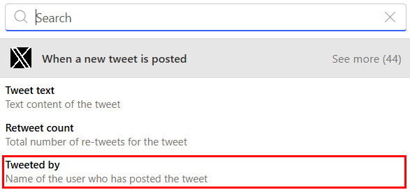
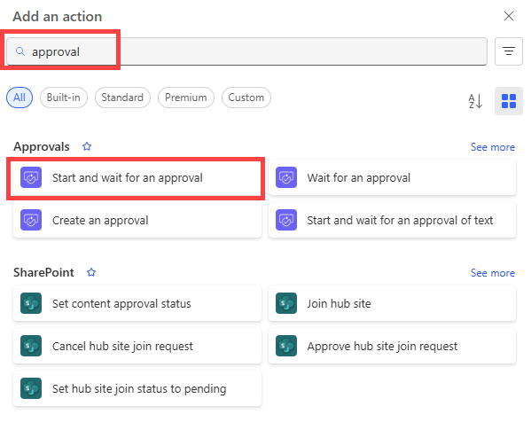
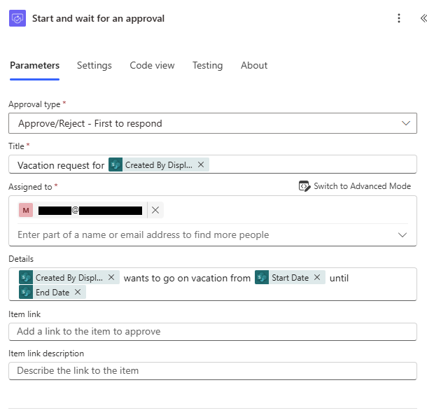
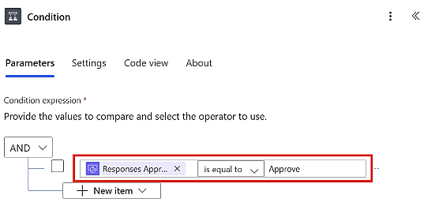
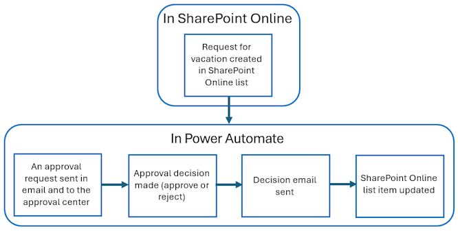
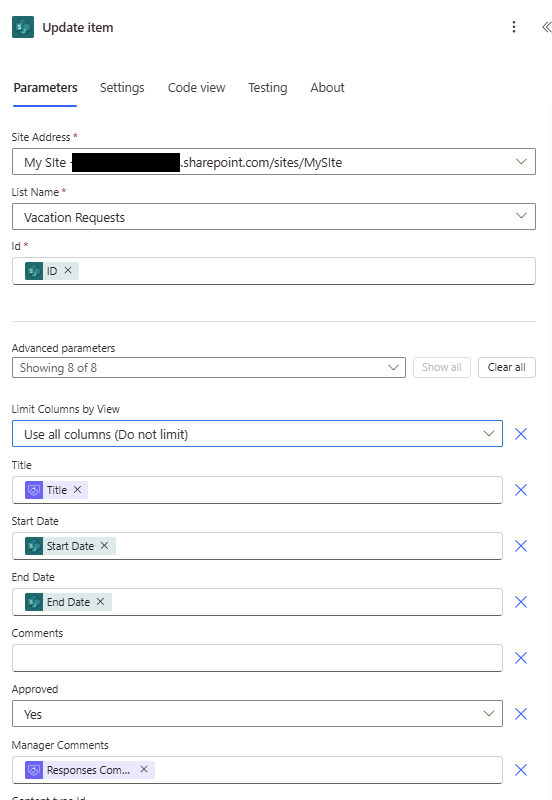
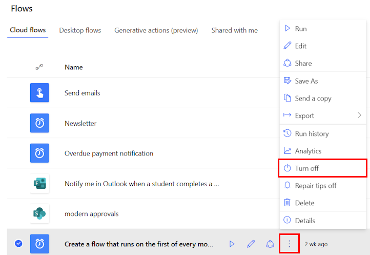

# Additional Material

This page extends [Power Automate Fundamentals](../episodes/01-power_automate.qmd) with screen examples, a safe test matrix and a reusable handover record. Use [Setup](setup.qmd) for access and the supplied files, and [Reference](reference.qmd) for terms and troubleshooting.

The aim is not to memorise every button. The aim is to understand what each screen is asking you to decide.

## How to Read a Flow Screen

Most Power Automate screens are asking one of five questions:

1. What starts the flow?
2. Which system does this step connect to?
3. What data came from earlier steps?
4. What should happen when a decision is made?
5. How can I check what happened after the flow ran?

> 🧭 If you feel lost in the designer, name the step, identify the connector, and ask what data is going in and coming out.

## Choosing a Trigger

{fig-alt="Power Automate trigger search showing that the flow start event is selected before later actions." fig-align="center" width="70%"}

> 🚦 The trigger is the start line. Choose it based on how the real work begins, not based on the final action you want to perform.

Examples:

- Use a **manual trigger** when a person should decide when the flow starts.
- Use a **scheduled trigger** when work should happen every day, week, or month.
- Use an **event trigger** when a form response, file, item, or email should start the work.

## Trigger Settings

{fig-alt="SharePoint trigger configuration with site and list settings that determine which events start the flow." fig-align="center" width="82%"}

> 📍 Trigger settings tell Power Automate where to watch for the event.

For a SharePoint trigger, this usually means:

- Which site to watch;
- Which list or library to watch;
- Whether the flow should start when an item is created, modified, or both.

A common mistake is choosing the right connector but the wrong location. If a flow never starts, check the site, list, library, and permissions before rebuilding the whole flow.

## Suggested Flows

{fig-alt="Copilot proposes a trigger and actions that must be checked against the intended process before use." fig-align="center" width="78%"}

> 🧪 Suggested flows can be useful starting points, but they still need checking.

Treat generated or suggested flows like a draft:

- Check the trigger matches the real process;
- Check every connector uses the right account;
- Check where records are written;
- Test with safe data before using real recipients or live records.

## Connectors in Plain English

A connector is the bridge between Power Automate and another service.

| Connector family | Examples | Plain-English role |
|---|---|---|
| Microsoft 365 | Outlook, Teams, SharePoint, OneDrive | Work with messages, files, sites, and collaboration tools |
| Data | Excel, Microsoft Lists, Dataverse, SQL | Read or update structured records |
| Documents | Word Online, PDF services | Create or transform documents |
| Approvals | Approvals, Teams | Ask a person to make a decision |
| Custom or premium | HTTP, custom connectors, third-party apps | Connect to systems outside standard Microsoft 365 |

> 🔌 The connector decides which system you are touching. The connection decides whose permissions you are using.

Useful Microsoft references:

- [Power Automate connector reference](https://learn.microsoft.com/en-us/connectors/connector-reference/)
- [Excel Online Business connector](https://learn.microsoft.com/en-us/connectors/excelonlinebusiness/)
- [Word Online Business connector](https://learn.microsoft.com/en-us/connectors/wordonlinebusiness/)

## Dynamic Content

{fig-alt="The dynamic-content picker lists output values from earlier steps for mapping into a later action." fig-align="center" width="78%"}

> 🧩 Dynamic content is data from earlier steps that you can reuse later in the flow.

For example:

- A form trigger might provide `Responder email`;
- An Excel row might provide `First Name`;
- An approval action might provide `Outcome`;
- An Outlook trigger might provide `Subject` and `From`.

Dynamic content is powerful, but it can also be confusing. If you are not sure what a value contains, run the flow once and inspect the run history.

## Approvals

{fig-alt="Approval action choices include creating an approval and waiting for its response." fig-align="center" width="70%"}

> ✅ **Start and wait for an approval** waits for a response before continuing. Choose an approval action that matches the intended workflow.

Use approvals when the next step depends on a human decision. Do not use them just to notify someone. If no decision is needed, send an email or Teams message instead.

## Approval Details

{fig-alt="Approval configuration collects the decision type, recipient and context for the approver." fig-align="center" width="68%"}

> 📝 A good approval gives the approver enough context to decide without opening five other systems.

Include:

- What is being requested;
- Who requested it;
- The key dates or deadlines;
- Links to useful documents or records;
- What approve and reject mean;
- Where comments or reasons will be recorded.

## Branching After an Approval

{fig-alt="A condition checks the approval outcome and routes the flow to approved or rejected actions." fig-align="center" width="72%"}

> 🔀 Approval is not the end of the flow. The outcome should route the next action.

Typical pattern:

- If approved, update the record and send a confirmation;
- If rejected, update the record and tell the requester what happened;
- If the approval times out, escalate or mark it for manual follow-up.

Rejection is not a technical error. It is a valid business outcome.

## Approval Overview

{fig-alt="An approval workflow connects a request, human decision and resulting flow actions." fig-align="center" width="78%"}

> 🧾 Approvals are useful because they create both a message and a decision record.

For important flows, think about where the official decision record should live:

- Approval history;
- An Excel tracker;
- A SharePoint list;
- A Dataverse table;
- A case management system.

## Updating an Item or Record

{fig-alt="An update action selects a record and maps outcome values back into its fields." fig-align="center" width="55%"}

> ✍️ Update actions write the result back to the system of record.

This is what turns a notification flow into a process flow. A useful automation should usually leave a record behind:

- Status changed from `Ready` to `Sent`;
- Approval outcome recorded as `Approved` or `Rejected`;
- Sent date written into `SentAt`;
- Owner or reviewer assigned;
- Comments stored somewhere findable.

## Run History

{fig-alt="A flow run-history menu gives access to individual runs for inspecting steps and errors." fig-align="center" width="78%"}

> 🔎 Run history is the first place to look when a flow behaves unexpectedly.

Use run history to check:

- Whether the flow started;
- Which step failed;
- What data each step received;
- What each step returned;
- Whether the wrong branch was followed;
- Whether a connector account had permission.

Do not debug by guessing. Run history shows the evidence.

## Practice Files

These are the same files used in the workshop:

- [Download the example Excel table](../episodes/data/Example_table.xlsx)
- [Download the example Word template](../episodes/data/Example_template.docx)

Use test rows and your own email address before trying any real process.

## Safe Test Matrix

Do not judge a flow only by one successful run. Make a practice copy, keep test recipients under your control and use this matrix to decide what evidence to inspect. The results below are **expected outcomes to design and test**, not claims that the supplied workbook already implements these features.

| Test case | Expected behaviour | Evidence to retain |
|---|---|---|
| One valid request or row | Perform the intended action once and record its outcome | Relevant run steps, test message and source-record state |
| Missing required value | Stop or route for review with an understandable explanation | Validation outcome; confirmation that no unintended message was sent |
| Approval rejected | Record rejection and notify the requester appropriately | Rejection branch and durable decision record |
| Approval receives no response | Follow a defined timeout or manual follow-up route | Timeout handling and named follow-up owner |
| Same request or row processed again | Avoid an unintended duplicate, or flag it before repeating the effect | Stable request identifier or status check and repeat-run result |
| Action loses file access | Report the failed step and identify who can resolve it | Run error and escalation route, without sharing restricted inputs |

The supplied Excel table has only name and email columns. If you extend the design to track processing, add fields such as a stable `RequestID`, `Status` and `SentAt` to **your practice copy**, then update and test the mapping deliberately. Do not assume that the example already prevents duplicate sends.

### Paired Practice: Design Two Tests (5 min)

::: callout-task

**Goal:** identify checks that a single successful run would miss.

**Input:** the test matrix and a sketch of your workshop flow. Work in pairs.

1. **1 min:** choose one ordinary case and one failure or repeat case.
2. **2 min:** write the input, expected result and evidence needed for each.
3. **1 min:** the partner checks that the test cannot send to a real mailing list or alter a live record.
4. **1 min:** two pairs report their failure test to the room; the instructor asks who would respond if it happened.

**Keep:** the two-case test plan and the name of the role responsible for follow-up.

**If Power Automate access is unavailable:** inspect the flow sketch and write the tests without running them. Mark the results as untested.

:::

**Debrief:** a useful test describes observable evidence, not just “the flow succeeds”. Rejection is an expected business outcome, and a technical failure needs a different handling route. Re-running a failed flow may repeat an action that already succeeded, so inspect the run and source state before retrying.

## Flow Handover Record

Keep this record with the authoritative process documentation. Use role names where possible and avoid copying secrets or restricted run-history inputs.

```text
Flow name and purpose:
Environment and location:
Process owner and maintenance contact:
Trigger, schedule or event:
Input locations and stable record identifiers:
Connections, account owners and access requirements:
Decisions requiring human review:
Authoritative record and status values:
Outputs, recipients and test recipients:
Repeat-run and duplicate-handling design:
Failure, timeout and notification routes:
Test cases, dates and outcomes:
How to pause the flow and resume safely:
Review date and changes still needed:
```

For a proposed live workflow, take the record to the relevant process owner or support team. Confirm access, ownership and maintenance arrangements before relying on it for a shared service.

## Further Microsoft Learning

These Microsoft Learn pages are useful follow-up reading:

- [Get started with Power Automate](https://learn.microsoft.com/en-us/power-automate/getting-started)
- [Use expressions in conditions](https://learn.microsoft.com/en-us/power-automate/use-expressions-in-conditions)
- [Modern approvals in Power Automate](https://learn.microsoft.com/en-us/power-automate/modern-approvals)
- [Power Automate connector reference](https://learn.microsoft.com/en-us/connectors/connector-reference/)
- [Error handling: run-after settings, scopes and retries](https://learn.microsoft.com/en-us/power-automate/guidance/coding-guidelines/error-handling)

> 🎯 Read these as examples of patterns, not as scripts to copy blindly. Your flow still needs the right owner, permissions, test data, and record location.

## Course Navigation

[Course Overview](../index.qmd) · [Setup](setup.qmd) · [Additional Material](additional_material.qmd) · [Reference](reference.qmd) · [Discussion](discuss.qmd)
