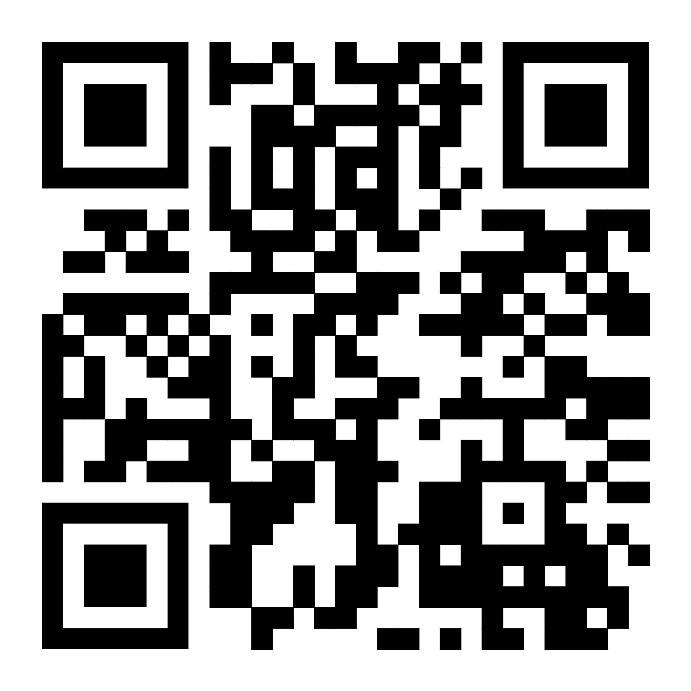

::: {.content-visible when-format="revealjs"}

<!-- Hidden by default -->


:::

::: callout-outcomes

## 💡 Learning Outcomes

- Navigate core UoN digital ecosystem
- Apply digital best practices in collaboration & file organisation
- Manage your research identity
- Identify essential practices for secure research
- Find relevant literature, record searches and maintain a checked reference library
- Use writing tools to structure documents, manage citations and review work with co-authors
- Evaluate AI-assisted writing against its sources and record its contribution
:::

::: callout-questions

## ❓ Questions

1. What are the basic tools I need to conduct research at UoN?
2. How do I maintain a consistent online researcher identity?
3. What best practices should I undertake to ensure my research is secure?  
4. How do I find, organise and cite literature without losing track of the evidence?
5. How can writing tools help co-authors produce a clear, reviewable document?
6. What should I check before accepting an AI-assisted rewrite?
:::


# Introduction to the Digital Skills Programme

{fig-align="center" max-height=50%}

## Structure & Agenda

1. Introduction to the Digital Skills Programme (~10+5 min)
2. Institutional Systems for Digital Research (~10+5 min)
3. Research Identity and Profiles (~10+5 min)
4. Digital Security & Good Practice (~10+5 min)
5. Literature Discovery and Reference Management (~10+15 min)
6. Tools to Support Writing (~10+15 min)

> 🔧 Each topic has 10 minutes of teaching. Tasks take five minutes each, including room debriefs. Allow 120 minutes overall: 60 minutes teaching, 50 minutes activities and a 10-minute break after Digital Security.

## What is the Digital Skills programme

The **Digital Skills** programme equips researchers with the competencies required for modern, data-driven scholarship. 

The programme is not about tools....

It is also about **connecting researchers** with the people who work with data, including **data stewards**, **software engineers**, and **information specialists**. 

## Bridging Communities

This programme aims to bridge the gap between disciplinary experts and technical specialists. 

{fig-align="center" width="76%"}

> 🧭 Support is most useful when it travels with the project from first data capture to final sharing.

## Programme Structure

The programme offers **three tiers of learning**, from foundational to applied and specialist skills.

| **Level** | **Focus** | **Example Modules** |
|------------|------------|---------------------|
| **Foundation** | Core digital research competencies | Essential Digital Skills |
| **Intermediate** | Theory and collaboration in data science | Python, R, Software Engineering |
| **Advanced** | Applied analysis and discipline-specific practice | Bioinformatics, HPC, ML/AI |

> 🧩 *Each tier builds practical capability and supports research independence.*

## Courses

| Course                             | Description                                                                 | Duration       | Note |
|------------------------------------|-----------------------------------------------------------------------------|----------------|------|
| Essential Digital Skills – Foundation | Introduces the tools, practices, and principles needed to participate confidently in digital research. | 4× half days   |      |
| Methods for Data Science – Theoretical    | Introduces coding, software, and collaboration practices needed for sustainable research. | 4× half days   |      |
| Methods for Data Science – Applied Python | Provides practical experience in data analysis and interpretation using Python. | 2 days         | Introductory and intermediate |
| Methods for Data Science – Applied R      | Provides practical experience in data analysis and interpretation using R.     | 2 days         | Introductory and intermediate |
| Advanced       | —           | 1 day?    |  AI? ML? Bioinformatics?    |

---

::: callout-task

#### Task 1: Digital Skills Reflection (5 min)

Let’s start by reflecting on your current skills.  

❓ *Which digital skills (or tools) do you want to learn more about this year?* 

<div id="frame-q1"></div> 
<script>
document.addEventListener("DOMContentLoaded", function() {
  const params = new URLSearchParams(window.location.search);
  const base = "https://ds-shiny-helper.azurewebsites.net/edsm1/?embed=true";
  const isContrib = params.get("contribute") === "true";

  const src = isContrib
    ? `${base}&contribute=true#shiny-tab-q1_input`
    : `${base}#shiny-tab-q1_results`;

  document.getElementById("frame-q1").innerHTML =
    `<iframe src="${src}" width="100%" height="500" frameborder="0"
             style="border:none;" title="Q1"></iframe>`;
});
</script>

:::

# Institutional Systems for Digital Research


## Why Institutional Systems Matter

Digital research depends on **connected systems** that enable collaboration, safeguard data, and streamline research workflows.

{fig-align="center" width="68%"}

> 🧩 The value is in the connection between people, platforms, and outputs, not the platform list itself.

## UoN’s Digital Ecosystem

At the University of Nottingham, research operates within a **digitally integrated environment** that connects people, data, and administration.

| **System** | **Primary Role** |
|-------------|------------------|
| **Microsoft 365** | Collaboration and communication |
| **SharePoint** | Long-term data and document sharing |
| **UniCore** | Finance, HR, and procurement |
| **RIS (Worktribe)** | Research lifecycle, funding, outputs |

> 🏛️ *Together these platforms enable secure, collaborative, and transparent research practice.*

## Microsoft 365: A Platform for Collaboration

Microsoft 365 supports daily research activity—from communication to data management—within a single, integrated workspace.

| **Tool** | **Function** |
|-----------|---------------|
| **Word & Excel** | Writing, data capture, and co-editing |
| **OneDrive** | Personal cloud storage with versioning |
| **Teams** | Communication, meetings, shared workspaces |
| **SharePoint** | Institutional document repositories |

> 💬 *Microsoft 365 is the shared workspace for modern research collaboration.*

## File Collaboration Best Practice

- Use **Teams or SharePoint** for shared project files  
- Enable **autosave and version history** in Word or Excel  
- Maintain **logical folder structures** by project phase  
- Apply **permissions and access control** with care  

> 🧠 *Good file management is the foundation of digital reproducibility.*

## UniCore and RIS: Institutional Systems

UniCore and RIS link the operational and administrative sides of research.

| **System** | **Purpose** |
|-------------|-------------|
| **UniCore** | Finance, HR, procurement, and resource management |
| **RIS (Worktribe)** | Project proposals, outputs, and compliance tracking |

> 🗂️ *These systems ensure research activity is visible, auditable, and supported.*

## UniCore Overview

**UniCore** is UoN’s enterprise system for managing finance, HR, and procurement.

{fig-align="center" width="74%"}

> 🧭 Operational systems shape research delivery because they affect what teams can buy, claim, plan, and report.

## RIS (Research Information System)

**RIS (Worktribe)** records, tracks, and reports the full research lifecycle.

| **Feature** | **Purpose** |
|--------------|-------------|
| **Grant Management** | Develop and cost funding proposals |
| **Outputs Tracking** | Record publications and datasets |
| **Impact Recording** | Capture engagement and REF evidence |
| **ORCID Integration** | Synchronise researcher identity and outputs |

> 📚 *RIS ensures research activity is captured and connected institutionally.*


## System Use in Context

| **Research Task** | **Recommended System** | **Collaboration Benefit** |
|--------------------|------------------------|----------------------------|
| Co-author a paper | OneDrive / Word | Real-time editing and version control |
| Submit a funding bid | RIS | Shared proposal development and audit trail |
| Claim expenses | UniCore | Secure and traceable reimbursement |
| Share datasets | SharePoint / Teams | Controlled access and persistence |
| Record outputs | RIS + ORCID | Automatic institutional linking |

> ⚙️ *Each platform serves a distinct role in the research ecosystem.*


## The Broader Vision: Connected Research

By using institutional systems effectively teams build **trust and accountability**, data remains **secure, reusable, and open** and researchers can spend more time working on **innovation and discovery**

{fig-align="center" width="74%"}

> 🌍 Good infrastructure makes research easier to audit, hand over, and reuse.

---

::: callout-task

#### Task 2: Match Research Tasks to Tools (5 min)

::: panel-tabset
##### Activity

List the digital tools you would use for each of the following:

<div id="frame-q2"></div>
<script>
document.addEventListener("DOMContentLoaded", function() {
  const params = new URLSearchParams(window.location.search);
  const base = "https://ds-shiny-helper.azurewebsites.net/edsm1/?embed=true";
  const isContrib = params.get("contribute") === "true";

  const src = isContrib
    ? `${base}&contribute=true#shiny-tab-q2_input`
    : `${base}#shiny-tab-q2_results`;

  document.getElementById("frame-q2").innerHTML =
    `<iframe src="${src}" width="100%" height="500" frameborder="0"
             style="border:none;" title="Q2"></iframe>`;
});
</script>

##### Answers

- **Microsoft Word -> Sharepoint + Teams** are ideal for collaborative document editing  
- **RIS (Worktribe)** is used for grant applications and research output tracking  
- **UniCore** handles finance, procurement, HR and expenses  
- **Microsoft Teams + SharePoint** are best for group file access and collaboration  
:::
:::

# Research Identity & Profiles


## Why Research Identity Matters

Your **research identity** defines how your work is discovered, attributed, and connected across the digital research ecosystem.

{fig-align="center" width="76%"}

> 🧩 Persistent identifiers reduce the chance that outputs become separated from the person or project that produced them.

## The Importance of Consistency

A consistent identity links your outputs, affiliations, and roles automatically across systems. This approach:

- Guarantees **proper attribution** and supports efficient collaboration.
- Ensures **discoverability** across publishers and repositories  
- Prevents **duplication or misattribution** of outputs  
- **Universal interoperability:** used by funders, publishers, and institutions  
- **Portability:** your iD remains active throughout your career  

> 💡 *A consistent research identity builds long-term recognition and credibility.*

## ORCID: A Persistent Digital Identifier

**ORCID (Open Researcher and Contributor ID)** is the global standard for uniquely identifying researchers across institutions and disciplines.

{fig-align="center" width="74%"}

> 🧠 ORCID is useful because other systems can read the same stable identifier.


## RIS (Research Information System) at UoN

At UoN, **RIS (Worktribe)** complements your ORCID profile by linking research activity to institutional records.

| **Feature** | **Function** |
|--------------|--------------|
| **Grant Management** | Tracks proposals, approvals, and costings |
| **Outputs Dashboard** | Records publications, datasets, and impacts |
| **Compliance** | Supports REF and Open Access requirements |
| **Integration** | Syncs with ORCID and external repositories |

> 🏛️ *RIS ensures your institutional identity mirrors your global research presence.*

## Managing Your Research Profiles

It is recomended that you:

- Make your **ORCID profile public** for discoverability  
- **Merge duplicate Scopus IDs** to ensure accuracy  =
- Use consistent **name and affiliation formats**  
- Avoid unverified or **proprietary metrics**  
- **Audit profiles regularly** for correctness  

> 🧭 *Managing your identity actively ensures your research remains visible and verifiable.*

---

::: callout-task 

#### Task 3: Research Identity Self-Audit (5 min)

::: panel-tabset

#####  Task

❓ Do you have a ORCID research identity? 

Visit [Orcid](https://orcid.org/), Log in / sign up

❓ Is your ORCID ID populated with your name, affiliation etc? If not make sure that is complete. 
- Set your ORCID ID to public (if appropriate)  

#####  Note

- You can actually link your RIS and ORCID profiles, but for that you need to be registered to use worktribe. It is recomended that you [request access](https://nottingham-research.worktribe.com/login.jx)
- Once registered you will be able to link your ORCID and RIS profiles. For more infomation please refer to the [RIS training materials](http://moodle.nottingham.ac.uk/course/view.php?id=47898).
:::
:::

# Digital Security & Good Practice

## Why Digital Security Matters

Effective digital research requires vigilance, responsibility, and sound data stewardship to protect not only research, but also collaborators and institutions.

{fig-align="center" width="78%"}

> 🔒 Security failures usually damage trust first, then data and continuity.

## Passwords & Access Management

Passwords remain the first line of defence against unauthorised access.  
Weak or reused passwords are still the most common research vulnerability.

- Use **at least 12 characters** with a mix of cases, numbers, and symbols  
- Create **unique passwords** for each system  
- Never share credentials via email or chat  
- Regularly **review access permissions** for shared platforms  

> 🧠 *Strong passwords are simple, low-cost defences against complex risks.*

## Multi-Factor Authentication (MFA)

**MFA** adds a crucial verification step beyond a password.  
Even if your password is compromised, MFA prevents most unauthorised logins.

{fig-align="center" width="70%"}

> 🔐 MFA makes one stolen password much less useful to an attacker.

## Device & Data Protection

Devices are gateways to institutional data.  
Protecting them is vital for maintaining research integrity and trust.

| **Action** | **Purpose** |
|-------------|-------------|
| Store files on OneDrive or SharePoint | Secure cloud storage with version control |
| Avoid local or personal cloud drives | Prevent data loss and compliance breaches |
| Enable screen locks and encryption | Protect devices if lost or stolen |
| Use separate user profiles on shared machines | Maintain privacy and accountability |

> ⚙️ *Encryption safeguards your work even when devices are compromised.*


## Secure Remote Access

Remote work expands flexibility but increases risk.  
Safe access protects your data wherever you work.

- Always connect through the **UoN VPN** when off campus  
- Avoid public Wi-Fi without VPN protection  
- Keep **software and systems updated** before connecting  
- Define **secure sharing protocols** for collaborators  

> 🌍 *A VPN keeps your connection secure—your data stays private, even on public networks.*

## Data Backup Strategy

Backups prevent irreversible data loss from accidents, failures, or attacks.  
Follow the **3-2-1 Rule** to ensure resilience.

| **Rule** | **Description** |
|-----------|-----------------|
| **3 Copies** | Maintain three versions of your data |
| **2 Media Types** | Store on two different media (e.g., cloud and drive) |
| **1 Offsite** | Keep one copy offsite or in the cloud |

> 💾 *A backup untested is not a backup—it’s a hypothesis.*

## Cybersecurity Best Practices

Cybersecurity requires daily habits, not one-off actions.

- **Verify sender identity** before opening attachments or links  
- **Avoid personal email** for research communication  
- **Report incidents** immediately to UoN IT Security  
- Ensure **GDPR compliance** for international collaborations  

> 🧩 *Cybersecurity is continuous awareness—prevention through habit.*

---

::: callout-task

#### Task 4: Digital Security Self-Audit (5 min)

::: panel-tabset
##### Exercise  
<div id="frame-q4"></div>
<script>
document.addEventListener("DOMContentLoaded", function() {
  const params = new URLSearchParams(window.location.search);
  const base = "https://ds-shiny-helper.azurewebsites.net/edsm1/?embed=true";
  const isContrib = params.get("contribute") === "true";

  const src = isContrib
    ? `${base}&contribute=true#shiny-tab-q4_input`
    : `${base}#shiny-tab-q4_results`;

  document.getElementById("frame-q4").innerHTML =
    `<iframe src="${src}" width="100%" height="500" frameborder="0"
             style="border:none;" title="Q4"></iframe>`;
});
</script>

##### Follow-up  
- Identify one way in which you can improve your digital security in the coming week  
- Reflect on what was easy/hard to assess, and which barriers exist for better practice  
:::
:::

# Literature Discovery and Reference Management

{fig-alt="Find literature, check its details, read and organise sources, then cite them. New questions return to the search; keep a search log and source links throughout." fig-align="center" width="90%"}

## Start with a Research Question

A useful literature workflow connects **the question, the search, the reference and your reading notes**.

- What do you need to understand or support with evidence?
- Which concepts, populations or contexts matter?
- What would make a source relevant to this question?

**Room check:** turn to a neighbour and describe one question from your research. Together, identify two searchable concepts.

> 🔎 Finding a paper is the start: you still need to decide what it contributes.

## Choose an Appropriate Search Service

| Starting point | Useful for | What to check |
|---|---|---|
| **NUsearch** | Finding material available through the university library | Whether the record links to the full text you need |
| **Subject databases** | Searching literature within a discipline | Coverage, subject headings and available search fields |
| **Google Scholar** | Broad discovery and following citations | Publication type, source quality and search limitations |
| **A relevant paper's references** | Finding earlier work behind a claim or method | Whether you need the original source rather than a later summary |

Choose the service that fits the question. One search service will not necessarily cover all relevant literature.

[UoN Libraries: bibliographic databases](https://www.nottingham.ac.uk/library/documents/research/subject-databases-for-searching.pdf)

## Construct a Basic Search

List synonyms **within** each concept, then combine **different** concepts.

```text
(doctoral OR postgraduate) AND ("writing group" OR "writing retreat")
```

- **OR** includes alternative terms for a concept.
- **AND** requires both concepts in the results.
- Quotation marks can search a phrase where the service supports them.
- Check the service's syntax; field names and search operators vary.

Inspect the first few results. Are relevant papers appearing? Adjust one part of the search and compare what changes. Record filters rather than applying them without explanation.

> 🧠 The example is a starting search, not a complete systematic review strategy.

## Follow Citation Trails and Access the Paper

{fig-alt="Follow a starting paper's references backwards to earlier sources and cited-by links forwards to later papers. Read and evaluate the sources you find." fig-align="center" width="90%"}

- **Look backwards:** inspect the references of a relevant paper.
- **Look forwards:** use a service's cited-by links to find later papers that cite it.
- **Retrieve the source:** follow the library's full-text links and sign in when required.
- **If access fails:** check for a lawful open-access version or ask the library about obtaining it.

Check which version you are reading, including whether it is a preprint or published article. Record its DOI or another stable link.

> 📖 A search snippet or abstract can help you select a paper; it cannot replace reading the material needed to support your claim.

## Record Searches and Keep Up with a Topic

Keep a short search log:

| Record | Example |
|---|---|
| Question | What is known about doctoral writing groups? |
| Service and date | Named subject database; date searched |
| Exact query and filters | Search string, fields, date limits and other filters |
| Result | Number returned and references selected for reading |
| Next step | Search another term or follow a citation trail |

Where supported, save the search and set an **email or RSS alert** for new results. Author, journal or citation alerts can also help you keep up with a topic.

Record when you review an alert and which papers you retain. Alerts support ongoing discovery; they do not replace a documented search when a review needs one.

## Recommended Reference Managers: EndNote and Zotero

Both tools help you collect, organise and cite references. Choose one that fits your collaborators and writing workflow.

| Tool | Why consider it? | Before you begin |
|---|---|---|
| **EndNote** | An established reference manager with library organisation and Cite While You Write integration | Check UoN access, your installed version and the writing integration you need |
| **Zotero** | A free reference manager with browser capture, notes, collections and citation integration | Install the application and browser Connector; check your writing integration |

You do not need to learn both today. Agree a compatible approach with co-authors before building a large shared library.

[UoN EndNote setup guidance](https://xerte.nottingham.ac.uk/USER-FILES/53584-uazecw-Nottingham/media/2025%20EndNote%20-%20Separate%20guide%20-%20Downloading%20Endnote.pdf) · [Zotero quick start](https://www.zotero.org/support/quick_start_guide)

## Import References and Check the Details

Import from a database's export function, a supported browser capture tool or a recognised identifier such as a DOI. A **reference record** and its **full-text attachment** are separate things.

Compare the imported record with the original source:

- Authors and their order
- Title, publication year and item type
- Journal or publisher
- Volume, issue, pages or article number, where applicable
- DOI or stable URL

Correct the record in your library so future citations use the corrected details.

> 🔍 Automatic import saves typing; it does not guarantee accuracy.

## Organise a Library and Attach Reading Notes

Use **groups in EndNote** or **collections in Zotero** to organise references by project or topic. Use a small, consistent set of tags or keywords where useful.

Attach a reading note to the reference, or record it in the reference's notes field:

- **Question:** why am I reading this?
- **Evidence:** what does the source actually report?
- **Location:** page, section, table or figure supporting the note
- **Interpretation:** my response, limitations and next questions

Label exact quotations and keep them distinct from paraphrases and your own ideas. Attach a lawfully obtained PDF where appropriate.

> 📝 Record enough context to understand the note when you return to it months later.

## Handle Duplicates and Shared Libraries

Duplicate checks identify **possible matches**, not a reason to delete records automatically. Compare identifiers, titles, authors and versions, then preserve useful notes and attachments.

- **Zotero:** inspect Duplicate Items and merge genuine duplicates after reviewing the retained fields.
- **EndNote:** use Find Duplicates and review which record to retain; preserve useful content before removing a duplicate.
- A preprint and its published article may need separate records.

For a shared library, agree an owner, editing permissions, organisation and who corrects records. Use the tool's supported sharing features; check whether the selected sharing method includes notes and attachments.

**Room question:** who should be able to edit your project's reference library, and who would maintain it if you left?

[Zotero duplicate detection](https://www.zotero.org/support/duplicate_detection) · [Zotero group libraries](https://www.zotero.org/support/groups) · [EndNote groups and sharing guidance](https://docs.endnote.com/docs/endnote/2025/v1/windows/en/content/05groups_and_tags/the_groups_panel.htm)

## Insert Citations and Generate a Bibliography

Use the reference manager's writing integration to:

1. Insert a citation linked to a library record.
2. Add a page locator when required, particularly for quotations.
3. Generate the bibliography from the cited records.
4. Change the citation style and refresh the document.

Check the result against your discipline or publication's requirements. Correct source details in the library rather than repeatedly editing a generated bibliography.

Keep citation fields intact in the working document. If a submission requires plain text, create a separate final copy.

[Zotero citations and bibliographies](https://www.zotero.org/support/creating_bibliographies)

## Export References When Changing Tools

Use a format the receiving tool supports, such as **RIS** or **BibTeX**. Here, RIS is a reference exchange format, distinct from UoN's Research Information System.

- Keep a backup of the original library.
- Export a small sample and import it into a separate test library first.
- Compare record counts and key bibliographic fields.
- Check notes, attachments and organisation: these may not transfer completely.
- Check existing document citations separately; exporting a library does not automatically convert their links to another manager.

> 🧳 A formatted bibliography is not a portable copy of your reference library.

[Zotero export guidance](https://www.zotero.org/support/kb/exporting)

## Task 5a: Search Together (5 min)

::: callout-task

Work in pairs. Choose one research question; use **doctoral writing groups** if you need a starting topic.

1. **1 min:** agree two concepts and choose a search service. Explain the choice to your partner.
2. **2 min:** search, inspect the results and change one term. Record the service, date, exact queries and filters.
3. **1 min:** select one relevant source and follow one backward or forward citation link. Try to open the full text through the library.
4. **1 min:** locate an alert or saved-search option and join the room debrief. If none exists, name another monitoring route.

**Room engagement:** the instructor takes a show of hands for each search service and asks two pairs: “What changed when you revised your search?”

**Keep:** a search log and two candidate references. A candidate still needs checking before you use it as evidence.
:::

## Task 5b: Build a Checked Library (5 min)

::: callout-task

Use EndNote or Zotero. One person operates the software; the other checks the sources. Swap roles halfway through.

1. **2 min:** import your two candidate references into a practice library and organise them in a named group or collection.
2. **1 min:** compare one record's authors, year and DOI or stable URL with the original source. Correct an error or record the fields checked.
3. **1 min:** attach a short reading note to that reference. Label it as an **abstract-only note** if that is all you have read. Include a source location and one question for further reading.
4. **1 min:** inspect the instructor's duplicate example and join the room debrief. State how you would confirm a match and preserve useful notes.

**Room engagement:** compare one checked field with a neighbouring pair. The instructor asks two pairs to explain why it matters for citation accuracy.

**Keep:** two imported records, one checked record and one source-linked reading note.

**Follow-up practice:** check the second record fully, then import a reference again in your practice library and resolve the genuine duplicate without losing the note.
:::

## Task 5c: Cite, Export and Compare (5 min)

::: callout-task

1. **2 min:** write one sentence describing what your checked source covers. Insert a linked citation using the writing integration and generate a bibliography. Check that the citation supports the sentence.
2. **1 min:** change the citation style and refresh the bibliography. Compare the result with your partner.
3. **1 min:** export the two references in a supported format. Keep the original library and name one thing you would check after importing the file elsewhere.
4. **1 min:** agree who would own a shared library and who could edit it. Two pairs report their decisions during the room debrief.

**Room debrief:** “What could be lost when we share or move this library?” The instructor collects examples covering metadata, notes, attachments and document citation links.

**If software or an integration is unavailable:** join a pair with a working setup, or check sources and write notes while the instructor demonstrates import, citation and export. Record the access issue for follow-up.

**Keep:** a cited paragraph, bibliography and reference export, or checked notes and a record of the demonstrated steps.

**Follow-up practice:** cite the second source and import your export into a separate test library. Compare counts, fields, notes and attachments.
:::

# Tools to Support Writing

{fig-alt="A document heading connects to styles for navigation, a table caption to managed numbering, and a cross-reference to a linked mention that stays connected when numbering changes." fig-align="center" width="90%"}

## Choose Word or LaTeX for the Work

| Tool | A useful starting point when... | Discuss with co-authors |
|---|---|---|
| **Microsoft Word** | You want familiar editing, comments, tracked changes and reference-manager integration | Desktop/web features, document location and review responsibilities |
| **LaTeX**, locally or through a service such as Overleaf | Your discipline uses mathematical typesetting or a LaTeX publication template | Who can edit the source, bibliography workflow and available collaboration features |

LaTeX uses marked-up source files that compile into a document. Word offers direct visual editing. Neither removes the need to check the final output.

**Room check:** show of hands for Word, LaTeX or another tool. Ask a neighbour: “Could every co-author review my chosen format?”

## Structure Before Appearance

| Purpose | Word | LaTeX |
|---|---|---|
| Identify sections | Heading styles | Section commands such as `\section{...}` |
| Describe tables and figures | Insert Caption | A caption within the appropriate table or figure environment |
| Refer to an item | Insert Cross-reference | A label and reference, such as `\label{...}` and `\ref{...}` |
| Manage references | EndNote or Zotero writing integration | A bibliography file and the template's citation commands |

Use structure rather than manually typing numbers or making text look like a heading. Update fields or recompile after changes, then check the references and layout.

Heading styles also support navigation and accessibility; bold text alone does not identify a heading.

[Word captions](https://support.microsoft.com/en-us/word/add-format-or-delete-captions-in-word) · [Word cross-references](https://support.microsoft.com/en-us/word/create-a-cross-reference) · [LaTeX cross-references](https://www.overleaf.com/learn/latex/Cross_referencing_sections%2C_equations_and_floats)

## Comments and Tracked Changes Have Different Jobs

- **Comments:** ask a question, explain a concern or request evidence.
- **Tracked changes:** propose an identifiable edit for someone to accept or reject.
- **Author review:** respond to comments and decide which edits to retain.

In Word, turn on Track Changes before reviewing. Hiding markup does not accept the changes or remove comments.

For LaTeX, agree how you will review source changes and discuss the compiled document. Services may offer comments and tracked changes, but availability depends on the tool and account.

> 💬 “What evidence supports this sentence?” is more useful than silently rewriting its meaning.

[Word tracked changes](https://support.microsoft.com/en-us/word/training/track-changes-in-word) · [Overleaf tracked changes](https://docs.overleaf.com/collaborating/track-changes)

## Version History and the Authoritative Version

Tracked changes support **review**; version history supports **recovering and comparing saved states**. They serve different purposes.

- For shared Word documents, use an agreed Teams/SharePoint location and check the available version history.
- For LaTeX, use the editor's history or an agreed source version-control workflow, such as Git where the team already uses it.
- Keep the editable document or source files, bibliography and supporting assets together.
- Record the reviewed version used for submission, including the compiled PDF where relevant.

An emailed attachment is a separate copy. Agree how any edits to that copy return to the authoritative document.

[Microsoft 365 version history](https://support.microsoft.com/en-gb/office/collab-files/view-previous-versions-of-office-files)

## Agree a Co-author Review Process

{fig-alt="Co-authors draft in an agreed location, propose edits and comments, decide which changes to retain, and record an approved version. Return revisions to the same source; use version history to inspect saved states." fig-align="center" width="90%"}

Before substantial writing, agree:

1. **Where:** the authoritative document and reference library live.
2. **Who:** drafts, checks evidence, reviews and accepts changes.
3. **How:** co-authors propose edits, discuss disagreements and update references.
4. **When:** reviews are due and which version is ready for approval.
5. **What is retained:** the approved document, sources and record of important decisions.

Use one writing and citation workflow that the team can maintain. Check the references again before submission, especially after combining contributions.

> 🤝 A shared link helps only when everyone knows which document it identifies and how to review it.

## Practice Draft: A Small Writing Pilot

Use this **fictional teaching example** for the writing activities. The counts are invented for practice.

**Title:** A pilot writing session

**Background:** We wanted to explore participants' experiences of a writing session.

**Results:** Six volunteers attended a one-hour session. Four reported feeling more confident immediately afterwards. There was no comparison group or later follow-up.

**Draft conclusion:** These findings prove that writing sessions benefit all researchers.

| Immediate self-reported confidence | Number of participants |
|---|---:|
| More confident | 4 |
| Unchanged | 2 |

**Unstructured draft reference:** “See the table above.”

> 🧪 This exercise checks writing and review skills. It provides no real evidence about writing sessions.

## Task 6a: Give the Draft Structure (5 min)

::: callout-task

Work in pairs using Word, or LaTeX if you already use it. Start from the practice draft above.

1. **1 min:** open a copy of the practice draft and apply meaningful section headings. Check that you can navigate by its structure.
2. **2 min:** give the supplied table a numbered caption and replace “the table above” with a cross-reference.
3. **1 min:** follow the instructor's renumbering demonstration: insert another captioned table before it, update fields or recompile, and check where the cross-reference points.
4. **1 min:** swap the operator and checker. Explain what is generated automatically and what you must still inspect.

**Room engagement:** the instructor asks a pair to demonstrate the changed numbering and the room to identify why a manually typed table number would be fragile.

**If your editor lacks the feature:** use a partner's desktop setup or check the instructor's demonstration. Note which feature your workflow requires.

**Keep:** a structured document with a caption and a working cross-reference.

**Follow-up practice:** repeat the renumbering test yourself and check the compiled or exported document.
:::

## Task 6b: Review as Co-authors (5 min)

::: callout-task

One person acts as the author and the other as the reviewer.

1. **1 min:** the reviewer comments on the draft conclusion and proposes a more defensible sentence using tracked changes, or the agreed LaTeX review method.
2. **1 min:** the author explains whether they accept the edit and responds to the comment. Swap roles to check the revision.
3. **2 min:** write a three-line agreement: **authoritative location; reviewer and decision-maker; review deadline and how the approved version will be recorded**. Locate version history if your setup supports it.
4. **1 min:** two pairs report one review rule; the room compares these with their own agreements. The instructor asks: “What happens if a co-author returns an edited attachment?”

**Debrief:** the conclusion exceeds the supplied evidence. Review should correct the claim as well as improve the prose. Agree how edits return to the authoritative version before creating parallel copies.

**Keep:** a reviewed document and a short co-author agreement.
:::

## AI for Writing: Set the Boundaries

AI can suggest an outline, clarify a sentence or shorten text. Keep the **evidence, interpretation and final decision** with the researcher.

- Define the **task, context, source boundary and output format**; ask it to flag uncertainty.
- Use only material permitted in the chosen service. Practise with public or fictional text when permissions are unclear.
- Check claims, numbers and citations against the original sources. Editing can change meaning or remove caveats.
- Record the tool/model, date, important inputs and prompts, checks and changes retained. Follow applicable disclosure requirements.

These principles come from [Responsible Use of Generative AI](../../responsible_use_of_generative_ai/index.qmd), particularly [Prompting for Research](../../responsible_use_of_generative_ai/episodes/02-Prompting_for_research.qmd).

> 🧠 A polished rewrite still needs an evidence check.

## Task 6c: Check an AI-style Rewrite Together (5 min)

::: callout-task

The following rewrite is **invented for this exercise**, not a live AI response. Compare it with the practice draft's results.

> “The session significantly improved researchers' writing confidence. The findings demonstrate lasting benefits for researchers across the university.”

::: panel-tabset

##### Pair Work and Room Vote

1. **2 min:** underline claims that the source does not support. Rewrite the passage while preserving the counts and limitations.
2. **1 min:** vote by show of hands: **accept; revise; reject**. Two pairs read their revisions and explain one correction.
3. **2 min:** agree one instruction that might prevent this drift and one check you would still perform. Write a brief record of the example reviewed, checks made and wording retained.

##### Debrief

No statistical test supports “significantly”, no follow-up supports “lasting”, and six volunteers cannot establish a university-wide effect.

A defensible revision is: “Four of six volunteers reported greater confidence immediately after the session. With no comparison group or later follow-up, we cannot establish its effect or whether any benefit persisted.”

Ask for clarity without adding evidence or strengthening claims. Compare the revision with the source yourself; record and disclose actual AI contributions where required.
:::
:::

# Further Information

## UoN Training Resources

- Microsoft 365 Training Resources
- Excel 2016: Basic–Advanced (Online)
- Staff session: Managing your online and RIS research profiles
- Digital Accessibility: The Core Nottingham Accessible Practices
- RIS: Worktribe User Guidance 
- UniCore Training Materials
- UoN Information Security: Protect Your Data & Devices

## Literature and Writing Guidance

- [UoN Libraries: searching bibliographic databases](https://www.nottingham.ac.uk/library/documents/research/subject-databases-for-searching.pdf)
- [UoN EndNote setup guidance](https://xerte.nottingham.ac.uk/USER-FILES/53584-uazecw-Nottingham/media/2025%20EndNote%20-%20Separate%20guide%20-%20Downloading%20Endnote.pdf)
- [Zotero quick start](https://www.zotero.org/support/quick_start_guide)
- [Overleaf: learning LaTeX](https://www.overleaf.com/learn)
- [Responsible Use of Generative AI](../../responsible_use_of_generative_ai/index.qmd)

---

::: callout-keypoints

## 📚 keypoints

- UoN currently uses Microsoft 365 tools support collaborative writing, file sharing, and communication
- UniCore manages research-related administration  and RIS manages the research lifecycle.
- A well-maintained research identity increases visibility and attribution of your work.
- Store research data in encrypted, university-backed platforms and ensure your account details are protected
- Record searches and check imported references against their original sources.
- Use a reference manager to connect reading notes, citations and a bibliography.
- Structure writing with headings, captions and cross-references, then agree how co-authors review the authoritative version.
- Verify AI-assisted revisions against the evidence and retain a record of the contribution.
:::

---

::: callout-hints

## 🔦 hints

- Store shared project files in Microsoft Teams rather than OneDrive to ensure long-term access for collaborators.
- Use version history in OneDrive/SharePoint instead of manually renaming file versions.
- Link your ORCID iD to your RIS profile to automate tracking of publications and outputs.
- Practice “security by default”
- Test a small reference export before moving a whole library to another tool.
- Use comments for questions, tracked changes for proposed edits and version history to inspect saved states.
:::

::: {.content-visible when-format="revealjs"}

## Feedback



:::
