::: {.content-visible when-format="revealjs"}

<!-- Hidden by default -->
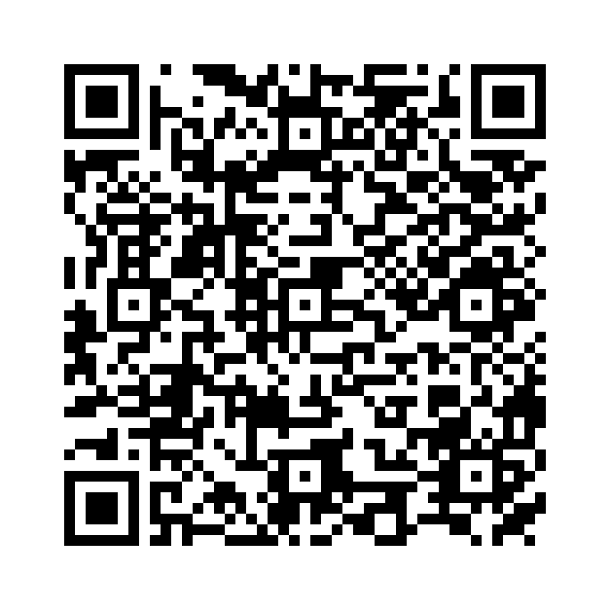{fig-align="center" max-height=80%}

:::

::: callout-outcomes

## 💡 Learning Outcomes

- Navigate core UoN digital ecosystem
- Apply digital best practices in collaboration & file organisation
- Manage your research identity
- Identify essential practices for secure research
- Plan literature searches, record the approach and check reference records
- Explain how writing tools support document structure, citations and co-author review
:::

::: callout-questions

## ❓ Questions

1. What are the basic tools I need to conduct research at UoN?
2. How do I maintain a consistent online researcher identity?
3. What best practices should I undertake to ensure my research is secure?  
4. How do I find, organise and cite literature without losing track of the evidence?
5. How can writing tools help co-authors produce a clear, reviewable document?
6. What should I check before accepting an AI-assisted rewrite?
:::

# Introduction to the Digital Skills Programme

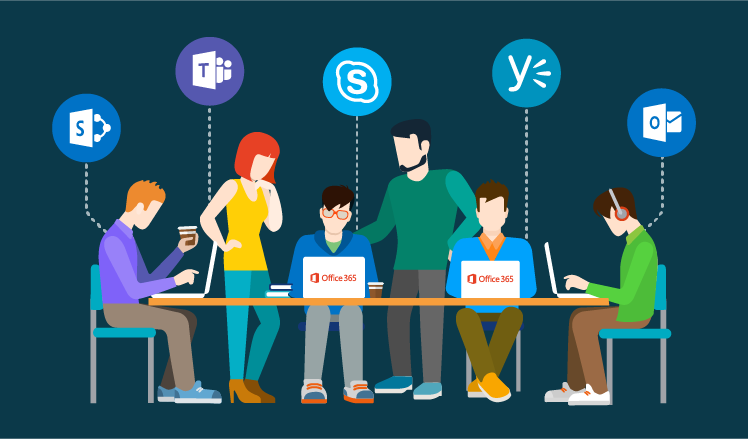{fig-align="center" max-height=50%}

## Structure & Agenda

1. Introduction to the Digital Skills Programme (~10+5 min)
2. Institutional Systems for Digital Research (~10+5 min)
3. Research Identity and Profiles (~10+10 min)
4. Digital Security & Good Practice (~10+5 min)
5. Literature Discovery and Reference Management (~10+10 min)
6. Tools to Support Writing (~10+10 min)

> 🔧 Each topic has no more than 10 minutes of directed teaching

## What is the Digital Skills programme

The **Digital Skills** programme equips researchers with the competencies required for modern, data-driven scholarship. 

**The programme is not about tools....**

> It is also about **connecting researchers** with the people who work with data, including **data stewards**, **software engineers**, and **information specialists**. 

## Bridging Communities

This programme aims to bridge the gap between disciplinary experts and technical specialists. 

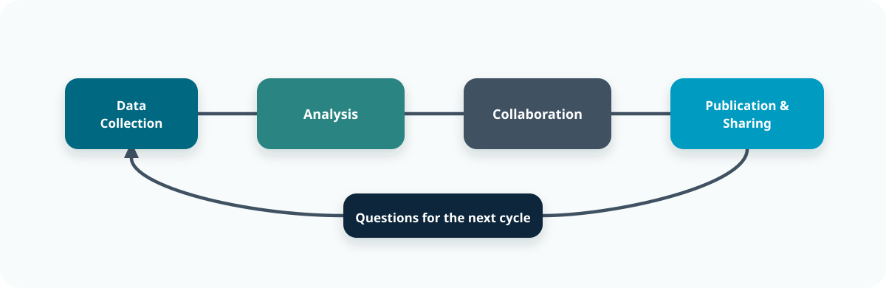{fig-align="center" width="76%"}

> 🧭 Support is most useful when it travels with the project from first data capture to final sharing.

## Programme Structure

The programme offers **three tiers of learning**, from foundational to applied and specialist skills.

| **Level** | **Focus** | **Example Modules** |
|------------|------------|---------------------|
| **Foundation** | Core digital research competencies | Essential Digital Skills |
| **Intermediate** | Theory and collaboration in data science | Python, R, Software Engineering |
| **Advanced** | Applied analysis and discipline-specific practice | Bioinformatics, HPC, ML/AI |

> 🧩 *Each tier builds practical capability and supports research independence.*

## Courses

| Course | Focus | Format |
|---|---|---|
| [Essential Digital Skills](../index.qmd) | Digital tools, collaboration, governance and RDM | 4 lessons |
| [Methods for Data Science](../../methods_for_data_science/index.qmd) | Data quality, exploration, visualisation and interpretation | 4 lessons |
| [Applied Python](../../applied_python/index.qmd) | Programming, data analysis, modelling and debugging | 8 lessons |
| [Applied R](../../applied_R/index.qmd) | Data analysis, defensive programming, notebooks and dashboards | 8 lessons |
| [Responsible Use of Generative AI](../../responsible_use_of_generative_ai/index.qmd) | Research applications, prompting and responsible use | 3 lessons |
| [Automating Business Processes](../../automating_business_processes/index.qmd) | Power Automate and repeatable workflows | 1 lesson |
| [FAIR and Open Research Practices](../../fair_and_open_research_practices/index.qmd) | Usable outputs, transparent methods and responsible sharing | 2 lessons |

---

::: callout-task

#### Task 1: Digital Skills Reflection (5 min)

Let’s start by reflecting on your current skills.  

❓ *Which digital skills (or tools) do you want to learn more about this year?* 

::: {.content-visible when-format="revealjs"}

::: panel-tabset

##### Contribute

<a href="https://ds-shiny-helper.azurewebsites.net/edsm1/?contribute=true&amp;embed=true#shiny-tab-q1_input" style="color: #ffffff; background: transparent; display: inline-block;">
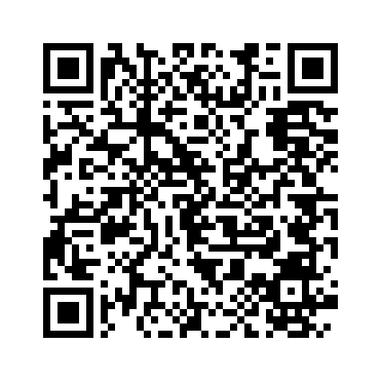 
Open the response form
</a>

##### Contribute / Results

:::

:::

:::

# Institutional Systems for Digital Research

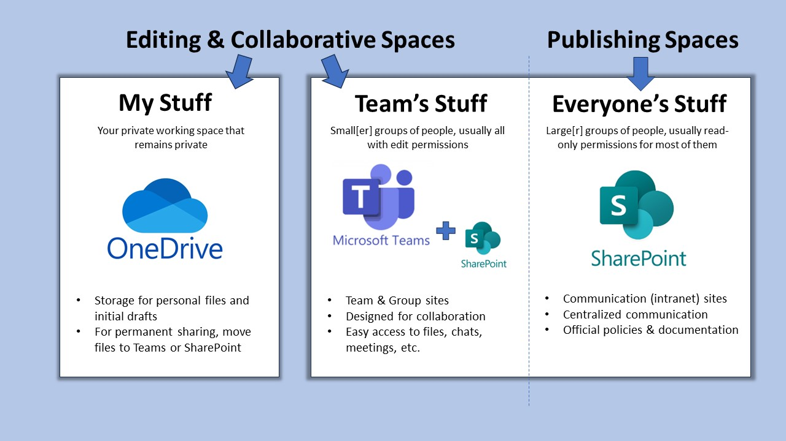

## Why Institutional Systems Matter

Digital research depends on **connected systems** that enable collaboration, safeguard data, and streamline research workflows.

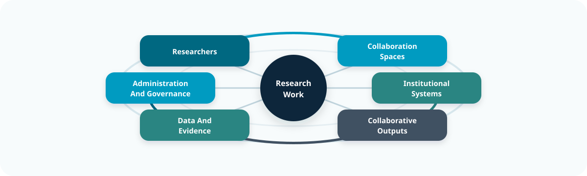{fig-align="center" width="68%"}

> 🧩 The value is in the connection between people, platforms, and outputs, not the platform list itself.

## UoN’s Digital Ecosystem

At the University of Nottingham, research operates within a **digitally integrated environment** that connects people, data, and administration.

| **System** | **Primary Role** |
|-------------|------------------|
| **Microsoft 365** | Collaboration and communication |
| **SharePoint** | Long-term data and document sharing |
| **UniCore** | Finance, HR, and procurement |
| **RIS (Worktribe)** | Research lifecycle, funding, outputs |

> 🏛️ *Together these platforms enable secure, collaborative, and transparent research practice.*

## Microsoft 365: A Platform for Collaboration

Microsoft 365 supports daily research activities within a single, integrated workspace.

| **Tool** | **Function** |
|-----------|---------------|
| **Word & Excel** | Writing, data capture, and co-editing |
| **OneDrive** | Personal cloud storage with versioning |
| **Teams** | Communication, meetings, shared workspaces |
| **SharePoint** | Institutional document repositories |

> 💬 *Microsoft 365 is the shared workspace for modern research collaboration.*

## File Collaboration Best Practice

- Use **Teams or SharePoint** for shared project files  
- Enable **autosave and version history** in Word or Excel  
- Maintain **logical folder structures** by project phase  
- Apply **permissions and access control** with care  

> 🧠 *Good file management is the foundation of digital reproducibility.*

## UniCore and RIS: Institutional Systems

UniCore and RIS link the operational and administrative sides of research.

| **System** | **Purpose** |
|-------------|-------------|
| **UniCore** | Finance, HR, procurement, and resource management |
| **RIS (Worktribe)** | Project proposals, outputs, and compliance tracking |

> 🗂️ *These systems ensure research activity is visible, auditable, and supported.*

## UniCore Overview

**UniCore** is UoN’s enterprise system for managing finance, HR, and procurement.

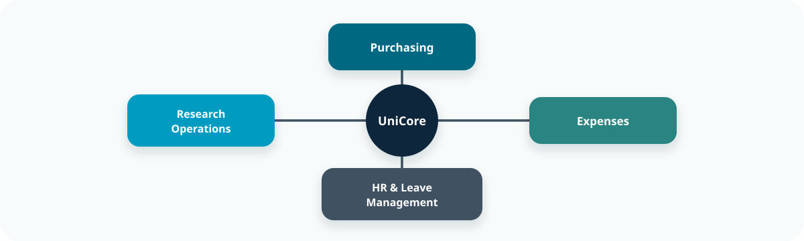{fig-align="center" width="74%"}

> 🧭 Operational systems shape research delivery because they affect what teams can buy, claim, plan, and report.

## RIS (Research Information System)

**RIS (Worktribe)** records, tracks, and reports the full research lifecycle.

| **Feature** | **Purpose** |
|--------------|-------------|
| **Grant Management** | Develop and cost funding proposals |
| **Outputs Tracking** | Record publications and datasets |
| **Impact Recording** | Capture engagement and REF evidence |
| **Integration** | Syncs with ORCID and external repositories |

> 📚 *RIS ensures research activity is captured and connected institutionally.*

## The Broader Vision: Connected Research

By using institutional systems effectively teams build **trust and accountability**, data remains **secure, reusable, and open** and researchers can spend more time working on **innovation and discovery**

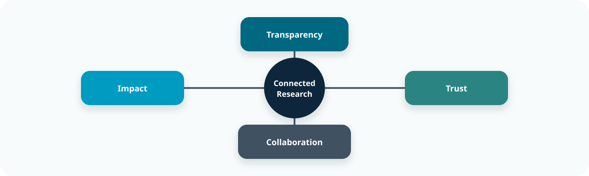{fig-align="center" width="74%"}

> 🌍 Good infrastructure makes research easier to audit, hand over, and reuse.

---

::: callout-task

#### Task 2: Match Research Tasks to Tools (5 min)

List the digital tools you would use for each of the following:

::: {.content-visible when-format="revealjs"}

::: panel-tabset

##### Contribute

<a href="https://ds-shiny-helper.azurewebsites.net/edsm1/?contribute=true&amp;embed=true#shiny-tab-q2_input" style="color: #ffffff; background: transparent; display: inline-block;">
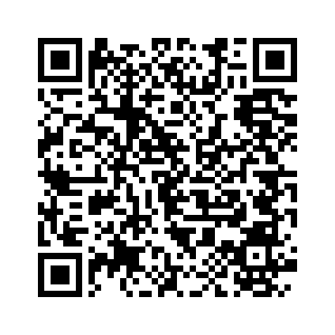 
Open the response form
</a>

##### Contribute / Results

##### Discussion

| Research task | Suggested answer |
|---|---|
| Co-write a manuscript | **Word** with **Teams**; store the shared file in **SharePoint** or **OneDrive**. |
| Submit a funding bid | **RIS (Worktribe)** for the bid; use **Word** and **Teams** for drafting and collaboration. |
| Order equipment | **UniCore**. |
| Share large datasets | **SharePoint** through **Teams**, subject to access controls and local research data storage guidance. |

The Shiny activity offers **Teams, Word, SharePoint, RIS, UniCore** and **OneDrive** as options, but it does not score responses against a fixed answer key.

:::

:::

:::

# Research Identity & Profiles

## Why Research Identity Matters

Your **research identity** defines how your work is discovered, attributed, and connected across the digital research ecosystem.

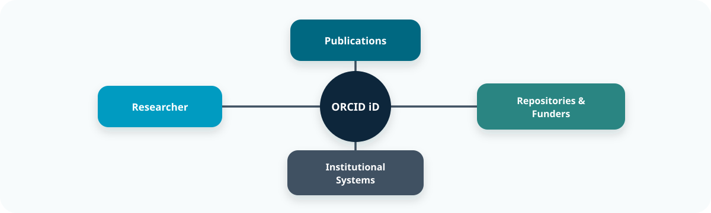{fig-align="center" width="76%"}

> 🧩 Persistent identifiers reduce the chance that outputs become separated from the person or project that produced them.

## The Importance of Consistency

A consistent identity links your outputs, affiliations, and roles automatically across systems. This approach:

- Guarantees **proper attribution** and supports efficient collaboration.
- Ensures **discoverability** across publishers and repositories  
- Prevents **duplication or misattribution** of outputs  
- **Universal interoperability:** used by funders, publishers, and institutions  
- **Portability:** your iD remains active throughout your career  

> 💡 *A consistent research identity builds long-term recognition and credibility.*

## ORCID: A Persistent Digital Identifier

**ORCID (Open Researcher and Contributor ID)** is the global standard for uniquely identifying researchers across institutions and disciplines.

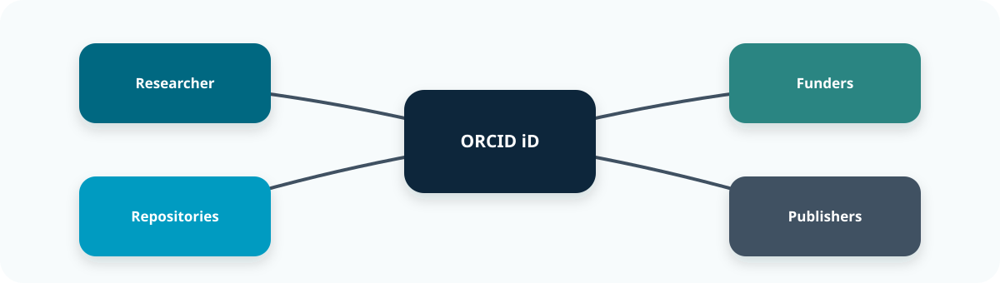{fig-align="center" width="74%"}

> 🧠 ORCID is useful because other systems can read the same stable identifier.

## Managing Your Research Profiles

It is recomended that you:

- Make your **ORCID profile public** for discoverability  
- **Merge duplicate Scopus IDs** to ensure accuracy  =
- Use consistent **name and affiliation formats**  
- Avoid unverified or **proprietary metrics**  
- **Audit profiles regularly** for correctness  

> 🧭 *Managing your identity actively ensures your research remains visible and verifiable.*

---

::: callout-task 

#### Task 3: Research Identity Self-Audit (10 min)

::: panel-tabset

#####  Task

❓ Do you have a ORCID research identity? 

Visit [Orcid](https://orcid.org/), Log in / sign up

❓ Is your ORCID ID populated with your name, affiliation etc? If not make sure that is complete. 
- Set your ORCID ID to public (if appropriate)  

#####  Note

- You can actually link your RIS and ORCID profiles, but for that you need to be registered to use worktribe. It is recomended that you [request access](https://nottingham-research.worktribe.com/login.jx)
- Once registered you will be able to link your ORCID and RIS profiles. For more infomation please refer to the [RIS training materials](http://moodle.nottingham.ac.uk/course/view.php?id=47898).
:::
:::

# Digital Security & Good Practice

## Why Digital Security Matters

Effective digital research requires vigilance, responsibility, and sound data stewardship to protect not only research, but also collaborators and institutions.

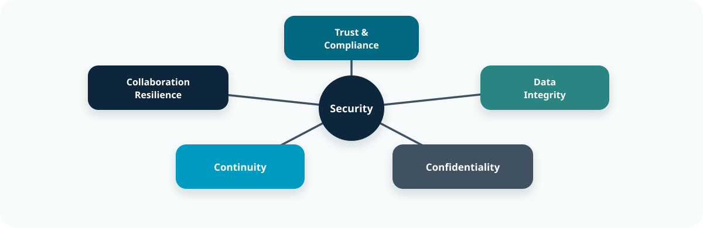{fig-align="center" width="78%"}

> 🔒 Security failures usually damage trust first, then data and continuity.

## Passwords & Access Management

Passwords remain the first line of defence against unauthorised access.  
Weak or reused passwords are still the most common research vulnerability.

- Use **at least 12 characters** with a mix of cases, numbers, and symbols  
- Create **unique passwords** for each system  
- Never share credentials via email or chat  
- Regularly **review access permissions** for shared platforms  

> 🧠 *Strong passwords are simple, low-cost defences against complex risks.*

## Multi-Factor Authentication (MFA)

**MFA** adds a crucial verification step beyond a password.  
Even if your password is compromised, MFA prevents most unauthorised logins.

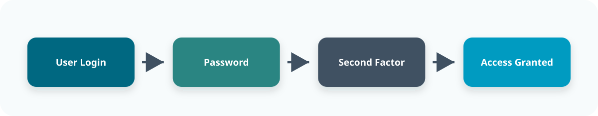{fig-align="center" width="70%"}

> 🔐 MFA makes one stolen password much less useful to an attacker.

## Device & Data Protection

Devices are gateways to institutional data.  
Protecting them is vital for maintaining research integrity and trust.

| **Action** | **Purpose** |
|-------------|-------------|
| Store files on OneDrive or SharePoint | Secure cloud storage with version control |
| Avoid local or personal cloud drives | Prevent data loss and compliance breaches |
| Enable screen locks and encryption | Protect devices if lost or stolen |
| Use separate user profiles on shared machines | Maintain privacy and accountability |

> ⚙️ *Encryption safeguards your work even when devices are compromised.*

## Secure Remote Access

Remote work expands flexibility but increases risk.  
Safe access protects your data wherever you work.

- Always connect through the **UoN VPN** when off campus  
- Avoid public Wi-Fi without VPN protection  
- Keep **software and systems updated** before connecting  
- Define **secure sharing protocols** for collaborators  

> 🌍 *A VPN keeps your connection secure—your data stays private, even on public networks.*

## Data Backup Strategy

Backups prevent irreversible data loss from accidents, failures, or attacks.  
Follow the **3-2-1 Rule** to ensure resilience.

| **Rule** | **Description** |
|-----------|-----------------|
| **3 Copies** | Maintain three versions of your data |
| **2 Media Types** | Store on two different media (e.g., cloud and drive) |
| **1 Offsite** | Keep one copy offsite or in the cloud |

> 💾 *A backup untested is not a backup—it’s a hypothesis.*

## Cybersecurity Best Practices

Cybersecurity requires daily habits, not one-off actions.

- **Verify sender identity** before opening attachments or links  
- **Avoid personal email** for research communication  
- **Report incidents** immediately to UoN IT Security  
- Ensure **GDPR compliance** for international collaborations  

> 🧩 *Cybersecurity is continuous awareness—prevention through habit.*

---

::: callout-task

#### Task 4: Digital Security Self-Audit (5 min)

::: {.content-visible when-format="revealjs"}

::: panel-tabset

##### Contribute

<a href="https://ds-shiny-helper.azurewebsites.net/edsm1/?contribute=true&amp;embed=true#shiny-tab-q4_input" style="color: #ffffff; background: transparent; display: inline-block;">
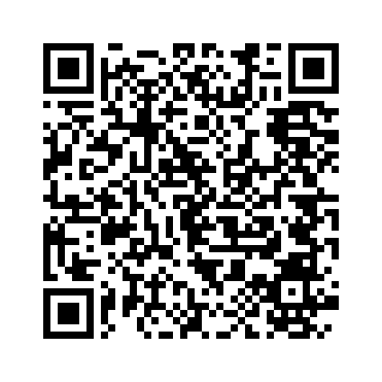 
Open the response form
</a>

##### Contribute / Results

Follow-up

- Identify one way in which you can improve your digital security in the coming week  
- Reflect on what was easy/hard to assess, and which barriers exist for better practice

:::

:::

:::

# Literature Discovery and Reference Management

## Find Evidence You Can Use

Literature review are an intrisic component of the research lifecycle: Researchers need relevant papers, accurate references and notes you can trace back to the sources.

A literature review can be broken down into three parts:

- **Discovery:** choose a search service and build a focused search.
- **Organisation:** check references, handle duplicates and keep useful reading notes.
- **Citeation:** connect claims to sources and maintain the bibliography.

## A Literature Workflow You Can Trace

A research question leads to a search, checked records, linked notes and claims that can be traced back to their sources.

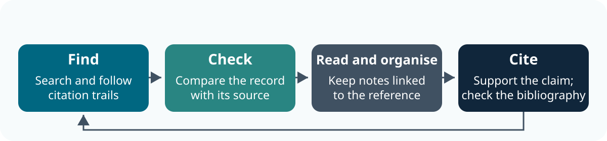{fig-alt="Find literature and follow citation trails, check the reference against its source, organise reading notes with the reference, then cite and check the bibliography. A return arrow connects new questions to further searching." fig-align="center" width="88%"}

> 🧭 New questions refine the search. Keep a search log and stable source links throughout.

## Start with a Research Question

A useful workflow connects **the question, the search, the reference and your reading notes**.

- Define what you need to understand or support with evidence.
- Identify the main concepts and alternative terms.
- Decide what would make a source relevant.

> 📖 Finding a paper is the start: decide what it contributes before citing it.

## Choose a Search Service

| Service | Useful for |
|---|---|
| **NUsearch** | Finding material available through the UoN library |
| **Subject databases** | Discipline-specific literature, fields and subject headings |
| **Google Scholar** | Broad discovery and citation trails |
| **AI-assisted search tools** ([Elicit](https://elicit.com), [Consensus](https://consensus.app), [Semantic Scholar](https://www.semanticscholar.org), [ResearchRabbit](https://www.researchrabbit.ai)) | Discovering relevant papers, exploring research questions and identifying connections between studies |

> 🔎 Check coverage and search features. One service may not cover all relevant literature. [UoN Libraries: bibliographic databases](https://www.nottingham.ac.uk/library/documents/research/subject-databases-for-searching.pdf)

## Construct a Basic Search

Most search engines use similar controls to restrict searches. For example; (doctoral OR postgraduate) AND ("writing group" OR "writing retreat"). In this instance:

- **OR:** alternative terms for the same concept.
- **AND:** combine different concepts.
- **Quotation marks:** phrases, where supported.

> 🔍 Check the service's syntax and record filters. 

## Follow Citation Trails

From a relevant starting paper, follow its reference list backwards and find later papers through cited-by links.

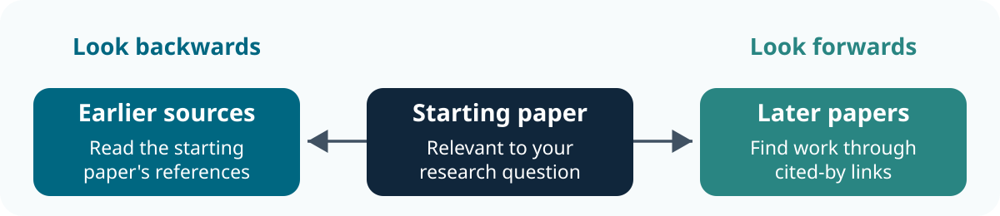{fig-alt="From a starting paper, follow its references backwards to earlier sources and cited-by links forwards to later papers." fig-align="center" width="85%"}

> 🔎 Follow the links, then read and evaluate each source.

## Access and Read the Source

- Follow **references backwards** and **cited-by links forwards**.
- Use the library's full-text links and sign in where required.
- If access fails, look for a lawful open version or ask the library.
- Record the DOI or stable link and the version you read.

> 📚 An abstract can help select a paper. Read the relevant full text before using it to support a claim.

## Keep a Search Log

Record five things:

1. Research question.
2. Service and date searched.
3. Exact query and filters.
4. Relevant references and result count, if available.
5. Next search or citation trail to follow.

> 📝 A colleague should be able to understand how you found the source. some modern software help you record this by default

## Keep Up with a Topic

Where available, save a search and create an **email or RSS alert**. Author, journal and citation alerts offer other routes.

Review alerts regularly and record which papers you retain. Alerts support discovery; they do not replace the search record needed for a review.

## Storing References; EndNote or Zotero?

| Tool | Why consider it? |
|---|---|
| **EndNote** | Groups, library sharing and Cite While You Write integration; check UoN access |
| **Zotero** | Free reference manager with browser capture, collections, notes and citation integration |

> 🧭 Choose one that suits your co-authors and writing workflow. You do not need either installed for today's tasks. [UoN EndNote guidance](https://xerte.nottingham.ac.uk/USER-FILES/53584-uazecw-Nottingham/media/2025%20EndNote%20-%20Separate%20guide%20-%20Downloading%20Endnote.pdf) · [Zotero quick start](https://www.zotero.org/support/quick_start_guide)

## Import, Then Check

Import through a database export, supported browser capture or identifier such as a DOI. The **reference record** and **PDF attachment** are separate. Always check:

- authors and order;
- title, year and item type;
- journal/publisher, volume and pages;
- DOI or stable URL.

> ✅ Correct the library record so later citations use the corrected details.

## Organise and Annotate

Use **EndNote groups** or **Zotero collections** for projects and topics.

A useful reading note contains:

- the finding relevant to your question;
- its page, section, table or figure;
- a limitation or next question.

> 📝 Keep quotations, paraphrases and your own ideas distinct. Label an abstract-only note and attach lawfully obtained full text where appropriate.

## Duplicates and Shared Libraries

Compare suspected duplicates before removing anything. Preserve useful notes and attachments; a preprint and published article can require separate records.

> 🤝 For a shared library, agree **owner, editors, organisation and correction responsibilities**. Check which notes and attachments the sharing method includes. [Zotero duplicates](https://www.zotero.org/support/duplicate_detection) · [Group libraries](https://www.zotero.org/support/groups) · [EndNote groups](https://docs.endnote.com/docs/endnote/2025/v1/windows/en/content/05groups_and_tags/the_groups_panel.htm)

## Cite and Generate a Bibliography

1. Insert a citation linked to the checked record.
2. Add a page locator where required.
3. Generate the bibliography from cited records.
4. Choose the required style and refresh.

> 🔍 Check that the source supports the claim. Fix bibliographic errors in the library; preserve citation fields in the working document. [Zotero citation guidance](https://www.zotero.org/support/creating_bibliographies)

## Move Between Tools Carefully

Export in a supported format such as **BibTeX**. 

- Keep the original library and test a small sample.
- Compare counts and key fields after importing.
- Check notes, attachments and organisation.
- Check existing document citation links separately.

> 📦 A formatted bibliography is not a portable library. [Zotero export guidance](https://www.zotero.org/support/kb/exporting)

## Search Plan: Worked Check

A subject database can support a discipline-specific search; NUsearch can help locate accessible material. The example query combines alternatives using OR and concepts using AND.

Record the service, date, exact query and filters. Follow references or cited-by links, then check whether a saved-search alert is available. Other choices are valid when they fit the question.

::: callout-task

#### Task 5: Check the Records (5 min)

::: panel-tabset

##### Task

**Fictional teaching example.** Both records below were imported from the same article. 

| Field | Record A | Record B |
|---|---|---|
| Authors | Chen, R. | Chen, R.; Patel, M. |
| Year | 2024 | 2025 |
| Title | Writing groups | Doctoral writing groups: a small pilot |
| Reading note | Question about recruitment | Methods, p. 13: six volunteers |

Its title-page details are:

Chen, R. and Patel, M. (2025). *Doctoral writing groups: a small pilot*. Example Research Journal, 4(1), 12–19.

1. **2 min:** identify the fields to correct and decide how to combine this confirmed duplicate without losing either note.
2. **2 min:** write a source-linked reading note and choose a project group or collection.
3. **1 min:** two pairs share one correction and the information they would preserve.

##### Discussion

Record B matches the supplied authors, title and year. Complete the journal, volume and pages from the source; retain both useful notes with their context.

A note could be: “Methods, p. 13: six volunteers; check recruitment before drawing wider conclusions.” Do not invent a DOI or findings absent from the supplied material.
:::
:::

# Tools to Support Writing

## Make Writing Easier To Review

You are drafting a paper with co-authors. Everyone needs to navigate the document, check the evidence and identify the version being reviewed.

Writing tools can help you to:

- **Structure your work:** use headings, captions and cross-references.
- **Collaborate:** agree how comments, edits and versions are handled.
- **Check:** keep revisions, including rewrites, faithful to the evidence.

>  Agree a format with your co-authors before you start writing. 

## Structure Supports Reliable Writing

Heading styles organise sections, captions label tables and figures, and cross-references connect mentions to the relevant item.

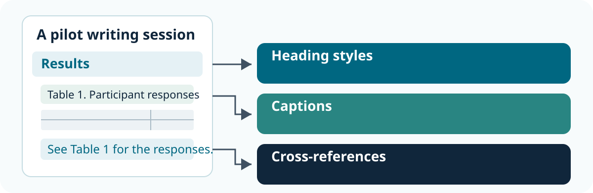{fig-alt="A sample Results page connects its heading to heading styles, its table caption to captions, and its table mention to cross-references." fig-align="center" width="85%"}

> 🔗 Refresh fields after edits, then check captions and cross-references in the final document.

## Choose Word or LaTeX

There are multiple tools you can use to write with. two of the most common in scientific research are Micorsoft Word and LaTeX:

| Tool | Useful when |
|---|---|
| **Word** | Co-authors want familiar editing, comments, tracked changes and citation integration |
| **LaTeX** | The discipline needs mathematical typesetting or a LaTeX publication template |

> Check that co-authors can review the chosen format. Word uses visual editing; LaTeX compiles marked-up source. Both need a final output check.

## Use Document Structure

Always conform with the tool you are using when structuring documents:

| Purpose | Word | LaTeX |
|---|---|---|
| Sections | Heading styles | `\section{...}` |
| Tables/figures | Insert Caption | Caption in the appropriate environment |
| Linked mentions | Insert Cross-reference | `\label{...}` and `\ref{...}` |

> Update fields or recompile after changes. Bold text alone does not identify a heading; manually typed numbers can become stale. [Word captions](https://support.microsoft.com/en-us/word/add-format-or-delete-captions-in-word) · [Cross-references](https://support.microsoft.com/en-us/word/create-a-cross-reference) · [LaTeX references](https://www.overleaf.com/learn/latex/Cross_referencing_sections%2C_equations_and_floats)

## Structure Scientific Writing with IMRaD

Most scientific research papers follow the **IMRaD structure** to communicate research clearly and logically:

| Section | Key question | Purpose |
|---|---|---|
| **Introduction** | Why was the study needed? | Establish context, identify the research gap and state the objectives |
| **Methods** | How was the study conducted? | Describe the design, data and methods sufficiently to support reproducibility |
| **Results** | What was found? | Present findings objectively using text, tables and figures |
| **Discussion** | What do the findings mean? | Interpret results, relate them to existing evidence and acknowledge limitations |

> **Think of IMRaD as a logical argument:** Why? → How? → What? → So what? The structure supports clarity and reproducibility, but conventions vary between disciplines and journals. [Scientific writing (IMRaD)](https://www.ncbi.nlm.nih.gov/pmc/articles/PMC442179/)

## Comments and Tracked Changes

Use both comments and tracked changes when collaborating:

- **Comment:** ask a question or explain a concern.
- **Tracked change:** propose an edit for acceptance or rejection.
- **Author decision:** respond and decide what to retain.

> For LaTeX, agree how to review source changes and the compiled document; collaboration features depend on the tool and account. [Word review](https://support.microsoft.com/en-us/word/training/track-changes-in-word) · [Overleaf review](https://docs.overleaf.com/collaborating/track-changes)

## Identify the Authoritative Version

**Tracked changes support review. Version history supports comparison and recovery.**

Agree:

- where the authoritative document, bibliography and assets live;
- who reviews and accepts changes, and by when;
- how the approved version is recorded.

> An emailed attachment is a separate copy. Return its edits to the agreed source. For LaTeX, use editor history or the team's existing source version-control workflow. [Microsoft 365 version history](https://support.microsoft.com/en-gb/office/collab-files/view-previous-versions-of-office-files)

## A Co-author Review Workflow

An agreed review workflow makes clear which document is authoritative and how suggested changes become approved.

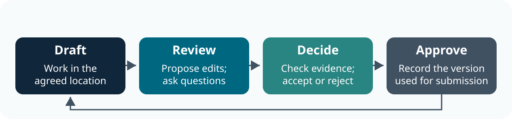{fig-alt="Co-authors work in an agreed location, propose edits and questions, check evidence and decide which changes to accept, then record the approved version. A return arrow connects revisions to the shared source." fig-align="center" width="85%"}

> 🔁 Return edits to the same source. Use version history to inspect saved states and review markup to track proposed changes.

## AI for Writing: Set the Boundaries

AI can suggest an outline or rewrite. The researcher remains responsible for meaning and evidence.

- Specify the task, source boundary and output required.
- Use only material permitted in the chosen service.
- Check claims, numbers and citations against the sources.
- Record the tool, date, contribution and checks; follow disclosure requirements.

> See [Responsible Use of Generative AI](../../responsible_use_of_generative_ai/index.qmd) and [Prompting for Research](../../responsible_use_of_generative_ai/episodes/02-Prompting_for_research.qmd).

::: callout-task

#### Task 6: Mark Up the Structure (10 min)

::: panel-tabset

##### Task

**Fictional example:** six volunteers attended a one-hour writing session. Four reported greater confidence immediately afterwards. There was no comparison group or later follow-up.

**Draft conclusion:** “These findings prove that writing sessions benefit all researchers.”

Work in pairs or small groups; no writing software is required you can do this on you computer or using paper or notes. 

ACTIVITY. **5 min:** propose section headings to write up these results, a table, a caption and a clearer table reference. What other information would you need to turn this into a research paper? 

##### Discussion

**Possible structure:** Methods describes the six volunteers, the one-hour session, recruitment and how confidence was assessed. Results reports that four of six volunteers said they felt more confident immediately afterwards.

**Possible table caption:** “Table 1. Volunteers reporting greater confidence immediately after the writing session (n = 6).” A text reference could read: “Four of six volunteers reported greater confidence immediately after the session (Table 1).”

The conclusion should describe this small, uncontrolled pilot. It cannot show that the session caused the change, that it benefits all researchers or that any change lasted. A fuller report would need details of recruitment, the confidence measure, the session content and any relevant ethics approval.

:::

:::

# Further Information

## UoN Training Resources

- [Microsoft 365 Training Resources](https://training.nottingham.ac.uk/Course?courseref=M365TR&dates=0)
- [Excel 2016: Basic–Advanced (Online)](https://training.nottingham.ac.uk/portal/BrowseCoursesFromSubCat?cat=21&subCatId=34)
- [Staff session: Managing your online and RIS research profiles](https://training.nottingham.ac.uk/Portal/BrowseCategory?cat=8)
- [Digital Accessibility: The Core Nottingham Accessible Practices](https://training.nottingham.ac.uk/Course?courseref=LT-COREACCESSIBILITY&dates=0)
- [RIS: Worktribe User Guidance](http://moodle.nottingham.ac.uk/course/view.php?id=47898)
- [UniCore Training Materials](https://www.nottingham.ac.uk/dts/unicore.aspx)
- [UoN Information Security: Annual Data Protection and Information Security Awareness](https://training.nottingham.ac.uk/Portal/BrowseCategory?cat=8)

## Literature and Writing Guidance

- [UoN Libraries: searching bibliographic databases](https://www.nottingham.ac.uk/library/documents/research/subject-databases-for-searching.pdf)
- [UoN EndNote setup guidance](https://xerte.nottingham.ac.uk/USER-FILES/53584-uazecw-Nottingham/media/2025%20EndNote%20-%20Separate%20guide%20-%20Downloading%20Endnote.pdf)
- [Zotero quick start](https://www.zotero.org/support/quick_start_guide)
- [Overleaf: learning LaTeX](https://www.overleaf.com/learn)
- [Responsible Use of Generative AI](../../responsible_use_of_generative_ai/index.qmd)

::: callout-keypoints

## 📚 keypoints

- UoN currently uses Microsoft 365 tools support collaborative writing, file sharing, and communication
- UniCore manages research-related administration  and RIS manages the research lifecycle.
- A well-maintained research identity increases visibility and attribution of your work.
- Store research data in encrypted, university-backed platforms and ensure your account details are protected
- Record searches and check imported references against their original sources.
- Use a reference manager to connect reading notes, citations and a bibliography.
- Structure writing with headings, captions and cross-references, then agree how co-authors review the authoritative version.
:::

::: callout-hints

## 🔦 hints

- Store shared project files in Microsoft Teams rather than OneDrive to ensure long-term access for collaborators.
- Use version history in OneDrive/SharePoint instead of manually renaming file versions.
- Practice “security by default”
- Test a small reference export before moving a whole library to another tool.
- Use comments, tracked changes and version history to review documents.
:::

::: {.content-visible when-format="revealjs"}

## Feedback and Register

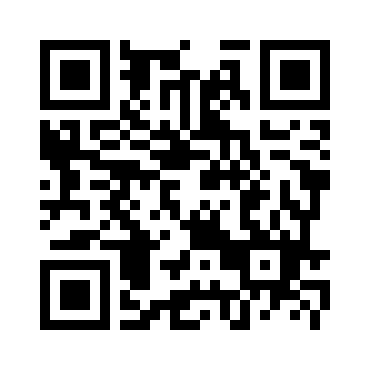{fig-alt="Scan the QR code to give feedback on Digital Skills training."}

:::
