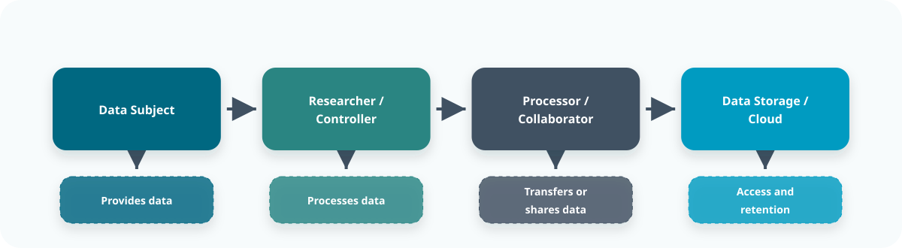
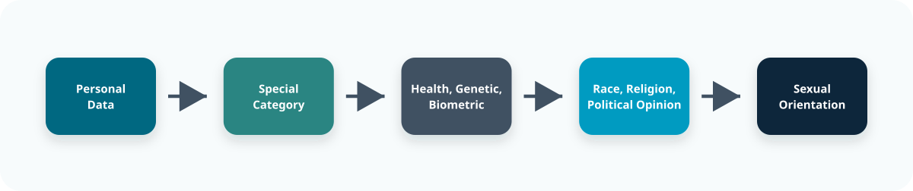
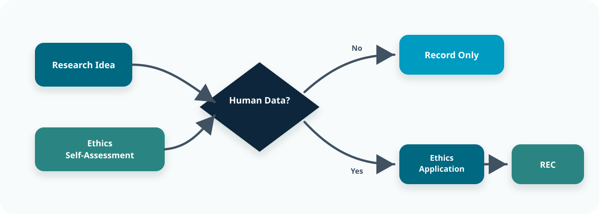
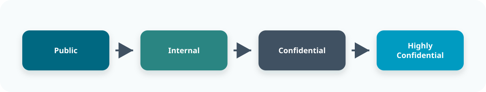
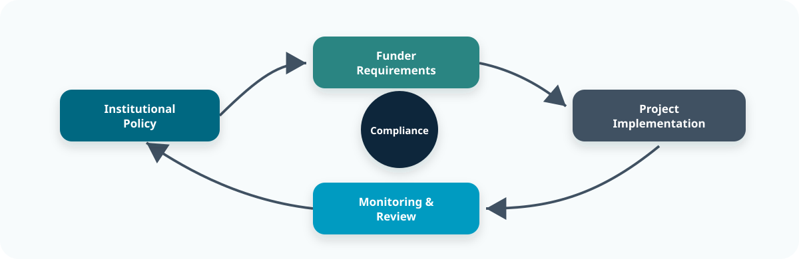

::: {.content-visible when-format="revealjs"}

<!-- Hidden by default -->

:::

::: callout-outcomes

## 💡 Learning Outcomes

* Understand the principles of GDPR and lawful handling of personal/sensitive data
* Recognise University of Nottingham policies on research ethics and data management
* Apply data classification and information security tiers to research datasets
* Identify key compliance frameworks and shared responsibilities in research projects
:::

::: callout-questions

## ❓ Questions

1. What are researchers’ responsibilities under GDPR and UK data protection law?
2. When does a project require research ethics approval at UoN?
3. How should datasets be classified to align with institutional information security policy?
4. How do institutional and funder policies intersect to shape digital compliance?
:::

## Structure & Agenda

1. Data Protection and Legal Frameworks (~15 min)
2. Research Ethics and Institutional Conduct (~15 min)
3. Data Classification and Information Security (~15 min)
4. Policy and Digital Compliance Landscape (~15 min)

---

# Data Protection and Legal Frameworks

## Why is Data Protection important?

Data protection forms the legal foundation for ethical and compliant research practice. Understanding the regulatory environment enables researchers to manage risk, protect participants and maintain trust. 

> ⚖️ The UK General Data Protection Regulation (UK GDPR) and the Data Protection Act 2018 govern all processing of personal and special category data in research.

## Understanding Personal Data

Personal data means *any information relating to an identified or identifiable person*. This includes not only names and contact details but also identifiers such as location, IP address, or images.

**Examples in research:**

* Interview recordings and transcripts
* Survey responses including demographics
* Pseudonymised datasets linked via participant IDs
* Lab results associated with patient identifiers

> 🧠 *If someone can be identified directly or indirectly, the data should be considered personal.*

## The GDPR Framework

{fig-align="center" width="82%"}

> 🧭 The key distinction is who decides why data is used, who acts on instructions, and where access is controlled.

## Lawful Basis for Research (UK GDPR Article 6)

Article 6 UK GDPR provides **six** lawful bases for processing personal data. Research typically relies on two of them, but all are listed for completeness.

1. **Consent** Freely given, specific, informed and unambiguous. *Used in research only when genuinely optional*
2. **Contract** Necessary to perform a contract with the data subject. *Rarely applicable to research.*
3. **Legal Obligation** Required to comply with law. *Not normally relevant to research activities.*
4. **Vital Interests** Protecting someone’s life. *Applies mainly to medical emergencies, not planned research.*
5. **Public Task** Necessary for performing a task in the public interest. *Most UK universities rely on this for research.*
6. **Legitimate Interests** Permitted where processing is necessary and impact is minimal. *Used when Public Task does not apply.*

--- 

## Consent

**Consent is not a universal lawful basis for research.**  
It complements ethical approval and transparency but does not replace institutional safeguards, accountability, or appropriate governance.

## Rights of Data Subjects

* Right to be informed
* Right of access and rectification
* Right to restrict processing
* Right to erasure (limited for research)
* Right to data portability and objection

> 🧩 *Research exemptions exist but require proportionality and documentation.*

## Special Category Data (UK GDPR Article 9)

{fig-align="center" width="78%"}

> ⚠️ Article 9 data raises the evidence threshold because misuse can harm people directly.

Special category data (Article 9) require **both** a lawful basis (Art 6) and a specific **Article 9 condition**, commonly *scientific research with appropriate safeguards*.

## Research Safeguards

Safeguards must ensure that personal data are used responsibly:

* **Data minimisation** – collect only what is necessary
* **Pseudonymisation / anonymisation** – protect identity
* **Restricted access** – use least privilege principle
* **Retention limits** – define storage duration in DMP
* **DPIA** – conduct where processing poses high risk to individuals

> 🔐 *Good governance transforms legal compliance into ethical research practice.*

## Roles and Responsibilities

| **Role**                          | **Responsibility**                                        |
| --------------------------------- | --------------------------------------------------------- |
| **Data Controller**               | Determines purposes and means of processing (often UoN)   |
| **Processor**                     | Processes data on behalf of controller (e.g., cloud host) |
| **Joint Controllers**             | Shared decision-making between partners                   |
| **Data Protection Officer (DPO)** | Oversees compliance, provides advice                      |

---

::: callout-task

#### Task 1: Group Scenario Ranking (15 min)

**Objective:** Using the scenario card assigned to your group, identify the main data protection risks and rank the specific components of your scenario from lowest to highest risk.

**Instructions:**

1. Examine the data types, processing steps and partnerships described on your scenario card.
2. Identify risk drivers (e.g., identifiability, sensitivity, continuous monitoring, third-party processing, cross-border flows).
3. Rank the elements of your scenario from lowest → highest risk and justify the ordering.
4. Suggest safeguards that would reduce the highest-ranked risks.

**Plenary reflection:** Which characteristics in your scenario elevate risk?
:::

# Institutional Conduct

## Ethics

Ethical review ensures that research is conducted with **integrity, transparency and respect**. At the University of Nottingham, ethical standards are guided by the **Code of Research Conduct and Research Ethics**.

## Core Ethical Principles

| **Principle**      | **Meaning**                                            |
| ------------------ | ------------------------------------------------------ |
| **Respect**        | Uphold autonomy, dignity and rights of participants   |
| **Integrity**      | Ensure honesty and transparency in all research stages |
| **Responsibility** | Prevent harm and manage potential risks                |
| **Accountability** | Maintain records and be answerable for decisions       |

> 🧭 *Ethical practice is both a regulatory requirement and a marker of research quality.*

## Review Processes at UoN

* **Ethics approval** required for any study involving humans, personal data, or safety risks
* **Proportionate review** based on level of risk: School/Faculty REC or NHS REC
* Some low-risk activities may be registered but not reviewed if fully anonymised

{fig-align="center" width="86%"}

> 🧭 Early self-assessment prevents ethics and governance questions from becoming late-stage delays.

## Common Ethical Issues

* Use of vulnerable populations (children, patients)
* Power dynamics in interviews
* Cultural and linguistic sensitivity
* Secondary use of existing data
* Data storage, retention and destruction

## Building Ethics into Design

* Embed ethical reflection from project inception
* Draft consent materials in accessible language
* Include withdrawal procedures and feedback mechanisms
* Consider participant burden and researcher wellbeing

---

::: callout-task

#### Task 2: Group Ethics Mapping (15 min)

**Objective:** Classify all data types in your scenario card using UoN’s Information Classification Framework and assign appropriate storage and access controls.
**Steps:**

1. Identify ethical issues inherent in your scenario (e.g., vulnerability, distress, clinical linkage, geolocation, minors).
2. Decide whether the project requires ethical review and specify the likely route: School/Faculty REC? Specialist REC (i.e. NHS)
3. Identify core documentation needed (consent materials, information sheets, risk assessments).
4. Agree on key ethical considerations the research team must address before data collection.

**Plenary reflection:** Which factors most strongly affect whether review is needed? Where do grey areas appear?
:::

# Data Classification and Information Security

## Handling research data

Research data must be handled according to sensitivity and risk. UoN’s **Information Classification Framework** defines four tiers: Public, Internal, Confidential and Highly Confidential.

## Information Classification Model

{fig-align="center" width="70%"}

> 🔐 Classification should be decided before storage and sharing choices are made.

| **Level**               | **Description**                     | **Examples**                           | **Storage Guidance**             |
| ----------------------- | ----------------------------------- | -------------------------------------- | -------------------------------- |
| **Public**              | Freely shareable data               | Published results, open datasets       | Repositories, websites           |
| **Internal**            | Limited to UoN community            | Teaching materials                     | SharePoint, OneDrive             |
| **Confidential**        | Sensitive but manageable risk       | Interview transcripts, research drafts | Research drives                  |
| **Highly Confidential** | High-risk personal or security data | Clinical data, restricted partnerships | Secure servers, encrypted access |

## Protecting Research Data

* Apply classification labels consistently
* Encrypt sensitive data in transit and at rest
* Record and review data access permissions regularly

## Managing Security Incidents

* Report suspected breaches immediately to Digital Technology services and the data protection officer
* Document actions taken and lessons learned
* Implement follow-up audits if needed

---

::: callout-task

#### Task 3: Group Data Classification (15 min)

**Objective:** Determine the information security requirements for the project described on your scenario card.

**Instructions:**

1. List all data types present in the scenario (raw, processed, derived).
2. Classify each as Public, Internal, Confidential, or Highly Confidential.
3. Identify suitable storage locations (e.g., research drives, secure servers, encrypted environments).
4. Define access control needs (minimum access, MFA, encryption, role-based permissions).
5. Identify any components that require additional safeguards (e.g., separate linkage files, encryption in transit).

**Plenary reflection:** How do teams balance openness and risk? Which criteria most influenced your decisions?
:::

# Policy and Digital Compliance Landscape

## Teired levels
 
Data governance operates across multiple levels: **institutional, national and funder** each setting standards for responsible research and compliance.

## Institutional Policies

* **Code of Research Conduct and Research Ethics:** defines ethical standards and oversight.
* **Code of Practice on Research Data Management:** mandates DMPs, retention and repository use.
* **Information Security Policy:** classification, storage and access control.
* **Trusted Research (UoN)** due diligence for international collaboration.

## National & Funder Frameworks

| **Framework**                          | **Focus**                          | **Examples**                        |
| -------------------------------------- | ---------------------------------- | ----------------------------------- |
| **UKRI Trusted Research & Innovation** | Secure international collaboration | Partnership risk assessments        |
| **UKRI Open Research Data Policy**     | Sharing with safeguards            | FAIR data principles                |
| **Data Protection Act 2018**           | Legal controller obligations       | Research exemptions with safeguards |
| **Export Controls**                    | Sharing restrictions               | Sensitive collaborations            |

## Implementing Compliance in Projects

{fig-align="center" width="72%"}

> 📋 Compliance is maintained through repeated checks, not a single form at the start.

## Essential Compliance Documents

Modern research governance relies on a set of **standard documents** that ensure transparency, accountability and risk-aware data management throughout the project lifecycle.

## Key Documents

| **Document** | **Purpose** | **When Required** |
|--------------|-------------|--------------------|
| **DPIA – Data Protection Impact Assessment** | Identifies and mitigates high-risk processing (e.g., special category data, monitoring, novel tech). | Mandatory for *any* high-risk activity under UK GDPR; often required for clinical, AI-enabled or large-scale personal data studies. |
| **DAR – Data Access Request / Data Access Review** | Records, evaluates and approves requests to access sensitive or controlled datasets; ensures proportionality and security. | When researchers need access to restricted, confidential or external datasets. |
| **DMP – Data Management Plan** | Specifies how data will be collected, stored, secured, shared, preserved and disposed of. | Required by UoN, UKRI and most funders; drafted at proposal stage and updated throughout the project. |
| **Data Sharing / Collaboration Agreements** (DSA / DCA) | Define roles (controller/processor), safeguards and transfer conditions. | When sharing data with external partners, processors or internationally. |
| **Participant Information & Consent Materials** | Provide transparency and ensure voluntary, informed participation. | Required whenever collecting personal data directly from participants. |
| **Risk Assessments** (Information Security, Fieldwork, Technical) | Document digital, physical and technical risks and their controls. | Required for projects involving sensitive data, fieldwork or specialised systems. |

## Why These Documents Matter

* Support **accountability** and demonstrable compliance  
* Protect **privacy**, **security**, and **ethical integrity**  
* Provide a clear audit trail  
* Enable effective collaboration with Ethics, DPO, IT Security, and external partners

> 🗂️ *Good documentation is the backbone of trustworthy research and strong data governance.*

## Shared Responsibility Matrix

| **Actor**         | **Responsibility**                   |
| ----------------- | ------------------------------------ |
| **Researcher**    | Follow ethical and legal guidelines  |
| **PI**            | Ensure compliance and oversight      |
| **Faculty / REC** | Review and approve projects          |
| **DPO / Legal**   | Provide advice, investigate breaches |
| **Funders**       | Define standards and expectations    |

## Embedding Compliance in Teams

* Schedule compliance check-ins during project meetings
* Store key documents (DMP, REC approvals) in shared folders
* Ensure all collaborators understand relevant obligations
* Keep version-controlled audit trails

> 🌍 *Compliance works best when embedded in daily workflows, not treated as an afterthought.*

---

::: callout-task

#### Task 4: Group Policy Mapping (15 min)

**Objective:** Map your scenario card to relevant institutional, funder and legal policies and identify responsibilities across the project team.

**Instructions:**

1. Review the scenario for elements such as third-party processing, international data flows, clinical data, special category data, open publication, or high-risk technology use.
2. Match your scenario to applicable policies (e.g., RDM Code, Information Security Policy, Code of Research Conduct, Trusted Research, UKRI requirements).
3. Identify which team members hold responsibility for compliance actions (Researcher, PI, Faculty REC, DPO, IT Security, external partners).
4. Summarise key compliance actions required before the project can proceed (e.g., DPIA, DMP, agreements, export controls checks).

**Plenary reflection:** Which policy areas overlap most frequently across scenarios?
:::

# Further Information

* [UoN Code of Research Conduct and Research Ethics](https://www.nottingham.ac.uk/research/ethics-and-integrity/code-of-research-conduct-and-research-ethics.aspx)
* [Code of Practice on Research Data Management](https://www.nottingham.ac.uk/library/research/research-data-management/code-of-practice.aspx)
* [Information Security and Classification Guidance](https://www.nottingham.ac.uk/it-services/security)
* Annual **Data Protection and Information Security Awareness** training (mandatory).

---

::: callout-keypoints

## 📚 Keypoints

* GDPR defines lawful bases and safeguards for personal data.
* Ethical review ensures responsible and transparent research.
* Data classification determines secure storage and access.
* Compliance integrates institutional, funder and legal responsibilities.
:::

::: callout-hints

## 🔦 Hints

* Consult the **Research Ethics & Integrity** team or **Data Protection Officer** early.
* Incorporate compliance into project design, not post-hoc review.
* Keep records in DMPs and ethics applications.
* International collaboration may trigger Trusted Research checks.
:::
