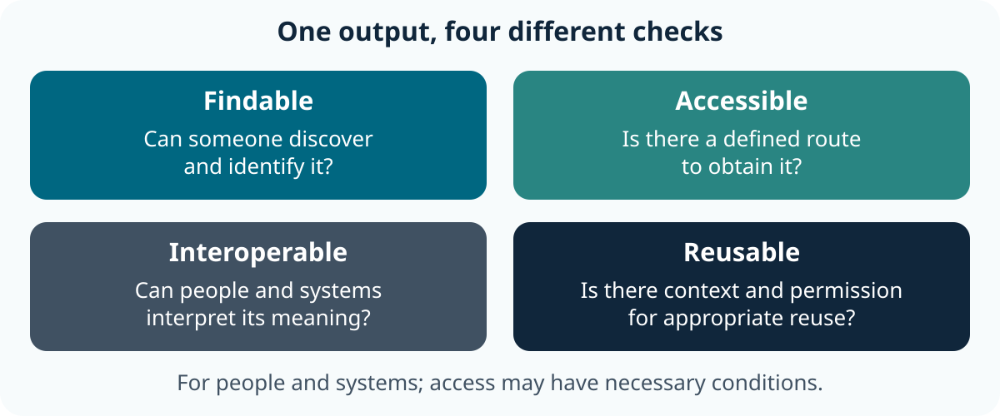
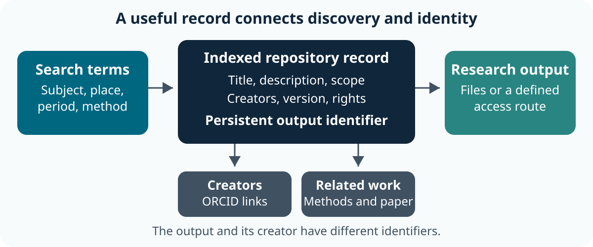
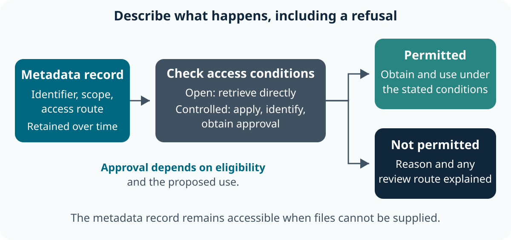
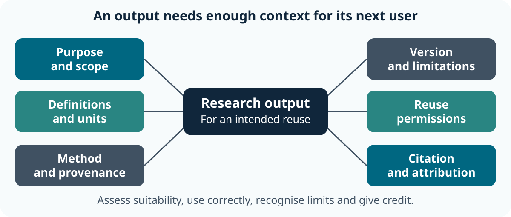

::: callout-outcomes
## 💡 Learning Outcomes

- Explain the four FAIR principles and distinguish FAIRness from unrestricted openness.
- Assess a research output using evidence for Findability, Accessibility, Interoperability and Reusability.
- Improve a repository record through meaningful metadata, persistent identifiers and a clear access route.
- Identify appropriate formats, shared terminology, provenance and permissions for reuse.
- Prioritise practical improvements while recording uncertainty and necessary restrictions.
:::

::: callout-questions
## ❓ Questions

1. Could somebody outside our team discover and understand this output?
2. What would they need to obtain and use it appropriately?
3. Which improvement would remove the most important barrier to reuse?
:::

## Structure & Agenda

| Section | Teaching | Activity | Output to keep |
|---|---:|---:|---|
| Why FAIR? | 7 min | 3 min | An initial ranking with reasons |
| Findable | 8 min | 4 min | A stronger discovery record |
| Accessible | 8 min | 4 min | An access decision and explanation |
| Interoperable | 10 min | 5 min | A proposed interpretation map |
| Reusable | 10 min | 5 min | Three justified documentation changes |
| FAIR beyond data | 7 min | 3 min | A recommendation for another output |
| FAIRness assessment | 0 min | 21 min | An evidence-based assessment and priorities |
| Review | 5 min | 0 min | One action for a real project |
| **Total** | **55 min** | **45 min** | **100 min overall; 45% active learning** |

All activity timings include the room response and debrief. Breaks are additional to these 100 minutes; agree them with the instructor before starting.

## Starting Point and Preparation

You have encountered basic research data management; today the task is to judge whether an output can be discovered, interpreted and reused. No coding, repository account or specialist software is required.

Open the [fictional scenario pack](../learners/scenarios.qmd) and [FAIR assessment worksheet](../learners/files/fair-assessment.md). Work in pairs, alternate recorder and challenger, and keep notes on paper or in a document. Printed materials and a projected example support every activity if web access fails.

All projects and repository records used below are fictional teaching examples. Labels such as **hypothetical persistent identifier** describe a feature of the scenario; they are not real DOIs or live records.

# Why FAIR? (10 min)

## An Output Exists: Can We Use It?

A researcher wants to compare findings with an earlier study. A download link works, but the file contains `t`, `loc` and `val`. The paper never explains the units. The original researcher has moved institution.

The obstacle is more than access: the researcher cannot confidently decide what the measurements mean or whether comparison is appropriate.

| Fictional output | The immediate obstacle |
|---|---|
| Repository record titled `data.csv` | A relevant output is difficult to discover |
| Publication supplement containing code | Dependencies and required inputs are unexplained |
| Publicly downloadable Urban Shade data | Variables, dates, units and permissions are unclear |
| Controlled Steps and Sleep clinical data | Access requires an application, but the route and context are documented |

## Four Questions for People and Systems

{fig-alt="Four connected questions surround the same research output: can it be discovered, obtained through a defined route, interpreted using shared meaning, and reused with appropriate context and permissions?" fig-align="center" width="94%"}

FAIR addresses **Findability, Accessibility, Interoperability and Reusability** for people and machines. Useful descriptions should support both a researcher reading a record and a service searching or interpreting it. [Original FAIR principles](https://www.nature.com/articles/sdata201618).

## FAIRness and Openness Answer Different Questions

**FAIRness:** how well can an output be found, accessed through a defined process, interpreted and reused?

**Openness:** who may see, obtain, use or share it, and under what conditions?

A public download may lack meaning and permission. A controlled dataset may have a persistent record, structured metadata, clear eligibility and well-defined permitted uses. FAIR allows authentication and authorisation when needed. [GO FAIR: access conditions](https://www.gofair.foundation/a1-2).

We will consider the broader research process in [Open Research Practices](02-open_research_practices.qmd).

## Task 1: Which Output Looks More FAIR? (3 min)

::: callout-task
**Goal:** distinguish a working download from a usable research output.

**Input:** the four examples above. Work in pairs.

::: panel-tabset
##### Do the Task

1. **1 min:** choose the strongest and weakest examples for likely reuse; record one reason for each.
2. **1 min:** compare your choice with your partner and identify one fact you would still need.
3. **1 min:** the instructor takes a show of hands and two short explanations, then gives feedback.

**Keep:** your ranking, reasons and one unanswered question.

**If access fails:** use the projected table or printed scenario pack.

##### Debrief

**Ask the room:** “Did a restriction lower your ranking even when the route was clear?”

Steps and Sleep is the strongest described example: another researcher can understand the output and establish whether access is possible. Urban Shade is public but has several reuse barriers. The code supplement and bare record have different weaknesses, so their relative order needs more evidence.

This is an initial judgement, not certification. A restriction alone does not establish poor FAIRness; a repository alone does not establish good FAIRness.
:::
:::

# Findable (12 min)

## Begin with the Search Another Researcher Would Make

Imagine searching for **urban tree shade temperature measurements, summer 2025**. A record titled `results_final` offers little evidence that it is relevant.

Useful **metadata** describes the output: what it contains, who created it, when and where it was produced, its subject and its relationship to other work. Repository fields make those descriptions searchable and support indexing. [GO FAIR: descriptive metadata](https://www.gofair.foundation/f2), [searchable resources](https://www.gofair.foundation/f4).

A shared folder may serve the team. A personal website may support downloads. Check whether someone who does not know the project can discover a maintained, meaningful record.

## An Identifier Connects the Record to the Output

{fig-alt="Search terms lead to an indexed descriptive repository record. The record contains a persistent output identifier and links to the output, creators through ORCID, and related methods or publications." fig-align="center" width="95%"}

The record should name the output's identifier and provide enough context to recognise it. Describing the paper alone can leave its associated dataset or protocol hard to find.

## DOI and ORCID Have Different Jobs

| Identifier | What it identifies | Practical check |
|---|---|---|
| **DOI**, a Digital Object Identifier | An output, such as a dataset, article or released workflow | Does it resolve to the intended record, with the relevant version clear? |
| **ORCID iD** | A researcher | Is the correct creator linked, rather than inferred from their name? |
| A local file or project code | An item within a team's own system | Will someone outside that system understand or resolve it? |

A persistent identifier depends on maintained infrastructure and a commitment to keep its reference meaningful. It does not establish scientific quality, openness or adequate documentation. [GO FAIR: persistent identifiers](https://www.gofair.foundation/f1), [ORCID's purpose](https://info.orcid.org/what-is-orcid/).

## Compare Three Fictional Repository Records

These alternatives describe the same Market Letters transcriptions; they are teaching comparisons rather than real repository entries.

| Record | Search result and description | Likely result |
|---|---|---|
| **1** | `data.csv`; “Data for paper”; no subject, dates or identifier | Easy to overlook; hard to recognise |
| **2** | “Market Letters transcriptions”; creator and year; hypothetical persistent identifier | Identifiable, but scope and content remain unclear |
| **3** | “English-language market letters, 1840–1860: researcher transcriptions”; collection, dates, language, creators, version, rights and related publication; hypothetical persistent identifier | A researcher can judge relevance before requesting or downloading |

The improvement is information that helps discovery and interpretation, rather than a longer title alone. Specific repository metadata fields will vary; [DataCite's schema](https://datacite-metadata-schema.readthedocs.io/en/4.6/) illustrates structured descriptions and relationships.

## Task 2: Strengthen a Discovery Record (4 min)

::: callout-task
**Goal:** make an output discoverable to someone who does not know its filename.

**Input:** the three records above. Work in pairs; one proposes, one checks.

::: panel-tabset
##### Do the Task

1. **1 min:** agree which record your search would find and which would let you judge relevance.
2. **2 min:** rewrite Record 1's title and a two-sentence description; name two structured fields and the identifier feature it needs.
3. **1 min:** two pairs read their proposed title; the instructor connects each addition to a search or identification need.

**Keep:** your revised record and one remaining uncertainty.

**If access fails:** annotate the printed comparison; no live repository entry is needed.

##### Debrief

A defensible revision names the material, language, collection and period. Creator, date, subject, version and related-output fields support discovery; a maintained persistent identifier supports unambiguous reference.

**Ask the room:** “Could someone find this without knowing the project name?” A DOI attached to an uninformative record leaves a discovery problem. Do not invent collection details that the source has not supplied.
:::
:::

# Accessible (12 min)

## Describe the Retrieval Route

Findability gets someone to a record. Accessibility concerns the mechanism for retrieving the record and, where permitted, its output through established communications protocols, such as a repository's web service. [GO FAIR: retrieval](https://www.gofair.foundation/a1).

| Access arrangement | What the record needs to explain |
|---|---|
| **Open** | How to retrieve the files and metadata |
| **Embargoed** | What is available now, the release date or condition, and the later route |
| **Restricted** | Who may access which material and under what conditions |
| **Controlled** | How to apply, prove identity, obtain approval and use an approved environment |

These arrangements can overlap. Describe the actual process rather than relying on a label.

## Make the Decision Route Visible

{fig-alt="A persistent public metadata record leads either directly to permitted retrieval or to a documented application and identity check. Approval leads to authorised use; refusal leads to an explained decision while the metadata record remains available." fig-align="center" width="95%"}

Authentication establishes who is requesting access. Authorisation establishes what that person is permitted to obtain or do. Where needed, these steps should be defined, rather than an unexplained obstacle. [GO FAIR: authentication and authorisation](https://www.gofair.foundation/a1-2).

## Compare Urban Shade and Steps and Sleep

| Urban Shade: public website | Steps and Sleep: controlled repository |
|---|---|
| CSV downloads without login | Sensitive files require approval |
| No stable output record or identifier | Descriptive record with a hypothetical persistent identifier |
| No statement about continued access | Metadata remains even if files are withdrawn |
| No explanation of permitted uses | Eligibility, application, identity checks, decision route and agreed-use conditions are described |

Urban Shade has convenient immediate retrieval. Steps and Sleep provides stronger evidence across FAIR principles. Restrictions protect participants; the judgement rests on the documented process and descriptions.

## What If Access Is Refused or the Files Disappear?

A controlled repository should tell a requester what decision was made, which condition was unmet and whether clarification, another route or an appeal is possible. The fictional Steps and Sleep case includes these details; they are good operational evidence, rather than a universal promise of approval.

Metadata should remain accessible when the data no longer exist. A retained record can explain what existed, its provenance and why files are unavailable without disclosing sensitive details. [GO FAIR: metadata persistence](https://www.gofair.foundation/a2).

A DOI that resolves to a blank page is insufficient. A retained metadata record meets an important part of accessibility, but does not make an unobtainable file reusable.

## Task 3: Accessible to Whom? (4 min)

::: callout-task
**Goal:** judge accessibility using the documented route and permitted use.

**Input:** Urban Shade and Steps and Sleep above. Work in pairs.

::: panel-tabset
##### Do the Task

1. **1 min:** name one strength and one uncertainty in each retrieval route.
2. **2 min:** explain what an eligible applicant should do for Steps and Sleep, and what an ineligible applicant should learn from its record.
3. **1 min:** vote for the better-described route; two pairs explain, and the instructor gives feedback.

**Keep:** your decision plus one practical improvement to either record.

**If access fails:** use the case descriptions; nobody applies for real clinical data.

##### Debrief

Steps and Sleep describes eligibility, application, authentication, approval, use conditions and refusal. Urban Shade permits immediate download but needs a maintained record and continued-access information.

**Ask the room:** “What remains accessible after a refusal?” The record and route can remain accessible while the files are restricted. Necessary refusal is compatible with FAIR; undocumented access barriers still need attention.
:::
:::

# Interoperable (15 min)

## From Opening the File to Understanding the Meaning

A spreadsheet opening successfully establishes little about whether two outputs can be interpreted together.

Three questions help:

1. **Structure:** are fields, records, identifiers and relationships explicit?
2. **Meaning:** do terms and units have consistent, documented definitions?
3. **Exchange:** can relevant tools read the format and supporting metadata without losing essential information?

FAIR calls for shared representations and vocabularies that themselves can be found and understood. A label such as “temperature” needs context: air, water or surface temperature, measured how and in which units? [GO FAIR: representation](https://www.gofair.foundation/i1), [vocabularies](https://www.gofair.foundation/i2).

## Choose Standards for the Research Object

| Discipline or object | A useful starting point | Meaning to preserve |
|---|---|---|
| Environmental measurements | Structured tables and documented geospatial formats | Units, coordinate reference system, sampling method |
| Historical transcriptions | Encoded text or tabular exports with an agreed transcription scheme | Language, uncertain readings, links to collection items |
| Clinical observations | Repository-supported schema and agreed clinical terminology | Definition of each measure, coding scheme and version |
| Engineering models | Supported exchange format and declared model specification | Parameters, units, boundary conditions and assumptions |

These are examples, not a universal preferred format. Ask a relevant repository or community which standard it supports, and what conversion would lose. Community expectations are part of appropriate reuse. [GO FAIR: community standards](https://www.gofair.foundation/r1-3).

## Controlled Vocabulary, Ontology and Related Identifiers

A **controlled vocabulary** supplies agreed terms with definitions. An **ontology** also represents relationships between concepts, such as a measurement observing a particular property. Use a community resource where it suits the task; do not construct an elaborate scheme simply to claim FAIRness.

Consistent identifiers connect observations to the same site, archive item, instrument or source. Relationships should explain what the link means: “transcribed from”, “derived from” or “supplements”, for example. [GO FAIR: qualified references](https://www.gofair.foundation/i3).

**Market Letters:** UTF-8 CSV helps text exchange, but missing collection item identifiers prevent reliable links back to sources. The format solves one problem while a relationship remains missing.

## Worked Example: A Readable CSV with Ambiguous Semantics

This fictional extract extends Urban Shade for the activity. `row_id` is supplied to keep observations identifiable.

| row_id | t | loc | val | surface |
|---|---|---|---:|---|
| A1 | 03/04/25 | P-01 | 18.2 | shaded |
| A2 | 2025-04-03 | Park1 | 64.8 | shade |
| A3 | 4 Mar 2025 | P01 | n/a | Shade |

We cannot assume that `t` means measurement date, that the site names are identical, that `val` has one unit, or that `n/a` means “not measured”. A CSV can be machine-readable while these meanings remain unresolved. Supporting table metadata can state field types and interpretations. [W3C tabular data model](https://www.w3.org/TR/tabular-data-model/).

## Task 4: Make an Interpretation Map (5 min)

::: callout-task
**Goal:** propose improvements without inventing scientific meaning.

**Input:** the three-row extract above. Work in pairs; switch recorder and challenger.

::: panel-tabset
##### Do the Task

1. **1 min:** mark three ambiguities that would obstruct comparison.
2. **2 min:** propose field definitions, date representation, units, site identifiers and surface terms; label every unverified mapping **needs confirmation**.
3. **1 min:** identify the source evidence needed before any conversion or merging.
4. **1 min:** two pairs report a change they can justify and a change they must defer; the instructor gives feedback.

**Keep:** a proposed dictionary or mapping, including unresolved questions.

**If access fails:** annotate the printed table; no spreadsheet edits are required.

##### Debrief

Preserve all three rows and their identifiers. Confirm field meanings and source conventions before renaming fields or converting dates and units. `03/04/25` remains ambiguous; the differently labelled sites cannot yet be merged.

After confirmation, one documented date representation, explicit units, defined missing values and verified terminology mappings reduce interpretation errors. **Ask the room:** “Which tempting correction could change the observation?” Consistency created by guessing is a new error, not an interoperability improvement.
:::
:::

# Reusable (15 min)

## Can the Output Answer a New Research Question?

Reusability needs enough context to decide whether an output is suitable, use it correctly and recognise its limits. A file called `results_final.csv` cannot establish any of those things on its own.

**Fictional reuse request:** a researcher wants to combine Urban Shade measurements with another city's study. Before proceeding, they need the measured property, units, site selection, timing, instrument, transformations and permitted uses.

Opening the file is a starting point. It does not establish comparability, measurement validity or permission to publish a derivative output.

## Build a Package That Answers Reuse Questions

{fig-alt="The research output is supported by six connected pieces of information: purpose and scope, definitions and units, method and provenance, version and limitations, reuse permissions, and citation. Together they help a reuser assess suitability, use it correctly and give credit." fig-align="center" width="93%"}

An improved Urban Shade deposit would connect the data with a README, dictionary, method description, provenance, version, limitations, licence or other explicit terms, and citation information. Adding filenames alone would not provide their contents.

## Worked Example: Document Meaning and Limits

The following is a **proposed documentation structure**, not newly established facts about Urban Shade.

| Reuse question | Documentation needed |
|---|---|
| What does a row represent? | Observation unit, fields, types, units and missing-value definitions |
| How were observations produced? | Instruments, sampling decisions, source material and transformations |
| Which result am I using? | Release/version and relation to the cited paper or other output |
| What comparisons are unsafe? | Coverage, uncertainty, known errors and methodological limits |
| What may I do and who gets credit? | Rights scope, licence or agreement, creators and recommended citation |

Record unknowns as unknowns. A polished README does not replace missing evidence.

## Provenance Makes the Chain Inspectable

**Provenance** describes where an output came from and how it was produced: sources, responsible people, methods and transformations. It helps another researcher assess the result for a new use. [GO FAIR: provenance](https://www.gofair.foundation/r1-2).

For Market Letters, link each transcription to its archive item, say whether OCR was used, record correction rules, and explain how uncertain readings are represented. For an engineering workflow, identify the input sources, model assumptions and processing stages.

Different methods can produce different meanings. A transcription silently “corrected” into modern spelling may be unsuitable for a language-history study even when the text is accurate for another purpose.

## Permission Is Part of Reuse

State which output and version the licence or agreement covers, who can grant those rights, and which materials are excluded. Public availability alone does not grant blanket permission; unclear terms leave a reuse decision unresolved. [GO FAIR: reuse terms](https://www.gofair.foundation/r1-1).

**Market Letters:** the fictional researchers' transcriptions use **CC BY 4.0**; archive images require separate permission. The transcription licence permits sharing and adaptation subject to attribution, a licence link and indicating changes. It cannot grant rights the licensor does not control or remove other applicable rights. [Creative Commons CC BY 4.0](https://creativecommons.org/licenses/by/4.0/), [licensor guidance](https://creativecommons.org/faq/).

Steps and Sleep instead uses a documented agreement defining eligible purposes and prohibiting redistribution. Clear permitted reuse can coexist with controlled access.

## Task 5: Remove the Biggest Reuse Barriers (5 min)

::: callout-task
**Goal:** prioritise documentation and rights improvements for a specific reuse.

**Input:** the Urban Shade comparison request and Market Letters rights statement above. Work in pairs.

::: panel-tabset
##### Do the Task

1. **1 min:** choose one case and state the proposed reuse.
2. **2 min:** record three improvements, each linked to a decision the reuser needs to make.
3. **1 min:** identify one remaining limit and who must supply evidence or permission.
4. **1 min:** two pairs report their highest priority; the instructor explains why it removes a barrier.

**Keep:** three ranked changes and the unresolved limit.

**If access fails:** use the projected examples or printed pack.

##### Debrief

For Urban Shade, confirm variable meanings and units, document comparable methods and establish reuse terms. For Market Letters, link source items, explain transcription/OCR provenance and separate image permissions from transcription rights.

**Ask the room:** “What decision becomes possible after your change?” A larger file package without usable explanations achieves little. Attribution credits a contribution; it does not itself provide permission.
:::
:::

# FAIR Beyond Data (10 min)

## Apply the Same Questions to Other Objects

The FAIR principles were intended to benefit digital research objects beyond conventional datasets, including tools and workflows. [Original FAIR principles](https://www.nature.com/articles/sdata201618).

| Output | What a future user needs to inspect |
|---|---|
| Software or computational workflow | Identifiable release, access route, inputs, dependencies, purpose and software licence |
| Protocol or method | Procedure, scope, required equipment, assumptions, version and permissions |
| Model | Specification, parameters and units, training/calibration sources and limits |
| Notebook | Linked inputs, environment information, computational steps and explanation of outputs |
| Training material | Learning purpose, prerequisites, source attribution, access and adaptation rights |

The implementation differs by object; the four questions remain useful.

## Watershed Patterns: A Paper Does Not Describe Every Output

The fictional engineering workflow is described as a ZIP supplement to an article. It has a paper citation but no separate output identifier, maintained record, documented input specification, dependency information or software licence. Obtaining the latest ZIP relies on the author's email.

A useful improvement would be a maintained workflow record linked to the paper, identifying the release, inputs, method, environment requirements, limitations and permitted uses. Email can support a defined process, but an unexplained dependency on one person is fragile.

Software licensing needs an appropriate software licence; Creative Commons advises using software-specific licences for code. [Creative Commons: software guidance](https://creativecommons.org/faq/#can-i-apply-a-creative-commons-license-to-software).

## Keep the Software Question at the Right Level

Today we ask whether another researcher can identify, obtain, interpret and appropriately reuse a workflow. Implementing Git, testing or detailed software engineering is outside this lesson.

For a notebook, for example, ask: “Which output and input versions does this represent, what environment is needed, and what assumptions limit reuse?” Do not treat a rendered result as proof that all underlying steps are correct.

For practical notebook authoring, the existing [R course lesson](../../applied_R/episodes/07-digital_research_notebooks.qmd) is a follow-on. For general data management, revisit [Essential Digital Skills](../../essential_digital_skills/episodes/04-research_data_managment.qmd) when that prerequisite needs attention.

## Task 6: Choose One Improvement Beyond Data (3 min)

::: callout-task
**Goal:** transfer FAIR reasoning to a research object other than a dataset.

**Input:** Watershed Patterns or one object in the table above. Work in pairs.

::: panel-tabset
##### Do the Task

1. **1 min:** name the object and its intended future user.
2. **1 min:** choose one FAIR barrier and propose an improvement with a visible check.
3. **1 min:** three pairs give one-sentence recommendations; the instructor connects them to the four principles.

**Keep:** “For this user, we will improve ___ and check ___.”

**If access fails:** use Watershed Patterns on the projected slide.

##### Debrief

For Watershed Patterns, a separate maintained record addresses discovery; documented inputs and dependencies address interpretation and reuse; explicit software terms address permitted use. Check the improved record as a researcher outside the team.

**Ask the room:** “Does the improvement solve the barrier you named?” A paper citation alone does not identify a specific workflow release or explain how to use it.
:::
:::

# FAIRness Assessment (21 min)

## Assess the Evidence, Not the Label

Use all four [fictional cases](../learners/scenarios.qmd): **Urban Shade**, **Steps and Sleep**, **Market Letters** and **Watershed Patterns**.

| Principle | Question for your assessment |
|---|---|
| **Findable** | Can someone discover and identify this particular output? |
| **Accessible** | Is there a defined retrieval route, including necessary conditions? |
| **Interoperable** | Can people and relevant systems interpret its structure and meaning? |
| **Reusable** | Is the context and permission sufficient for an appropriate new use? |

For each principle record **evidence of a strength**, **a weakness or unknown**, and **a practical improvement**. “Not described” is a useful finding; it does not prove the feature is absent in every real system.

## Task 7: Assess Four Outputs and Prioritise Action (21 min)

::: callout-task
**Goal:** produce a comparative assessment and defend the most valuable improvements.

**Input:** the scenario pack and [assessment worksheet](../learners/files/fair-assessment.md). Work in pairs; share the reasoning, rather than assigning cases silently to individuals.

::: panel-tabset
##### Do the Task

1. **2 min:** read the cases and agree a plausible future user for each.
2. **12 min:** allow **3 min per case** to complete F/A/I/R strengths, weaknesses or unknowns, and improvements. Cite the case detail supporting each judgement.
3. **3 min:** choose two priority improvements across your assessment, with an owner and a check; distinguish a necessary restriction from a missing process.
4. **4 min:** the instructor takes one brief report per case, challenges one unsupported assumption and gives the worked feedback on the next slides.

**Keep:** four assessments and two justified priorities to adapt to your project.

**If access fails:** use the printed worksheet and pack. If reading takes longer, the instructor reads each case aloud while pairs annotate the same four questions.

##### Prepare Your Room Response

Report: **“Our evidence is ___; the barrier is ___; the improvement is ___; we would check ___.”**

Expect differences between pairs because users and intended reuses differ. Be ready to explain which case fact supports your choice, and which fact you still need.
:::
:::

## Assessment Debrief: Discovery and Access

This is worked teaching feedback, not an audit or formal FAIR score.

| Case | Findability: evidence and improvement | Accessibility: evidence and improvement |
|---|---|---|
| **Urban Shade** | No stable identifier or descriptive record: create a meaningful, indexed record | Download works now; continued access unclear: document a maintained route |
| **Steps and Sleep** | Descriptive metadata and hypothetical persistent identifier: check relevant indexing and version links | Defined application, identity, decision and refusal routes; metadata persists: check that the documented service works |
| **Market Letters** | Useful collection, date, language and identifier metadata: connect individual collection items | Repository retrieval is described: make any separate image permission route explicit |
| **Watershed Patterns** | Article citation does not identify the workflow release: add a linked output record and identifier | Latest ZIP access relies on an author: define a maintained access route |

**Ask the room:** “Which improvement depended on a fact the scenario did not supply?” Record it as a check rather than an invented assurance.

## Assessment Debrief: Interpretation and Reuse

| Case | Interoperability: evidence and improvement | Reusability: evidence and improvement |
|---|---|---|
| **Urban Shade** | CSV is readable, fields and formats ambiguous: confirm definitions, units, dates and site mappings | Licence and methods unclear: establish terms and contextual documentation |
| **Steps and Sleep** | Dictionary, units and ISO-style dates support interpretation: check relevant community terminology | Method, version and agreement support approved reuse: verify suitability and the requested purpose |
| **Market Letters** | UTF-8 CSV supports exchange; item links missing: add source identifiers and defined relationships | Transcriptions have CC BY 4.0; provenance incomplete and images separate: document OCR/corrections and rights scope |
| **Watershed Patterns** | ZIP can be unpacked; inputs and dependencies unclear: document required representations | Method and software terms unclear: describe assumptions, release and permission |

Steps and Sleep has strong evidence but still requires checks for the intended reuse. Market Letters is stronger in some areas than others. Different barriers need different changes; a single total can conceal them.

# Review (5 min)

::: callout-keypoints
## 📚 Key Points

- FAIR describes the usability of research outputs for people and systems; openness concerns access and permission choices.
- Persistent identifiers work with rich, maintained, searchable metadata.
- Defined controlled access and retained metadata can support FAIRness.
- Format, structure, terminology and linked identifiers help interpretation; context, provenance and permissions help appropriate reuse.
- FAIRness improves through evidence and practical changes. It is not a binary label, nor a guarantee of scientific quality.
:::

## Check the Reasoning

The instructor asks for a decision and one reason before revealing each answer.

| Claim | Reasoned answer |
|---|---|
| “A public download is automatically FAIR.” | No: meaning, identification, context and permissions may still be missing |
| “A DOI proves that the measurements suit my analysis.” | No: inspect methods, units, coverage and limitations |
| “Refusing an ineligible clinical-data request makes the dataset non-FAIR.” | No: defined necessary access conditions can coexist with FAIRness |
| “Standardising ambiguous dates by guessing improves interoperability.” | No: confirm conventions and preserve unresolved information |

## Choose a Next-Week Action

Select one output from a current project. Apply the four questions, choose a future user and record **one improvement, its owner and how you will check it**. Retain any unknowns and restrictions alongside the plan.

Your assessment addresses output usability. In [Lesson 2: Open Research Practices](02-open_research_practices.qmd), use that judgement to choose how a project should communicate its process, outputs and contributions responsibly.

## Additional Learning

| Resource | Use it when |
|---|---|
| [GO FAIR Foundation principles and interpretations](https://www.gofair.foundation/fair-principles) | You need the full principles behind the practical questions |
| [DataCite metadata schema](https://datacite-metadata-schema.readthedocs.io/en/4.6/) | You want examples of structured output metadata and relationships |
| [Creative Commons guidance](https://creativecommons.org/faq/) | You need to check the scope and conditions of a proposed content licence |
| [Learner reference](../learners/reference.qmd) | You want a reusable glossary and decision prompts |
| [Additional materials](../learners/additional_material.qmd) | You want repository, institutional and further-practice resources |
