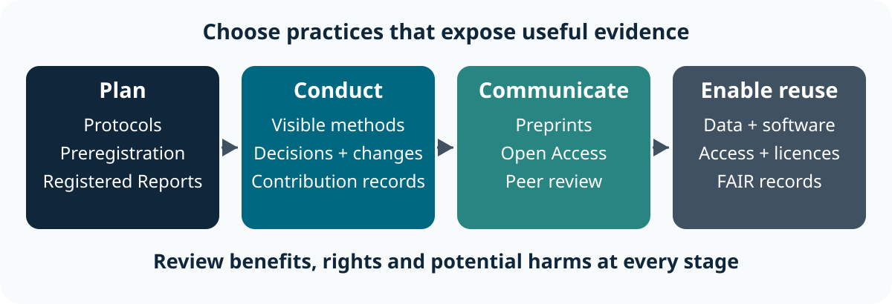
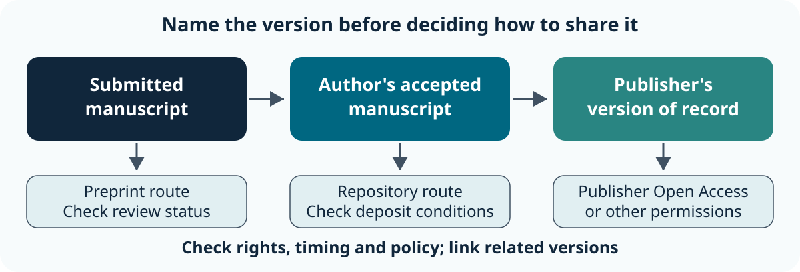
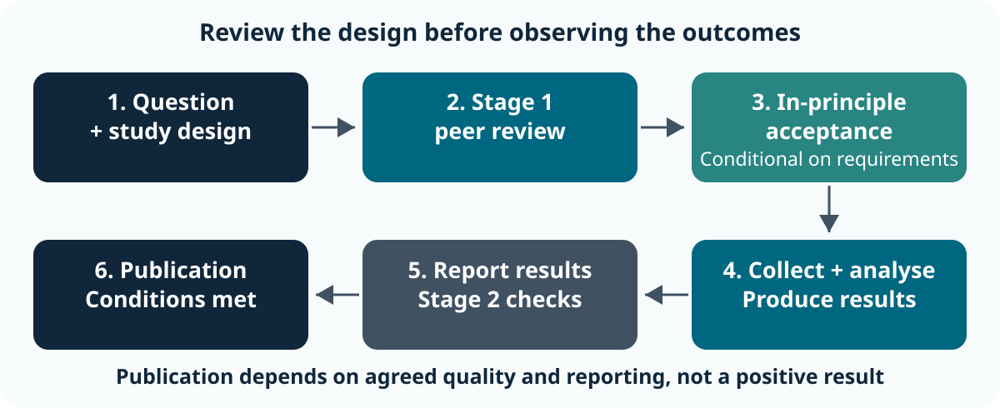
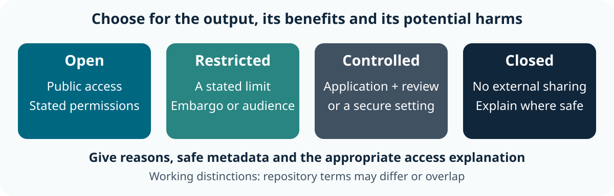

::: callout-outcomes
## 💡 Learning Outcomes

- Select an Open Access route and identify the version, permissions and policy checks it needs.
- Distinguish exploration, preregistration and Registered Reports using the timing of research decisions.
- Describe methods, deviations and contributions so others can evaluate the work.
- Choose an access arrangement that accounts for benefits, rights and potential harms.
- Produce and justify an Open Research strategy that also makes outputs more FAIR.
:::

::: callout-questions
## ❓ Questions

1. Which parts of a research process can we make transparent, and when?
2. What do publication routes and research plans actually tell a reader?
3. What should be shared, what needs protection, and who makes that decision?
:::

## Structure & Agenda

| Block | Teaching | Activity | What learners keep |
|---|---:|---:|---|
| What is Open Research? | 6 min | 2 min | One practice matched to a project need |
| Open Access and publication | 8 min | 6 min | A publication route and checks |
| Preprints and early sharing | 5 min | 3 min | A sharing decision and status statement |
| Preregistration | 8 min | 6 min | A more specific prospective plan |
| Registered Reports | 7 min | 3 min | A corrected publication decision |
| Open methods and reporting | 7 min | 3 min | A transparent methods statement |
| Credit and attribution | 5 min | 3 min | A contribution statement to confirm |
| Responsible openness | 4 min | 6 min | Access decisions for different outputs |
| Open Research strategy | 0 min | 13 min | A justified nine-part project strategy |
| Review | 5 min | 0 min | One next action |
| **Total** | **55 min** | **45 min** | **100 min overall** |

> Activities include the room response and immediate debrief. Active learning occupies 45% of the lesson. Breaks are additional to these 100 minutes; agree them with the group before starting.

## Starting Point and Preparation

Begin with [FAIR Research Outputs](01-fair_research_outputs.qmd): making an output discoverable and usable does not require unrestricted access.

- **Materials:** the fictional [scenario pack](../learners/scenarios.qmd) and [Open Research strategy worksheet](../learners/files/open-research-strategy.md). No research findings or identifiers in the scenarios are real.
- **Tools:** a browser and a way to write notes. No accounts, coding or live publication are required.
- **Working arrangement:** pairs; take turns proposing a decision and checking the justification.
- **Access fallback:** use a printed worksheet or the examples on screen. Record decisions on paper.

# What is Open Research? (8 min)

## Connect the Process and Its Outputs

**FAIR:** can people and systems find, obtain, interpret and reuse the outputs?

**Open Research:** how can the process and outputs be made more transparent, accessible and useful to others?

An openly available article may still leave its methods unclear. A controlled clinical dataset can have strong FAIR metadata and a transparent access process. Combine the questions when deciding how to communicate the work.

[UoN's Open Research overview](https://www.nottingham.ac.uk/research/open-research/open-research.aspx) connects publications, data, protocols and software across the research process.

## Practices Across a Project

{fig-alt="Before a study, make plans and protocols transparent. During the study, record methods, decisions and contributions. During communication, consider preprints, Open Access and peer review. For reuse, provide appropriate data and software access, licences and FAIR records. Review benefits and harms at every stage." fig-align="center" width="95%"}

Open Research includes **preregistration, Registered Reports, open protocols, transparent reporting, preprints, Open Access, open peer review, open data and open software**. Different projects can use different combinations.

> **As open as possible, as restricted as necessary.** Make the reason for a restriction understandable wherever it is safe to do so.

## Task 1: Choose a Useful Practice (2 min)

::: callout-task
**Goal:** connect one practice with a research need. **Input:** these fictional project needs; work in pairs.

::: panel-tabset
##### Do the Task

1. **1 min:** each partner chooses a different need: a historian wants readers to inspect transcription decisions; an engineer wants readers to distinguish a planned test from later exploration. Name one helpful practice and the evidence it would expose.
2. **1 min:** the instructor asks for one answer for each need. Compare the answers with the debrief.

**Keep:** “We would use ___ so another researcher could inspect ___.” **If access fails:** use the two needs shown here.

##### Debrief

- **Ask the room:** “What would someone be able to check after your change?”
- **Reasoning:** open transcription methods would expose editorial and OCR decisions; a prospective plan and clear reporting would separate planned testing from exploration.
- **Check:** simply making an article downloadable does not answer either question. A useful practice exposes the particular evidence a reader needs.
:::
:::

# Open Access and Publication (14 min)

## Choose a Route, Then Check the Conditions

Open Access makes scholarly publications available online without a reader subscription barrier. Permissions for reuse depend on the licence and rights attached to the material.

| Route | How the work becomes available | What to check |
|---|---|---|
| **Green** | Deposit an appropriate manuscript version in an institutional or subject repository | Version, rights retention, licence and any applicable embargo |
| **Gold** | The publisher makes the published article openly available | Licence, charges and whether funding or an agreement covers them |
| **Diamond** | The journal or platform charges neither authors nor readers | Scope, review standards, licence and suitability for the audience |

Gold can involve an article processing charge (APC); it does not always do so. Diamond describes a funding model, not a guarantee of quality. See [UoN's routes to Open Access](https://www.nottingham.ac.uk/library/research/open-access/basics/index.aspx) and [Science Europe's Diamond definition](https://www.scienceeurope.org/our-priorities/open-science/diamond-open-access/).

## Identify the Version You Are Sharing

{fig-alt="A submitted manuscript can become a preprint before acceptance. After peer review, the author's accepted manuscript can be deposited through an appropriate repository route. The publisher's version of record can be shared under its Open Access or other permissions. Each version needs its status, permissions and link to related versions checked." fig-align="center" width="95%"}

The **author's accepted manuscript** contains the agreed peer-review changes, before the publisher's final layout. The **version of record** is the published version. A preprint is an earlier public manuscript; it is not automatically a substitute for a required accepted-manuscript deposit.

Check [UoN's current policy and rights retention guidance](https://www.nottingham.ac.uk/library/research/open-access/policy.aspx), then follow the [RIS deposit guidance](https://www.nottingham.ac.uk/library/research/open-access/depositing-output.aspx). Check the rules for the actual output, affiliation and funding rather than assuming every publication has identical requirements.

## Permissions, Costs and Requirements

Before submitting, identify:

1. **Version and timing:** what must be deposited, where and when?
2. **Permissions:** what licence is required, and which third-party elements are excluded?
3. **Costs:** is there an APC, and has support been confirmed before a commitment?
4. **Requirements:** do the chosen journal and route meet institutional and funder conditions?

Creative Commons licences state reuse permissions. For example, **CC BY 4.0** allows sharing and adaptation with attribution and its other conditions; it does not remove third-party privacy or copyright constraints. Check the [licence conditions](https://creativecommons.org/licenses/by/4.0/) and the rights you hold.

For a UKRI-funded output, consult the [current UKRI Open Access policy](https://www.ukri.org/publications/ukri-open-access-policy/). Ask the [UoN Open Access team](https://www.nottingham.ac.uk/library/research/open-access/index.aspx) about uncertain routes, rights retention or funding.

## Task 2: Advise Three Research Teams (6 min)

::: callout-task
**Goal:** identify a plausible Open Access route and its unresolved check. **Input:** fictional scenarios below; pairs record one sentence per scenario.

These scenarios imagine possible publication stages. The integrated Urban Shade project used in the final exercise is still being planned.

| Scenario | Information supplied |
|---|---|
| Urban Shade article | The authors have an accepted manuscript. Their chosen journal charges an APC that the project cannot cover. Deposit permissions and policy alignment need checking. |
| Market Letters article | A relevant Diamond journal has no reader or author charges. The article includes archival images with separate rights. |
| Watershed Patterns article | A fully Open Access journal offers a CC BY article for an APC. An author believes an institutional agreement will pay, but has not checked eligibility. |

::: panel-tabset
##### Do the Task

1. **2 min:** choose a plausible route for each scenario; identify the version it would make available.
2. **2 min:** write one question to resolve before committing to each route. Mark guesses explicitly.
3. **2 min:** three pairs each report one route and check. The room votes “ready” or “needs a check”; the instructor gives the debrief.

**Keep:** your three route/check sentences; transfer the Urban Shade decision to the strategy worksheet. **If access fails:** the table supplies all activity inputs; no live policy lookup is necessary.

##### Debrief

- **Urban Shade:** investigate Green deposit and rights retention for the accepted manuscript. Lack of an APC budget does not establish that the work must remain inaccessible. Confirm the actual version, timing and licence requirements.
- **Market Letters:** Diamond is plausible if the journal suits the work. Confirm image permissions, or use a permitted substitute or clearly scoped exclusion; the article's licence cannot grant rights the authors do not hold.
- **Watershed Patterns:** Gold is plausible, but check agreement eligibility, licence and funding before accepting a charge.
- **Reusable check:** a plausible route becomes a defensible choice when the version, permissions, requirements and payment position are established.
:::
:::

# Preprints and Early Sharing (8 min)

## Share Early with an Accurate Status

A preprint is a public scholarly manuscript shared before journal acceptance, typically before formal journal peer review. It can provide a dated public record, invite feedback and make work available sooner. Feedback is possible, not assured.

Check disciplinary server scope and journal policy. Keep the manuscript's **version, date and review status** visible; connect it to later versions and the published article. Server screening does not establish that the findings have been peer reviewed. Earlier versions may remain available.

See [ASAPbio's preprint guidance](https://asapbio.org/about/faq/preprint-faq/) for benefits, versions and communication concerns. The examples there focus on life sciences; choose a service appropriate to your discipline.

## Early Sharing Needs a Decision

**Fictional examples:** an engineering method may benefit from early technical feedback; a humanities argument may benefit from disciplinary discussion. An Urban Shade draft containing identifying recruitment details needs a permissions and disclosure review first.

Before posting, agree the decision with co-authors and check participant protections, third-party material and any commercialisation obligations. A public preprint can be copied and read beyond its intended audience.

**Clear status statement:** “Preprint, version 1, dated [actual date]. This manuscript has not undergone journal peer review. Findings are preliminary; see the methods and limitations.” Change the statement if review has occurred, and link the evidence of that review.

## Task 3: Release Now, Revise First or Wait? (3 min)

::: callout-task
**Goal:** make an early-sharing decision with a reason. **Input:** fictional Urban Shade draft: preliminary results from the old sensor measurements, identifying worker recruitment details with a workplace location, co-author approval still pending. The new interviews have not taken place. Work in pairs.

::: panel-tabset
##### Do the Task

1. **1 min:** decide whether to release now, revise first or wait. Name the issue your decision addresses.
2. **1 min:** write a status statement and a condition that must be met before release.
3. **1 min:** show the room your choice with one, two or three fingers. Two pairs explain; the instructor debriefs.

**Keep:** the decision, release condition and status statement in the worksheet. **If access fails:** use the draft description here.

##### Debrief

- **Reasoning:** revise first or wait while permissions and co-author agreement are resolved. Removing a name alone may leave a worker identifiable through location and recruitment details.
- **Status check:** “not journal peer reviewed” describes review status; “preliminary” does not make a disclosure safe or establish correctness.
- **Alternative:** a cleared sensor-only account might be shared earlier if it accurately describes its narrower scope and meets the relevant checks.
:::
:::

# Preregistration (14 min)

## Separate Discovery from a Prospective Test

**Exploration** uses observations to develop questions, interpretations or candidate explanations. **Confirmation** tests a question using decisions made before examining the relevant outcomes.

Preregistration creates a dated record of the intended study and analysis. It helps readers see which decisions preceded outcome knowledge; it does not certify the quality of the design or prohibit useful new analyses. See the [Center for Open Science introduction](https://www.cos.io/initiatives/prereg).

**Urban Shade:** the team explored old environmental measurements and noticed a possible shade effect. That observation remains exploratory. They can plan a new test using future measurements; registering now cannot turn the already observed pattern into a prospective finding.

## Specify Decisions that Affect the Answer

| Plan component | A reader needs to know |
|---|---|
| Question and hypothesis | What claim will be tested, and in which direction if relevant? |
| Outcome | What will be measured, with which units and time window? |
| Eligibility and exclusions | Which sites or observations count, and when are they excluded? |
| Collection and analysis | Sampling or stopping rule, comparison, model and decision criteria |
| Contingencies | What happens if equipment fails or assumptions cannot be met? |

Use an appropriate disciplinary template. Disclose previous access to existing data when relevant. A qualitative exploration may need a transparent evolving protocol rather than a fixed hypothesis test; a prospective qualitative design can also document its planned approach.

## Report What Changed and Why

Plans can change for good reasons. Keep the original plan identifiable and report the change, its timing, reason and whether outcomes were already known.

**Fictional worked example:** a sensor fails. The team reports the planned eligibility rule, the failure, the affected measurements, its replacement decision and any additional analysis. It separates the planned test from a new exploratory comparison instead of silently rewriting the plan.

Choose registration and visibility arrangements that suit the project; public registration is not the only available arrangement. Methods are not exempt from sensitivity checks. See [COS's guidance on choosing a template](https://www.cos.io/blog/choosing-preregistration-template-guide-for-researchers).

## Task 4: Improve a Vague Plan (6 min)

::: callout-task
**Goal:** make a future test sufficiently specific to discuss with the research team. **Input:** fictional Urban Shade proposal: “We will compare shaded and unshaded places during hot weather, remove bad readings and see if shade helps.” No new measurements have yet been collected. Work in pairs.

::: panel-tabset
##### Do the Task

1. **1 min:** underline three phrases that allow important decisions to change after seeing results.
2. **3 min:** draft the outcome and units, site/time eligibility, one exclusion rule and the intended comparison. Mark any scientific threshold as **proposed for discussion**, not an established fact.
3. **2 min:** two pairs report one ambiguity and its revision. The instructor asks, “Could a second researcher apply that rule without seeing the result first?” and debriefs.

**Keep:** the draft plan and one unresolved design question in the worksheet. **If access fails:** annotate the quoted proposal on paper.

##### Debrief

- **More specific proposal:** compare daily peak temperature in °C between preselected shaded and unshaded sites, within a predetermined observation window; state site selection, matching and the analysis before collection.
- **Exclusions:** define how a malfunction is detected independently of whether the result favours the hypothesis. Agree the exact rule and contingency with relevant expertise.
- **Unresolved:** observation alone may not support a causal claim because sites can differ in other ways. A specific plan still needs a defensible design.
- **Check:** retain the earlier exploratory observation and label it accurately; do not present it as a preregistered confirmation.
:::
:::

# Registered Reports (10 min)

## Review the Design Before Outcomes

{fig-alt="A research question and study design undergo Stage 1 peer review before outcomes are observed. If approved, in-principle acceptance precedes collection and analysis. A Stage 2 report presents all relevant results and undergoes checks against the approved protocol before publication. Publication remains conditional on meeting the journal's requirements, rather than whether the result is positive." fig-align="center" width="95%"}

A Registered Report is a publication format, rather than simply a registered plan. Stage 1 review assesses the question and methods; **in-principle acceptance** is conditional. Stage 2 examines adherence, quality and reporting, including deviations and additional exploration.

The approach addresses publication decisions that depend on obtaining a striking or positive result. It does not guarantee acceptance regardless of how the study is conducted. Check the [COS workflow](https://www.cos.io/initiatives/registered-reports) and the chosen journal's requirements.

## Decide Whether the Format Fits

| Arrangement | What happens before relevant outcomes are examined? |
|---|---|
| Prospective preregistration | Researchers record their plan; journal review is not inherent |
| Registered Report | The journal reviews the design and may offer conditional in-principle acceptance |
| Ordinary article | Journal review usually evaluates a report including results |

Registered Reports require a suitable outlet, time for review and a design compatible with its requirements. Standard prospective formats do not fit a completed analysis that has already revealed the outcomes. Some outlets offer variants for existing data: check their rules rather than assuming eligibility.

## Task 5: Correct a Colleague's Claim (3 min)

::: callout-task
**Goal:** explain what a Registered Report changes. **Input:** a fictional message imagining a later, completed Urban Shade study: “We found no shade effect. Let's register the completed study now; the journal will have to publish it.” Work in pairs.

::: panel-tabset
##### Do the Task

1. **1 min:** identify the timing error and the incorrect claim about acceptance.
2. **1 min:** write a two-sentence reply with one constructive route forward.
3. **1 min:** one pair reads its reply. The room names a condition missing from the colleague's claim; the instructor debriefs.

**Keep:** the corrected explanation. **If access fails:** use the message on screen.

##### Debrief

- **Correction:** a completed analysis cannot retrospectively meet the standard prospective Stage 1 process. In-principle acceptance depends on prior design review and subsequent conditions.
- **Next step:** report the completed null finding transparently through a suitable ordinary publication route; consider a Registered Report for a new prospective study if an outlet fits.
- **Check:** ask when the plan was reviewed relative to knowledge of the outcomes.
:::
:::

# Open Methods and Transparent Reporting (10 min)

## Make the Reasoning Inspectable

Share a protocol or method description with enough context to evaluate what was done:

- sampling, materials and measures;
- analytical decisions and their rationale;
- departures from the plan and when they arose;
- which analyses were exploratory and which were planned;
- null, negative and uncertain findings, with their limitations;
- supplementary methodological detail linked to the relevant output.

**Market Letters:** document how OCR errors were corrected and editorial additions marked. **Watershed Patterns:** describe the workflow, input assumptions and software versions a reader needs to interpret the result. Technical implementation belongs in specialist software teaching.

## Report Computational and AI Contributions

**Weak fictional statement:** “The data were cleaned and AI helped with analysis.”

**More informative fictional statement:** “We applied the stated sensor exclusion rule. A named AI tool suggested an explanation of the error messages; a researcher checked each proposed change against the documented rule. No participant material was submitted. The additional location comparison was exploratory.”

For actual work, record the tool/model and available version or date, task, permitted input boundary, checks and substantive changes. Explain limitations and follow relevant disclosure requirements. A tool name alone does not explain a method.

Continue with [Responsible Use of Generative AI](../../responsible_use_of_generative_ai/index.qmd) for deeper practice in verification and documentation.

## Open Peer Review Has Several Forms

| Feature | What becomes visible? |
|---|---|
| Open reports | Review reports and sometimes author responses |
| Open identities | Reviewer and author identities, according to the outlet's policy |
| Open participation | Contributions from a wider community, with stated moderation or review arrangements |

These features can be combined independently; publishing reports does not necessarily reveal identities. Inspect the policy and evidence of review. Public comments do not automatically establish expert assessment or editorial endorsement.

The [Ross-Hellauer review of open peer review](https://pmc.ncbi.nlm.nih.gov/articles/PMC5437951/) explains these distinct features. Consider accountability benefits alongside reviewer consent, confidentiality and the effects of power differences. Open review still needs sound judgement and clear rules.

## Task 6: Repair a Methods Statement (3 min)

::: callout-task
**Goal:** reveal a decision hidden by vague reporting. **Input:** fictional Urban Shade sentence: “We removed unsuitable sites and performed further tests until the pattern was clear.” Work in pairs.

::: panel-tabset
##### Do the Task

1. **1 min:** list two pieces of missing information a reader needs.
2. **1 min:** rewrite the sentence using placeholders for unknown facts; identify any exploratory analysis explicitly.
3. **1 min:** two pairs read one revision. The instructor checks whether invented facts have been distinguished from missing evidence and debriefs.

**Keep:** the revised statement and the facts to obtain from the team. **If access fails:** annotate the sentence here.

##### Debrief

- **Reasoning:** identify the actual exclusion rule, sites affected, reason and timing; describe all relevant tests and why they were undertaken.
- **Example scaffold:** “We excluded [sites] using [rule and reason], decided [before/after outcome inspection]. We additionally explored [comparison]; this was not in the original plan.”
- **Check:** do not invent a tidy prospective rule. Transparent reporting makes uncertainty and deviations visible instead of concealing them.
:::
:::

# Credit, Contribution and Attribution (8 min)

## Agree Credit Before Submission

Contributions include design, collection, curation, analysis, software, methods, interpretation, writing and support. An author list alone can hide who did which work.

The [NISO CRediT taxonomy](https://credit.niso.org/contributor-roles-defined/) provides 14 roles for describing contributions. One person can hold several roles and several people can share a role. **CRediT does not determine authorship or author order.** Agree these separately using applicable disciplinary, institutional and journal criteria; give contributors an opportunity to confirm their statements.

Use an [ORCID iD](https://info.orcid.org/researchers/) to identify a person. Use output identifiers and citations to credit the particular article, dataset, software release or protocol used. An ORCID iD does not identify the dataset itself.

## Cite the Output You Used

Prefer the output's recommended citation. Include its creators, title, year, repository or publisher, identifier and the specific version when relevant.

**Fictional citation scaffold:** “Urban Shade project team. [year]. Urban Shade sensor measurements, [version]. [repository]. [assigned persistent identifier].” The brackets show information still to supply, not a real reference.

Credit the software or dataset directly as well as an associated paper where relevant. Acknowledgements can recognise technical or community contributions, subject to agreement; they do not replace appropriate authorship or a contribution statement.

## Task 7: Make Contributions Visible (3 min)

::: callout-task
**Goal:** draft accurate roles without guessing authorship. **Input:** fictional Urban Shade contributors; work in pairs.

For this activity, imagine the project after collection and analysis. The table describes completed contributions at that later stage; confirm actual roles as the project progresses.

| Contributor | Work described |
|---|---|
| Maya | Formulated the question and designed the comparison |
| Joel | Collected sensor observations and checked their quality |
| Priya | Developed the analysis method and wrote the analysis script |
| Alex | Coordinated community contact, conducted interviews and curated the records |
| Sam (supervisor) | Obtained funding and supervised the project |

::: panel-tabset
##### Do the Task

1. **1 min:** assign plausible contribution roles to two people; include a methodological or technical contribution.
2. **1 min:** write what needs confirmation before the statement is submitted.
3. **1 min:** two pairs report. The room identifies a contribution an author list could miss; the instructor debriefs.

**Keep:** the draft roles and confirmation step in the worksheet. **If access fails:** use the descriptions here rather than a live taxonomy lookup.

##### Debrief

- **Plausible roles:** Maya: Conceptualization and Methodology; Joel: Investigation and Validation; Priya: Methodology, Software and Formal analysis; Alex: Investigation and Data curation; Sam: Funding acquisition and Supervision.
- **Confirmation:** ask each person whether the description reflects the work they actually did; additional roles may emerge.
- **Boundary:** these roles alone do not establish who qualifies as an author or their order. Discuss applicable authorship criteria and contribution statements separately.
:::
:::

# Responsible Openness (10 min)

## Choose Access for Each Output

{fig-alt="Open outputs are available publicly; restricted outputs have a stated limit such as an embargo or defined audience; controlled outputs require an application, eligibility check or secure access; closed outputs are not externally shared. These are teaching distinctions, and repository terms can differ. Each arrangement should have a justified reason, safe metadata and a review or access explanation where appropriate." fig-align="center" width="95%"}

These are **working distinctions for the lesson**; repositories may use different or overlapping terms. A restricted output may also be controlled.

An appropriate arrangement depends on the output and context: participant confidentiality, commercial or intellectual-property obligations, security or dual-use risks, vulnerable groups, cultural permissions, sensitive ecological locations and third-party agreements can all matter.

## Balance Benefits and Potential Harms

Ask who benefits from disclosure, who could be harmed and whether a useful safer output can be provided. “Remove the names” is not a complete disclosure assessment; location, quotations and combinations of attributes can still identify people.

Consider a redacted protocol, appropriately assessed aggregate data or a controlled-access process with public metadata. Restrictions do not prevent describing the research honestly, but metadata can also need protection.

Use relevant ethics, data protection, community, information security and intellectual-property advice where the decision requires it. The [UKRI Open Research resource hub](https://www.ukri.org/manage-your-award/good-research-resource-hub/open-research/) signposts guidance. Keep routine management detail in [Essential Digital Skills RDM](../../essential_digital_skills/episodes/04-research_data_managment.qmd).

## Task 8: Set Access and Explain It (6 min)

::: callout-task
**Goal:** choose defensible access arrangements with benefits and harms in view. **Input:** planned fictional Urban Shade outputs; make prospective decisions in pairs.

| Output | Relevant constraint |
|---|---|
| Sensor summary by broad public area | Disclosure and quality assessment still needed; potential reuse for urban planning |
| Worker interview transcripts and exact work/home coordinates | Includes potentially vulnerable participants; consent limits onward sharing |
| Protocol and blank interview questions | Can support evaluation; operational details may reveal protected sites |
| Third-party map images | The project's agreement does not grant public redistribution |

::: panel-tabset
##### Do the Task

1. **2 min:** give each output a proposed arrangement: open, restricted, controlled or closed. Write the reason and what still needs checking.
2. **2 min:** select one safer shareable alternative and one access or restriction statement. Do not assume a new data-use agreement can override the original consent limits.
3. **2 min:** the room votes on the transcripts. Two pairs defend their choice; the instructor compares it with the debrief.

**Keep:** the four decisions, safer alternative and unresolved check in the worksheet. **If access fails:** use this table; no real data are involved.

##### Debrief

- **Summary:** potentially open after a suitable assessment; broad aggregation alone is not proof that disclosure risk is resolved.
- **Transcripts/coordinates:** closed to external reuse if no permissible onward sharing exists. Controlled access is an option only if consent, other permissions and governance allow the proposed use.
- **Protocol:** consider an open version with justified redactions. Explain methods sufficiently without exposing protected operational details.
- **Images:** do not redistribute beyond the agreement. Link to the lawful source or provide a permitted alternative.
- **Statement scaffold:** “The raw interviews are not publicly shared because [safe explanation]. [Permissible summary or access route] is available at [actual record].” Good metadata must also avoid disclosing protected details.
:::
:::

# Design an Open Research Strategy (13 min)

## Task 9: Bring the Decisions Together (13 min)

::: callout-task
**Goal:** produce a coherent project strategy with justified choices. **Input:** [Urban Shade integrated project](../learners/scenarios.qmd) and your [strategy worksheet](../learners/files/open-research-strategy.md). Work in pairs and reuse decisions from Tasks 2–8.

The project combines an exploratory observation from old sensor measurements, a proposed future shade comparison, consent-limited interviews, an article draft, an analysis script, a protocol, third-party maps and several contributors. Precise locations can identify participants. There is no requirement to maximise public disclosure.

::: panel-tabset
##### Do the Task

1. **2 min:** read the integrated case and transfer existing decisions. Identify one decision that needs revising because it conflicts with another.
2. **5 min:** complete or refine all nine decisions below. For each, write a reason and a necessary check. Use “pending” when evidence is missing.
3. **3 min:** exchange plans with a neighbouring pair. They challenge one disclosure decision and one claim about planning, publication or reuse. Revise or defend your choices.
4. **3 min:** two pairs report their most consequential choice and its reason. The instructor uses the debrief to compare the plans; everyone records one next action and owner.

**Keep:** the completed strategy, one peer challenge, and a named next action. **If access fails:** draw nine numbered rows on paper using the decisions below; use the case summary on screen.

##### Debrief

- **Coherence:** a public article does not require unrestricted interviews. A licence for original text does not grant rights in map images. The old exploratory pattern stays exploratory even if the future study is preregistered.
- **Practicality:** every “share” decision needs a suitable destination, rights check and useful context; every restriction needs a reason and a safe explanation or lawful access route where possible.
- **Acceptable alternatives:** Green, Gold or Diamond can each work if their actual conditions fit. Early sharing can happen after necessary checks or be deferred with a reason. A prospective study can use preregistration or an eligible Registered Report; these are separate choices.
- **FAIR connection:** retain descriptive records, identifiers, relevant standards, provenance, version and citation information. Restricted outputs can still be discoverable and have a clear permitted access process.
- **Assessment:** look for a justified decision for every row, accurate distinctions and realistic next checks. A plan with more public outputs is not automatically better.
:::
:::

## Nine Decisions to Record

| Decision | What the strategy must say |
|---|---|
| **Publication** | Which Open Access route, manuscript version and requirements check? |
| **Preprint** | Yes, no or later; which release checks and status statement? |
| **Study design** | What remains exploratory; what will be planned prospectively; preregistration or an eligible Registered Report? |
| **Methods** | Which protocol, decisions, deviations and limitations will be visible? |
| **Data** | Access for each output, benefits/harms and any permitted safer alternative |
| **Analysis/code** | Whether the script can be shared; necessary input, method, dependency and rights context |
| **Licence** | Permissions for each eligible output; third-party exclusions; a suitable software licence for code |
| **Contributions** | Roles to confirm, authorship discussion, ORCID iDs and output citations |
| **Metadata/PIDs** | Descriptive records, links between outputs, appropriate identifiers, standards, provenance and versions |

Apply licences only where the rightsholder can grant the permissions. Creative Commons advises using [software licences for software](https://creativecommons.org/faq/#can-i-apply-a-creative-commons-license-to-software), rather than treating every output as the same kind of work.

# Review (5 min)

## Check the Distinctions

| Claim | Correction |
|---|---|
| “Our article is Open Access, so the whole project is open.” | Open Access is one component; inspect methods and other outputs separately. |
| “Preregistration means we cannot change anything.” | Report justified changes and distinguish them from the original plan. |
| “Registered Reports guarantee publication of any completed work.” | Design review precedes relevant outcomes; acceptance remains conditional. |
| “A DOI and CC BY allow public release of interviews.” | Identifiers and licences do not establish permission to disclose participants' information. |

The instructor reviews the plans against these distinctions and highlights one example of a well-justified restriction and one worthwhile improvement to transparency.

::: callout-keypoints
## 📚 Key Points

- Make deliberate choices about transparency, access and reuse for each part of the project.
- Keep the timing of research decisions and the status of each publication visible.
- Explain methods, changes, limitations and contributions so readers can evaluate the work.
- Choose openness with benefits, rights and potential harms in view; retain FAIR context wherever appropriate.
:::

## Module Summary

You have drafted an Open Research strategy covering publication, early sharing, design, methods, data, code, licences, credit and FAIR records. Good Open Research depends on deliberate, transparent and responsible decisions about communication, access and reuse.

**Next-week action:** take one pending decision from the worksheet, identify the colleague or support service needed, and obtain the information that turns it into an agreed action.

## Additional Learning

| Resource | Use it when |
|---|---|
| [UoN Open Research](https://www.nottingham.ac.uk/research/open-research/open-research.aspx) | Connecting publication, protocols and other research outputs |
| [UoN Open Access support](https://www.nottingham.ac.uk/library/research/open-access/index.aspx) | Checking a publication route, deposit, rights retention or funding |
| [COS preregistration](https://www.cos.io/initiatives/prereg) and [Registered Reports](https://www.cos.io/initiatives/registered-reports) | Choosing a prospective planning or publication approach |
| [CRediT role definitions](https://credit.niso.org/contributor-roles-defined/) | Agreeing and checking contribution statements |
| [Responsible Use of Generative AI](../../responsible_use_of_generative_ai/index.qmd) | Evaluating and documenting AI-assisted research work |
| [Course additional material](../learners/additional_material.qmd) | Continuing with worked decisions and reusable resources |

## Course Navigation

[Course Overview](../index.qmd) · [FAIR Research Outputs](01-fair_research_outputs.qmd) · [Scenario Pack](../learners/scenarios.qmd) · [Reference](../learners/reference.qmd) · [Discussion](../learners/discuss.qmd)
