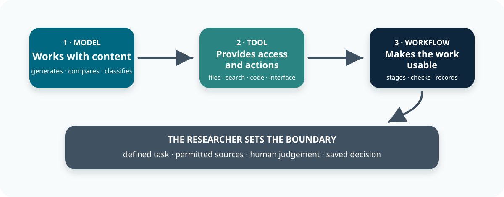
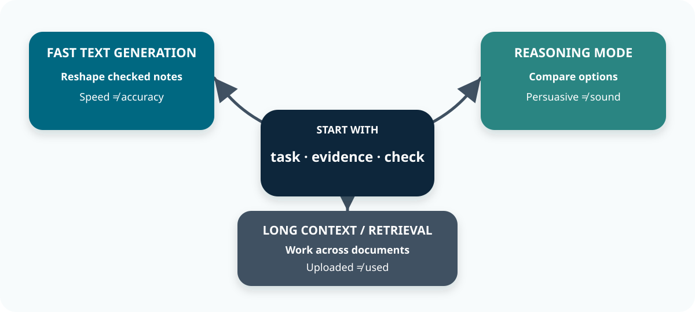
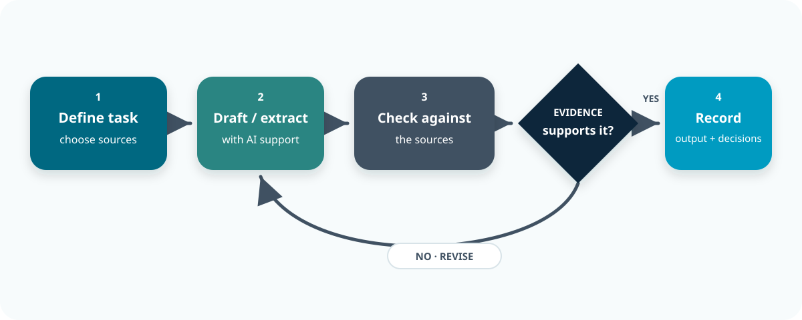
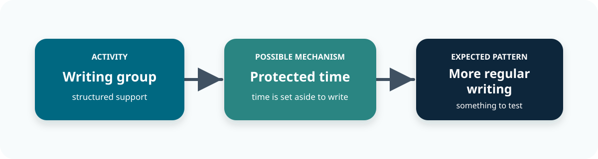
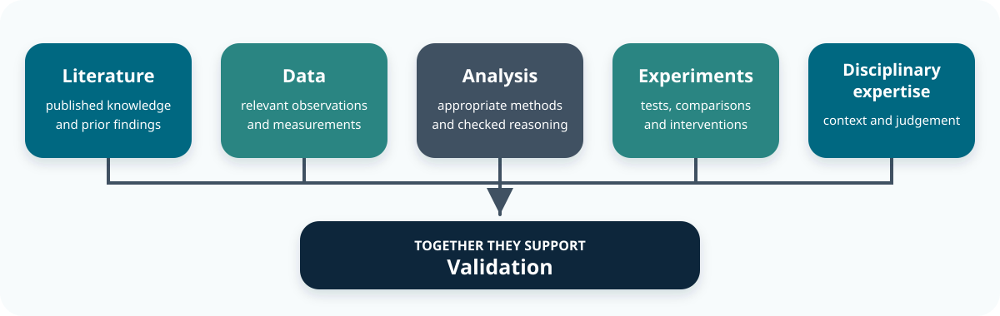
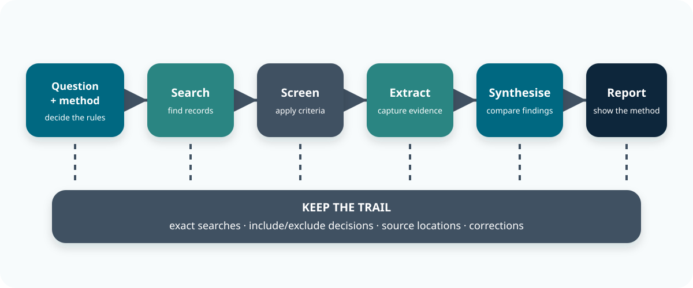
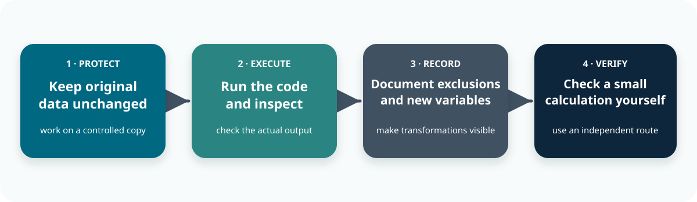
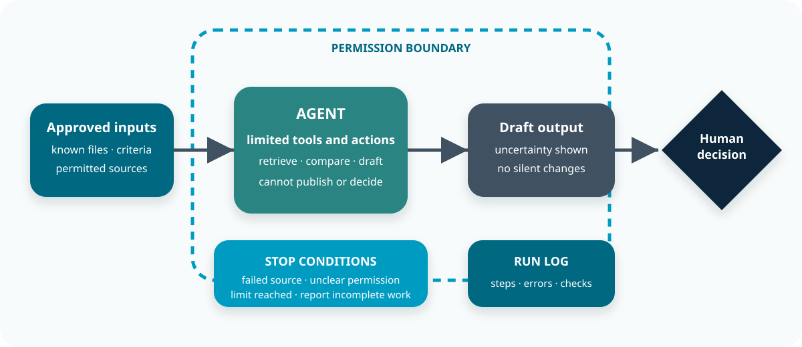

::: callout-outcomes

## 💡 Learning Outcomes

By the end of this module, learners will be able to:

- Choose an AI approach that fits a research task.
- Turn a request into a clear workflow with labelled sources.
- Judge where AI may help with reviews, study design, analysis, writing, automation and grants.

:::

::: callout-questions

## ❓ Questions

1. What are we asking AI to do, and what evidence can it actually see?
2. How will we check the answer and show how it was produced?
3. Which decisions still require a researcher's judgement?

:::

## Outline

This workshop builds on [Introduction to AI for Research](01-Introduction_to_AI_for_research.qmd) and [Prompting for Research](02-Prompting_for_research.qmd). It assumes familiarity with basic prompting and source checking; no programming background is required.

| Block | Approximate time |
|---|---:|
| Opening and framing | 10 min |
| Choosing tools and approaches | 10 min |
| Building inspectable workflows | 10 min |
| Working across the research lifecycle | 10 min |
| Literature reviews | 20 min |
| Qualitative and quantitative analysis | 20 min |
| Agents and research automation | 10 min |
| Grant applications | 10 min |
| Research integrity, action and close | 20 min |

# The Current AI Landscape for Academic Research

## Three Layers of an AI-Assisted Task

- A **model** is the underlying AI that generates or interprets content.
- A **tool** is the product around it: the interface, files, search or code execution.
- A **workflow** is the plan that connects the tool to a research task, human checks and a decision.

The same model can behave differently when the available sources, tools or instructions change.

> 🧭 Start with the task, the permitted inputs and the checks you can perform.

## From Model to Research Workflow

{fig-alt="Three layers of AI-assisted research: the model works with content, the tool provides access and actions, and the workflow adds the task, checks and human decision." fig-align="center" width="88%"}

## A Product Is More Than Its Model

The product name tells you very little about whether they are sutible to use for research processes.

ChatGPT, [Claude](https://claude.com/product/overview), [Gemini](https://ai.google.dev/gemini-api/docs/models) and [Microsoft Copilot Chat](https://learn.microsoft.com/en-us/copilot/overview) are products or interfaces. A product may offer several models, choose one automatically and add abilities such as web search, document reading or code execution.

GPT, Claude, Gemini and [Mistral](https://docs.mistral.ai/models) are families of models. Where the information is visible, record both the **product or service** and the **model and version**.

> Match the Tool to the Task: These are starting points, not performance rankings. 

## Tools

| Tool Function | Research Task | Possible Starting Point |
|---|---|---|
| Discovery and search | Refine a question or critique a draft | A general assistant such as Claude, Gemini or an approved Copilot service |
| Discovery and search | Explore a topic or public guidance | Web search with an assistant such as [Perplexity](https://www.perplexity.ai/help-center/en/articles/10352155-what-is-perplexity) |
| Discovery and search | Find papers from a research question | [Elicit](https://elicit.com/) or [Consensus](https://help.consensus.app/en/articles/9922660-how-to-search-best-practices), alongside disciplinary databases |
| Citation connections | Explore related papers | [ResearchRabbit](https://www.researchrabbit.ai/) or [Litmaps](https://www.litmaps.com/) |
| Citation connections | Examine how a paper is cited | [Scite](https://scite.ai/) |
| Document evidence | Ask across a selected collection | Google's [source notebooks](https://support.google.com/gemininotebook/answer/16206563?hl=en), known as NotebookLM and now described as Gemini Notebook; approved document assistants |
| Document evidence | Extract fields across papers | [Elicit's extraction workflows](https://elicit.com/) or a structured prompt over approved PDFs |
| Data and code | Work with interview text | An approved assistant or [MAXQDA AI Assist](https://www.maxqda.com/products/ai-assist) |
| Data and code | Develop code and visualisations | [GitHub Copilot](https://docs.github.com/en/copilot/get-started/what-is-github-copilot) or an approved coding assistant |

## Choose Tools based on capabilities, Not Labels

{fig-alt="The task, evidence and planned check guide the choice between fast text generation, reasoning-oriented modes, and large-context or retrieval tools. Each capability has a practical limitation." fig-align="center" width="86%"}

## Verify the Tool is appropriate for the Task

Different tools and models have different strengths. **Do not assume a capability: verify it.**

- Some models are better at **reasoning, coding, images, or long documents** than others.
- Check that the tool can **actually perform the task you need**.
- Verify important outputs rather than relying on the model's description of its own capabilities.
- For hosted or open-weight models, also check **where data is processed, licensing, logging and external connections**.

**Choose the tool for the task, then verify the result.**

## A Small Evaluation Beats a General AI Rankings

Compare candidate tools on the **same permitted material**. Include a straightforward case, an ambiguous case and a question the sources cannot answer.

- Can you trace claims to source passages or executed calculations?
- Does the tool preserve uncertainty, contrary evidence and missing values?
- Can you export the inputs, prompts, outputs and corrections?
- What are the total time, cost and checking effort?

> 🔎 Agreement between two AI tools is a reason to check the evidence, not independent confirmation of a finding.

## Discussion Pause 1: Choose an Approach {background-color="#2b2b2b"}

::: callout-task

::: panel-tabset

##### Discussion

When evaluating which tool is best for a sepecific task what approach would you use? 

Example; For the following; What is the single check you would insist on?

1. Find newer papers related to a known article.
2. Compare a concept across three approved PDFs.

##### Debrief

- **Newer related papers:** Check how good coverage and the retrieved records?
- **Three PDFs:** Check source locations and cross-document attribution?

The brand name is secondary to the evidence it can access and the checks you can perform.
:::
:::

# Using AI Effectively in Research Workflows

## Start with the Research Task

Before using AI, briefly define what you want to investigate.

| Include | Example |
|---|---|
| Purpose | Prepare for a supervision meeting |
| Research question | How might peer writing groups support sustained writing over six weeks? |
| Scope | Focus on writing time, confidence and completed outputs |

> A clear research task helps the model understand **what you need, why you need it and what to focus on**.

## Set the Evidence Rules

Be clear about what the AI can use and what a good result should include.

| Include | Example |
|---|---|
| Sources | Use only the supplied material |
| Output | Show where each claim came from |
| Limits | Do not invent details or overstate conclusions |
| Check | Verify important claims yourself |

> Keep your instructions separate from the material being analysed.

## Provide Documents

Give the AI the right material, and make sure it can actually find what you want. 

1. Check permission to use each document in the selected service.
2. Give each source a stable ID, title, date and version.
3. Ask which sources the tool can access and which pages or tables it cannot read.
4. Test a small extraction against the original before expanding the task.


## Understand How Documents Reach the Model

Many document tools first search the uploaded material for relevant passages and then give only those passages to the model. This is often called **retrieval-augmented generation (RAG)**. It can make answers easier to trace, but the search step can miss important evidence.

Ask for section headings, printed page numbers or passage locations. Mark the location as unavailable when the tool cannot provide it reliably.

> 📄 Being able to accept a long document does not mean the tool gives equal attention to every page.

## Compare First, Then Combine

For comparisons across many papers:

1. extract every paper into the same schema
2. check individual rows against the papers
3. only then ask for a cross-paper synthesis

> When a conversation becomes long or changes direction, you are often better starting a new session with the current sources.

## Work in Visible Stages

Break down the process into its components

{fig-alt="Visible AI-assisted research workflow moving from a defined task through drafting and evidence checking, with unsupported work revised before the output and decisions are saved." fig-align="center" width="91%"}

> Dont try to do everything in one prompt. 

## Verification Is Still Your Job

Ask the assistant to flag assumptions, unanswered questions and other possible interpretations. Then check these points yourself against the sources and method.

> Asking a research assistant to approve their own answer can expose weaknesses; it is not independent verification. The same goes for AI. 

## An example Reusable Research Prompt

```text
Task: Compare what sources say about peer writing groups.

Context: I am preparing a research design discussion, not claiming an effect.

Sources: Use only the labelled teaching extracts supplied below.

Process: 

First list the sources you can access and any missing information.

Then produce one row per source with: source ID; design; participants; 
outcome or concept; finding;source location; limitation; question requiring human review.

Distinguish reported findings from your interpretation.

Use "not reported" for missing details. Do not invent references or values.
Do not combine different outcomes into a single claim of effectiveness.
Finish with disagreements and uncertainties for me to check.
```

## Discussion Pause 2: From Request to Workflow {background-color="#2b2b2b"}

::: callout-task

::: panel-tabset

##### Discussion

Consider the prompt *“Read these papers and tell me what my PhD should study.”*

What do you think is the **single most important change** that you could make to improve this?

##### Debrief

A defensible workflow would define:

- labelled sources and a structured extraction
- comparison criteria and source locations
- handling for missing or conflicting evidence
- a researcher checkpoint before any proposed question becomes a decision

The AI can organise possibilities. It cannot decide what is novel, worthwhile and feasible.
:::
:::

# AI Across the Research Lifecycle

## Synthesize Ideas

AI can help bring together **observations, concepts and existing theory** to suggest possible explanations.

**Example:** Writing becomes more regular during a writing group.

Possible explanations include **protected time, accountability, confidence or peer support**.

> 🧭 These are ideas to investigate, not findings.

## Consider Alternative Explanations

The same observation can often be explained in several different ways.

**Why might this happen?**

> The writing group creates protected time.

**What else could explain it?**

> Deadlines, supervision, motivation or workload.


## Build a Theoretical Explanation

A theory proposes **how or why different concepts might be related**.

{fig-alt="A possible theoretical pathway in which a writing group creates protected time, which may lead to more regular writing." fig-align="center" width="88%"}

Other factors may influence that relationship, such as **motivation, workload or caring responsibilities**.

> A plausible explanation is still something to test.

## Turn Theory into Predictions

A theory becomes more useful when it leads to something that could be observed.

| Proposed explanation | What might we expect? |
|---|---|
| Protected time matters | Writing becomes more regular when sessions occur |
| Accountability matters | Peer contact influences engagement |

> Explanation need to be made into prediction based on evidence

## Challenge the Explanation

AI can help expose weaknesses before you commit to an idea.

It can help you explore:

- What assumptions am I making?
- What important factors are missing?
- What else could explain the observation?
- What evidence would contradict my explanation?

> 📝 Use AI to challenge the idea, not just support it.

## Compare Ideas with Evidence

Once you have possible explanations, compare them with the evidence available.

**Does the evidence support it?**  

**Does anything contradict it?**  

**What evidence is still missing?**

> Keep **evidence**, **researcher interpretation** and **AI suggestions** separate.

## Validate the Theory

AI can help generate and challenge explanations, but it cannot establish that they are correct.

{fig-alt="Appropriate literature, data, analysis, experiments and disciplinary expertise work together to validate a research explanation." fig-align="center" width="92%"}

Agreement between several AI systems is not independent evidence.

> 🔎 The important question is whether the evidence supports the explanation.

## From Ideas to Research

Research develops by moving from an interesting observation towards something that can be tested.

| Stage | Guiding question |
|---|---|
| Observation | What did we notice? |
| Explanation | What might explain it? |
| Alternatives | What else could explain it? |
| Prediction | What should follow if the explanation is right? |
| Evidence | What supports or challenges it? |
| Research design | How will we test it? |

> 🔎 The important question is whether the evidence supports the explanation.

## Discussion Pause 3: Match the Claim to the Evidence {background-color="#2b2b2b"}

::: callout-task

::: panel-tabset

##### Discussion

Below are a few example of why writing might become more of a regular research task:

- protected time
- social accountability
- increased confidence

Name **one alternative explanation** and **one piece of evidence** that could help distinguish between them.

##### Debrief

AI response (Codex GPT-5.6 Sol): 

| Explanation | Alternative | Useful evidence |
|---|---|---|
| Protected time | Approaching deadline | Writing patterns inside and outside scheduled sessions |
| Accountability | Existing motivation | Attendance, prior writing habits and engagement |
| Confidence | Supervisory support | Changes in confidence alongside other sources of support |

The take home is that AI can generate competing explanations. **The evidence determines which remain plausible.**
:::
:::

# AI for Literature Reviews

## What are you reviewing?

An early exploration, a narrative review and a systematic review are different kinds of work. 

Decide the purpose, question and method before choosing a tool.

For a systematic or scoping review, work with an information specialist where possible. 

Set the rules for which studies count, where you will search, how records will be selected and what information will be extracted. 

> Groups like [PRISMA 2020](https://www.prisma-statement.org/prisma-2020) help teams report this work transparently.

## “Deep Research” Is Not a Review Method

An automatically generated “deep research” report can help you get oriented. 

But the “deep research” label does not mean that:

- The search can be repeated
- The coverage is complete 
- The result is a systematic review

> What you need to be asking yourself when using AI for review is: Could another researcher understand what was searched, selected, extracted and checked?

## A Review Needs a Visible Trail

Break it down into its components: 

{fig-alt="Traceable literature review workflow moving from the question and method through searching, screening, extraction, synthesis and reporting, with a record kept at every stage." fig-align="center" width="91%"}

## Build a Search You Can Report

AI may support the individual stages of generating a review, but it does not replace the review method or the record of decisions.

1. Group the main ideas in the question, then list synonyms and database subject headings. AI can suggest terms; check them against the language used in the field and the database.
2. Search suitable disciplinary databases, such as PubMed, Scopus or Web of Science where appropriate and available. Keep exact queries, database/platform names, dates and filters.
3. Use AI-assisted discovery to explore additional terminology and candidate papers. Record this as another search route.
4. Follow references backwards and citations forwards from several relevant starting papers, including contrary findings.
5. Export records to a reference manager. Check duplicates and distinguish multiple reports of one study from separate studies.

> [ResearchRabbit](https://www.researchrabbit.ai/) and [Litmaps](https://www.litmaps.com/) s offer ways to explore connections and discover related work. 

## Test Screening Suggestions on Difficult Cases

Test AI on the papers that are hardest to classify, not just the obvious ones.

- Define the rules for including and excluding records before screening. 
- Test AI suggestions against a set already reviewed by people, including borderline cases and relevant studies that are easy to miss. 
- Inspect excluded records as well as included ones: a polished summary cannot reveal an important paper that was wrongly removed.

> Document how automation was used and validated. The [PRISMA expanded checklist](https://www.prisma-statement.org/s/PRISMA_2020_expanded_checklist-yc78.pdf) addresses reporting automation in selection and data collection.

## Keep the source documents and the Decision Distinct

For each reference:

1. Keep a stable ID, the reference details and whether you have the full text, only the abstract or only part of the paper. 
2. Check supplements, tables, corrections and retractions where relevant. 
3. Keep the decision to include a paper separate from what you extract and how you interpret it.

> Follow the review protocol's requirements for human review and resolving disagreements.

## Evidence Matrix: Identity and Context

Use a structured evidence matrix, Do not let AI fill blanks with plausible values.

| Field | What to record |
|---|---|
| Identity | Paper ID, study ID, citation/DOI and source version |
| Design and setting | Method, population, recruitment, context and timing |
| Concepts and outcomes | What was studied, how it was measured, units and time points |
| Findings | Extracted result, uncertainty and the exact supporting location |
| Limitations | Reported limitations and your separate appraisal |
| Verification | Checked by whom, corrections and unresolved questions |

## From Extraction to Synthesis

Once you have collated the evidence, organise the synthesis around the research questions, themes, theories or methods. 

A useful review structure could be:

1. Question, scope and rationale.
2. Search, selection and appraisal approach.
3. Characteristics of the included evidence.
4. Synthesis of patterns, differences and competing explanations.
5. Limitations of the evidence and review process.
6. Implications and carefully bounded research gaps.

> The aim is to turn the collected evidence into a clear, structured account of what is known, uncertain or still missing.

## Keep Claims Attached to Studies

One way to keep claims attached is to ask AI to:

1. Draft an outline from the checked evidence table and attach paper IDs to each proposed claim. 
2. Write and revise with the actual papers open. 

> Do not treat AI generated counts of “positive” papers as proof: study quality, overlapping samples, uncertainty and whether studies are comparable all matter. 

## Fictional Evidence

AI can absolutly overstate evidence to make semi-fictious claims;

| Source | What it found | Important limitation |
|---|---|---|
| **A** | Confidence increased during a six-week writing group | No comparison group; writing output not measured |
| **B** | Participants valued protected time and encouragement | Only attendees were interviewed |
| **C** | Attendees reported more weekly writing time | Other factors such as motivation or workload were not accounted for |

> The studies may point in a similar direction, but they measure different things and do not prove the same claim.

## Discussion Pause 4: Challenge the Synthesis {background-color="#2b2b2b"}

::: callout-task

::: panel-tabset

##### Discussion

Challenge this conclusion:

> “Three studies prove that writing groups increased productivity, so universities should require attendance.”

Which single word least defensible? Why?

##### Debrief

"Prove"

- A measures confidence without a comparator; B reports experiences; C reports an unadjusted association.
- The extracts do not establish a causal effect on productivity. 

:::
:::

# AI for Qualitative and Quantitative Data Analysis

## Start with the Research Question

AI can help **organise data, suggest interpretations and write code**. But first decide:

- **What are you trying to find out?**
- **What data do you have?**
- **What method is appropriate?**

> 🧭 Choose the method because it fits the research question — not because an AI tool can do it.

## Protect Your Data

Before using AI, check **what data you are sharing and where it is going**.

- Keep the original data unchanged and work on a copy.
- Be careful with transcripts, prompts, previews and error messages.
- Use fake or simplified data when real data is not needed.

> 🔒 Only share the minimum data needed for the task.

## Qualitative Analysis

AI can help with some of the **early, repetitive work** and also help organise patterns and compare different parts of the dataset.

| Stage | AI can help with | You still need to |
|---|---|---|
| Transcription | Draft text and flag unclear sections | Check it against the recording |
| Reading the data | Find relevant passages and summarise sections | Read the full material yourself |
| Coding | Suggest labels or apply an existing codebook | Check that each code fits the text |
| Developing themes | Compare patterns and find contrasting examples | Decide what the patterns mean |
| Reporting | Organise extracts and challenge your explanation | Preserve context, anonymity and meaning |

> [MAXQDA AI Assist](https://www.maxqda.com/products/ai-assist), for example, offers coding support, summaries and questions over text.

## Quantitative Analysis

Before asking AI to analyse data, explain **what each variable means**, how the data were collected and what you want to test.

Start by checking the dataset itself:

1. Names, data types, IDs and units.
2. Missing values, duplicates and obvious problems.
3. Whether variables are coded consistently and contain sensible values.
4. The proposed analysis and its assumptions.
5. Whether the planned analysis actually answers the research question.

> 🧭 Investigate and understand the data before transforming, modelling or interpreting it.

## Make It Reproducible

When using AI to produce code, ensure that it **keeps the original data unchanged**.

{fig-alt="A reproducible code workflow: keep original data unchanged, run the code and inspect its output, record exclusions and calculated variables, then independently check a small calculation." fig-align="center" width="92%"}

> 💻 A convincing answer does not prove that the calculation was actually run.

## Question Statistical Assumptions and suggestions

AI may suggest a statistical method without enough context.

| AI suggests | Ask |
|---|---|
| “Run a t-test” | Does this test fit the question and data? |
| “Remove outliers” | Are they errors, or genuine observations? |
| “Fill missing values” | Why are values missing, and is this appropriate? |

> 🔎 Treat statistical suggestions as proposals to check.

## Question the Conclusions Too

AI can also overstate what an analysis shows.

| AI says | Check |
|---|---|
| “This is significant” | What was tested, and what is the size of the effect? |
| “This predicts well” | Was it tested on new data? |
| “Use a bar chart” | Would another plot show the data more clearly? |

> Use specialist statistical advice when the design or assumptions require it.

## Discussion Data: Qualitative Example

**Fictional example, below are three feedback responses to a writing group:**

1. “Booking the session made me protect the time.”
2. “The afternoon slot clashed with collecting my children.”
3. “My supervisor's deadline was probably what got the chapter finished.”

**AI Proposed conclusion:** “Writing groups increase productivity for everyone.”

> 🔎 Does the evidence really support that conclusion?

## Discussion Data: Quantitative Example

**Fictional example, below is a table showing the started writing time per week at 0 and 6 weeks.

| ID | Baseline | Week 6 |
|---|---:|---:|
| P001 | 4 | 6 |
| P002 | 3 | 4 |
| P003 | 5 | NA |
| P004 | 2 | 2 |
| P005 | 6 | 5 |
| P006 | 4 | 4 |

N.b. `NA` means **missing**, not zero.

>**AI Proposed conclusion:** “Writing time increased, proving the group was effective.”

## Discussion Pause 5: Find the Hidden Error {background-color="#2b2b2b"}

::: callout-task

::: panel-tabset

##### Discussion

For either the qualitative **or** quantitative examples we have just looked at. Identify what the AI got wrong

::: columns
::: {.column width="60%"}

1. “Booking the session made me protect the time.”
2. “The afternoon slot clashed with collecting my children.”
3. “My supervisor's deadline was probably what got the chapter finished.”

**AI Proposed conclusion:** “Writing groups increase productivity for everyone.”

:::

::: {.column width="40%"}

| ID | Baseline | Week 6 |
|---|---:|---:|
| P001 | 4 | 6 |
| P002 | 3 | 4 |
| P003 | 5 | NA |
| P004 | 2 | 2 |
| P005 | 6 | 5 |
| P006 | 4 | 4 |

**AI Proposed conclusion:** “Writing time increased, proving the group was effective.”

:::
:::

##### Debrief: Qualitative

The extracts support protected time, encouragement, an access barrier and an alternative influence from supervision.

They do not establish universal benefit, higher output or causation. Check retained quotations exactly, seek contrary cases and record how the researcher's expectations shaped interpretation. Three extracts are not a completed thematic analysis.

##### Debrief: Quantitative

There are six unique IDs but only **five complete pairs**. Their changes are **2, 1, 0, −1 and 0 hours/week**: a mean of **0.4**.

Report P003 as unavailable for the paired calculation and retain the record. The mean conceals variation, and these data do not establish effectiveness.
:::
:::

# AI Agents and Research Automation

## Prompt, Workflow or Agent?

Different levels of automation suit different kinds of tasks.

- A **prompt** repeats an instruction.
- A **workflow** follows a set series of steps.
- An **agent** can choose and carry out some steps for you, such as searching, reading files or running code.

> 🤖 Start with a process that already works, then decide whether automation actually saves time.

## A Bounded Agent Workflow

A bounded research agent receives approved inputs, uses limited actions, produces a draft and run log, obeys stop conditions, and pauses for a human decision.

{fig-alt="A bounded research agent receives approved inputs, uses limited actions, produces a draft and run log, obeys stop conditions, and pauses for a human decision." fig-align="center" width="89%"}


## Good Tasks Have Clear Checkpoints

Automation works best when you know **where a person should stop and check the work**.

| Repeated task | AI can help with | Human check |
|---|---|---|
| Literature monitoring | Find new papers and possible duplicates | Decide what is relevant |
| Document extraction | Pull the same information from many papers | Check the source and missing information |

> 🧭 Automate repeatable steps, not final research decisions.

## Keep Interpretation with the Researcher

AI can help prepare and organise the work, but **research judgement should stay with the researcher**.

| Task | AI can help with | Human check |
|---|---|---|
| Analysis reporting | Run scripts and prepare tables or figures | Check results and interpretation |
| Grant preparation | Compare a draft with the funding call | Check eligibility, costs and commitments |

> AI can prepare material for review. **The researcher makes the decision.**

## Example: Monitoring New Research

An agent could regularly prepare a **draft list of new papers**.

1. Use an approved search.
2. Compare results with your existing library.
3. Record when and where each paper was found.
4. Flag possible duplicates or relevant papers.

> The result is a list for review, not an automatic decision.

## Know When the Search Failed

Our example agent should distinguish between:

**No new papers found**  

and  

**The search did not work**

A failed database connection or unreadable file should be reported, not treated as an empty result.

> 🔎 Automation needs clear failure checks.

## Set Clear Boundaries

Decide in advance what the agent should be able to do modern agent can control you entire computer! What do you need it to do? 

- **read**
- **create**
- **change**
- **notify**
- **decide**

> Use read-only access where possible and start with a small test.

## Documents Are Data, Not Instructions

Web pages and PDFs may contain text telling an AI agent to change what it is doing.

This is known as **prompt injection**.

Agents should be set to treat retrieved material as **content to analyse**, not new instructions to follow.

> 🔒 Limit what the agent can access and do.

## Define What the Agent Is Allowed to Do

Set clear limits so the agent knows **what it can do and where it must stop**.

- **Purpose:** prepare a draft list of new papers for researcher review.
- **Allowed:** read approved sources, create a draft table and record what it did.
- **Not allowed:** delete records, contact people, change the search rules or make final inclusion decisions.

> Clear permissions reduce the chance of unexpected actions.

## Define When the Agent Should Stop

In our example the agent should stop and ask for help when:

- A file cannot be read
- A source is unavailable
- Permissions are unclear
- An important step fails
- A limit is reached

> It should report **what worked, what failed and what still needs review**.

## Test Before You Automate

Start with a small example where you already know the answer.

Include:

- a duplicate
- an irrelevant result
- a missing or unreadable source

Check what the agent **misses or gets wrong**, not just what it gets right.

> Repeat the test when the model, data or workflow changes.

## Discussion Pause 6: Bound the Automation {background-color="#2b2b2b"}

::: callout-task

::: panel-tabset

##### Discussion

For a literature-monitoring agent, what do you think are the **single most important stop condition**?

##### Debrief

Good stop conditions include an unreadable input, failed search, changed schema, unclear permission or exceeded limit.
 
Human approval should remain before final inclusion, deletion, external communication or publication. Test both a normal case and a known failure case.
:::
:::

# AI for Grant Applications

## Always start with the Funding Call

Provide the current funding call, eligibility rules, assessment criteria, word limits and an approved project brief. Ask AI to list the requirements before it drafts any prose. Record the call version and deadline, then verify them on the funder's original page.

| Application task | Useful AI support | What the team must supply or check |
|---|---|---|
| Assessing fit | Map the project to the call's priorities and eligibility criteria | Actual eligibility and strategic fit |
| Planning the application | Build a section checklist, timetable and evidence map | Owners, time available and internal submission deadlines |
| Drafting and editing | Structure the argument, clarify language and reduce word count | Original ideas, evidence, accurate claims and permitted use |

> Make sure you are not inventing early findings, collaborators, letters of support, costs or promised outcomes. 

## AI Can Read you application and generate a Reviewer Scores

AI can imitate a reviewer and give a **score, ranking or funding recommendation**.

Whilst this is super helpful, it does not know:

- the other applications in the round
- the panel discussion or priorities
- how individual reviewers will interpret the proposal

> 🎯 Use AI feedback to **find weaknesses and improve clarity**, not to predict whether a proposal will be funded.

## Use AI to Challenge Delivery Plans

AI is good at estimating workloads, costs and project and breakdown. You can use it to chack:

| Application task | Useful AI support | What the team must supply or check |
|---|---|---|
| Work packages and impact | Identify unclear dependencies, outputs and assumptions | Feasible methods, partner commitments and credible routes to benefit |
| Budget and resources | Check consistency between narrative and a supplied costing sheet | Approved rates, arithmetic, eligibility and research-office sign-off |
| Critical review | Identify weak links against the published criteria | Research quality and final submission decisions |

## Applicants and Assessors Have Different Rules

Under the [UKRI policy checked on 14 September 2026](https://www.ukri.org/publications/generative-artificial-intelligence-in-application-and-assessment-policy/use-of-generative-artificial-intelligence-in-application-preparation-and-assessment/), applicants are expected to be transparent about substantial AI use, while minor help with language or formatting need not be disclosed. 

People must remain involved in developing an application or its sections.

AI use during application interviews is prohibited.

## For Assessors, Confidentiality Changes the Boundary

UKRI assessors may use AI only for language refinement within the specified restrictions: 

1. Application content and personal information must not be entered
2. AI must not interpret or evaluate the application.

> Read the policy for the applicable role and check the particular funding opportunity before use. Other funders may set different conditions.

## A Prompt for Reviewing an Application Draft

Below is an example prompt for reviewing a application draft:

```text
Use only the supplied fictional call and project notes.

Create a table: criterion; evidence already present; missing information;
question for the project team; proposed revision.

Quote or locate the relevant call requirement.

Do not invent findings, partnerships, commitments, costs or eligibility.

Flag conflicts between the work plan, proposed methods and resources.

Suggest revisions for human review; do not submit anything.
```
> 🧭 The aim is to identify gaps and strengthen the draft while keeping all claims grounded in the supplied evidence.

## Fictional Funding Call

A funder will provide up to **£5,000** for a six-month pilot that supports doctoral researchers.

The application must explain:

- what you want to test
- who will take part
- how you will judge whether it worked
- how long it will take
- what the money will be spent on

> 🧭 Your job is to show clearly how the proposed project meets each requirement of the call.

## Fictional Project Idea

- Run a flexible peer writing group to check if it increases writing time.
- Recruit volunteers from one school.
- Ask participants about their experience and track weekly writing time.
- Claim that the project will prove writing groups improve productivity across the University.

> No timetable, no plan for people who do not attend and no cost for the facilitator.


## Discussion Pause 7: Does the Idea Fit the Call? {background-color="#2b2b2b"}

::: callout-task

::: panel-tabset

##### Discussion

What is the **biggest problem** with this application?


##### Debrief

The project idea is reasonable, but the claim is too strong and some important details are missing.

A stronger application would:

- make a more realistic claim
- explain who will take part
- include a timetable
- include all expected costs

:::
:::

# Research Integrity and Responsible Use of AI

## Check Before You Upload

Before sharing research material with AI, ask: **am I allowed to put this here?**. Alway check: 

1. The data
2. Consent
3. Ethics approval and agreements that apply

Removing names may not be enough to make someone anonymous.

> 🔒 Having access to information does not automatically mean you can upload it to an AI service.

## “Not Used for Training” Is Not Enough

A service may not use your data directly, but it may still **store and process it**.

Check:

- how long the data is kept
- where it is processed
- who can access it
- whether other services receive it

> 🧭 Many modern tools use your date for more than training.

## If You Are Unsure, Change the Input

You often do not need real research data to test an AI workflow.

Ways around this problem incldude using: **fake data · example texts · Blank templates · Data structures**

> 🔒 When in doubt, use the minimum information needed.

## Check the Evidence

What you should always be looking out for: 

| Risk | What to do |
|---|---|
| Invented links | Check that the source exists and says what AI claims |
| Unsupported conclusions | Go back to the original evidence |
| Overconfident answers | Ask what evidence might challenge the answer |

> AI is predictive responses. Even if its ouput is fluent it can still be wrong.

## Check for Missing Context

What is contectually missing? 

| Risk | What to do |
|---|---|
| Bias | Look for missing groups, viewpoints or evidence |
| Lost context | Return to the full paper, interview or dataset |
| Fabricated evidence | Never present generated material as real research data |

> 🧭 A polished answer is not necessarily an accurate one.

## Keep a Record of Your AI Use

Record enough information to understand **what AI contributed**.

Keep track of:

- the tool and model used
- the task and inputs
- important prompts
- outputs you kept
- checks, corrections and decisions

> 📝 Record the process, not just the final answer.

## Record What You Changed

AI output is rarely the end of the research process.

**What did AI produce?**  
**What did you check?**  
**What was wrong?**  
**What did you keep, change or reject?**

> This makes your decisions easier to explain later.

## Exact Reproduction May Not Be Possible

AI systems change over time and may give different answers to the same question.

Search results and available models can change too.

Keep important **outputs and decisions**.

> 🔎 A saved prompt alone may not reproduce what happened.

## You Are Still Responsible

AI cannot take responsibility for research. Researchers remain responsible for:

1. evidence 
2. methods
3. interpretation
4. writing
5. conclusions

> Responsibility cannot be delegated. Make sure you stay upto date with the rules set by the **institution, funders and publishers you work with**.


## Discussion Pause 8: Can You Use This Data? {background-color="#2b2b2b"}

::: callout-task

::: panel-tabset

##### Discussion

You want to upload interview transcripts to an AI tool to help identify themes.

You have:

- participant consent for the research
- names removed from the transcripts
- no confirmation that the AI service is approved for this data

**What would you do next?**

##### Debrief

Removing names is not enough on its own.

Before uploading, check:

- whether consent covers this use
- the data classification and ethics requirements
- where the AI service stores and processes data
- whether the service is approved for the material

If this is unclear, use **fake or simplified data** until permission is confirmed. The safest AI workflow often starts by changing the input, not accepting the risk.
:::
:::

# Further Information

## 📚 Key Points: Start with the Research

::: callout-keypoints
- Choose tools by task, evidence access, data permissions and verification.
- Use a research brief, labelled sources, structured outputs and visible checks.
- Keep questions, methods and claims aligned through disciplinary judgement.
- Build synthesis from verified records while preserving difference and uncertainty.
:::

## 📚 Key Points: Keep the Work Inspectable

::: callout-keypoints
- Connect qualitative interpretations to source material and numerical claims to executed analysis.
- Automate bounded steps with logs, failure handling and human checkpoints.
- Use AI to strengthen grants without inventing evidence, commitments or eligibility.
- Record and disclose what actually happened under the applicable requirements.
:::

::: callout-hints

## Further Practice and Guidance

- Revisit [Prompting for Research](02-Prompting_for_research.qmd) and the course [reference guide](../learners/reference.qmd) for prompt and validation habits.
- Use [Research Data Management](../../essential_digital_skills/episodes/04-research_data_managment.qmd) for organising, documenting and protecting project data.
- Build analysis skills through [Applied Data Science in Python](../../applied_python/index.qmd) or [Applied Data Science in R](../../applied_R/index.qmd).
- Read [PRISMA 2020](https://www.prisma-statement.org/prisma-2020) and its relevant extensions when planning review reporting.
- Check the current [UKRI application and assessment policy](https://www.ukri.org/publications/generative-artificial-intelligence-in-application-and-assessment-policy/) and [Springer Nature guidance](https://group.springernature.com/gp/group/ai/ai-guidance-for-our-researchers-and-communities) alongside local requirements.
:::
