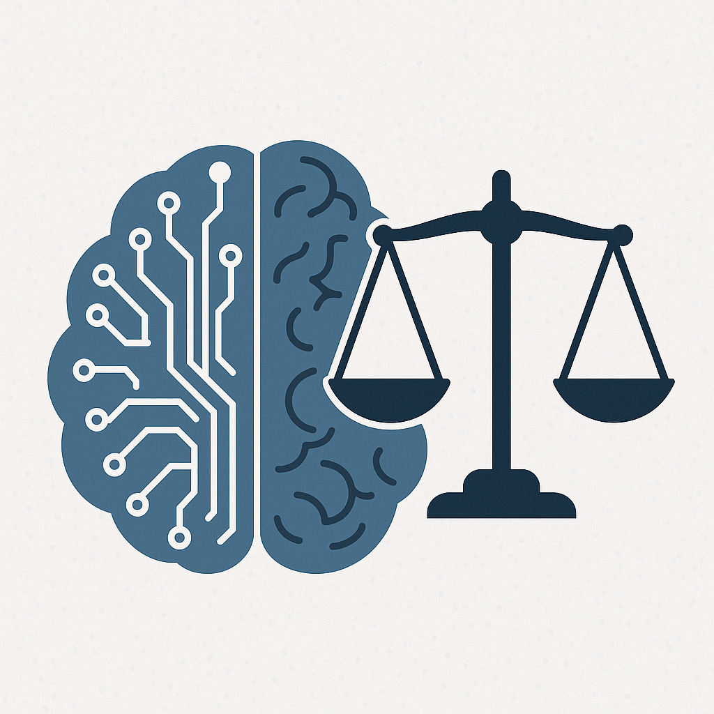
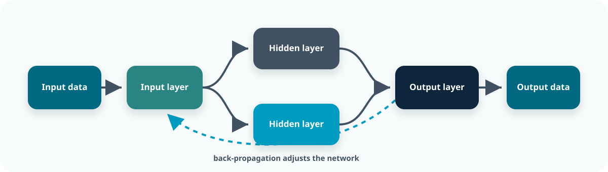
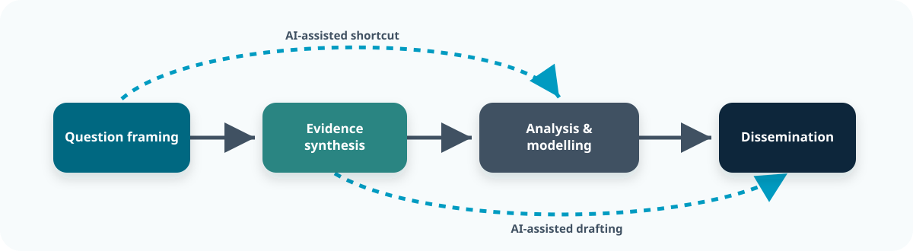
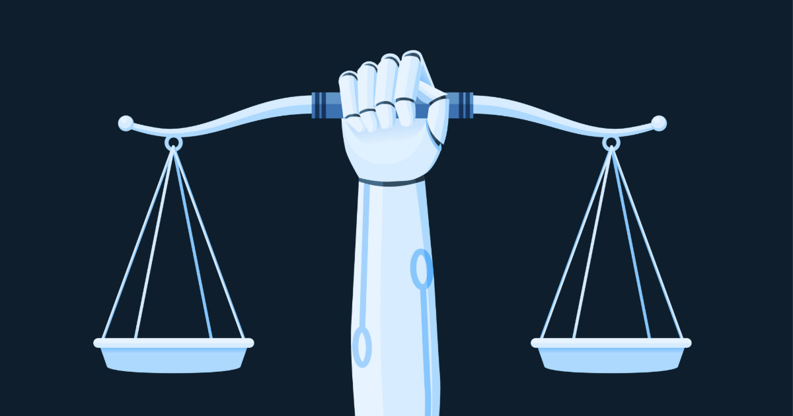
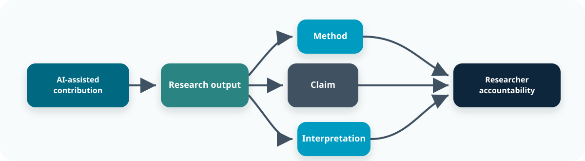
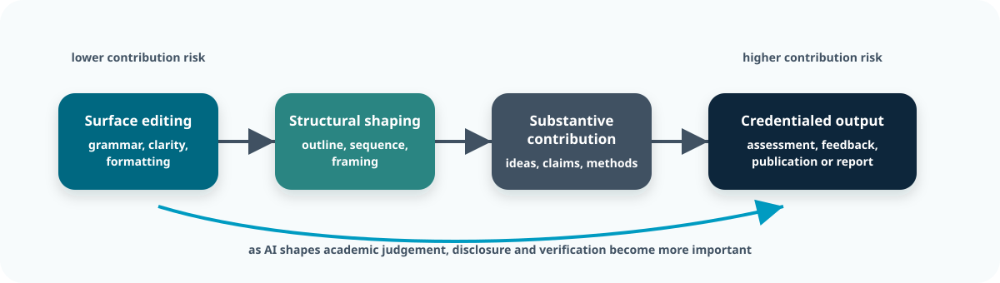
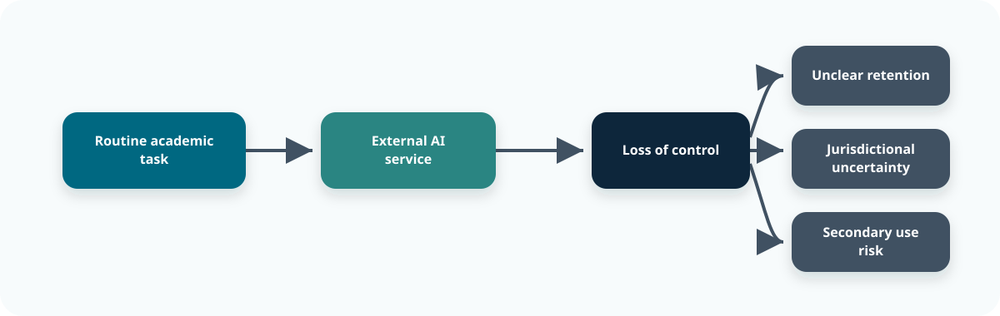
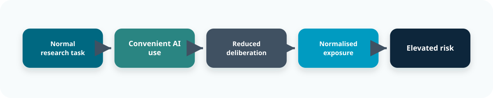

::: {.content-visible when-format="revealjs"}

<!-- Hidden by default -->

:::

::: callout-outcomes

## 💡 Learning Outcomes

- Recognise how generative AI can be applied in university teaching and research, including curriculum design, learning materials, assessment, literature search, data analysis and coding assistance.
- Identify opportunities and risks associated with using AI in academic practice, such as efficiency, accessibility, bias, hallucinations, copyright, academic integrity and reproducibility.
- Apply the principles of transparency, accountability, fairness, privacy and human oversight when integrating AI into teaching or research workflows.
- Interpret institutional guidance on staff and student use of AI, academic integrity, authorship, disclosure and data security.
- Incorporate research data governance considerations when selecting and using AI tools.
:::

::: callout-questions

## ❓ Questions 

1. What opportunities can AI offer for university teaching and research?
2. What are the main risks and challenges when AI is used in teaching, assessment or research?
3. Which ethical principles should guide staff use of AI?
4. How can institutional frameworks and local expectations support responsible practice?
:::

## Structure & Agenda

1. **Foundations and Context** – 10 minutes of teaching followed by a 5-minute poll.  
2. **Opportunities and Risks** – 10 minutes of teaching followed by a 5-minute case demonstration and critique.  
3. **Ethics, Governance and Good Practice** – 10 minutes of teaching followed by a 5-minute discussion prompt.   
4. **AI, Data Security and Future Directions** – 10 minutes of teaching followed by a 5-minute confidence poll.  

> 🔧 Four activities provide opportunities for reflection, critique and discussion.

# Note

AI was used (but not harmed) in the generation of these training materials! 

---

::: callout-task

#### Temperature Check

How many of you have already used generative AI in your teaching, assessment or research? (show of hands)

:::

# Foundations and Context

{fig-align="center" width="500px"}

## A Brief Origin Story: The Beginnings of AI (~1950)

- Artificial Intelligence (AI) emerged in the 1950s 
- Initial ideas were around whether machines could replicate human thought. 

> 🤔 Alan Turing argued that intelligence might be understood through behaviour rather than internal processes, leading to the famous question: *Can machines think?*

## Expansion of Rule-Based AI (1960–1970)

**Early AI focused on symbolic reasoning.**  Intelligence was treated as a problem of **logic, rules, and formal symbols**.

- Human reasoning was assumed to be **explicit and decomposable**
- Knowledge could be encoded as **if–then rules**
- Computers would outperform humans by applying rules **faster and more consistently**
 
> ⚙️ *If reasoning can be fully specified, it can be automated.*

## Growth of Structured Knowledge Systems

**Large, structured knowledge bases emerged:** Expert knowledge was represented using **rule sets, semantic networks, and frames**.

- Emphasis on capturing **specialist reasoning explicitly**
- Knowledge engineered directly into the system
- Reasoning executed by deterministic rule application

**Expert systems** became prominent as a way to formalise human expertise.

> 🧠 *Early AI treated thinking as rule-following, not pattern-learning.*

## The First AI Winter (1970–1980)

**Expert systems struggled to scale:** Human expertise had to be encoded manually, often as **thousands of explicit rules** for diagnosis, recommendation, or classification.

- Rule sets became increasingly **large and brittle**
- **Contradictions and edge cases** multiplied
- Maintaining internal consistency became impractical
- System performance degraded as complexity increased

> 🧠 At the same time, early research into **neural networks stalled** following early mathematical criticism, accelerating the loss of confidence and funding.

## The Emergence of Machine Learning (1980–1995)

In the 1980s, machine learning emerged as researchers realised that instead of telling computers *how* to solve problems, they could let them *learn* from examples. 

**Three conditions enabled this transition:**

- **Data was being generated at scale** in science, finance, and the internet.  
- **Statistical methods improved** (e.g., Bayesian modelling, maximum likelihood).
- **Computers became fast enough** to fit models to real datasets.

> 📈 ML became the dominant paradigm because it could adapt to messy, uncertain, real-world problems.

## Core Machine Learning Approaches

Machine learning is based on three main approaches:

| Approach | What It Does | Typical Use Cases | Examples |
|---------|---------------|-------------------|-----------|
| **Supervised Learning** | Learns from labelled examples to predict outcomes | classification, regression | regression, random forests, SVMs |
| **Unsupervised Learning** | Finds structure in unlabelled data | clustering, dimensionality reduction | k-means, PCA, topic modelling |
| **Reinforcement Learning** | Learns actions through trial-and-error with rewards | control, optimisation, agents | Q-learning, policy gradients |

## Deep Learning (1995–2010)

- In the mid 90s, research shifted toward data-driven methods, with probabilistic graphical models and support vector machines (SVMs) becoming standard in scientific and industrial settings.  

- A landmark moment came in 1997 when IBM’s *Deep Blue* defeated Garry Kasparov, demonstrating the power of specialised computation and statistical optimisation. 

> 🧠 Deep learning transformed AI performance across multiple domains by learning rich features automatically.

## Natural Language Processing (NLP) (2000s–2016)

In the early 2000s Natural Language Processing (NLP) emerged as a field of AI that focuses on understanding and generating human language. It focused on tasks such as translation, sentiment analysis, summarisation and question answering.

{fig-align="center" width="78%"}

> 🧠 Learning improves when output errors are fed back into the model rather than treated as final answers.

## A field ready for change (2014-2016)

Various deep learning models attempted to address the NLP problem, but these had their limitations:

- They were slow because they processed text step by step
- They had difficulty capturing long-range relationships (i.e. semantic meaning)
- They were hard to scale to large datasets

> 🔁 Researchers needed models that could look at text in larger blocks (or all at once).

## Transformers (2017-2020)

Transformers introduced self-attention, allowing models to **attend to all elements of an input simultaneously** and learn contextual relationships across an entire sequence.

By predicting the most likely next token from prior context, transformer models can learn statistical patterns that can be reused across tasks, enabling flexible inference beyond simple memorisation.

> ✨ Given a sufficiently large training set, this allows them to generate responses that can appear thoughtful. 

## Foundation Models (2020)

Training transformers models through self-supervision, led to the emergence of general-purpose foundation models that were capable of adaptation across diverse tasks.

| Property | Description |
|---------|-------------|
| Scale | Trained on trillions of tokens |
| Generality | Perform across domains |
| Transferability | Effective adaptation with small datasets |

> 🧠 What we think of as AI now are essentially just massive transformer based models.

## From Scale to Generality (2020–present)

- **2020**: **GPT-3** (~175B parameters)  
  First truly large-scale autoregressive model demonstrating broad, task-agnostic capabilities.
- **2021**: **PaLM** (~540B parameters)  
  Empirical validation of scaling laws, with notable gains in multilingual performance and reasoning.
- **2023**: **GPT-4**, **Claude**, **Gemini** (parameter counts undisclosed but likely Trillion-scale)  
  Shift toward multimodality, alignment, safety, and system-level optimisation rather than raw scale alone.
- **2024–2025**: **Mixture-of-Experts and hybrid systems**  
  Trillion-scale *effective* capacity via sparse activation, retrieval-augmented generation, and domain-specialised models.

> 🚀 *Foundation models marked a transition from task-specific AI systems to general-purpose computational platforms.*

## Summary

AI began with rules but moved toward learning. Deep learning enabled rich representations, and sequence models advanced language processing. Transformers removed key bottlenecks, allowing the creation of foundation models and LLMs.

The current emphasis is increasingly on optimisation because training and running large models is computationally expensive. 

> 🌐 Modern generative AI is the result of many incremental breakthroughs.

::: {.content-visible when-format="revealjs"}

<!-- Hidden by default -->

:::

---

::: callout-task

#### Task: Questionnaire

<iframe
  src="https://ds-shiny-helper.azurewebsites.net/edsex1/?embed=true#shiny-tab-q1_results"
  width="100%"
  height="500"
  frameborder="0"
  style="border:none;"
  title="Q1">
</iframe> 

:::

# 1. Opportunities

{fig-align="center" width="400px"}

## AI as a structural shift in academic practice

Generative AI represents a structural change in academic work by **compressing intellectual labour** associated with curriculum planning, drafting, synthesis, translation, feedback scaffolds and technical preparation.  

Rather than replacing academic expertise, it can reallocate staff effort from **production** towards **evaluation, verification and judgement**.

> ✍️ The key change is not simply faster content production. Staff increasingly need to act as critical editors of AI-assisted materials, decisions and reasoning.

## Compression of teaching and research workflows

AI-enabled workflows can shorten the distance between planning, drafting, review and delivery. In teaching, this may accelerate the production of explanations, examples, activities, assessment materials and feedback scaffolds. In research, it can connect ideation, analysis and dissemination more rapidly.

{fig-align="center" width="78%"}

> ⏸️ Faster movement between stages makes deliberate review points more important, not less. Increased throughput can remove natural pauses for pedagogic reflection, peer discussion, quality assurance and methodological reconsideration.

## Where genuine opportunities arise

Opportunities from AI in teaching and research are best understood as **capacity multipliers**.

Common high-value gains include:

- drafting alternative explanations, examples, activities and formative questions  
- adapting material for different levels, formats and accessibility needs  
- developing initial assessment, rubric and feedback scaffolds for staff review  
- rapidly orientating within unfamiliar or interdisciplinary literature  
- exploring methodological, analytical or technical alternatives  
- reducing repetitive boilerplate, formatting and coding work  

> ⏱️ These benefits are particularly significant where staff face limited time, high cognitive load or the need to translate complex material across audiences and disciplines.

## Expansion of exploratory space

AI can increase the *breadth* of exploration by lowering the cost of asking “what if?” questions. It can:

- suggest alternative explanations, examples and learning activities  
- identify possible misconceptions or accessibility barriers  
- explore different assessment formats or feedback approaches  
- recommend alternative research methods or sensitivity analyses  
- reframe questions and offer competing explanatory narratives  

> ✅ This can improve teaching and research practice *if* exploration is paired with clear aims, explicit selection criteria and human validation.

## A simple academic risk matrix

| Scenario | Typical risk level | Why |
|---|---|---|
| summarising a public guidance page for personal notes | low | public source and easy to verify |
| generating draft examples or quiz questions from public material | low to medium | factual, pedagogic and accessibility errors remain possible |
| using an approved tool to develop feedback scaffolds from de-identified work | medium | requires careful checking against criteria and the student's submission |
| uploading identifiable student work or marks to a public AI tool | high | data protection, confidentiality and fairness risks |
| asking AI to make grading, progression or misconduct decisions | high | academic judgement and accountability cannot be delegated |
| analysing identifiable participant material in a public tool | high | ethics, governance and disclosure failure |

> ⚖️ The point is not to ban AI in difficult areas. It is to match the tool, safeguards and level of human review to the stakes.

## Accessibility and inclusion

When used carefully, AI can also support:

- alternative explanations and representations of difficult concepts  
- clearer expression for staff and students working across languages  
- improved readability and accessibility across different formats  
- translation across disciplinary vocabularies  
- structured drafting for students, educators and early-career researchers  

> 🌍 These gains can support more inclusive teaching and communication, but generated adaptations still require disciplinary and accessibility review.

---

::: callout-task

#### Task: Risk relocation audit (5 minutes)

**Plenary discussion:**

For each area, state how AI could reduce staff effort. Can you also identify where effort, judgement or risk is relocated?

- curriculum and session planning  
- learning materials and student support  
- assessment and feedback  
- research planning, analysis and dissemination  

:::

# Ethics, Governance and Academic Integrity

{fig-align="center" width="400px"}

## The condition for opportunity: retained ownership

AI-enabled capacity is valuable only when staff retain ownership of:

- learning outcomes and curriculum choices  
- assessment design and academic standards  
- feedback and academic judgement  
- research assumptions, analysis and interpretation  
- uncertainty and limitations  

> 🚨 Where ownership is ceded, opportunities can rapidly become risks. 

## Capacity gain requires explicit control mechanisms

Effective use of AI in academic practice therefore requires intentionally designed safeguards:

- define the teaching or research purpose before using AI  
- align teaching outputs with learning outcomes and assessment expectations  
- treat AI outputs as drafts or hypotheses, not authoritative answers  
- verify factual claims, references, calculations and code  
- review outputs for bias, accessibility and disciplinary appropriateness  
- retain human responsibility for feedback, grading and research interpretation  

> 🎛️ Opportunity only scales with *control*. Speed without control does not create academic value.

## Why governance is now an academic necessity

Generative AI makes it easier for substantive contributions to teaching, assessment and research to be produced rapidly and invisibly: 

{fig-align="center" width="80%"}

> 🧾 Accountability cannot be delegated to the tool that generated or shaped the material. This places pressure on established norms around **academic judgement, assessment validity, authorship, contribution, provenance and accountability**.

## Academic integrity and authorship: the institutional framing

Institutional guidance commonly distinguishes between permitted assistance and AI use that replaces or obscures a person's own intellectual contribution. In assessed work, unpermitted or unacknowledged AI assistance may constitute an academic integrity issue. Staff use also requires appropriate oversight and transparency.

This can include AI contribution to:

- teaching materials, examples and explanations  
- assessment briefs, marking criteria and feedback  
- text, argumentation, code and analysis outputs  
- images, figures or other generated artefacts  

> 📢 Staff are responsible for setting clear expectations for students and for being transparent where AI materially shapes teaching or research outputs.  

## Permission is contextual, not assumed

AI acceptability varies by:

- institutional guidance and approved tools  
- module and assessment instructions  
- disciplinary and professional norms  
- data protection, accessibility and equality requirements  
- collaboration agreements  
- funder and publisher expectations  

> 🔐 The governance principle: **permission and boundaries should be explicit**; ambiguity creates risk.

## Accountability: what must remain human

Academic staff must be able to:

1. justify learning outcomes, curriculum and assessment choices  
2. ensure that assessment and feedback are valid, fair and aligned  
3. verify teaching content, references and examples  
4. explain and defend research assumptions, methods and claims  
5. describe limitations, uncertainty and the role played by AI  

> 👤 AI can assist, but it cannot carry responsibility for the quality of teaching, assessment or research.

## Transparency and traceability as academic norms

Traceability aligns with established expectations for quality assurance, academic integrity and research integrity.

| What must be transparent | Why it matters |
|---|---|
| Tool(s) and version(s) | provenance and reproducibility |
| Where AI influenced materials or decisions | auditability of academic judgement |
| What was verified, and how | defensible teaching and research outputs |
| What data or content was shared | confidentiality and governance |
| What was not verified | honest uncertainty |

> 👤 Transparency is not an extra requirement created by AI; it should extend normal academic quality and integrity practices.

## Contribution boundaries: editing vs substantive generation

A recurring problem is distinguishing *surface assistance* (clarity, structure or formatting) from *substantive contribution* (learning design, assessment decisions, ideas, methods, claims or interpretation).

{fig-align="center" width="80%"}

> 👤 The risk rises when the tool starts shaping claims, methods, interpretation, or assessed work.

## Integrity risks that look “benign”

Teaching- and research-related risks often arise from apparently routine workflow choices:

- using a polished explanation that contains subtle factual errors  
- generating feedback that is not grounded in the marking criteria or student's work  
- reusing AI-generated assessment material without checking validity, accessibility or answerability  
- adopting analytic code without validation  
- using a summary that narrows the literature space prematurely  

> ⚠️ Failing to review or disclose material AI contribution where required may seem minor, but can have significant educational, ethical and governance implications. 

## What good disclosure achieves

Disclosure is not a punishment; it enables:

- clear expectations for students  
- clearer attribution of intellectual work  
- defensible teaching and scholarship  
- auditability and reproducibility  
- trust among students, colleagues, collaborators and audiences  

> 📝 Where AI materially shaped an academic output or decision, keep an appropriate record and disclose its role where required. 

---

::: callout-task

#### Task: Worked example for direct critique (AI-assisted, 5-minute discussion)

The following assessment guidance was produced using AI:

***“This assessment will evaluate students' critical understanding of the topic. Students should use relevant evidence, demonstrate originality and communicate their ideas clearly. Work will be graded for knowledge, analysis and presentation.”***

1. What important pedagogic and assessment decisions are missing or obscured?  
2. What would need to be revised by the module team before this could be used?  
3. At what point would AI have made a substantive contribution that should be recorded or disclosed?
:::

# Data Security in Teaching and Research

{fig-align="center" width="400px"}

## Why AI materially changes academic data risk

Many AI tools operate outside institutional infrastructure and governance controls.  
This can transform routine academic actions—such as adapting teaching materials, reviewing student work, summarising notes, refining code or drafting interpretation—into potential **boundary-crossing events** that bypass established safeguards.

{fig-align="center" width="80%"}

> 🔐 Once material leaves governed systems, controls become uncertain. 

## What “data” means in AI-mediated academic work

In AI-assisted workflows, “data” includes any material that encodes student, teaching or research context, not only formal datasets:

- student submissions, marks, feedback, attendance and support information  
- reasonable-adjustment, wellbeing or other sensitive student information  
- unpublished assessments, model answers, teaching plans and internal moderation material  
- unpublished results, figures, qualitative notes and intermediate tables  
- grant drafts, reviewer responses and collaboration documents  
- code containing credentials, endpoints or infrastructure details  

> 📎 Much of this material is *informally handled* but *formally sensitive*.

## High-risk material: common categories

| Category | Examples | Why high risk |
|---|---|---|
| Student personal / sensitive | marks, support needs, reasonable adjustments | legal, ethical and fairness obligations |
| Assessed work | submissions, feedback, misconduct evidence | confidentiality and academic integrity |
| Unpublished teaching | assessments, model answers, moderation records | assessment security and validity |
| Research personal / sensitive | clinical, genetic, qualitative or geolocation data | legal and ethical obligations |
| Unpublished research | manuscripts, results and grant material | premature disclosure |
| IP / commercial | methods, pipelines and agreements | loss of competitive advantage |
| Security material | tokens, keys and internal URLs | direct compromise |

> 🧩 Risk frequently arises from **aggregation**, not single items.

## De-identification is not a sufficient safeguard

Removing explicit identifiers does not eliminate disclosure risk.  
Residual risk persists through rare attribute combinations, contextual cues in narrative text, small-n summaries, or linkage with external information.

> 🛠️ The practical implication is operational rather than theoretical: *“Anonymised” does not mean “safe to upload.”*

## AI systems as external service providers

A useful governance analogy is to treat an external AI service as a third party that may have:

- no institutionally approved contract  
- no appropriate data-processing or data-sharing agreement  
- no role in the relevant ethics approval  
- no enforceable deletion or confidentiality guarantee available to the user  

> 🧭 This framing clarifies why **minimum necessary disclosure** and use of approved institutional tools are defensible defaults.

## Jurisdiction, retention, and opacity

From a teaching and research governance perspective, unresolved questions include:

1. where prompts and uploads are processed and stored  
2. how long material is retained  
3. whether content is reused for model improvement  
4. whether third parties (plugins, analytics, telemetry) have access  

> ❓ Uncertainty itself constitutes a risk factor when handling sensitive research material.

## Behavioural drift as a security threat

Risk is not only technical; it is behavioural.  
Convenience can normalise incremental risk-taking across routine teaching and research activities without explicit decision points.

{fig-align="center" width="76%"}

> 🔍 Drift is dangerous because each individual step can feel too small to question. This form of “quiet drift” is harder to detect than discrete policy violations.

## Practical implication for academic staff

A simple operational test:

> 📧 *Would I be permitted to send this student, teaching or research material to an external service without institutional approval?*

If not, it should not be shared with an external AI service. Check whether your institution provides an approved or secure version of the tool and seek advice where the boundary is unclear.

# Further Information

::: callout-keypoints

## 🔦 Key points

- AI can support teaching through planning, explanation, accessibility, formative activity design and feedback scaffolds, and can support research through literature search, coding, analysis and translation.
- Key opportunities include efficiency, broader exploration, clearer communication and reduced repetitive workload.
- Main risks include factual errors, bias, invalid assessment or feedback, academic integrity concerns, copyright or IP issues, data breaches and loss of critical skills.
- Ethical use requires transparency, accountability, fairness, privacy and meaningful human oversight.

> 🛡️ Use secure, approved tools; do not upload sensitive student or research material without authorisation; follow institutional, disciplinary, funder and publisher policies.
:::

::: callout-hints

## 📚 Additional Reading

- **University guidance on AI:** [UoN guidance](https://www.nottingham.ac.uk/studyingeffectively/studying/ai.aspx) summarises expectations around AI use and academic integrity.  
- **Publisher policies:** [Nature editorial](https://www.nature.com/articles/d41586-023-00191-1) explains why LLMs cannot be credited as authors and when research use should be documented.  
- **Living guidelines:** The European Research Area’s living guidelines on generative AI provide best‑practice recommendations [Swedish Research Council news](https://www.vr.se/english/just-now/news/news-archive/2024-04-09-new-guidelines-for-using-ai-in-europe.html).  
- **Microsoft responsible AI:** [AzureMentor blog](https://azurementor.wordpress.com/2024/03/08/the-6-microsoft-responsible-ai-principles-explained/) explains the six pillars of Microsoft’s responsible AI framework.  
- **Generative AI ethics:** [TechTarget article](https://www.techtarget.com/searchenterpriseai/tip/Generative-AI-ethics-8-biggest-concerns) lists ethical concerns and risks of generative AI.    
:::
