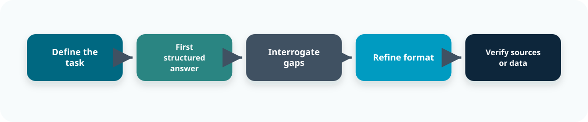

::: {.content-visible when-format="revealjs"}

<!-- Hidden by default -->

:::

::: callout-outcomes

## 💡 Learning Outcomes

- Design effective prompts for producing teaching materials that are aligned with a defined learning outcome, learner level and teaching context.  
- Critically assess AI-generated content for factual accuracy, pedagogical alignment, accessibility, inclusivity and appropriate academic level.  
- Explore how role, audience and format instructions influence AI responses, while recognising that fluent output is not evidence of educational quality.  
- Apply responsible AI practices by protecting student and institutional information, documenting substantial AI use and retaining academic oversight.  
- Identify when repeated prompting can be converted into a documented workflow or a simple agent for teaching or research support.  
:::

 

::: callout-questions

## ❓ Questions

1. How can you use Copilot to develop teaching materials without delegating academic judgement?  
2. How do you verify that an AI-generated resource is accurate, appropriately challenging and aligned with its intended learning outcome?  
3. How do role, audience and format instructions change the usefulness of an AI-generated teaching resource?  
4. Which teaching and research tasks are suitable for repeatable AI-supported workflows?  
:::

## Structure & Agenda

1. **Orientation and Prompting** – define the teaching purpose, set source boundaries and practise a reusable prompt pattern.
2. **Critique and Validation** – review AI-generated material for accuracy, learning alignment, accessibility, inclusion and practical fit.
3. **Prompt Framing and Role Effects** – compare how subject, learning-design and accessibility perspectives change the review.
4. **Using Agents for Repeatable Tasks** – turn a structured teaching-material workflow into a reusable agent with human approval built in.
5. **Going Further with AI** – apply the same define, source, generate, critique, verify and document pattern to wider teaching and research tasks.

# Orientation and Prompting

{fig-align="center" width=500px}

## Introduction

This workshop builds on the principles introduced in the previous session. Responsible AI use requires transparency, verification, documentation, fairness and continuous human oversight.

Participants will practise using Copilot to produce and refine university teaching materials. The same methods can also support appropriate research tasks, but the primary examples in this session concern curriculum delivery, learning activities and academic communication.

Do not include personal student information, live assessment submissions, confidential institutional material, unpublished research or other restricted information in prompts unless the tool and use have been explicitly approved.

## AI as a drafting partner

AI can help generate a **first draft** of a teaching resource, but it cannot determine whether that resource is educationally sound.

Academic staff remain responsible for:

- deciding what students should learn  
- selecting appropriate content and examples  
- setting the expected level of challenge  
- checking accuracy and disciplinary nuance  
- ensuring accessibility and inclusion  
- deciding whether and how the material should be used  

> 🎓 AI can reduce drafting effort. It does not replace curriculum expertise, pedagogical judgement or accountability.

## Start with the educational purpose

Before using AI, define the reason the resource is needed.

| Question | Example |
|---|---|
| What should learners be able to do? | compare two explanations using evidence |
| What prior knowledge can be assumed? | introductory disciplinary concepts |
| Where will the resource be used? | 20-minute seminar activity |
| What evidence may be used? | approved reading and lecture notes |
| What must remain with the lecturer? | content selection, standards and final approval |

> 🎯 A polished resource that is not aligned with the learning outcome is still a poor teaching resource.

## Reusable prompt patterns

Reusing prompts can make it easier to get consistent answers, an example for generating training material could include:

- **Create** [teaching resource] for [learner level and audience].  
- The relevant learning outcome is: [learning outcome].  
- The resource will be used in [teaching context] and should take [duration].  
- Use only [attached or linked source material].  
- Include [required components and format].  
- Ensure [accessibility, inclusivity and level requirements].  
- Flag any claim that cannot be supported from the supplied material. Do not invent references or policy requirements.

> 🧭 The prompt provides a specification. It does not guarantee that the resulting resource meets it.

## Group Formation

**Participants are welcome to work in small groups or individually.**

---

::: callout-task

#### Task 1: Prompt practice

::: panel-tabset

##### Activity

[https://m365.cloud.microsoft/chat/](https://m365.cloud.microsoft/chat/)

Use a topic from your own teaching, or use the example below:

> 📝 *“Create a 10-minute seminar activity for first-year undergraduates that helps them distinguish correlation from causation. The learning outcome is: ‘Evaluate whether an observed association supports a causal claim.’ Use only the source material I provide. Include a short scenario, three discussion questions, model responses and one common misconception. Use clear language, avoid discipline-specific assumptions and flag anything that requires additional evidence.”*

##### Follow-up

- Which parts of the prompt defined the task, learning outcome, audience and source boundary?  
- What did the prompt leave unspecified?  
- Which parts of the output would still require academic review?  
- Did Copilot identify uncertainty, or did it fill gaps confidently?  

:::
:::

# Critique and Validation

## Accuracy is necessary but not sufficient

A teaching resource can be factually correct and still be unsuitable because it:

- does not address the intended learning outcome  
- assumes knowledge that learners do not have  
- reduces an evaluative task to simple recall  
- includes an unrealistic or culturally narrow example  
- gives away the reasoning students are meant to develop  
- creates unnecessary barriers through language, format or structure  
- cannot be delivered within the available time  

> 🧠 Validation must examine both **what the material says** and **what learners are being asked to do**.

## Source first, material second

A safer workflow is:

1. define the learning outcome and teaching context  
2. gather the approved source material  
3. ask Copilot to draft within that evidence boundary  
4. compare every substantive claim with the source  
5. evaluate the educational design separately from factual accuracy  
6. revise, test and approve the material yourself  

> 🔎 AI can help transform source material into a draft. It should not become an unexamined source of disciplinary content.

## A practical validation checklist

| Dimension | What to check |
|---|---|
| factual accuracy | claims, calculations, references, disciplinary nuance |
| source fidelity | whether content follows from the supplied material |
| learning alignment | direct connection to the stated learning outcome |
| academic level | prior knowledge, conceptual demand and terminology |
| pedagogical value | opportunities for explanation, practice, feedback or discussion |
| accessibility | clarity, structure, format, alternatives and avoidable barriers |
| inclusion | assumptions, examples, representation and potential bias |
| assessment integrity | whether the resource exposes or reproduces restricted assessment material |
| practical fit | duration, group size, technology and delivery context |
| transparency | whether substantial AI contribution needs to be recorded or disclosed |

> ✅ Validation should be built into the workflow, not added after the resource has already been adopted.

## A worked prompt chain often helps

{fig-align="center" width="78%"}

A controlled prompt chain might separate:

1. **Draft** – generate the initial resource from specified material.  
2. **Interrogate** – identify unsupported claims, assumptions and omissions.  
3. **Review alignment** – map each component to the learning outcome.  
4. **Review accessibility** – identify avoidable barriers or narrow assumptions.  
5. **Refine format** – improve usability without changing the evidence.  
6. **Human verification** – check and approve the final material.  

> 🧭 A staged chain is less about clever prompting than control: generation, critique and verification remain visible and separable.

---

::: callout-task

#### Task 2: Critique the generated resource

::: panel-tabset

##### Exercise (10 min)

Evaluate the resource produced in Task 1.

Ask Copilot to critique the draft against the validation checklist, but conduct your own review as well. Identify at least:

- one factual or source-related issue  
- one learning-alignment or level issue  
- one accessibility, inclusion or clarity issue  
- one feature that is genuinely useful  

Revise the original prompt or resource in response.

> 🔍 Copilot's self-critique is another AI output. Treat it as a prompt for inspection, not as evidence that the resource is sound.

##### Discussion (5 min)

- Which problems did Copilot identify in its own output?  
- Which problems did it miss?  
- Did refinement improve the educational value, or mainly the presentation?  
- What checks would be required before using the resource with students?  

:::
:::

# Prompt Framing and Role Effects

## Role and perspective prompting

The tone and focus of Copilot's response can vary according to the role or perspective specified. Asking it to review a resource as a **subject lecturer**, **learning designer** or **accessibility reviewer** may foreground different concerns.

Role prompts can be useful for widening the review, but they do not give the model professional expertise or institutional authority.

- useful for prompting different questions about the same artefact  
- useful for adapting tone and structure to different audiences  
- risky when stylistic confidence is mistaken for expertise  
- most effective when the evidence, task and criteria are already clear  

> 🎭 Role prompting changes the lens applied to the task. It does not create a qualified reviewer.

## Audience prompting

Changing the intended audience can alter:

- terminology and assumed prior knowledge  
- explanation length and conceptual depth  
- examples and analogies  
- the amount of scaffolding provided  
- the balance between explanation and independent reasoning  

> 🧩 Simplifying language should not mean removing the core disciplinary idea or lowering the intended learning outcome.

---

::: callout-task

#### Task 3: Role effects experiment

::: panel-tabset

##### Exercise (5 min)

Ask Copilot to review the same resource from Task 2 using three role instructions:

1. **subject lecturer** – focus on factual accuracy, disciplinary nuance and academic level  
2. **learning designer** – focus on learning alignment, activity structure and opportunities for feedback  
3. **accessibility reviewer** – focus on clarity, format, assumptions and avoidable barriers  

Record differences in the issues identified, recommendations made and certainty expressed.

##### Plenary (5 min)

- Which role produced the most useful questions?  
- Did any response claim authority it could not support?  
- Which recommendations conflicted with each other?  
- How should academic staff resolve those conflicts?  

:::
:::

# Using Agents for Repeatable Tasks

## When a repeated task should become a workflow

Good candidates for a reusable workflow have:

- a stable input pattern  
- a clear output structure  
- public, approved or lecturer-authored source material  
- explicit quality criteria  
- an obvious point for human validation  

> 🧭 If the same low-risk drafting and checking steps are repeated regularly, ad hoc prompting becomes inefficient and inconsistent.

## A repeatable teaching-material workflow

A simple workflow might:

1. receive a learning outcome, audience, duration and source material  
2. produce a draft resource in a consistent format  
3. map each component to the learning outcome  
4. list unsupported claims or missing information  
5. perform an accessibility and inclusion review  
6. generate a validation checklist for the lecturer  
7. produce a short record of how AI was used  

> 🔁 The purpose of the workflow is consistency and traceability, not automatic approval.

## Automating teaching-resource development with an AI agent

An AI agent can coordinate a repeatable, multi-step process. Instead of prompting separately for each stage, it can be configured to:

- collect the teaching specification  
- work only from approved source material  
- generate a structured draft  
- conduct defined quality checks  
- flag uncertainty and missing information  
- return the draft with a human-review checklist  

> ✅ Once the workflow is defined, the lecturer supplies the topic, context and source material; the agent applies the same process each time.

## Automate the structure, not the responsibility

| Good agent candidates | Poor agent candidates |
|---|---|
| turning approved notes into a consistent draft format | deciding curriculum outcomes or academic standards |
| generating low-stakes formative examples for review | assigning marks or progression decisions |
| checking a resource against a defined checklist | determining whether misconduct has occurred |
| producing alternative explanations from approved content | processing identifiable student submissions in an unapproved tool |
| creating an AI-use record | approving the resource without academic review |

> 🤖 Agents work best when the task is narrow, low-risk, source-bounded and easy to check.

## A lightweight AI-use note

A short record after substantial AI use can include:

- date and tool  
- purpose of the task or agent  
- prompt, instructions or template used  
- source material provided  
- substantive changes suggested by AI  
- checks performed  
- what was retained, changed or rejected  

> 📝 An agent can produce this record automatically, but the user must check that it accurately reflects the process.

---

::: callout-task

#### Task 4: Build an agent for teaching-resource development

::: panel-tabset

##### Exercise (10 min)

Create an AI agent configured to accept:

- a learning outcome  
- learner level and prior knowledge  
- teaching context and duration  
- approved source material  
- the required type of teaching resource  

##### Agent Configuration

- generate a structured first draft  
- use only the supplied source material for factual content  
- map each section of the resource to the learning outcome  
- flag unsupported claims, missing information and assumptions  
- review clarity, accessibility and inclusivity  
- distinguish content decisions from presentational suggestions  
- include a lecturer validation checklist  
- produce a short AI-use note covering the tool, purpose, inputs, checks and retained output  
- state clearly that final academic approval remains with the lecturer  

Test it using two different topics, formats or learner levels. Note where it succeeds, where it becomes generic and where human oversight is required.

##### Plenary (5 min)

- Which parts of the process became more consistent?  
- Which weaknesses were repeated or amplified?  
- Where did the agent need more context than expected?  
- Which decisions should never be delegated to the agent?  

:::
:::

# Going Further with AI

## Applying the same method beyond teaching materials

The same controlled workflow can support other appropriate tasks, including:

- transforming approved guidance into staff checklists  
- producing alternative explanations for interdisciplinary audiences  
- structuring research notes or project plans  
- drafting code scaffolds against non-sensitive example data  
- preparing public-facing summaries for expert review  
- monitoring changes to public guidance where sources and dates are checked  

> 🔬 The context may change, but the core sequence remains: define, source, generate, critique, verify, document and approve.

# Further Information

::: callout-keypoints

## 📚 Key points

- Begin with the learning outcome, audience and teaching context rather than asking AI for a generic resource.  
- Give the model an explicit source boundary and instruct it to flag uncertainty rather than invent content.  
- Evaluate pedagogical alignment, academic level, accessibility and inclusion as well as factual accuracy.  
- Role prompts can widen a review, but they do not provide professional expertise or authority.  
- Do not enter identifiable student information, live submissions, restricted assessment material or confidential content into unapproved tools.  
- Repeatable workflows and agents are most useful when the task is narrow, low-risk, source-bounded and easy to validate.  
- Academic staff remain responsible for the final content, its use and any consequences for learners.  
:::

---

::: callout-hints

## 📚 Additional resources

- **University guidance on AI:** [University of Nottingham guidance](https://www.nottingham.ac.uk/studyingeffectively/studying/ai.aspx) summarises institutional expectations around generative AI and academic integrity.  
- **AI literacy for teaching and learning staff:** [Jisc AI literacy training](https://nationalcentreforai.jiscinvolve.org/wp/2026/07/08/ai-literacy-training/) provides a wider curriculum for practical and responsible AI use in higher education.  
- **Microsoft Copilot:** [Microsoft 365 Copilot Chat](https://m365.cloud.microsoft/chat/) can be used for the workshop exercises where institutionally available.  
- **UKRI policy:** follow [UKRI guidance on generative AI in application preparation and assessment](https://www.ukri.org/publications/generative-artificial-intelligence-in-application-and-assessment-policy/use-of-generative-artificial-intelligence-in-application-preparation-and-assessment/) when using AI with funding applications, assessment activity, confidential material or personal data.  
:::
