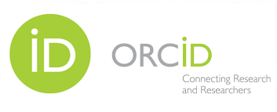

---
title: Digital Tools
teaching: 40
exercises: 40
---

# Module Overview

- **Module:** EDS-M1 -  Digital Tools
- **Course:** Essential Digital Skills (EDS)
- **Audience:** Early Career Researchers (PhD, Postdoc)  
- **Duration:** ~40 minutes directed teaching (+4 exercises)  

::: callout-c1

## Learning Outcomes

- Navigate core UoN digital ecosystem
- Apply digital best practices in collaboration & file organisation
- Manage your research identity
- Identify essential tools for coding & reproducible research
:::

 

::: callout-c2

## Questions

1. What basic data tools I need to do research at UoN?
2. How to I maintain a consistent online researcher identity?
3. What digital tools may I need to support my research aims?  
:::

## Structure & Agenda

1. Introduction to DS&DSP (~10 min)  
2. Institutional Systems for Digital Research (~10 min)  
3. Research Identity and Profiles (~10 min)  
4. Tools for Coding & Reproducibility (~10 min)  

> 🔧 4 Activities spaced every 10 minutes.

---

# Introduction to DS&DSP

{fig-align="center" width=500px}

## What is DS&DSP?

The Digital Skills & Digital Scholarship Programme aims to equips researchers with foundational digital competencies, focusing on core themes such as digital collaboration, data management, coding and reproducibility.

### Why Digital Skills Matter

- Essential for effective, collaborative research  
- Improve reproducibility & efficiency  
- Enable data-driven methods  
- Increase research visibility and impact  

## Course Structure

There are three training tiers, each progressively developing digital skills from foundational competencies to applied and specialist practice.

### Esential Digital Skills

| Course                             | Description                                                                 | Duration       | Note |
|------------------------------------|-----------------------------------------------------------------------------|----------------|------|
| Essential Digital Skills – Foundation | Introduces the tools, practices, and principles needed to participate confidently in digital research. | 4× half days   |      |

### Methods for Data Science

| Course                             | Description                                                                 | Duration       | Note |
|------------------------------------|-----------------------------------------------------------------------------|----------------|------|
| Methods for Data Science – Theoretical    | Introduces coding, software, and collaboration practices needed for sustainable research. | 4× half days   |      |
| Methods for Data Science – Applied Python | Provides practical experience in data analysis and interpretation using Python. | 2 days         | Introductory and intermediate |
| Methods for Data Science – Applied R      | Provides practical experience in data analysis and interpretation using R.     | 2 days         | Introductory and intermediate |

### Standalone modules

| Course               | Description | Duration | Note |
|----------------------|-------------|----------|------|
| Bioinformatics       | —           | 1 day    |      |
| Advanced Computing   | —           | 1 day    |      |
| ML and AI            | —           | 1 day    |      |

## How DS&DSP will be Delivered

The course follows a modular structure—you don’t have to do all of it—and includes hands-on activities to make learning enjoyable, with blended delivery combining slides, demonstrations, exercises, and workshops. 

---

#### Task 1: Digital Skills Reflection

::: panel-tabset
##### Question

Lets start by reflecting on your current digital research skills.

❓ What’s one digital skill or tool you want to develop this year?

Post your response on the shared board. 

##### Follow-up

- Read through what others have shared.
- Discuss trends and common goals in the group
- Are there recurring skills people want to develop?
:::

---

# Institutional Systems for Digital Research

{fig-align="center" width=500px}

## Microsoft 365: 

### Core Tools

- **Word & Excel:** writing, data capture  
- **OneDrive:** personal cloud, autosave  
- **Teams:** shared spaces, chat, files, meetings  

### File Collaboration Best Practices

- Use Teams/SharePoint for group work  
- Enable autosave in Word/Excel  
- Use version history over file renaming  
- Plan clear folder structures  

## UoN Tools: UniCore & RIS

| Tool     | Purpose                           |
|----------|-----------------------------------|
| UniCore  | HR, finance, procurement          |
| RIS      | Research lifecycle & outputs mgmt |

### UniCore Quick Facts

- Oracle-based UoN system  
- Used for:  
  - Equipment purchases  
  - Expense claims  
  - Leave, sickness, HR tasks  
- Secure login via MFA  

### RIS (Research Information System)

- Based on Worktribe  
- Used for:  
  - Grant proposals  
  - Research outputs & REF  
  - Impact recording & compliance  
  - Links with repository and ORCID  

## When to Use What

| Task                           | System        |
|--------------------------------|---------------|
| Co-author a paper             | OneDrive/Word |
| Grant application             | RIS           |
| Claim travel expenses         | UniCore       |
| Share project datasets        | Teams         |

---

#### Task 2: Match Research Tasks to Tools

::: panel-tabset
##### Activity

In groups, suggest the most appropriate digital tool or system for each of the following:

1. Co-write a manuscript  
2. Submit a funding bid  
3. Order equipment  
4. Share large datasets with your team  

##### Reflection

- Share your answers with the group  
- Reflect on whether you've used any of these systems before  
- Identify any gaps in your familiarity that you want to address  

##### Answers

- **Microsoft Word -> Sharepoint + Teams** are ideal for collaborative document editing  
- **RIS (Worktribe)** is used for grant applications and research output tracking  
- **UniCore** handles finance, procurement, HR and expenses  
- **Microsoft Teams + SharePoint** is best for long-term group file access and collaboration  

:::

---

# Research Identity & Profiles

{fig-align="center" width=500px}

## Why Identity Matters

- Disambiguate names  
- Improve visibility & citation  
- Link your outputs across systems  
- Enable collaboration & networking  

### ORCID – Persistent Identifier

- 16-digit free researcher ID  
- Link to funders, publishers, RIS  
- Automated updates  
- Lifetime use across institutions  

### RIS Profile (UoN)

- Connects with ORCID  
- Shows grants, outputs, impact  
- Syncs to public staff page  
- Use for REF and reporting  

### Other Profiles

- **Scopus Author ID:** citation tracking  
- **Google Scholar:** broad coverage, h-index  
- **ResearchGate / Academia.edu:** optional, social layer  

## Profile Management Tips

- Set ORCID to public  
- Merge duplicate Scopus IDs  
- Sync profiles when possible  
- Avoid fabricated metrics (e.g., RG Score)  

---

#### Task 3: Research Identity Self-Audit

::: panel-tabset
##### Activity part 1

❓ Do you have a ORCID research identity? 

Visit [Orcid](https://orcid.org/), Log in / sign up

##### Activity part 2

❓ Is your ORCID iD is populated with your name, affiliation etc? if not make sure that is complete. 
- Set your ORCID ID to public (if appropriate)  

#####  Further Infomation

- You can actually link your RIS and ORCID profiles but for that you need to be registered to use worktribe. It is recomended that you [request access](https://nottingham-research.worktribe.com/login.jx)
- Once registered and logged in, you can link your ORCID and RIS profiles. For more infomation please refer to the [RIS training materials](http://moodle.nottingham.ac.uk/course/view.php?id=47898) to go away and read

:::

---

# Tools for Coding & Reproducibility

{fig-align="center" width=500px}

## Code Editors / IDEs

- **VS Code:** multi-language, extensible  
- **RStudio:** R-centric, easy plotting  
- **Jupyter Notebooks:** narrative + code + output  

## Research Languages

- **Python:** general scripting, ML, automation  
- **R:** statistics, visualisation, reporting  
- **MATLAB/SPSS:** discipline-specific tools  

## Version Control: Git + GitHub

- Record and revert code changes  
- Collaborate via branches  
- Share code via GitHub  
- Use GUI (e.g., GitHub Desktop) if new to Git  

## Managing Environments

- Use **conda**, **pip**, **renv** for package control  
- **Docker** for containerised reproducibility  
- **Binder** to share notebooks online  

## Databases in Research

- Structured data = relational DBs (SQL)  
- Use MySQL, PostgreSQL, SQLite  
- Learn basic SQL for querying data  

## AI Tools (e.g. ChatGPT)

- Summarise, explain, debug  
- Beware of hallucinations  
- Don’t trust citations blindly  
- Don’t enter confidential info  

---

#### Task 4: AI Prompt Testing with Code

::: panel-tabset
##### Question

Try entering the following prompt into ChatGPT or another AI assistant:

[ChatGPT](https://chatgpt.com/)

> “Plot me a graph using the mtcars data”

##### Check the output

Explore what the assistant returns:
- Does it use an appropriate language (e.g. R or Python)?
- Are the correct libraries used (e.g. `ggplot2`, `matplotlib`)?
- Is the code executable and complete?

##### Hint
 
Then try refining the prompt:
- “Add a regression line to the plot”
- “Label the x-axis as ‘Horsepower’”

##### Reflection

- Does the AI-generated code run correctly in your chosen environment?
- What parts of the code are correct and helpful?
- What is missing, misleading, or wrong?
- Did the assistant fabricate functions or libraries?
- Would you feel confident using this output in your research?

##### Takeaway

Always verify AI-generated code:
- Test it in your environment
- Understand what each line does
- Cross-check against official documentation

Using AI can accelerate your workflow — **only** if you apply critical thinking and validate outputs.
:::

---

# Further Information

## UoN Training Resources

- Microsoft 365 Training Resources
- Excel 2016: Basic–Advanced (Online)
- Staff session: Managing your online and RIS research profiles
- Digital Accessibility: The Core Nottingham Accessible Practices
- RIS: Worktribe User Guidance 
- UniCore Training Materials
- Introduction to GitHub, VS Code, and Jupyter 
 
::: callout-c1

## keypoints

- UoN currently uses Microsoft 365 tools support collaborative writing, file sharing, and communication
- UniCore manages research-related administration  and RIS manages the research lifecycle.
- A well-maintained research identity increases visibility and attribution of your work.
- Coding tools (e.g. VS Code, GitHub, Jupyter) and version control (Git) are essential for reproducible research.
:::

 

::: callout-c2

## hints

- Store shared project files in Microsoft Teams rather than OneDrive to ensure long-term access for collaborators.
- Use version history in OneDrive/SharePoint instead of manually renaming file versions.
- Link your ORCID iD to your RIS profile to automate tracking of publications and outputs.
- Use an IDE to organise scripts with reproducibility in mind.
:::