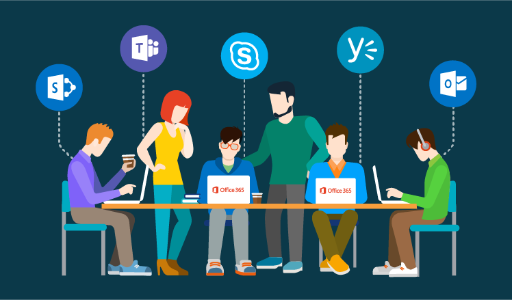
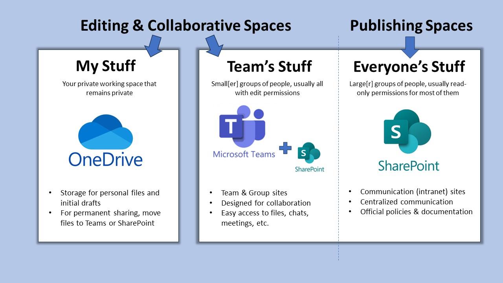

<!-- Hidden by default -->


<script>
document.addEventListener("DOMContentLoaded", function() {
  const params = new URLSearchParams(window.location.search);
  const isContrib = params.get("contribute") === "true";
  if (isContrib) {
    document.getElementById("wf-image").style.display = "block";
  }
});
</script>

::: callout-outcomes

## 💡 Learning Outcomes

- Navigate core UoN digital ecosystem
- Apply digital best practices in collaboration & file organisation
- Manage your research identity
- Identify essential practices for secure research
:::

::: callout-questions

## ❓ Questions

1. What are the basic tools do I need to conduct research at UoN?
2. How do I maintain a consistent online researcher identity?
3. What best practices should I undertake to ensure my research is secure?  
:::


# Introduction to the Digital Skills Programme

{fig-align="center" max-height=50%}

## Structure & Agenda

1. Introduction to the Digital Skills Programme (~10+10 min)  
2. Institutional Systems for Digital Research (~10+10 min)  
3. Research Identity and Profiles (~10+10 min)  
4. Digital Security & Good Practice (~10+10min)  

> 🔧 4 Activities spaced every 10 minutes.

## What is the Digital Skills programme

The **Digital Skills** programme equips researchers with the competencies required for modern, data-driven scholarship. 

The programme is not about tools....

It is also about **connecting researchers** with the people who work with data, including **data stewards**, **software engineers**, and **information specialists**. 

## Bridging Communities

This programme aims to bridge the gap between disciplinary experts and technical specialists. 

  ```{mermaid}
flowchart TB
    A["Data Collection"] --> B["Analysis"] --> C["Collaboration"] --> D["Publication & Sharing"]
    D --> A
    style A fill:#E3F2FD,stroke:#1565C0,stroke-width:1px
    style B fill:#E8F5E9,stroke:#2E7D32,stroke-width:1px
    style C fill:#FFF3E0,stroke:#EF6C00,stroke-width:1px
    style D fill:#F3E5F5,stroke:#6A1B9A,stroke-width:1px
```

> 💬 *Collaboration at every stage of the research process improves the quality of  outputs and supports a more open, reproducible culture.*

## Building Better Research Habits

The Digital Skills programme aims to supports researchers in developing practical habits that improve their ability to conduct research.

| **Focus Area** | **Good Practice** | **Research Benefit** |
|----------------|-------------------|----------------------|
| 🧩 **Collaboration** | Use shared digital workspaces and clear communication channels | Stronger teamwork and project continuity |
| 💾 **Data Management** | Keep data well-organised and documented throughout the project | Easier access, reuse, and long-term preservation |
| ⚙️ **Workflow Clarity** | Record methods, code, and decisions as you work | Improves transparency and reproducibility |
| 🌍 **Open Practice** | Share findings and materials early and responsibly | Increases visibility, impact, and trust |

> ⚙️ *Good digital practice builds resilient, connected, and credible research.*


## Programme Structure

The programme offers **three tiers of learning**, from foundational to applied and specialist skills.

| **Level** | **Focus** | **Example Modules** |
|------------|------------|---------------------|
| **Foundation** | Core digital research competencies | Essential Digital Skills |
| **Intermediate** | Theory and collaboration in data science | Python, R, Software Engineering |
| **Advanced** | Applied analysis and discipline-specific practice | Bioinformatics, HPC, ML/AI |

> 🧩 *Each tier builds practical capability and supports research independence.*

## Courses

| Course                             | Description                                                                 | Duration       | Note |
|------------------------------------|-----------------------------------------------------------------------------|----------------|------|
| Essential Digital Skills – Foundation | Introduces the tools, practices, and principles needed to participate confidently in digital research. | 4× half days   |      |
| Methods for Data Science – Theoretical    | Introduces coding, software, and collaboration practices needed for sustainable research. | 4× half days   |      |
| Methods for Data Science – Applied Python | Provides practical experience in data analysis and interpretation using Python. | 2 days         | Introductory and intermediate |
| Methods for Data Science – Applied R      | Provides practical experience in data analysis and interpretation using R.     | 2 days         | Introductory and intermediate |
| Advanced       | —           | 1 day?    |  AI? ML? Bioinformatics?    |

---

::: callout-task

#### Task 1: Digital Skills Reflection

Let’s start by reflecting on your current skills.  

❓ *Which digital skills (or tools) do you want to learn more about this year?* 

<div id="frame-q1"></div> 
<script>
document.addEventListener("DOMContentLoaded", function() {
  const params = new URLSearchParams(window.location.search);
  const base = "https://ds-shiny-helper.azurewebsites.net/edsm1/?embed=true";
  const isContrib = params.get("contribute") === "true";

  const src = isContrib
    ? `${base}&contribute=true#shiny-tab-q1_input`
    : `${base}#shiny-tab-q1_results`;

  document.getElementById("frame-q1").innerHTML =
    `<iframe src="${src}" width="100%" height="500" frameborder="0"
             style="border:none;" title="Q1"></iframe>`;
});
</script>

:::

# Institutional Systems for Digital Research

{fig-align="center" width=500px}

## Why Institutional Systems Matter

Digital research depends on **connected systems** that enable collaboration, safeguard data, and streamline research workflows.

```{mermaid}
flowchart TB
    A["Researchers"]:::a --> B["Institutional Systems"]:::b --> C["Collaborative Outputs"]:::c
    C --> A
    classDef a fill:#E3F2FD,stroke:#1565C0,stroke-width:1px
    classDef b fill:#E8F5E9,stroke:#2E7D32,stroke-width:1px
    classDef c fill:#FFF3E0,stroke:#EF6C00,stroke-width:1px
```

> 🧩 *Institutional systems form the backbone of a connected research ecosystem.*

## UoN’s Digital Ecosystem

At the University of Nottingham, research operates within a **digitally integrated environment** that connects people, data, and administration.

| **System** | **Primary Role** |
|-------------|------------------|
| **Microsoft 365** | Collaboration and communication |
| **SharePoint** | Long-term data and document sharing |
| **UniCore** | Finance, HR, and procurement |
| **RIS (Worktribe)** | Research lifecycle, funding, outputs |

> 🏛️ *Together these platforms enable secure, collaborative, and transparent research practice.*

## Microsoft 365: A Platform for Collaboration

Microsoft 365 supports daily research activity—from communication to data management—within a single, integrated workspace.

| **Tool** | **Function** |
|-----------|---------------|
| **Word & Excel** | Writing, data capture, and co-editing |
| **OneDrive** | Personal cloud storage with versioning |
| **Teams** | Communication, meetings, shared workspaces |
| **SharePoint** | Institutional document repositories |

> 💬 *Microsoft 365 is the shared workspace for modern research collaboration.*

## Collaboration in Practice

Microsoft 365 enables seamless teamwork across roles and locations.

- Co-edit documents with real-time version tracking  
- Use Teams for context-based discussion and meetings  
- Store project materials in structured SharePoint libraries  
- Sync files through OneDrive for offline access  

> 🔁 *Integrated tools make collaborative research smooth, secure, and efficient.*

## File Collaboration Best Practice

- Use **Teams or SharePoint** for shared project files  
- Enable **autosave and version history** in Word or Excel  
- Maintain **logical folder structures** by project phase  
- Apply **permissions and access control** with care  

> 🧠 *Good file management is the foundation of digital reproducibility.*

## UniCore and RIS: Institutional Systems

UniCore and RIS link the operational and administrative sides of research.

| **System** | **Purpose** |
|-------------|-------------|
| **UniCore** | Finance, HR, procurement, and resource management |
| **RIS (Worktribe)** | Project proposals, outputs, and compliance tracking |

> 🗂️ *These systems ensure research activity is visible, auditable, and supported.*

## UniCore Overview

**UniCore** is UoN’s enterprise system for managing finance, HR, and procurement.

```{mermaid}
flowchart TB
    P["Purchasing"]:::a --> E["Expenses"]:::b --> H["HR & Leave Management"]:::c --> R["Research Operations"]:::d
    R --> P
    classDef a fill:#E3F2FD,stroke:#1565C0,stroke-width:1px
    classDef b fill:#E8F5E9,stroke:#2E7D32,stroke-width:1px
    classDef c fill:#FFF3E0,stroke:#EF6C00,stroke-width:1px
    classDef d fill:#F3E5F5,stroke:#6A1B9A,stroke-width:1px
```

> 🧭 *UniCore underpins the financial and operational side of research at the university.*

## RIS (Research Information System)

**RIS (Worktribe)** records, tracks, and reports the full research lifecycle.

| **Feature** | **Purpose** |
|--------------|-------------|
| **Grant Management** | Develop and cost funding proposals |
| **Outputs Tracking** | Record publications and datasets |
| **Impact Recording** | Capture engagement and REF evidence |
| **ORCID Integration** | Synchronise researcher identity and outputs |

> 📚 *RIS ensures research activity is captured and connected institutionally.*

## Integrated Research Systems

The strength of UoN’s infrastructure lies in **interoperability**, connecting research activity, collaboration, and administration.

```{mermaid}
flowchart LR
    M["Microsoft 365"]:::a --> S["SharePoint"]:::b --> R["RIS (Worktribe)"]:::c --> U["UniCore"]:::d --> M
    classDef a fill:#E3F2FD,stroke:#1565C0,stroke-width:1px
    classDef b fill:#E8F5E9,stroke:#2E7D32,stroke-width:1px
    classDef c fill:#FFF3E0,stroke:#EF6C00,stroke-width:1px
    classDef d fill:#F3E5F5,stroke:#6A1B9A,stroke-width:1px
```

> 🔗 *Connectivity between systems ensures seamless movement from idea to output.*

## System Use in Context

| **Research Task** | **Recommended System** | **Collaboration Benefit** |
|--------------------|------------------------|----------------------------|
| Co-author a paper | OneDrive / Word | Real-time editing and version control |
| Submit a funding bid | RIS | Shared proposal development and audit trail |
| Claim expenses | UniCore | Secure and traceable reimbursement |
| Share datasets | SharePoint / Teams | Controlled access and persistence |
| Record outputs | RIS + ORCID | Automatic institutional linking |

> ⚙️ *Each platform serves a distinct role in the research ecosystem.*


## The Broader Vision: Connected Research

By using institutional systems effectively teams build **trust and accountability**, data remains **secure, reusable, and open** and researchers can spend more time working on **innovation and discovery**

```{mermaid}
flowchart TB
    A["Transparency"]:::a --> B["Trust"]:::b --> C["Collaboration"]:::c --> D["Impact"]:::d
    D --> A
    classDef a fill:#E3F2FD,stroke:#1565C0,stroke-width:1px
    classDef b fill:#E8F5E9,stroke:#2E7D32,stroke-width:1px
    classDef c fill:#FFF3E0,stroke:#EF6C00,stroke-width:1px
    classDef d fill:#F3E5F5,stroke:#6A1B9A,stroke-width:1px
```

> 🌍 *Digital infrastructure is the connective tissue of modern research.*

---

::: callout-task

#### Task 2: Match Research Tasks to Tools

::: panel-tabset
##### Activity

List the digital tools you would use for each of the following:

<div id="frame-q2"></div>
<script>
document.addEventListener("DOMContentLoaded", function() {
  const params = new URLSearchParams(window.location.search);
  const base = "https://ds-shiny-helper.azurewebsites.net/edsm1/?embed=true";
  const isContrib = params.get("contribute") === "true";

  const src = isContrib
    ? `${base}&contribute=true#shiny-tab-q2_input`
    : `${base}#shiny-tab-q2_results`;

  document.getElementById("frame-q2").innerHTML =
    `<iframe src="${src}" width="100%" height="500" frameborder="0"
             style="border:none;" title="Q2"></iframe>`;
});
</script>

##### Answers

- **Microsoft Word -> Sharepoint + Teams** are ideal for collaborative document editing  
- **RIS (Worktribe)** is used for grant applications and research output tracking  
- **UniCore** handles finance, procurement, HR and expenses  
- **Microsoft Teams + SharePoint** are best for group file access and collaboration  
:::
:::

# Research Identity & Profiles

{fig-align="center" width=500px}

## Why Research Identity Matters

Your **research identity** defines how your work is discovered, attributed, and connected across the digital research ecosystem.

```{mermaid}
flowchart TB
    P["Publications"]:::a --> O["ORCID iD"]:::b --> R["Repositories & Funders"]:::c --> I["Institutional Systems (RIS, HR)"]:::d
    I --> P
    classDef a fill:#E3F2FD,stroke:#1565C0,stroke-width:1px
    classDef b fill:#E8F5E9,stroke:#2E7D32,stroke-width:1px
    classDef c fill:#FFF3E0,stroke:#EF6C00,stroke-width:1px
    classDef d fill:#F3E5F5,stroke:#6A1B9A,stroke-width:1px
```

> 🧩 *A coherent digital identity ensures your contributions are visible, citable, and connected.*

## The Importance of Consistency

A consistent identity links your outputs, affiliations, and roles automatically across systems. This approach:

- Guarantees **proper attribution** and supports efficient collaboration.
- Ensures **discoverability** across publishers and repositories  
- Prevents **duplication or misattribution** of outputs  

> 💡 *A consistent research identity builds long-term recognition and credibility.*

## ORCID: A Persistent Digital Identifier

**ORCID (Open Researcher and Contributor ID)** is the global standard for uniquely identifying researchers across institutions and disciplines.

```{mermaid}
flowchart LR
    A["Researcher"]:::a --> B["ORCID iD"]:::b --> C["Funders"]:::c
    B --> D["Publishers"]:::d
    B --> E["Repositories"]:::e
    classDef a fill:#E3F2FD,stroke:#1565C0,stroke-width:1px
    classDef b fill:#E8F5E9,stroke:#2E7D32,stroke-width:1px
    classDef c fill:#FFF3E0,stroke:#EF6C00,stroke-width:1px
    classDef d fill:#F3E5F5,stroke:#6A1B9A,stroke-width:1px
    classDef e fill:#E1F5FE,stroke:#0277BD,stroke-width:1px
```

> 🧠 *Your ORCID iD is your digital fingerprint across the global research ecosystem.*

## Why ORCID is Essential

- **Universal interoperability:** used by funders, publishers, and institutions  
- **Automatic updates:** Crossref and DataCite can sync new outputs  
- **Portability:** your iD remains active throughout your career  

> 🔗 *ORCID connects your research identity beyond institutional boundaries.*

## RIS (Research Information System) at UoN

At UoN, **RIS (Worktribe)** complements your ORCID profile by linking research activity to institutional records.

| **Feature** | **Function** |
|--------------|--------------|
| **Grant Management** | Tracks proposals, approvals, and costings |
| **Outputs Dashboard** | Records publications, datasets, and impacts |
| **Compliance** | Supports REF and Open Access requirements |
| **Integration** | Syncs with ORCID and external repositories |

> 🏛️ *RIS ensures your institutional identity mirrors your global research presence.*

## ORCID–RIS Integration

```{mermaid}
flowchart LR
    O["ORCID iD"]:::a --> R["RIS (Worktribe)"]:::b --> P["Public Staff Page"]:::c
    R --> F["Funders & Repositories"]:::d
    classDef a fill:#E3F2FD,stroke:#1565C0,stroke-width:1px
    classDef b fill:#E8F5E9,stroke:#2E7D32,stroke-width:1px
    classDef c fill:#FFF3E0,stroke:#EF6C00,stroke-width:1px
    classDef d fill:#F3E5F5,stroke:#6A1B9A,stroke-width:1px
```

> 💬 *Connecting ORCID to RIS automates data flow and strengthens institutional visibility.*


## Scholarly Profiles Across Systems

Different platforms amplify your professional presence.  
When synchronised with ORCID, they create a distributed network of your scholarly identity.

| **Platform** | **Purpose** | **Notes** |
|---------------|-------------|-----------|
| **Scopus Author ID** | Tracks citations, co-authorship, and affiliations | Merge duplicates for accuracy |
| **Google Scholar** | Monitors visibility and citation trends | Manual curation may be required |
| **ResearchGate / Academia.edu** | Social exchange platforms | Use responsibly; metrics are non-standard |

> ⚠️ *Prioritise signing up to verified systems like ORCID, Scopus, and RIS for credible visibility.*


## Managing Your Research Profiles

It is recomended that you:

- Make your **ORCID profile public** for discoverability  
- **Merge duplicate Scopus IDs** to ensure accuracy  
- **Link ORCID to RIS** for automatic synchronisation  
- Use consistent **name and affiliation formats**  
- Avoid unverified or **proprietary metrics**  
- **Audit profiles regularly** for correctness  

> 🧭 *Managing your identity actively ensures your research remains visible and verifiable.*

## Research Identity as Collaboration Infrastructure

A connected identity supports collaboration, attribution, and trust across teams.

```{mermaid}
flowchart TB
    A["Accurate Profiles"]:::a --> B["Discoverable Expertise"]:::b --> C["Collaborative Opportunities"]:::c --> D["Trusted Attribution"]:::d
    D --> A
    classDef a fill:#E3F2FD,stroke:#1565C0,stroke-width:1px
    classDef b fill:#E8F5E9,stroke:#2E7D32,stroke-width:1px
    classDef c fill:#FFF3E0,stroke:#EF6C00,stroke-width:1px
    classDef d fill:#F3E5F5,stroke:#6A1B9A,stroke-width:1px
```

> 🤝 *A well-managed identity connects people, data, and recognition across research networks.*

## The Broader Impact of a Connected Identity

- Enhances **interdisciplinary visibility**  
- Simplifies **authorship and data attribution**  
- Strengthens **institutional reporting** and compliance  
- Promotes **open, transparent research collaboration**  

> 🌍 *A connected identity enables connected research.*

---

::: callout-task 

#### Task 3: Research Identity Self-Audit

::: panel-tabset

#####  Task

❓ Do you have a ORCID research identity? 

Visit [Orcid](https://orcid.org/), Log in / sign up

❓ Is your ORCID iD is populated with your name, affiliation etc? if not make sure that is complete. 
- Set your ORCID ID to public (if appropriate)  

#####  Note

- You can actually link your RIS and ORCID profiles, but for that you need to be registered to use worktribe. It is recomended that you [request access](https://nottingham-research.worktribe.com/login.jx)
- Once registered you will be able to link your ORCID and RIS profiles. For more infomation please refer to the [RIS training materials](http://moodle.nottingham.ac.uk/course/view.php?id=47898).
:::
:::

# Digital Security & Good Practice

## Why Digital Security Matters

Effective digital research requires vigilance, responsibility, and sound data stewardship to protect not only research, but also collaborators and institutions.

```{mermaid}
flowchart TB
    A["Trust & Compliance"]:::a --> B["Data Integrity"]:::b --> C["Confidentiality"]:::c --> D["Continuity"]:::d --> E["Collaboration Resilience"]:::e --> A
    classDef a fill:#E3F2FD,stroke:#1565C0,stroke-width:1px
    classDef b fill:#E8F5E9,stroke:#2E7D32,stroke-width:1px
    classDef c fill:#FFF3E0,stroke:#EF6C00,stroke-width:1px
    classDef d fill:#F3E5F5,stroke:#6A1B9A,stroke-width:1px
    classDef e fill:#E1F5FE,stroke:#0277BD,stroke-width:1px
```

> 🔒 *Digital security is a collective responsibility: protecting data protects discovery.*

## Passwords & Access Management

Passwords remain the first line of defence against unauthorised access.  
Weak or reused passwords are still the most common research vulnerability.

- Use **at least 12 characters** with a mix of cases, numbers, and symbols  
- Create **unique passwords** for each system  
- Never share credentials via email or chat  
- Regularly **review access permissions** for shared platforms  

> 🧠 *Strong passwords are simple, low-cost defences against complex risks.*

## Multi-Factor Authentication (MFA)

**MFA** adds a crucial verification step beyond a password.  
Even if your password is compromised, MFA prevents most unauthorised logins.

```{mermaid}
flowchart LR
    U["User Login"]:::a --> P["Password"]:::b --> V["Second Factor (App / SMS / Key)"]:::c --> A["Access Granted"]:::d
    classDef a fill:#E3F2FD,stroke:#1565C0,stroke-width:1px
    classDef b fill:#E8F5E9,stroke:#2E7D32,stroke-width:1px
    classDef c fill:#FFF3E0,stroke:#EF6C00,stroke-width:1px
    classDef d fill:#F3E5F5,stroke:#6A1B9A,stroke-width:1px
```

> 🔐 *Think of MFA as the seatbelt of your digital life—simple, unobtrusive, and essential.*

## Device & Data Protection

Devices are gateways to institutional data.  
Protecting them is vital for maintaining research integrity and trust.

| **Action** | **Purpose** |
|-------------|-------------|
| Store files on OneDrive or SharePoint | Secure cloud storage with version control |
| Avoid local or personal cloud drives | Prevent data loss and compliance breaches |
| Enable screen locks and encryption | Protect devices if lost or stolen |
| Use separate user profiles on shared machines | Maintain privacy and accountability |

> ⚙️ *Encryption safeguards your work even when devices are compromised.*


## Secure Remote Access

Remote work expands flexibility but increases risk.  
Safe access protects your data wherever you work.

- Always connect through the **UoN VPN** when off campus  
- Avoid public Wi-Fi without VPN protection  
- Keep **software and systems updated** before connecting  
- Define **secure sharing protocols** for collaborators  

> 🌍 *A VPN keeps your connection secure—your data stays private, even on public networks.*

## Data Backup Strategy

Backups prevent irreversible data loss from accidents, failures, or attacks.  
Follow the **3-2-1 Rule** to ensure resilience.

| **Rule** | **Description** |
|-----------|-----------------|
| **3 Copies** | Maintain three versions of your data |
| **2 Media Types** | Store on two different media (e.g., cloud and drive) |
| **1 Offsite** | Keep one copy offsite or in the cloud |

> 💾 *A backup untested is not a backup—it’s a hypothesis.*

## Cybersecurity Best Practices

Cybersecurity requires daily habits, not one-off actions.

- **Verify sender identity** before opening attachments or links  
- **Avoid personal email** for research communication  
- **Report incidents** immediately to UoN IT Security  
- Ensure **GDPR compliance** for international collaborations  

> 🧩 *Cybersecurity is continuous awareness—prevention through habit.*

## Building a Culture of Digital Responsibility

Security is cultural as much as technical.  
A trustworthy digital environment depends on shared awareness and accountability.

- Apply strong passwords and MFA as standard  
- Use secure institutional storage and VPNs  
- Implement regular backups and data audits  
- Communicate and report risks openly  

> 🛡️ *Security and good practice underpin research credibility—protecting data protects discovery.*

---

::: callout-task

#### Task 4: Digital Security Self-Audit (10 min)

::: panel-tabset
##### Exercise  
<div id="frame-q4"></div>
<script>
document.addEventListener("DOMContentLoaded", function() {
  const params = new URLSearchParams(window.location.search);
  const base = "https://ds-shiny-helper.azurewebsites.net/edsm1/?embed=true";
  const isContrib = params.get("contribute") === "true";

  const src = isContrib
    ? `${base}&contribute=true#shiny-tab-q4_input`
    : `${base}#shiny-tab-q4_results`;

  document.getElementById("frame-q4").innerHTML =
    `<iframe src="${src}" width="100%" height="500" frameborder="0"
             style="border:none;" title="Q4"></iframe>`;
});
</script>

##### Follow-up  
- Identify one way in which you can improve your digital security in the coming week  
- Reflect on what was easy/hard to assess, and which barriers exist for better practice  
:::
:::

# Further Information

## UoN Training Resources

- Microsoft 365 Training Resources
- Excel 2016: Basic–Advanced (Online)
- Staff session: Managing your online and RIS research profiles
- Digital Accessibility: The Core Nottingham Accessible Practices
- RIS: Worktribe User Guidance 
- UniCore Training Materials
- UoN Information Security: Protect Your Data & Devices

---

::: callout-keypoints

## 📚 keypoints

- UoN currently uses Microsoft 365 tools support collaborative writing, file sharing, and communication
- UniCore manages research-related administration  and RIS manages the research lifecycle.
- A well-maintained research identity increases visibility and attribution of your work.
- Store research data in encrypted, university-backed platforms and ensure your account details are protected
:::

---

::: callout-hints

## 🔦 hints

- Store shared project files in Microsoft Teams rather than OneDrive to ensure long-term access for collaborators.
- Use version history in OneDrive/SharePoint instead of manually renaming file versions.
- Link your ORCID iD to your RIS profile to automate tracking of publications and outputs.
- Practice “security by default”
:::