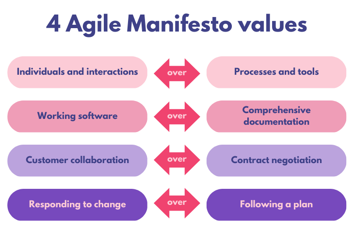
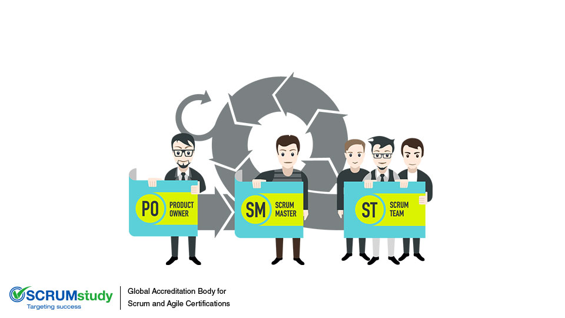

## Module Overview

- **Module:** DSDS-M? – Digital Delivery  
- **Course:** Data Science and Digital Skills (DSDS)  
- **Audience:** Early Career Researchers (PhD, Postdoc)  
- **Duration:** ~40 minutes directed teaching (+40 minutes exercises)  

---

::: callout-outcomes

## 💡 Learning Outcomes

- Understand how Agile values and principles apply to the delivery of research projects  
- Recognise roles and responsibilities in research teams and how they map to Agile/Scrum roles  
- Plan and deliver research or digital outputs in iterative sprints  
- Embrace shared ownership and collaborative research culture  
:::

---

::: callout-questions

## ❓ Questions

1. How can Agile values and principles be adapted for research projects?  
2. How do research team roles map to Agile/Scrum roles?  
3. What practices enable collaborative and iterative delivery of research outputs?  
:::

## Structure & Agenda

1. What is Agile for Research? (~10+10 min)  
2. Roles & Responsibilities (~10+10 min)  
3. Sprint-Based Delivery (~10+10 min)  
4. Shared Ownership & Culture (~10+10 min)  

# What is Agile for Research

## Overview

Agile thinking encourages researchers to view their projects not as fixed, linear processes but as evolving explorations. Instead of assuming that research questions, data availability, or methods are stable from the start, Agile practices invite continuous reflection and adjustment. This mindset helps avoid wasted effort on over-specified methods or outdated research designs. 

## Adopting an Agile mindset means

- Treating **research questions as hypotheses** that can be refined through iteration.  
- Valuing **rapid prototyping** of analyses or tools to test feasibility before investing heavily.  
- Using **feedback loops** with peers, supervisors, or stakeholders to check relevance and direction early.  
- Recognising that **failure is informative** — a negative or inconclusive result can still guide the next sprint.  

## Key Concepts

- Agile = Adaptability, Learning, Feedback Loops  
- From ‘step-by-step’ research → continuous discovery & innovation  
- Hypotheses as "user stories"  
- Value early validation over polished outputs  

## Agile Manifesto (adapted for research)

{fig-align="center" width=500px} 

### Examples in Research

- Running short cycles of data collection and preliminary analysis instead of waiting until the end of a project.  
- Sharing partially completed models, scripts, or results to gather input rather than waiting for polished outputs.  
- Adjusting study focus if early findings suggest new directions.  
- Using collaborative tools (e.g. Git, shared notebooks) to keep work transparent and adaptable.  

---

::: callout-task

#### Task 1: Discussion Prompt

::: panel-tabset

##### Question
*How could working in smaller research cycles help us avoid dead ends or irrelevant outputs?*

##### Follow-up
- Consider how smaller cycles can reduce wasted time.  
- Share examples from your own projects.  
:::
:::

# Roles and Responsibilities in Research & Agile Teams

{fig-align="center" width=500px}

## Traditional Research Roles

- Principal Investigator  
- Post-Doctoral Research Associate / Fellow  
- Research Software Engineer / Data Analyst  
- Subject Matter Experts  
- Project Coordinator / Manager  

These roles often have clearly defined responsibilities, but collaboration between them can be fragmented. Agile encourages reframing these roles as complementary and iterative rather than siloed.

## Agile/Scrum Roles

- **Product Owner** = Research Lead or PI (sets direction)  
- **Scrum Master** = Research Facilitator / Coordinator (removes blockers, supports team)  
- **Development Team** = Analysts, Developers, SMEs, Assistants (do the work collaboratively)  

In Agile, responsibilities are distributed. The Product Owner defines vision, but delivery is team-driven. The Scrum Master supports process and wellbeing. The Development Team collectively delivers value, with shared accountability.

### How the roles align

| Research Role | Agile Role       | Responsibility                                      |
|---------------|------------------|-----------------------------------------------------|
| PI            | Product Owner    | Define priorities, vision, link research to goals   |
| Coordinator   | Scrum Master     | Facilitate, track progress, resolve issues          |
| Analysts/SMEs | Development Team | Deliver outputs, refine understanding, share skills |

### Practical Considerations

- **Overlap:** One person may wear multiple hats in small teams (e.g., a PI may also act as Scrum Master).  
- **Flexibility:** Roles are not job titles; they represent responsibilities that may rotate.  
- **Team autonomy:** Development Team members decide how best to achieve sprint goals together.  

---

::: callout-task

#### Task 2: Reflection Prompt

::: panel-tabset

##### Question
*Where do you see yourself fitting in an Agile team based on your current role?*

##### Follow-up
- Share with a partner how your role responsibilities align with Agile.  
- Consider whether your role might shift in a more collaborative setting.  
:::
:::

# Sprint-Based Delivery and Coordination

{fig-align="center" width=500px}

## Key Concepts

- Work delivered in short iterations: 1–3 week sprints  
- Regular stand-ups to share progress and blockers  
- Sprint review/demo to show insights or findings  
- Retrospective to improve team working  

## Research Adaptation

- **Sprint** = Time-boxed research experiment or deliverable  
- **Backlog** = List of questions, hypotheses, tasks  
- **Stand-ups** = Quick team syncs on blockers or progress  
- **Retrospectives** = Discuss what went well, what to adjust  

---

::: callout-task

#### Task 3: Exercise

::: panel-tabset

##### Question
*Design a 1-week research sprint for investigating a data quality issue. What are your key tasks? What would you deliver?*

##### Follow-up
- Outline 2–3 specific tasks.  
- Decide what constitutes a successful sprint outcome.  
:::
:::

# Shared Ownership and Research Culture

{fig-align="center" width=500px}

## Agile Principles That Support Research Culture

- Team over individual heroes  
- Embracing uncertainty  
- Psychological safety  
- PI / customer / team feedback as basis for improvement  

Agile culture in research emphasises shared accountability and mutual support. This means that success is attributed to the team, not individuals, and challenges are tackled collectively. Creating an environment of psychological safety is central: researchers should feel able to admit mistakes, share early findings, and challenge assumptions without fear.

## Application to Research Teams

- **Co-develop research questions** so that the team feels invested in both the problem and the solution.  
- **Share draft findings early** to invite feedback and reduce the risk of pursuing unproductive directions.  
- **Rotate ownership** of demos, sprint updates, or reporting duties to distribute responsibility and visibility.  
- **Encourage open critique** by establishing ground rules for constructive feedback and regular reflection sessions.  
- **Celebrate team learning** (not just results) by acknowledging experiments that generated useful insights, even if inconclusive.  

## Strategies for Fostering Shared Ownership

- Establish **transparent communication channels** (shared dashboards, collaborative notebooks, project boards).  
- Build **inclusive decision-making** practices by inviting input from all disciplines and roles.  
- Use **paired or group working** to spread knowledge and avoid single points of failure.  
- Document lessons learned in retrospectives to build a living knowledge base for the group.  

---

::: callout-task

#### Task 4: Sprint Planning Simulation

::: panel-tabset

##### Question

In pairs or small groups, pick a small research goal (e.g., *Analyse user engagement on a platform*).

##### Task

- Break it into sprint-sized tasks (3–5)  
- Decide on a sprint goal  
- Assign responsibilities  

##### Follow-up

Discuss how this changed how you’d approach the work vs. a linear plan.
:::
:::

# Further Information

## UoN Training Resources

- [UoN Researcher Academy Training Catalogue](https://www.nottingham.ac.uk/researcher-academy/training)  
- Agile workshops and DSDS modules

---

::: callout-keypoints

## 📚 Keypoints

- Agile supports adaptability, collaboration, and iterative delivery in research  
- Research roles can map directly to Agile/Scrum roles  
- Small cycles reduce wasted effort and encourage early feedback  
- Shared ownership strengthens research culture  
:::

---

::: callout-hints

## 🔦 Hints

- Agile is not just for coders — it enables responsive, collaborative research.  
- You don’t have to follow Scrum perfectly; start small (e.g., daily syncs, 1-week sprints).  
- The minimum Scrum framework is regular feedback and planning sessions with PIs.  
- Embrace shared ownership: delivery is everyone’s responsibility.  
:::