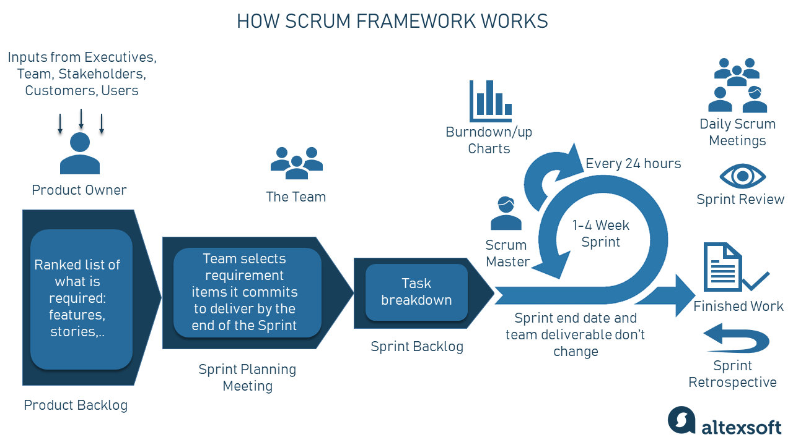
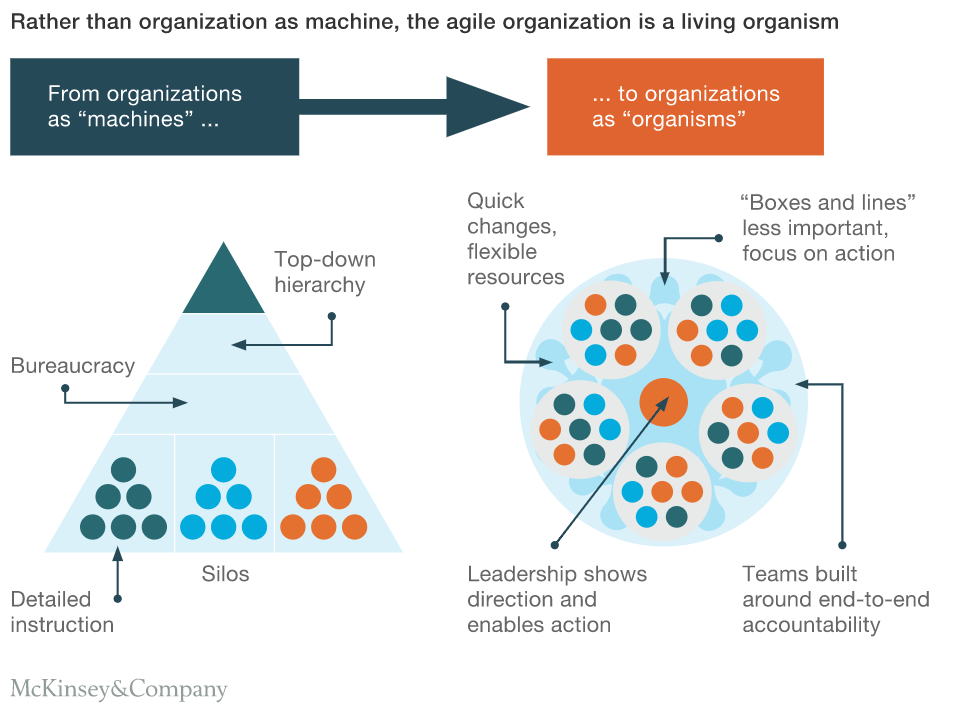

::: callout-outcomes

## 💡 Learning Outcomes

- Understand how Agile values and principles apply to the delivery of
  research projects  
- Recognise roles and responsibilities in research teams and how they
  map to Agile/Scrum roles  
- Plan and deliver research or digital outputs in iterative sprints  
- Embrace shared ownership and collaborative research culture  
:::

::: callout-questions

## ❓ Questions

1.  How can Agile values and principles be adapted for research
    projects?  
2.  How do research team roles map to Agile/Scrum roles?  
3.  What practices enable collaborative and iterative delivery of
    research outputs?  
:::

## Structure & Agenda

1. Agile for Research (~20 min)  

2. Scrum for research (~20 min)
  
3. Sprint-Based Delivery and Coordination (~20 min)  

4. Shared Ownership & Culture (~20 min)

# Agile for Research

## Traditional research process

The traditional research process is often framed as **linear**: define a question, collect data, analyse, publish.  

```{mermaid}
flowchart LR
    A[Define Research Question] 
    B[Collect Data]
    C[Analyse Results]
    D[Publish Findings]

    A --> B --> C --> D
    
    style A fill:#f5f5f5,stroke:#333,stroke-width:1px
    style B fill:#e0f7fa,stroke:#333,stroke-width:1px
    style C fill:#e8f5e9,stroke:#333,stroke-width:1px
    style D fill:#fff3e0,stroke:#333,stroke-width:1px
``` 

> ⚠️ While this approach offers structure, it can limit flexibility when new information, technologies, or constraints emerge.  

## What is Agile?

Agile is an **iterative and adaptive approach** to delivering work that emphasises:

- **Collaboration** 
- **Flexibility**
- **Learning** 
- **Transparency**
- **continuous feedback**

> 💡 *Agile means treating knowledge creation as a continuous experiment: learning, testing, and adapting as you go.*

## Iterative cycles

Instead of completing a research project in one linear sequence, Agile breaks work into **small, manageable cycles**, each delivering value, gathering feedback, and refining direction.

```{mermaid}
flowchart TB
    %% Main concept nodes (A–D)
    A["<b>Iterative Hypotheses</b>"]
    B["<b>Rapid Prototyping</b>"]
    C["<b>Feedback Loops</b>"]
    D["<b>Learn from Failure</b>"]

    %% Descriptive subnodes (wrapped)
    A1["Treat questions as evolving ideas"]
    B1["Test early to assess feasibility"]
    C1["Engage stakeholders early and often"]
    D1["View negative results as valuable insights"]

    %% Flow connections
    A --> B --> C --> D --> A

    %% Link descriptions below each main node
    A --> A1
    B --> B1
    C --> C1
    D --> D1

    %% Styling for main nodes
    style A fill:#E3F2FD,stroke:#1565C0,stroke-width:1px
    style B fill:#E8F5E9,stroke:#2E7D32,stroke-width:1px
    style C fill:#FFF3E0,stroke:#EF6C00,stroke-width:1px
    style D fill:#F3E5F5,stroke:#6A1B9A,stroke-width:1px

    %% Styling for descriptive nodes
    classDef desc fill:#FFFFFF,stroke:#999,stroke-dasharray:3 3,width:340px;
    class A1,B1,C1,D1 desc;

```

## Agile Values: 

Applying Agile values to research means prioritising:

- **Individuals and collaboration** over rigid project documentation  
- **Working analyses and prototypes** over perfect but unused plans  
- **Stakeholder interaction** over isolated investigation  
- **Adapting to change** over following an inflexible proposal  

> ❌ This does **not** reject structure or planning, it rebalances priorities to emphasise responsiveness, communication, and continuous improvement.

## Examples of applying Agile practise to research

1. **Data Collection:** Instead of collecting all data at once, researchers run **short cycles** of data gathering and preliminary analysis.  
2. **Experimentation:** Develop early **proof-of-concept experiments** to test methodology and identify bottlenecks before committing.
3. **Reporting:** Share **partial results or visualisations** with supervisors or collaborators to verify relevance, detect errors, and improve clarity, long before formal publication.
4. **Direction:** If early results indicate an unexpected trend or limitation, **pivot** research focus. Adjust hypotheses the or analytic methods in response to data.


> 🧩 *Small, visible, and frequent, keeps projects flexible, auditable, and aligned.*

## Agile Tools for Researchers

Below are some tools that can be helpful when adopting Agile practices: 

| **Purpose** | Tool / Platform | Agile Benefit |
|--------------|------------------|----------------|
| **Task management and planning** | Planner / Trello / Jira | Supports structured iteration and tracking |
| **Visual planning and workflow mapping** | Miro / Lucidchart | Encourages shared understanding and adaptability |
| **Reproducible analysis documentation** | Jupyter / R Markdown / Quarto | Facilitates iterative improvement and peer review |
| **Version control, collaboration, code transparency** | Git / GitHub / GitLab | Enables review, and iteration |

## Towards an Agile Research Culture

Adopting agile principles in research shifts the focus from rigid adherence to initial plans toward **responsive adaptation**, enabling research to thrive in dynamic, interdisciplinary environments.

- Teams become **more resilient** to change and uncertainty.  
- Outputs are **more reproducible**, as methods evolve transparently.  
- Collaboration improves through shared visibility and iterative refinement.  
- Research becomes **more impactful**, as feedback informs direction in real time.


> ⭐ Agile research is not about speed: It’s about responsiveness. The ability to learn, adapt, and collaborate faster than the world changes.

---

::: callout-task

#### Task 1: Why Work Iteratively?

- **Form groups of 5–6 people.**
- Discuss the pros and cons of *short, iterative research cycles* compared to long, linear projects.  
- Identify **five ways** iterative approaches can help avoid dead ends, reduce wasted effort, or prevent irrelevant outputs.  
- Capture your main ideas on a shared board or notes.

**Follow-up:**  
Share one key insight with the plenary, explain *why* it helps prevent wasted research effort.

:::

# Scrum for research

## Traditional Research Roles

Research teams often rely on **fixed hierarchies** that define expertise and control but can limit adaptability.

```{mermaid}
flowchart TB
    %% Main role nodes (A–E)
    A["<b>Principal Investigator (PI)</b>"]
    B["<b>Postdoctoral Researchers</b>"]
    C["<b>Analysts</b>"]
    D["<b>Project Managers</b>"]
    E["<b>Subject Experts</b>"]

    %% Descriptive subnodes
    A1["Leads the research project"]
    B1["Conduct analyses and interpret findings"]
    C1["Develop and refine analytical methods"]
    D1["Coordinate timelines and deliverables"]
    E1["Provide domain knowledge and contextual advice"]

    %% Flow connections (illustrating collaboration cycle)
    A --> B --> C --> D --> E --> A

    %% Descriptive links
    A --> A1
    B --> B1
    C --> C1
    D --> D1
    E --> E1

    %% Styling for main nodes
    style A fill:#E8F5E9,stroke:#2E7D32,stroke-width:2px
    style B fill:#E3F2FD,stroke:#1565C0,stroke-width:1px
    style C fill:#E3F2FD,stroke:#1565C0,stroke-width:1px
    style D fill:#FFF3E0,stroke:#EF6C00,stroke-width:1px
    style E fill:#F3E5F5,stroke:#6A1B9A,stroke-width:1px

    %% Styling for descriptive nodes
    classDef desc fill:#FFFFFF,stroke:#999,stroke-dasharray:3 3,width:340px;
    class A1,B1,C1,D1,E1 desc;
```

> 🧭 Clear but rigid structures can create **silos**, reduce communication, and limit shared ownership.

## Scrum for Research Collaboration

Scrum offers a **lightweight framework**, with defined roles for coordinating complex, evolving projects.

| **Scrum Role** | **Research Analogue** | **Key Function** |
|----------------|------------------------|------------------|
| **Product Owner** | Principal Investigator or Research Lead | Defines vision and priorities; aligns with goals and impact |
| **Scrum Master** | Research Facilitator or Coordinator | Supports process flow, removes blockers, maintains focus |
| **Development Team** | Postdocs, Analysts, Data Scientists, SMEs | Conducts research, analyses data, co-creates deliverables |

> 💡 Scrum supports flexibility while maintaining structure and clarity.

## The Scrum Role Loop

Scrum roles form a **feedback system** where leadership, facilitation, and delivery operate iteratively.

```{mermaid}
flowchart TB
    %% Main role nodes (A–C)
    A["<b>Product Owner</b>"]
    B["<b>Scrum Master</b>"]
    C["<b>Development Team</b>"]

    %% Descriptive subnodes
    A1["Sets research vision and priorities"]
    B1["Facilitates agile processes and removes blockers"]
    C1["Executes analyses and refines outputs iteratively"]

    %% Flow connections (cyclic collaboration)
    A --> B --> C --> A

    %% Descriptive links
    A --> A1
    B --> B1
    C --> C1

    %% Styling for main nodes
    style A fill:#E8F5E9,stroke:#2E7D32,stroke-width:1px
    style B fill:#FFF3E0,stroke:#EF6C00,stroke-width:1px
    style C fill:#E3F2FD,stroke:#1565C0,stroke-width:1px

    %% Styling for descriptive nodes
    classDef desc fill:#FFFFFF,stroke:#999,stroke-dasharray:3 3,width:340px;
    class A1,B1,C1 desc;
```

> 🔁 Each role reinforces the others, creating a **cycle of adaptation and feedback**.

## Core Principles

Scrum principles emphasise **iteration**, **communication**, and **shared accountability**.

| Agile Principle | Research Translation | 
|-----------------|----------------------| 
| Collaboration over control | Encourage open discussion and co-creation | 
| Iteration over perfection | Deliver incremental results and refine | 
| Communication over documentation | Focus on clarity and alignment | 
| Shared ownership | Collective accountability for success |

> ⚙️ Agility grows through clarity, transparency, and trust.

## Scalability

Scrum roles scale with project size and complexity, evolving as teams grow and responsibilities diversify.

- Small teams: A PI often combines leadership and coordination, acting as both Product Owner and Scrum Master.
- Growing teams: Dedicated facilitators emerge to manage process flow, freeing the PI to focus on research vision and priorities.
- Large, distributed teams: Roles become more specialised—Scrum Masters coordinate across sub-teams, and multiple Product Owners align local goals with overarching research objectives.

> 🧩 As research teams expand, Scrum roles shift from multitasking to coordinated specialisation, scaling process without losing agility.


---

::: callout-task

#### Task 2: Roles in Agile Research Teams
 
- Within your group, map each other to one or more of the following: **Product Owner**, **Scrum Master**, **Development Team**.  
- Discuss how responsibilities might shift in a more collaborative, cross-functional setting.  
- Sketch your team as a simple diagram or list showing feedback and communication flow.

**Follow-up:**  
Nominate one speaker to summarise how **collaboration** or **decision-making** would change under this model.

:::


# Sprint-Based Delivery and Coordination



## Sprint-Based Research

The **short, structured cycles** of focused work in Agile are called **sprints**

Each sprint provides visibility, adaptability, and shared accountability.

> ⏱️ *Sprints make progress visible, feedback actionable, and research more responsive.*

## Why Use Sprints?

Sprints Encourages steady, measurable progress:

- Surfaces challenges early through short feedback loops  
- Builds collaboration and collective ownership  
- Maintains focus through clear, time-boxed goals  
- Turns uncertainty into structured learning  

> 🧩 *The sprint cycle transforms uncertainty from risk into discovery.*

## The Sprint Cycle

There are four key components of the standard sprint cycle:

```{mermaid}
flowchart LR
    P["<b>Planning</b>"]:::plan --> 
    E["<b>Execution</b>"]:::exec --> 
    R["<b>Review</b>"]:::review --> 
    RET["<b>Retrospective</b>"]:::retro --> 
    P

    classDef plan fill:#E3F2FD,stroke:#1565C0,stroke-width:1px
    classDef exec fill:#E8F5E9,stroke:#2E7D32,stroke-width:1px
    classDef review fill:#FFF3E0,stroke:#EF6C00,stroke-width:1px
    classDef retro fill:#F3E5F5,stroke:#6A1B9A,stroke-width:1px
```

> 🔄 *Each cycle delivers both outputs and learning.*

## Anatomy of a Sprint

So what do these processes / stages mean? 

| **Stage** | **Description** | **Example** |
|------------|-----------------|--------------|
| **Planning** | Define objectives and select tasks | Choose analyses or datasets to test |
| **Execution** | Work toward defined outputs | Run experiments or prototype models |
| **Review** | Share outcomes and collect feedback | Discuss early results / interpretations |
| **Retrospective** | Reflect and refine processes | Identify improvements for the next sprint |

> 💬 *Reflection and feedback drive iteration.*

## Example: A Two-Week Research Sprint

Sprints can be any length—ranging from a few days to several weeks—depending on the scope and pace of the project.  
A two-week sprint provides a balanced rhythm for focus, collaboration, and review.  
Each phase combines delivery, reflection, and adaptation.

| **Week** | **Focus** | **Outputs** |
|-----------|------------|-------------|
| **Week 1** | Define objectives, explore materials or data, and plan methods | Clear goals, early insights, initial setup |
| **Week 2** | Conduct work, review outcomes, and reflect on process | Draft findings, refined workflow, lessons learned |

> 📈 *The aim is to maintain momentum while creating space for discovery, adjustment, and shared reflection.*

## Meetings in Research Sprints

Regular, structured meetings keep research teams aligned and adaptive.  
They replace long, infrequent check-ins with short, purposeful interactions.

| **Meeting Type** | **Purpose** | **Typical Timing** |
|------------------|------------------|---------------|
| **Sprint Planning** | Define objectives, assign tasks, and clarify expectations | Start of each sprint |
| **Stand-Up** | Share progress, identify blockers, coordinate efforts | 10–15 min each day |
| **Sprint Review** | Present outcomes, gather feedback, refine next steps | End of sprint |
| **Retrospective** | Reflect on process and teamwork, identify improvements | After review |

> 💬 *Short, focused meetings create rhythm, accountability, and continuous learning across the research cycle.*

## Embedding Sprint Thinking

Sprints are more than a workflow, they’re a mindset for how research evolves, learns, and collaborates.

- Build research plans that can **adapt as insight grows**  
- Treat **feedback as learning**, not correction  
- Keep **progress visible** through small, cumulative outputs  
- Make **collaboration continuous**, not episodic  
- Focus on **process as a shared responsibility**

> “Sprints don’t just accelerate research, they make learning intentional, progress visible, and collaboration sustainable.”

---

::: callout-task

#### Task 3: Design a Two-Week Research Sprint

- Choose a small, realistic project (e.g. pilot study, data validation, literature mapping).  
- Define your **sprint goal**, what should be achieved in two weeks?  
- Break the work into **3–5 tasks**.  
- Identify your **expected outputs** (data, plots, notes, draft methods).  
- Decide how you’ll measure success at the end of the sprint.

**Follow-up:**  
Compare your sprint to a traditional plan.  
What new opportunities or risks does the iterative approach create?

:::

# Shared Ownership and Research Culture



## Agile Principles That Shape Research Culture

Agile is more than a method, it’s a **mindset** that shapes how research teams collaborate, learn, and adapt.  
In environments defined by uncertainty, Agile principles build **resilience, transparency, and trust**.

```{mermaid}
flowchart LR
    A["<b>Shared Accountability</b>"]:::a --> B["<b>Psychological Safety</b>"]:::b --> C["<b>Continuous Learning</b>"]:::c
    A --> C
    classDef a fill:#E3F2FD,stroke:#1565C0,stroke-width:1px
    classDef b fill:#FFF3E0,stroke:#EF6C00,stroke-width:1px
    classDef c fill:#F3E5F5,stroke:#6A1B9A,stroke-width:1px
```

> 🌱 *An Agile research culture values collaboration over competition and progress over rigid certainty.*

## Team Over Individual Heroes

Research often celebrates individual brilliance, but real progress is **collective**.

- Agile research replaces individual ownership and rigid leadership with **shared responsibility, team visibility, and collaborative progress**.  
- Success becomes a **collective achievement**, built through rotating facilitation and mutual support.  

> 🤝 *Research thrives when recognition, responsibility, and learning are shared across the team.*

## Continuous Feedback Loops

Feedback is the heartbeat of Agile research: a mechanism for alignment, reflection, and improvement.

- Integrate feedback in every sprint: planning, review, retrospective  
- Use concise visual summaries for faster response  
- Treat feedback as dialogue rather than evaluation  

> 🔁 *Feedback in Agile research is not correction; it’s calibration.*

## Embedding Agile Practice in Daily Research

Agile only works when principles translate into **daily behaviour** and **shared process**.

- **Co-develop research questions**: shared ownership starts at design.  
- **Share findings early**: use sprint reviews or informal demos.  
- **Rotate visibility**: let everyone present or report progress.  
- **Encourage open critique**: focus on process, not blame.  
- **Celebrate learning**: value discovery, not just outcomes.

> 🧠 *Teams that learn together perform together.*

## Building a Sustainable Agile Research Culture

A thriving Agile research culture grows through **intentional practice**, reflection, communication, and inclusivity.

| **Principle** | **Description** |
|----------------|-----------------|
| **Open Dialogue** | Embed reflection and discussion into daily collaboration. |
| **Collective Recognition** | Celebrate progress as a shared achievement, not an individual milestone. |
| **Visible Progress** | Share updates and feedback transparently across the team. |
| **Empathy & Curiosity** | Value learning, adaptability, and mutual understanding. |

> “Agility in research isn’t about working faster, it’s about working *together*, learning continuously, and building something that lasts.”

---

::: callout-task

#### Task 4: Sprint Simulation and Reflection

- Use your sprint plan from Task 3.  
- Assign provisional roles (**Product Owner**, **Scrum Master**, **Team**).  
- Walk through a condensed cycle: *Planning → Execution → Review → Retrospective*.  
- Discuss how blockers or feedback would be managed in real time.  
- Note one improvement you’d make to strengthen collaboration or communication.

**Follow-up:**  
Reflect together:  
How did the sprint structure affect ownership, adaptability, and shared learning?

:::

# Further Information

## UoN Training Resources

- [UoN Researcher Academy Training
  Catalogue](https://uniofnottm.sharepoint.com/sites/ResearcherAcademyTrainingHub/SitePages/Home.aspx)  


::: callout-keypoints

## 📚 Keypoints

- Agile supports adaptability, collaboration, and iterative delivery in
  research  
- Research roles can map directly to Agile/Scrum roles  
- Small cycles reduce wasted effort and encourage early feedback  
- Shared ownership strengthens research culture  

:::

::: callout-hints

## 🔦 Hints

- Agile is not just for coders, it enables responsive, collaborative
  research.  
- You don’t have to follow Scrum perfectly; start small (e.g., daily
  syncs, 1-week sprints).  
- The minimum Scrum framework is regular feedback and planning sessions
  with PIs.  
- Embrace shared ownership: delivery is everyone’s responsibility.  

:::
