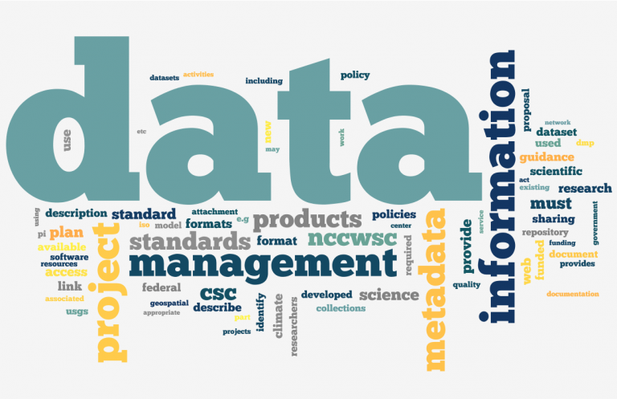
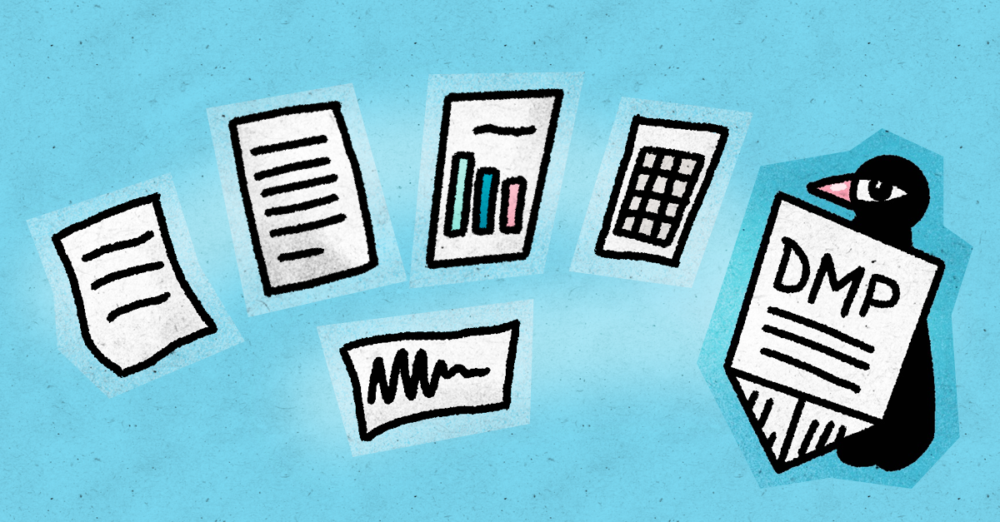
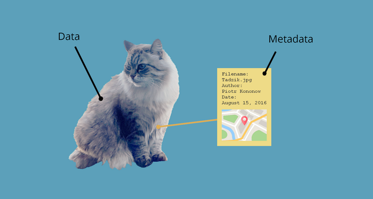

::: callout-outcomes

## 💡 Learning Outcomes

* Define roles and responsibilities for managing research data at the University of Nottingham (UoN).
* Produce a concise Data Management Plan (DMP) covering storage, documentation, sharing, retention and preservation.
* Generate robust metadata for collaborative, auditable workflows.
* Select appropriate institutional storage and archiving solutions for different data types.
* Assess and improve dataset reusability in line with **FAIR** principles (Findable, Accessible, Interoperable, Reusable).
:::

::: callout-questions

## ❓ Questions

1. Who is accountable for **long-term preservation** decisions?
2. What are the **essential sections** of a Data Management Plan (DMP)?
3. How would you design a **collaborative folder structure** and file-naming scheme?
4. Which actions most improve the **FAIRness** of a dataset?
:::

## Structure & Agenda

1. RDM at UoN (~15 min)
2. Data Management Plans (~15 min)
3. Data Structuring, Metadata and Archiving (~15 min)
4. Reusable Data in Practice (~15 min)

---

# RDM at UoN

{fig-align="center" width=400px}   

## Why is RDM important

Research Data Management (RDM) ensures that data are **organised, secure, documented and preserved** to support research integrity, reproducibility and reuse. Effective RDM is a shared responsibility across project roles and institutional services.

## Risk Management

* Data risks arise through inadequate documentation, inappropriate storage, weak access controls and unclear retention decisions.  
* Mitigation involves:  
  - Early identification of sensitive data categories.  
  - Use of approved platforms with defined roles and permissions.  
  - Periodic review of storage locations and data flows.  
* Well-specified RDM reduces the likelihood of loss, breach, or unresolvable provenance gaps.

## Roles and Responsibilities

| **Role**                        | **Key Responsibilities**                                                                                                   |
| ------------------------------- | -------------------------------------------------------------------------------------------------------------------------- |
| **Principal Investigator (PI)** | Accountable for project-level RDM, retention and preservation. Ensures compliance with funder and institutional policies. |
| **Researchers**                 | Day-to-day organisation, secure handling, documentation and quality control. Implement the DMP.                           |
| **Project Team**                | Shared responsibility for access, version control and documentation.                                                      |
| **Library (RDM Support)**       | Advises on metadata, citation, archiving and FAIR compliance.                                                             |
| **Digital Technology Services**                 | Provides secure storage, backup and collaboration platforms.                                                              |
| **Information Security**        | Defines classification tiers and enforces access controls.                                                                 |

## RDM roles
```{mermaid}
flowchart LR
    PI[Principal Investigator]
    T[Project Team]
    R[Researchers]
    L[Library - RDM Support]
    IT[Digital Technology Services]
    IS[Information Security]

    A[DMP & Preservation Oversight]
    B[Apply RDM Standards]
    C[Liaise for Metadata & Archiving]
    D[Metadata & Documentation Advice]
    E[Secure Storage & Access Controls]

    %% Role-to-Responsibility Mapping
    PI --> A
    T --> B
    R --> C
    L --> D
    IT --> E
    E --> IS

    %% Responsibility Flow
    A --> B --> C --> D --> E
```

> 🧭 *Good RDM depends on collaboration and accountability across roles.*

## Code of Practice on RDM: Expectations

* Plan data **before** collection using a DMP; review regularly.
* Store in **approved platforms** and apply **data classification** and access controls.
* Maintain **metadata and documentation** sufficient for audit and reuse.
* Agree **retention and preservation** periods and identify archives.
* Enable **responsible sharing**; record reasons for restrictions.

## Data Lifecycle Model

```{mermaid}
flowchart LR
    A[Plan & Design] --> B[Collect]
    B --> C[Process & Analyse]
    C --> D[Store & Share]
    D --> E[Preserve & Reuse]
```

> 🔁 *RDM supports every stage of the data lifecycle, not just archiving.*

## Costs and Resourcing

* RDM activities involve effort (documentation, metadata, validation) and may incur storage or software costs.  
* Planning should begin at proposal stage, especially when projects generate large or long-lived datasets.  
* PIs are responsible for ensuring appropriate resources throughout the project and into the preservation phase.

## Institutional Storage Options

| **Platform**             | **Purpose**                 | **Notes**                                 |
| ------------------------ | --------------------------- | ----------------------------------------- |
| **OneDrive**             | Individual work area        | Automatic versioning and sync             |
| **SharePoint / Teams**   | Collaborative workspace     | Fine-grained permissions, version control |
| **CPS Research Storage** | Group-managed access        | Backed-up, scalable                       |
| **TRE Secure Storage**   | Sensitive/confidential data | Encryption, limited access, audit logs    |

> 🔐 *Choose storage based on sensitivity, access needs and classification level.*

---

::: callout-task

#### Task 1: Group RDM Roles Map (10 min)

**Objective:** Identify how roles and responsibilities would operate for the research project described on your scenario card.

**Instructions:**

1. Analyse your scenario card and list all activities that generate, handle, store, or transfer data.  
2. Assign each activity to the appropriate role (PI, researchers, project team, IT Services, Information Security).  
3. Identify areas where responsibilities overlap, where escalation is likely, or where accountability may be unclear.  
4. Summarise one shared responsibility and one ambiguity your group identified.

**Reflection:** Which RDM responsibilities are most often misunderstood or overlooked within real projects?

:::

# Data Management Plans

{fig-align="center" width=400px}

## What is a data managment plan

A **Data Management Plan (DMP)** describes how data are created, managed and preserved. It clarifies accountability, ensures transparency and supports compliance with institutional and funder requirements.

## Why DMPs Matter

| **Purpose**             | **Outcome**                                 |
| ----------------------- | ------------------------------------------- |
| Clarify expectations    | Reduces confusion and duplication           |
| Ensure compliance       | Meets funder and institutional requirements |
| Improve reproducibility | Ensures transparency and documentation      |
| Manage risk             | Prevents loss, breaches and misuse         |

> 🗂️ *A DMP is both a planning tool and a compliance artefact.*

## Funder Expectations and UoN Template

Funders such as UKRI, Wellcome and Horizon Europe mandate DMPs at proposal stage. The UoN template aligns with these standards and includes:

1. Data description and anticipated volume.
2. Formats and standards.
3. Documentation and metadata approach.
4. Storage, backup and security.
5. Legal, ethical and IP considerations.
6. Sharing, reuse and licensing.
7. Retention and preservation.
8. Roles, responsibilities and costs.

## Characteristics of a High-Quality DMP

* Provides clear, specific solutions tailored to each dataset.  
* Demonstrates alignment with funder policy, ethical requirements and institutional practice.  
* Internally consistent across storage, access control, documentation and retention.  
* Identifies decision points that require scheduled review.

## Common Weaknesses in DMPs

* Overstated openness without assessing legal or ethical constraints.  
* Vague commitments regarding documentation and metadata.  
* Missing retention timelines or unclear archival locations.  
* No explicit assignment of responsibilities, particularly during staff changes.

## Integrating DMPs with Ethics and Governance

DMPs complement ethical review and governance processes:

* Ethics applications often reference DMP storage and retention.
* DPIAs may draw on DMP risk and safeguard sections.
* Data sharing statements in publications should reflect the final DMP.

> 🔄 *DMPs should evolve as the project and data context change.*

---

::: callout-task

#### Task 2: Group DMP Scenario (10 min)

**Objective:** Draft the core elements of a Data Management Plan tailored to the scenario on your card.

**Instructions:**

1. Identify the main datasets (raw, processed, derived) implied by your scenario.  
2. Specify formats, documentation needs and storage platforms suitable for the data.  
3. Identify legal, ethical, or IP constraints that must be addressed within the DMP.  
4. Outline expected sharing routes, access conditions and retention/preservation decisions.  
5. Capture 3–4 essential commitments that would appear in a concise DMP summary.

**Reflection:** Which components of your draft DMP are most likely to require revision as the project evolves?

:::

# Data Structuring, Metadata and Archiving

{fig-align="center" width=400px}

## Be organised

Effective RDM relies on consistent organisation and clear documentation. Structured data and metadata support collaboration, transparency and long-term preservation.

## File Naming and Structure

Use stable, descriptive and version-controlled names:

```
YYYYMMDD_project-feature_description_vNN.ext
```

**Example**

```
20250112_survey_raw_v01.csv
20250115_audio_int01_redacted_v02.wav
20250120_analysis_results_v03.parquet
```

> 🗃️ *Meaningful naming prevents confusion and simplifies version tracking.*

## Data Structuring, Metadata and Archiving: Version Control Beyond Filenames

* Filenames support version tracking but should be complemented by:  
  - Git repositories for code, text and small structured datasets.  
  - Structured changelogs recording rationale and context.  
  - Automated provenance capture where possible.  
* Version control supports reproducibility and prevents silent overwrites.

## Metadata and Documentation Essentials

| **Document**        | **Purpose**                                  |
| ------------------- | -------------------------------------------- |
| **README.md**       | Overview of project and data organisation    |
| **CODEBOOK.md**     | Defines variables, units and coding schemes |
| **CHANGES.md**      | Tracks version history                       |
| **DATA DICTIONARY** | Lists fields, formats, provenance            |

> 🧩 *Metadata describes context, structure and provenance for reuse.*

## Metadata Standards Overview

* **Dublin Core:** Generic metadata standard.
* **DataCite:** For citation and repository submission.
* **ISA-Tab / MIAME:** For biomedical and omics data.
* **JSON-LD / Schema.org:** For machine-readable web metadata.

> 🌐 *Select standards appropriate to your discipline and repository.*

## Preparing Data for Archival Deposit

* Preparation requires:  
  - Conversion to open, stable formats.  
  - Integrity and completeness checks.  
  - Removal or segregation of sensitive data when justified.  
* Archival metadata must specify provenance, methods, quality assessments and licensing.


---

::: callout-task

#### Task 3: Group Folder Design (10 min)

**Objective:** Develop a folder structure and metadata approach appropriate for the research scenario on your card.

**Instructions:**

1. Define file-naming conventions suitable for the data types in your scenario.  
2. Identify which components require the most detailed metadata (e.g., sensor logs, transcripts, genomic data).  
3. Decide what documentation (README, codebook, data dictionary, CHANGES log) is necessary to support reproducibility and collaboration.  
4. Indicate which folders or files require restricted access.

**Reflection:** Which metadata elements most strongly influence long-term reusability?
:::


# Reusable Data in Practice

{fig-align="center" width=400px}

## What is FAIR

Reusable data align with the **FAIR** principles: 

1. Findable
2. Accessible
3. Interoperable
4. Reusable. 

These are designed to promote transparency and maximise research value.

## What does FAIR mean for data?

| **Principle**     | **Features**                                  | **Practice Example**          |
| ----------------- | --------------------------------------------- | ----------------------------- |
| **Findable**      | Persistent IDs, indexed metadata              | Dataset DOIs, ORCID iDs       |
| **Accessible**    | Clear access conditions, stable landing pages | Repository with metadata only |
| **Interoperable** | Open formats, controlled vocabularies         | CSV + ontology alignment      |
| **Reusable**      | Licences, provenance, documentation           | CC BY licence + CODEBOOK.md   |

```{mermaid}
flowchart LR
    A[Findable] --> B[Accessible] --> C[Interoperable] --> D[Reusable] --> A
```

## Evaluating FAIR Reuse Potential

* Assess reuse value by examining:  
  - Completeness of metadata and provenance.  
  - Transparency of processing steps.  
  - Clarity of variable definitions and methodological notes.  
  - Sustainability of formats and identifiers.  
* Well-documented datasets retain scientific value beyond project closure.

## Implementing FAIR at Project Level

* Assign persistent IDs and maintain metadata.
* Use community-recognised ontologies for interoperability.
* Provide detailed documentation for reuse.
* Record provenance in README or metadata fields.

## Common Barriers to FAIRness

* Proprietary formats without documentation.
* Missing variable definitions.
* Restricted data without published metadata.
* No persistent links between outputs and code.

## Licensing and Reuse Conditions

* Reuse depends on clear legal and licensing statements.  
* Permissive licences (e.g., CC BY) maximise impact for non-sensitive data.  
* Constrained datasets may require controlled-access repositories with published metadata.  
* Explicit terms guide secondary use and reduce uncertainty.


---

::: callout-task

#### Task 4: Group FAIRness Audit (10 min)

**Objective:** Evaluate how data from your scenario card could meet the FAIR principles and identify improvements.

**Instructions:**

1. Assess how Findable, Accessible, Interoperable and Reusable the scenario’s datasets would be.  
2. Identify concrete gaps (e.g., missing metadata, proprietary formats, unclear access conditions, limited provenance).  
3. Propose one improvement that is realistically achievable for the scenario.  
4. Note any elements that cannot be made fully FAIR and explain why (e.g., confidentiality, legal restrictions).

**Reflection:** Which FAIR principle presents the greatest challenge in your scenario and what constrains it?
:::

# Further Information

* Research Data Management (Standalone): complementary training
* [Code of Practice on Research Data Management](https://www.nottingham.ac.uk/library/research/research-data-management/index.aspx)
* [Code of Research Conduct and Research Ethics](https://www.nottingham.ac.uk/research/ethics-and-integrity/)
* Annual **Information Security Awareness** training (mandatory).

::: callout-keypoints

## 📚 Keypoints

* Plan early using a DMP and review at milestones.
* Use approved storage, structured folders and meaningful names.
* Maintain documentation and metadata to support reuse.
* Decide retention and preservation routes before project end.
* Aim for FAIR data; share as openly as possible with justified restrictions.
:::

::: callout-hints

## 🔦 Hints

* Keep DMPs short, specific and actionable.
* Treat README and CODEBOOK as living documents.
* Separate raw and processed data.
* Prefer open formats and controlled vocabularies.
* Publish metadata even when data cannot be shared.
:::
