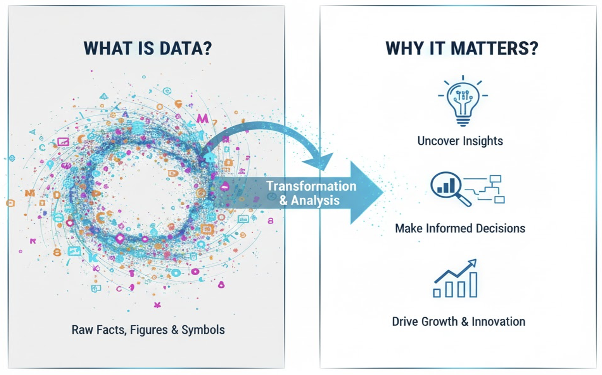
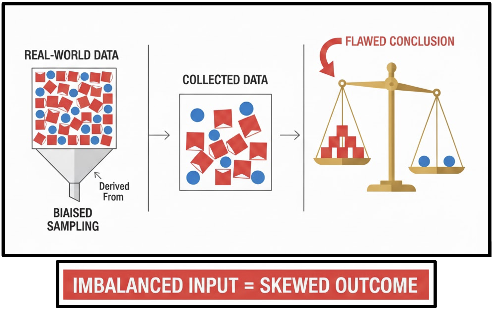
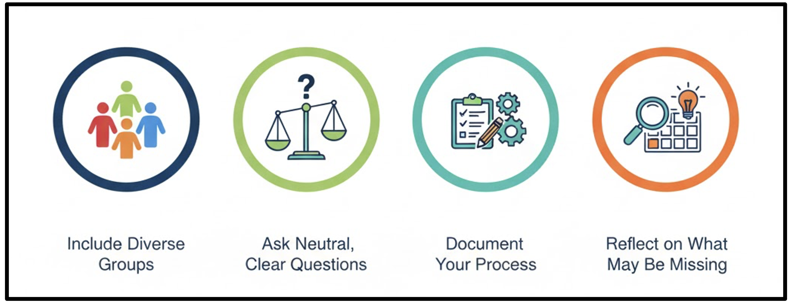

::: {.content-visible when-format="revealjs"}

<!-- Hidden by default -->
{fig-align="center" width=400px}

:::

# Introduction

Understanding *where* data comes from, *how* it is collected, and *why* certain choices matter is fundamental to good research practice.  

This module introduces the principles and practicalities of collecting high-quality, ethical, and relevant data to support effective analysis.

::: callout-outcomes

## Learning Outcomes

By the end of this module, you will be able to:

-	Understand where data comes from and why source quality matters.
-	Differentiate clearly between primary vs secondary data.
-	Plan data collection using strong questions and relevant variables.
-	Match the correct tool to the correct data format.
-	Recognise bias and fairness issues in data collection.
:::

::: callout-questions

## ❓ Questions

-	Where does data come from?
-	How do we decide which data we actually need?
-	Which tools match which data formats?
-	How do we avoid collecting misleading or biased data?
:::

## Structure & Agenda

1.	Data Sources (~20 min)
Where data comes from, what “digital trace” means, and how primary/secondary differ.
2.	Planning for Good Data (~20 min)
How strong questions and correct variables produce meaningful data.
3.	Tools & Formats (~20 min)
Understanding common data types and choosing the right collection tool.
4.	Trust & Fairness (~20 min)
Avoiding bias and ensuring fair representation.

# Data Sources

## Welcome to the Era of Data

- Everything around you generates data — your phone, your commute, your spending, your sleep, your university’s systems.

- Understanding where this data comes from (and how good it is) is the starting point of analysis.

> Your brain processes 11 million bits of data per second

## Digital Data Trace

Digital Trace Data refers to the traces that are left across the internet as humans communicate, coordinate, gather information, and manage their daily lives. 

```{mermaid}
sequenceDiagram
    participant User
    participant DigitalSystem
    participant DataStore
    participant ThirdParties

    User->>DigitalSystem: Interact with device / internet
    DigitalSystem->>DataStore: Generate digital trace
    DataStore->>ThirdParties: Provide access to data
    ThirdParties->>DataStore: Advertising or behavioural research
```

> 🚀 Every single day, approximately 2.5 quintillion bytes of data are generated globally, this persists over time

## What is data?

Data refers to raw facts, figures, observations, and symbols that represent various aspects of reality. It's the unprocessed material from which information is derived.


{fig-align="center" width=400px}

> ❓ Before analysis, data is not meaningful — it becomes meaningful only after context and interpretation.


## Why is data important?

1.	Uncover Insights: By analysing patterns and trends within data, we can discover hidden truths, make sense of complex situations, and gain deeper understanding.
2.	Make Informed Decisions: Instead of relying on guesswork or intuition, data provides evidence to support choices, reducing risk and increasing the likelihood of successful outcomes in business, science, and everyday life.
3.	Drive Growth & Innovation: Data fuels progress by identifying opportunities, optimizing processes, predicting future trends, and enabling the creation of new products and services. It's the engine behind continuous improvement and groundbreaking advancements.

> 📝 Around 80% of a data scientist's work involves preparing and cleaning data before any analysis can begin.

## Sources of Data

-	Primary Data: data you create yourself
Example: Survey students about their favorite snack and age.
- 	Secondary Data: pre-existing datasets (government reports, open data)
Example: University demographic report or publicly available dataset of students’ age and home countries.

> 💯 Unlike secondary data, which relates to the past, primary data captures information as it happens

## Comparison of Data Sources

| Feature     | Primary Data                 | Secondary Data               |
|-------------|------------------------------|-------------------------------|
| Control     | High                          | Low                           |
| Cost        | Higher                         | Lower                         |
| Speed       | Slow                          | Fast                          |
| Relevance   | Tailored                      | Variable                      |
| Richness    | Flexible                      | Fixed                         |

> ✅ Primary data can provide unique conclusions and original insights that may not be available elsewhere

---

::: callout-task

#### Data Hunt Game

::: panel-tabset

##### Setup

**Part 1**

-	Everyone gets a blank card/paper.
-	Collect Name, Height, Favorite Snack from 3 peers.
-	Discuss how it felt to collect primary data.

**Part 2**

Downloaded dataset:

<a class="btn btn-primary" href="data/student_data.xlsx" download>
  ⬇ Download student dataset
</a>

##### Discussion

-	Compare collected primary data vs provided secondary dataset. Does it feel the same to be given secondary data?

-	Variables: Name, Gender, Age, Favorite Snack, Height, Home Country, Steps Walked (Yesterday), Library Usage (per week), Commute Time, Campus Transport Method, Hours Slept (Avg. per night), Student Status, Participation in Clubs/Societies, Frequency of Healthy Meals, Postcode, IMD Score

:::
:::

# Planning for Good Data

## Why Planning Matters

You’ve got a dataset — but do you know why you’re collecting it?

```{mermaid}
mindmap
  root(Good data)
    Relevant(Relevant)
      Answers(Answers the research question)
      Objectives(Clear objectives)
      Variables(Appropriate variables)
    Accurate(Accurate)
      Reality(Faithfully represents reality)
      Sources(Validated sources)
      Errors(Error checking)
    Complete(Complete)
      Missing(Minimal missing values)
      LowMissing(Low missingness)
      Gaps(Documented gaps)
    Consistent(Consistent)
      Formats(Uniform formats and standards)
      Units(Standard units)
      Naming(Consistent naming)
```

> Good data is not accidental. It is designed.

## How Good Questions Lead to Good Data

```{mermaid}
timeline
    Step1 : Vague idea → Improve campus transport
    Step2 : Define analysis purpose → Connecting demographic factors to commute burden
    Step3 : Measurable questions → What % cycle?; Do PG students commute longer than UG?
    Step 4: Decide Variables → Commute Time, Student Status, Transport Method?
    Step 5: Drop irrelevant variables → i.e. Height + Favorite snack → irrelevant
```

> 📌 Identifying the right questions is not enough, you need to look at the data available to you!

## Importance of Choosing the Right Variables

Selecting appropriate variables leads to more accurate predictions, faster processing and better understanding by focusing on what is important.

> ❗ Rely on expertise and previous research to identify which variables are likely to be important
 
## Good Questions Lead to Good Data

-	A vague question can produce irrelevant data or overwhelm you with unnecessary variables.
-	Good questions along with an analysis purpose help you decide which variables to collect, how to structure data, and what methods/tools to use.
-	Based on the question, you can decide which variables are most suited for your analysis.

> 🎯 Well-formed questions clarify the project's goal and the specific business problem to be solved, preventing wasted effort!

---

::: callout-task

#### Question Shuffle

Each group is given cards/list with possible data variables

::: panel-tabset

##### Instructions:

1.	Choose a project idea.
2.	Identify the analysis purpose and key question based on the project idea.
3.	Select which variables you need from the list to answer the question.
4.	Present your analysis purpose, refined key question and selected variables.

##### Debrief Discussion:

-	Some data, though interesting, may not help answer the question.
-	Planning prevents data overload, keeps analysis relevant, and saves time.

:::
:::

# Tools and Formats

## Basic Data Formats

| Data Type     | Examples                                      | What You Can Do With It                          | Notes / Considerations                                  |
|---------------|-----------------------------------------------|--------------------------------------------------|---------------------------------------------------------|
| Numeric       | Height, age, step count                       | Calculate mean, median, range, variance           | Suitable for statistical analysis                       |
| Categorical   | Home country, snack category, student status  | Counts, proportions, group comparisons            | No inherent ordering unless explicitly defined          |
| Text          | Names, open-ended survey responses             | Qualitative analysis, coding, keyword extraction  | Requires cleaning (capitalisation, spelling, formatting)|
| Time-series   | Dates, timestamps                             | Trend analysis, change over time                  | Useful for patterns; optional for simple surveys        |

> ⭐ Data formats define how data is structured, stored, and interpreted

## Examples of Data Tools

- Spreadsheets (Excel/Google Sheets) → structured tables, easy to sort/filter
- Forms/Surveys (Google Forms) → collect responses automatically
- CSV files → large datasets with numeric or textual data
- Apps, logs → Sensor or high-frequency data

> 💎 Choosing the right tool depends on your data type and scale.

## Why Tools Matter

Tools help:

-	Organise data efficiently
-	Ensure accuracy and consistency
-	Scale data collection (small vs. large datasets)

> 🌱 Around 80% to 90% of the data in the world is unstructured

## Tool Comparison

| Tool / Platform                     | Best For                              | Example Using Our Dataset                              | Notes / Considerations                                  |
|------------------------------------|---------------------------------------|--------------------------------------------------------|---------------------------------------------------------|
| Excel / Google Sheets / CSVs        | Numbers, text, categorical             | Age, Favourite snack                                   | Easy to sort/filter; suitable for small datasets        |
| Google Forms / Survey tools         | Longer text, numbers, categorical      | Name, home country, favourite snack, age               | Automatic data capture; directly exportable to Sheets   |
| Phone sensors / mobile apps         | Numeric, time-series data              | Step counts, app usage data                             | Automatic capture; structured timestamps                |

> 📈 Understanding your data type and analysis goal helps pick the right tool.

---

::: callout-task

#### Sorting Game

Now that we know different data formats and sources, lets connect them together and reinforce what has been conveyed so far!

Each group is given a deck of cards with different data formats.

::: panel-tabset

##### Instructions:

1.	Hand out data cards to each group.
2.	Categorise each card as primary or secondary data.

##### Debrief:

-	Highlight: Some sources are borderline → context matters.
-	Relate to dataset: “The data we collected from the class survey is primary, but the table I give you afterwards is secondary.”

:::
:::


# Trust and Fairness in Data

## Why Trust & Fairness Matter

-	Data is only useful if it accurately represents reality.
-	Bias can lead to incorrect conclusions or poor decisions.
-	Fair data improves credibility and decision-making.

{fig-align="center" width=400px}

> ⚙️ Data is powerful — but only if reliable

## Common Types of Bias

| Bias Type        | Example                                | Effect on Decisions                       |
|------------------|-----------------------------------------|-------------------------------|
| Sampling bias    | Only surveying morning students         | Misrepresents population      |
| Measurement bias | Using an uncalibrated scale             | Inaccurate estimates          |
| Selection bias   | Surveying only volunteers               | Inflated engagement measures  |
| Confirmation bias| Leading questions in satisfaction surveys| Skewed responses             |

> 🎭 This occurs when you only look at the data that "survived" a process, ignoring the failures.

## Principles for Fair Data

- Include diverse groups.
- Ask neutral, clear questions.
- Document your data collection process.
- Reflect on what may be missing.

{fig-align="center" width=400px}

> 💡 A bias occurs due to the tendency to search for, interpret, favor, and recall information in a way that confirms or supports one's prior beliefs or values.

---

::: callout-task

#### Biased Sampling Game

::: panel-tabset

##### Instructions:

1.	Each group gets a bag of colored counters representing the student dataset: Pink = female, Blue = male

2.	Draw a small sample and answer the following questions: What % are females? What is the average age of the females?

3.	Compare with the total population. (40% 21.75 years)

##### Discussion Prompts:

-	How does missing data skew results?
-	What could have been done to get a fairer representation?
-	Can some bias be unavoidable? How do we acknowledge it?
-	Ambiguous / mixed counters → discuss real-world data ambiguities.

:::
:::

# Further Information

::: callout-keypoints

## 📌 Keypoints

* Distinguish between **primary** (first-hand) and **secondary** (pre-existing) data, as provenance directly affects trust, reuse, and interpretation.
* Start with **clear questions and objectives** to ensure data collection is focused, relevant, and proportionate.
* Select tools that match your **data format** (e.g. spreadsheets, surveys, text files) to simplify collection, cleaning, and analysis.
* Recognise that all datasets embed **bias**; fairness requires understanding representation, limitations, and documenting decisions transparently.

:::

::: callout-hints

## 🔦 Hints

Data is not just numerical output. Effective analysis depends on thoughtful planning, careful collection, and explicit intent, ensuring that later analyses genuinely address the original research questions.

:::

## Module Summary

This module introduces the foundations of good data practice, emphasising data provenance, purposeful collection, appropriate tooling, and awareness of bias. The focus is on making deliberate, transparent choices so that downstream analysis is meaningful, reliable, and fair.

## Additional Learning

The concepts in this module connect directly to practical data handling in Python.

| Submodule                  | Python Connection                                                                 | Why It Matters                                                     |
|----------------------------|-----------------------------------------------------------------------------------|--------------------------------------------------------------------|
| Primary & Secondary Data   | Import diverse data sources (CSV, Excel, APIs) using `pandas`.                    | Enables work with heterogeneous, real-world datasets.              |
| Planning for Good Data     | Filter, select, and structure data programmatically in Python.                    | Reinforces that well-planned data leads to robust analysis.         |
| Tools & Formats            | Read and write CSV, JSON, and XLSX files using `pandas`.                          | Supports movement between tools and reproducible workflows.        |
| Trust & Fairness           | Inspect missingness, imbalance, and bias using summaries and visualisation.       | Encourages ethical, transparent, and reliable data analysis.       |