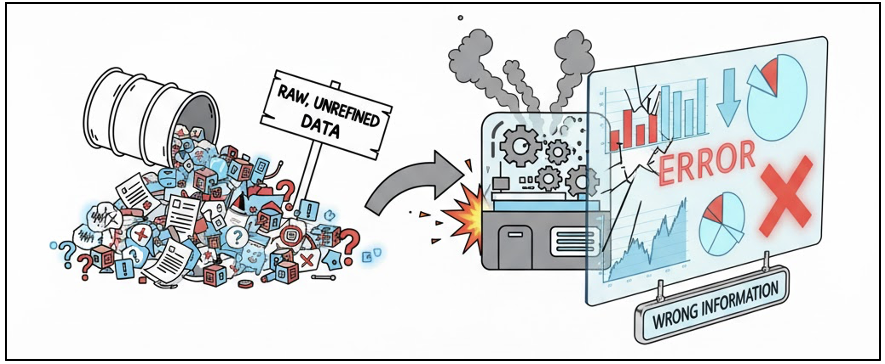
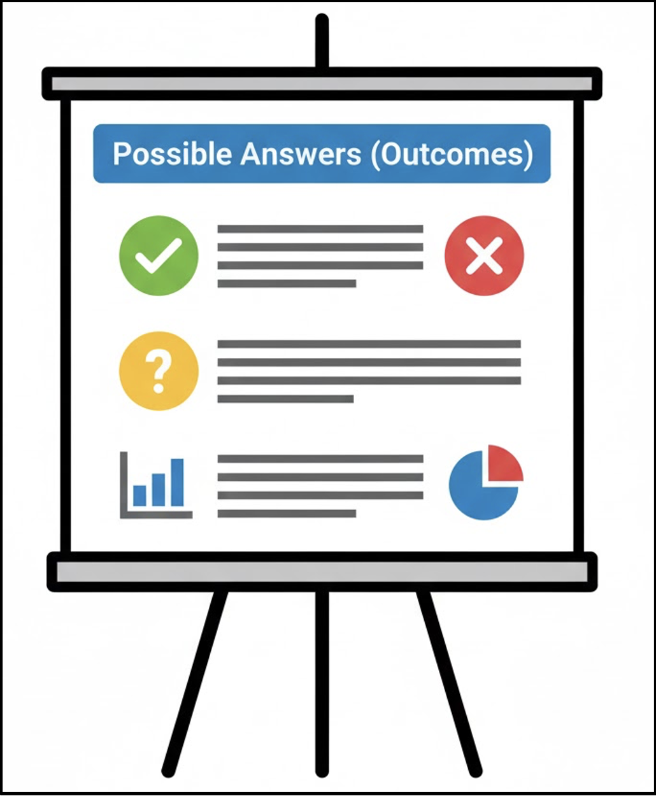
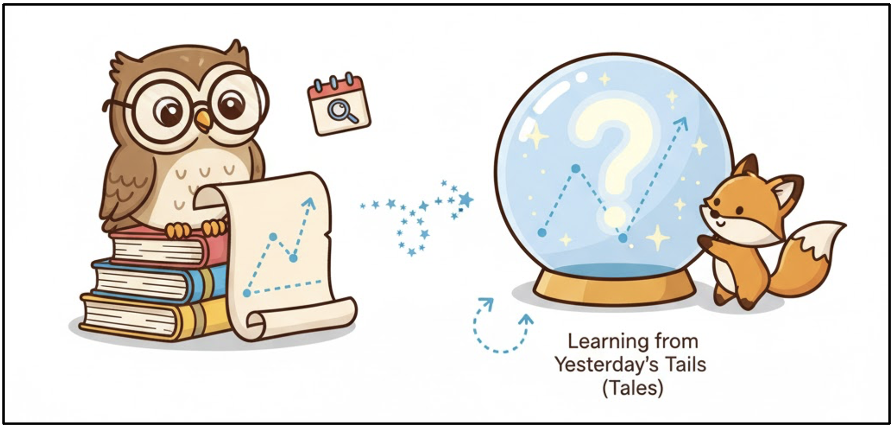
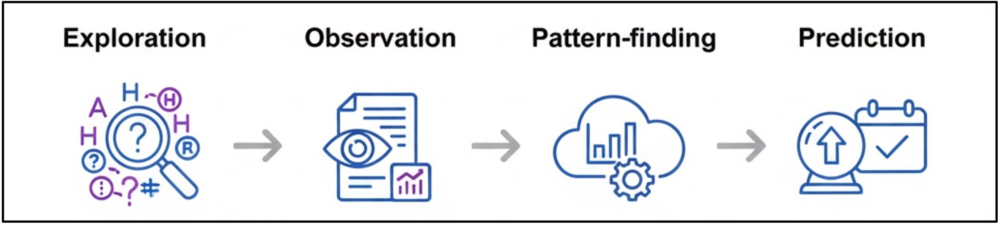

# Introduction

Organising and exploring data is a critical step between data collection and meaningful analysis.  
Raw datasets are rarely ready for use; they often contain errors, inconsistencies, and gaps that must be addressed before reliable insights can be drawn.

This module focuses on preparing data for analysis and using exploratory techniques to understand structure, patterns, and relationships, supporting the transition from description to interpretation and early prediction.

::: callout-outcomes

## 💡 Learning Outcomes

By the end of this module, you will be able to:

- Recognise why raw data requires cleaning and organisation prior to analysis.
- Apply basic techniques to tidy, structure, and validate datasets.
- Explore data to identify common features, patterns, and relationships.
- Move from descriptive observations to forming hypotheses and simple predictions.

:::

::: callout-questions

## ❓ Questions

- Why is real-world data often messy or inconsistent?
- How does cleaning and organising data improve analytical accuracy?
- What can we learn through basic data exploration and summary?
- How do insights and hypotheses support later prediction and analysis?

:::

## Structure & Agenda

1. **Organising Messy Data (~20 min)**  
   Identifying and correcting inconsistencies, duplicates, and missing values.

2. **Exploring Data (~20 min)**  
   Using basic descriptive and comparative techniques to summarise information.

3. **Finding Patterns (~20 min)**  
   Moving from exploration to interpretation by spotting trends and building hypotheses.

4. **Predicting Outcomes (~20 min)**  
   Using hypotheses to anticipate possible outcomes and introduce early predictive thinking.

# Organising Messy Data

## What is “Messy Data”?

Data rarely arrives clean. Messy data is any dataset that violates the rules required for analysis.

{fig-align="center" width=400px}

> 💬 Messy data is any data that violates the rules needed for easy analysis. It may contain missing values, inconsistent labels, extra spaces, or mixed types.

## Can you find the problems in this dataset?

| Name  | Age | Snack   | Height | Home Country     |
|-------|-----|---------|--------|------------------|
| Sarah | 21  | Chips   | 1.63 m | UK               |
| sarah | 21  | crisps  | 1.63   | United Kingdom   |
| NA    |     | Cookies | 1.7    | UK               |

> 🕵️ Think of this stage as being a data detective — scanning the scene, not solving the case yet.

## Problems Noticed

| Problem               | Example                | Impact on Analysis                       |
|----------------------|------------------------|-------------------------------------------|
| Inconsistent Entries | Sarah vs. sarah        | Impossible to count unique names          |
| Mixed Types/Formats  | 1.63m vs 163 vs 5'4"   | Blocks averages                           |
| Missing Values       | NA or blanks           | Misleading averages and errors            |
| Synonyms/Variations  | Chips vs. crisps       | Hides true popularity                     |

⚠️ If data is inconsistent, your results can be misleading or invalid. Data analysis is built on trust.

## Why Organising Matters

If your data is inconsistent, your results can be misleading or invalid.

**Organising data helps you:**

- Ensure accuracy and consistency  
- Remove duplicates  
- Handle missing values  
- Format data for analysis  

> 🧩 Clean data = reliable analysis

## The Four Pillars of Data Tidy-Up

Cleaning data often involves addressing four main categories of issues.

1.	Standardization: Making sure every entry is in the same format.
	Action: Converting '22 yrs', 'Twenty-Four' →22,24.
2.	Validation: Checking that values make logical sense.
	Action: Changing 'Age: 200' to a reasonable value or marking it as an error.
3.	Deduplication: Removing identical or near-identical rows that were recorded multiple times.
	Action: Deleting one of the identical 'Alex C.' rows.
4.	Transformation: Changing data types to suit analysis.
	Action: Converting Height from text ('5 ft 10 in') to a numerical value (177.8).

> ❌ Clean data isn't perfect data; it's data ready for reliable calculation.

## Categorical Vs. Numerical Data

Organising data includes properly identifying its type, as this determines what math you can perform.

| Type        | Description                           | Examples                | Operations Allowed      |
|-------------|----------------------------------------|-------------------------|--------------------------|
| Categorical | Qualities, groups, names               | Gender, Country, Snack | Counting, grouping       |
| Numerical   | Quantities that can be measured        | Age, Steps, Commute    | Mean, median, sum        |

> ⚙️ You must convert mixed numerical data (like '22 yrs') into pure numbers before you can calculate the mean age.

---

::: callout-task

#### Activity: The Data Detective Game

Setup:

-	Present the student dataset.
-	Scan the dataset and start finding errors: missing values, inconsistent formats, duplicates. (2 mins)

Instructions:

-	Answer the below questions (2-3 mins each).
-	Explain what you changed and why.

Questions:

1. Based on your cleaned dataset (after removing duplicates), what is the total number of unique students surveyed?
2. What is the most common of the Home Country after standardising the entries?
3. Calculate the Average Age of all students whose favorite snack is Chips.

Discussion: 
How can inconsistent categorisation hide data and skew average?
:::

# Exploring Data

## What Does It Mean to Explore Data?

Exploring data is like being a detective getting your first look at a crime scene. You don't jump to conclusions; you survey the scene to understand the layout, the context, and what's missing.
Exploration means getting to know your dataset before deep analysis.

It’s about asking foundational questions:

-	What variables exist?
-	What are their types (categorical, numerical, text)?
-	What ranges or common values appear?

> 💡 Exploration helps you catch any cleaning mistakes you missed and prepares you to form smart questions.

## Basic Exploration Techniques

| Technique | Tells You         | Example Question               |
|----------|-------------------|--------------------------------|
| Mean     | Typical value     | Average height?                |
| Median   | Middle value      | Median commute time?           |
| Mode     | Most frequent     | Most common snack?             |
| Min/Max  | Range             | Youngest and oldest?           |

> 📈 These techniques are impossible to calculate reliably until your data is clean.

## Visualising Distributions

Descriptive statistics are best understood when visualized. A distribution shows how often each value appears.

-	Symmetry: Is the data evenly spread? (e.g., ages of students)
-	Skew: Is the data bunched up on one side? (e.g., most students sleep 7-8 hours, but a few sleep 4 hours).
-	Outliers: Are there extreme values? (e.g., one student walks 50,000 steps).

> ⭐ A simple bar chart of the Campus Transport Method instantly shows you the mode and the distribution of travel options.

## The Importance of the Median

While the mean is often used, the median is crucial when your data might have outliers.

| Statistic | Meaning                      | Best Use Case                        |
|----------|------------------------------|--------------------------------------|
| Mean     | Sum of all values / Count of values                      | Best for symmetrically distributed data (e.g., Height).        |
| Median   | The value exactly in the middle of a sorted list.                 | Best for skewed data (e.g., Income or Commute Time, where a few long commutes skew the average).     |

> 💬 The median gives you a more reliable picture of the "typical" student experience.

---

::: callout-task

#### Summary Game

Download the following Dataset: *{insert link}*

Questions: 

1. What is the most common method of transport used by students?
2. What is the average number of hours students sleep?
3. What are the minimum and maximum ages of the unique students surveyed?

Discussion: 

For each of the above, what is the test you used? 

:::

# Finding Patterns

## From Observation to Patterns

After basic exploration, we move from simple facts ("The average age is 21") to asking why these facts exist.

The power of data lies in spotting patterns—trends, clusters, or relationships that tell us something new.

-	Simple Observation: The average number of steps walked is 7,000.
-	Pattern (Relationship): The average steps walked for people who walk to campus is 10,000, while the average for bus users is 4,500. (The pattern doesn't explain why they walk more, only that they do)

> 💡 Patterns show correlations, not necessarily causation—that’s key. 

## Common Pattern Techniques

We look for patterns by combining variables, shifting analysis from a single column to the relationship between two or more.

| Technique        | Example                        | Shows                       |
|------------------|--------------------------------|-----------------------------|
| Frequency counts | Most common snack              | Popularity                  |
| Group comparison | Average age by snack type      | Demographic patterns        |
| Cross-tabulation | Snack by home country          | Relationships               |
| Sorting/filtering| Top 3 snacks                   | Quick insights              |

## Why Patterns Matter

Patterns help you:

-	Group related behaviour or features.
-	Identify emerging relationships.
-	Form hypotheses for deeper testing later.

> 🧠 Example: “If taller people walk more, maybe height relates to physical activity.”

## Building Hypotheses

Patterns help us form hypotheses, guesses about the way the world works, that advanced analysis can test.

::: {.columns}
::: {.column}

Example table:

| Snack  | Avg Age | Avg Steps |
|--------|---------|-----------|
| Crisps | 20.1    | 4,000     |
| Cookies| 21.3    | 5,500     |
| Fruit  | 23.2    | 7,000     |
:::

::: {.column}

{fig-align="center" width=200px}
:::
::: 

> What could this suggest? Hypotheses are testable guesses — they bridge what we see and what we want to know.

## Example hypotheses

-	Possible Answer 1: Those who eat fruit (Taylor K.) may walk more steps than those who eat cookies (Zoe P.).
-	Possible Answer 2: The average age across snack types is very similar, suggesting snack choice is not strongly driven by age.

--- 

::: callout-task

#### Quick Insights Race

Download the following Dataset: *{insert link}*

Instructions: 

-	In 5-6 minutes, find as many interesting facts (e.g., “Chips are most popular among 21–22-year-olds”).
-	Share aloud — most insightful wins!

Discussion: 

Which patterns might be meaningful and which might just be random.

:::

# Predicting Outcomes

## What Does Prediction Mean?

Prediction = using what you know to estimate something unknown.
 
{fig-align="center" width=400px}

Even simple predictions rely on recognising past patterns.

> 🧠 Predictions are based on the idea that similar situations will likely lead to similar results.

## Hypothesis to Prediction
We can use the hypotheses from our insights to predict what could happen next!

Prediction is not just to describe what we’ve seen, but to anticipate what might come next based on what we’ve learned.

-	If you know that 90% of students who live in Postcode NG7 use the Bicycle to University, you might predict that a new student moving to NG7 is also a cyclist.
-	If you know 70% of students who like chips also walk more than 10,000 steps,
you might predict that a new “chip lover” is also an active walker.

> 💯 Prediction is simply history with a deadline.

## How Hypotheses Lead to Prediction

Flow:

{fig-align="center" width=400px}
 
Example:

- Hypothesis: “Age affects snack preference.”
- Prediction: “Students over 25 are more likely to choose savoury snacks.”

> 🤓 The discovery of the planet Neptune in 1846 was a pure prediction! Astronomers didn't actually see it first, they used the laws of physics and mathematics to predict the exact location and mass of an unseen planet whose gravitational pull was causing the disturbance. 

## Simple Predictive Thinking

Steps:

1.	Identify a clear question.
2.	Choose relevant variables.
3.	Look for patterns in past data.
4.	Apply that pattern to a new situation.

Example:

“If taller people walked more steps in our dataset, we might predict that a tall newcomer would too.”

> 💬 Prediction is informed guessing — powered by data.

## Forms of Prediction

| Approach           | Example                    | Concept               |
|--------------------|----------------------------|------------------------|
| Rule-based         | Age > 20 → savoury         | Heuristics, pattern-making             |
| Trend extrapolation| Snack preference over time | Trend extension        |
| Probabilistic      | 60% chance chips           | Predictive likelihood             |

> 📌 Every time you check the weather, you're relying on a data model making a prediction.

## Uncertainty Matters

Prediction ≠ certainty.

Predictions guide decision-making but should always include uncertainty.

-	A high probability of a result does not guarantee it.
-	Predictions are guides, not guarantees.
-	Even the best predictions can be wrong.

> 🎯 The goal: be less wrong.

---

::: callout-task

#### Prediction Game

This activity forces groups to move beyond pattern recognition to hypothesis-driven prediction.

Setup & Rules:

Divide the class into groups (5-6 people each) Groups will act as data scientists to predict a new, unmeasured variable: Estimated Daily Energy Level (High or Low) for all students which is currently hidden from the dataset.

Each group must complete the following four steps and record them:

1.	One Hypothesis: Create a testable statement linking variables to the outcome.	Example: "Correlation of Sleep and Activity with Estimated Energy: We hypothesise that students with high sleep and high steps will have high energy."
2.	Select Variables: List the 2+ variables chosen to test the hypothesis.
3.	Define The Criteria: State the relative thresholds for using those variables to categorise students as High or Low energy. This is their Predictive Rule. Example: "Low Energy if Hours Slept > 10.0 OR Height > 6 ft."
4.	Calculate Prediction: Apply their group's rule to the dataset and calculate: What percentage of students in the dataset fall into the Low Energy category according to your rule?

:::

# Further Information

::: callout-keypoints

## 📌 Keypoints

* Organising messy data is essential for accuracy and reliability; unresolved errors or inconsistencies can distort results.
* Exploring data builds familiarity with variables, distributions, and relationships before deeper analysis begins.
* Identifying patterns helps uncover hidden trends and associations that motivate hypothesis generation.
* Predicting outcomes translates observed patterns into insights, while recognising that all predictions carry uncertainty.

:::

::: callout-hints

## 🔦 Hints

Before analysis or coding, take time to understand your dataset. Exploring and organising data is like learning a new language—you cannot interpret meaning without first understanding structure and context.

:::

## Module Summary

This module focuses on the data workflow that bridges collection and analysis. It emphasises cleaning and organising raw data, exploring structure and relationships, identifying meaningful patterns, and using these insights to form hypotheses and early predictions. The aim is to ensure that subsequent analysis is informed, robust, and appropriately cautious.

## Additional Learning

The concepts in this module connect directly to practical data handling and exploration in Python.

| Submodule              | Python Connection                                                                 | Why It Matters                                                         |
|------------------------|-----------------------------------------------------------------------------------|------------------------------------------------------------------------|
| Organising Messy Data  | Clean and tidy data using `pandas` (remove duplicates, handle missing values, standardise formats). | Establishes a reliable foundation for all data projects.               |
| Exploring Data         | Use `.info()`, `.describe()`, and `.value_counts()` to summarise datasets.         | Supports rapid understanding and preliminary insights.                 |
| Finding Patterns       | Apply grouping and filtering (`groupby`, `pivot_table`) and introduce clustering. | Transforms summaries into meaningful insights; links to later methods. |
| Predicting Outcomes    | Explore basic prediction using correlations or simple `sklearn` models.           | Introduces predictive thinking that connects to machine learning.      |

> 📚 You can apply the same activities directly in Python to reinforce these concepts.
