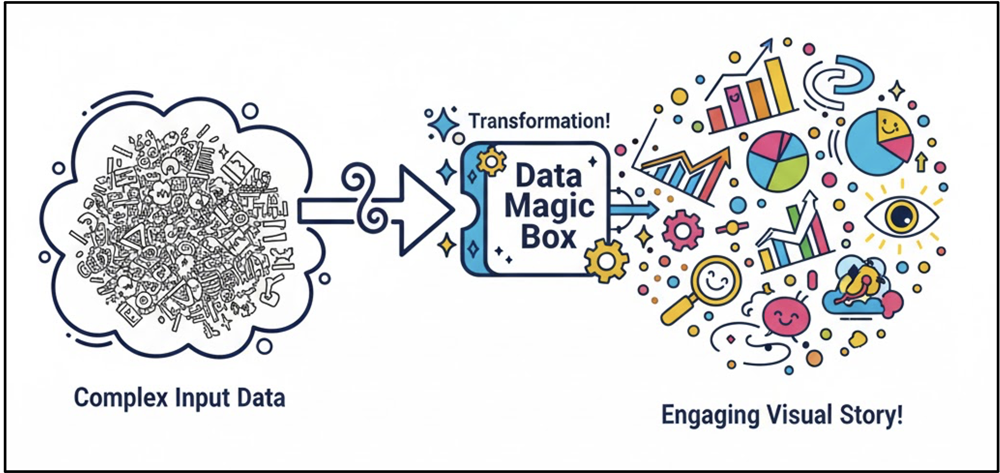
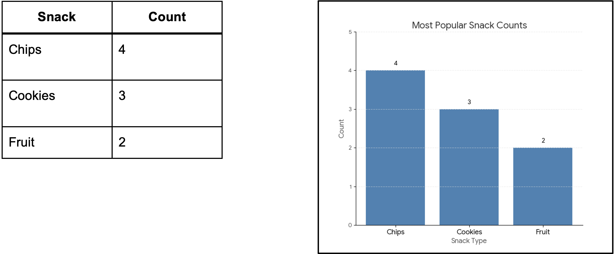
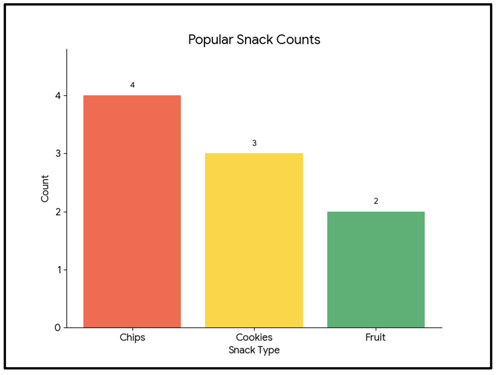
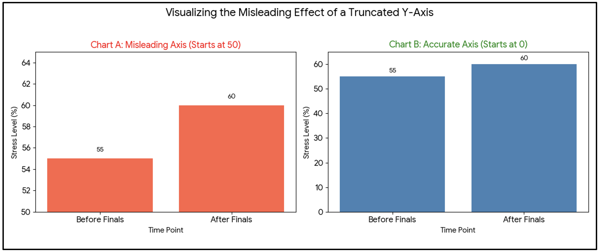
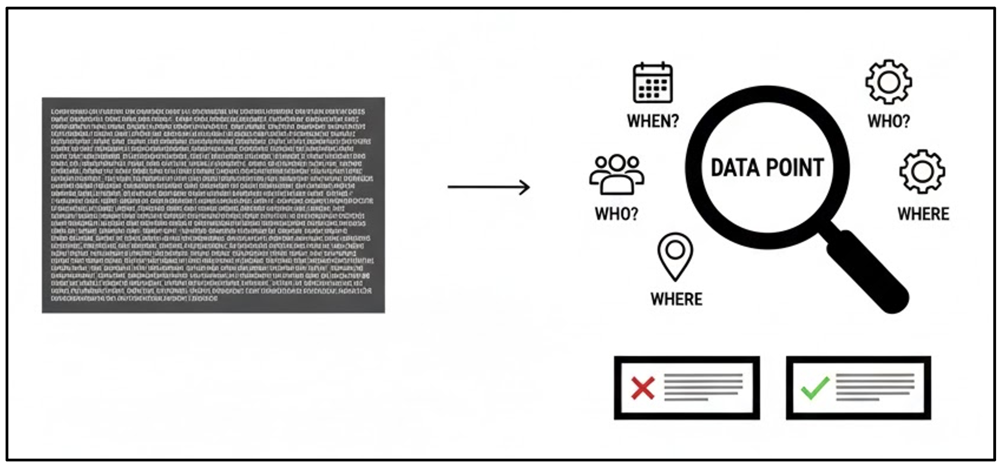
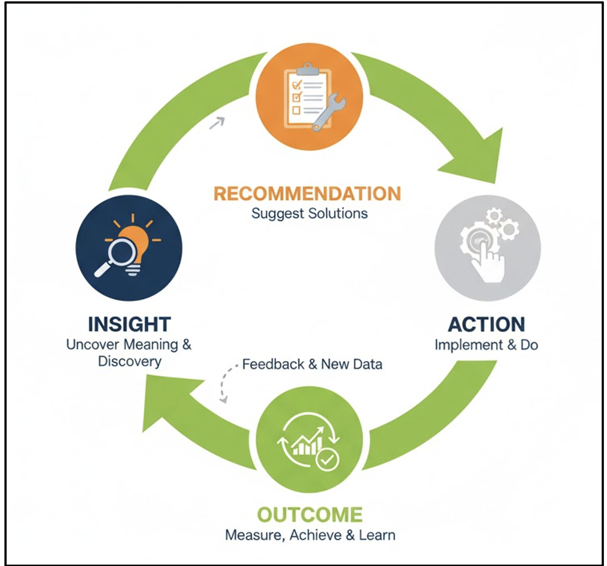

# Introduction

Data rarely speaks for itself. Before analysis can inform understanding or decision-making, it must be interpreted through appropriate visualisation, careful design, and contextual awareness. Tables of numbers may be precise, but without structure and framing they obscure patterns, exaggerate noise, and invite misinterpretation.

This module focuses on developing the skills required to make sense of data: selecting effective visual representations, critically evaluating how design choices influence interpretation, and recognising how context shapes meaning. Learners move beyond description to interpretation, learning how to assess evidence, avoid common pitfalls, and translate insights into responsible, actionable conclusions.

::: callout-outcomes

## 💡 Learning Outcomes

By the end of this module, learners will be able to:

-	Understand why visualisation helps reveal insights more clearly than raw tables.
-	Interpret charts and tables critically, identifying misleading design choices.
-	Recognise how context affects the meaning of data and prevents false conclusions.
-	Apply insights to make informed, data-driven decisions.
-	Communicate findings clearly and responsibly to guide real-world action.
:::

::: callout-questions

## ❓ Questions

-	Why are visuals often more powerful than numbers alone?
-	How do design choices influence how we interpret charts?
-	How does context change what data really means?
-	How can we turn data insights into better decisions?
:::

## Structure & Agenda

1.	**Visualisations for Insights**  (~20 min) Using visuals to find meaning in data
2.	**Making Sense of Visuals** (~20 min) Reading and critiquing charts effectively
3.	**Context is Key** (~20 min) Understanding how meaning changes with context
4.	**Insight to Action** (~20 min) Turning understanding into decisions

# Visualisations for Insights

## Why Visualisation Matters

Data visualisation transforms rows of numbers into stories the eye can instantly grasp.

{fig-align="center" width=400px}

Patterns that hide in tables jump out in a chart.

> 💬 Think of a chart as a map — it helps you find direction in a sea of information.

## Example: Tables vs. Charts

{fig-align="center" width=400px}

In a chart, you instantly see: Chips dominate. Cookies are next. Fruit lags behind.

> 🎨 The brain processes shapes faster than numbers.

## Single Variable Stories (Comparison & Change)

**When to Use:** To see the distribution of a single category or track how one thing changes over time. **Key Concept:** Univariate Analysis - The story of a single column of data.

| Chart Type   | What It Shows Best                               | Why It Matters                                                                 |
|--------------|--------------------------------------------------|--------------------------------------------------------------------------------|
| Bar Chart    | Comparison between distinct categories           | Instantly ranks items and shows magnitudes (e.g., favourite snacks by frequency). |
| Histogram    | Distribution of continuous numerical data        | Reveals the shape of the data: whether it is tightly clustered or widely spread (e.g., study hours per week). |
| Line Chart   | Change over time (trends)                         | Shows continuity and rate of change across time (e.g., steps walked each day); the slope conveys the trend. |

>📊 Bar charts can be vertical (like a cityscape) or horizontal

## Part-to-Whole Stories (Composition)

**When to Use:** When you need to show proportions where all parts add up to 100%. **Key Concept:** Compositional Analysis (The makeup of the total pie).

::: {.columns}
::: {.column}

**Pie Chart**

-	What It Shows Best: Proportion/Share of a simple whole.
-	Showing the split of Snack Categories by Share (e.g., 44% Chips, 33% Cookies, 22% Fruit).
:::
::: {.column}

**Stacked Bar Chart**
-	What It Shows Best: Composition that changes over a second category.
-	Showing Snack Preference Share by Campus Year (e.g., How the proportion of Chip eaters changes from Freshman to Senior year).
-	It allows comparison of the total length of the bars and the relative size of the segments within each bar.
:::
::: 

> ⚠️ Keep it simple! Avoid more than 5 slices or they become confusing and impossible to compare accurately.

## Connecting Two Variables (Relationships)

**When to Use:** To see if two numerical factors influence each other. **Key Concept:** Bivariate Analysis (The relationship between two columns).

::: {.columns}
::: {.column}

**Scatter Plot**

-	What It Shows Best: Correlation and Relationships.
- 	Use Case: Plotting Height vs. Steps Walked.
-	Insight: Reveals three possibilities: Positive (dots go up), Negative (dots go down), or None (random cloud). It's also the best way to spot outliers (data points that don't fit the trend).
:::
::: {.column}

**Bubble Chart**

-	What It Shows Best: Relationships between three variables at once.
-	Use Case: Same as a Scatter Plot, but the size of the bubble (the third dimension) could represent the Average Cost of the item.
-	It adds a layer of information without cluttering the main X-Y relationship.

:::
:::

>🌱 Bivariate Analysis is the foundation to Discovering Links, Trends, and Outliers

## Distribution Over Groups (Spread & Detail)

**When to Use:** When the main point is not the average, but the variability, uncertainty, and range of data across different groups.

**Key Concept:** Comparing the internal stories of multiple categories.

-	Box Plot (Box-and-Whisker Plot)
   -	What It Shows Best: The Five-Number Summary (Min, Max, Median, Quartiles).
   -	Use Case: Comparing Student Stress Levels across different Majors (Arts, Science, Business).
   -	Insight: Easily shows which groups have tighter (less variable) or wider (more variable) distributions and highlights the median (the center point).
-	Violin Plot
   -	What It Shows Best: The Density and Shape of the distribution.
   -	Use Case: Same as the Box Plot, but provides a much richer view of where the data is actually clustered.
   -	Value: If the data has two main clusters (a bimodal distribution), the violin plot will show two distinct bulges, while the Box Plot might hide this detail.

>📊 Visuals turn raw responses into visible stories.

---

::: callout-task

#### Activity: Quick Poll

::: panel-tabset

##### Question
Complete the four short-response poll at the qr code location below

::: {.content-visible when-format="revealjs"}

<!-- Hidden by default -->
{fig-align="center" width=400px}

:::

##### Wordcloud

<iframe
  src="https://ds-shiny-helper.azurewebsites.net/edsm7/?embed=true#shiny-tab-results"
  width="100%"
  height="500"
  frameborder="0"
  style="border:none;"
  title="Q1">
</iframe> 

:::
:::

# Making Sense of Visuals

## Interpreting Design Choices

Design isn’t decoration — it’s *communication*.

Ask:

-	What is this chart trying to show?
-	Does the design make it easy to see that point?
-	Would a different chart tell the story better?

> 🔹 Different visuals don’t just change how data looks — they change how data feels.

## Can you make sense of this graph?

{fig-align="center" width=400px}

::: {.columns}
::: {.column}

**Can you point out the issues?**
-	Small fonts
-	Eye-catching but cluttered
:::

::: {.column}

**Possible improvements:**
-	Clear fonts
-	Minimal or optimal usage of colours 
:::
:::

## Reading Visuals Critically

A visual can reveal patterns — or hide them.

-	A **cut-off y-axis** can exaggerate differences.
-	**Colour choices** can mislead focus.
-	**3D effects** can distort scale.

Good visuals show the truth clearly.

> ⚠️ Poor visuals manipulate perception

## Example: Misleading Visuals

{fig-align="center" width=400px}

>⚙️ Same data, different impression.

## Common Chart Pitfalls

| Issue             | Example                        | Why It’s Misleading            |
|-------------------|--------------------------------|--------------------------------|
| Truncated Axis    | Starts at 50, not 0             | Makes small differences look big |
| Too Many Colours  | 10 hues for 3 categories        | Confuses the reader            |
| Wrong Chart Type  | Pie chart for time series      | Hard to read progression       |
| Missing Labels    | Unclear categories             | Data loses meaning             |

> 💡 Visuals are powerful — and with that power comes the responsibility to design them honestly.

## Asking the Right Questions

When interpreting a visual:

1.	What is being measured?
2.	Over what time or group?
3.	Are scales consistent?
4.	Are outliers influencing perception?
5.	Is the visual honest?

> 🧠 Learning to “read” visuals helps prevent misinformation.

## Effective Design Principles

```{mermaid}

flowchart LR
    A[Effective Visual Design]
    B[Keep it simple]-->B1[Clarity over decoration]
    C[Use consistent colours]-->C1[One hue = one category]
    D[Label everything]-->D1[Never assume context]
    E[Start scales at zero]-->E1[Unless statistically justified]

    A --> B
    A --> C
    A --> D
    A --> E

    style A fill:#22223b,color:#ffffff,stroke:#22223b,stroke-width:2px
    style B fill:#cdb4db,color:#000000,stroke:#7b2cbf,stroke-width:2px
    style C fill:#bde0fe,color:#000000,stroke:#1d4ed8,stroke-width:2px
    style D fill:#caffbf,color:#000000,stroke:#2d6a4f,stroke-width:2px
    style E fill:#ffd6a5,color:#000000,stroke:#bc6c25,stroke-width:2px
   
```

> 🎯 You become the detective again — this time, investigating design truth.

---

::: callout-task

#### Chart Match-Up 

Get into small groups (4-5 people).

Each Group takes one set of Data Cards and one set of Chart Cards, along with the provided paper and pen.

Match each Data Card to the Chart Card that best tells its story. (use the principles just discussed)

Find the most effective matches.
:::

# Context is Key

## Why Context Matters

A case study in data interpretation for an App Platform Owner.

**Fact: 60% of users quit.**

Without context, this sounds alarming.

{fig-align="center" width=400px}

> ⭐ Numbers tell what. Context tells why.

## Changing Interpretation

| Stage        | Context Revealed                     | Why It Matters                                                                 | Interpretation Shift                                      |
|--------------|--------------------------------------|--------------------------------------------------------------------------------|-----------------------------------------------------------|
| “The Where”  | Only from one specific app            | Limits the scope: the problem is confined to a single product, not the entire platform. | It is a product issue, not a business failure.            |
| “The When”   | Only tracked in 2021                  | Outdated data: the issue may no longer be present or may have been resolved.   | It is a historical bug, not a current crisis.             |
| “The Why”    | Occurred immediately after an update | The causal link: the core app is sound; the issue arises from a newly introduced feature or bug. | It was a deployment mistake, not a fundamental design error. |

Different story entirely!

Never anchor a decision on a number until you know the full story.

> 🧩 Each layer of context reshapes meaning.

## Elements of Context

Once we have identified what our problem is, we move onto defining the other details.

| Element | Description                    | Example                                                      | Why It Matters                                                                 |
|---------|--------------------------------|--------------------------------------------------------------|--------------------------------------------------------------------------------|
| Who     | Population or sample            | University students                                         | Limits the scope—ensures findings are not inappropriately generalised.         |
| When    | Time frame                      | Before vs. after policy change                              | Establishes a baseline and indicates whether an event caused a shift.          |
| Where   | Geographic scope                | Campus A vs. Campus B                                       | Controls for environment—shows whether findings are universal or location-specific. |
| How     | Method of data collection       | Tracking data                                               | Assesses bias—determines whether the collection method influenced the results. |
| Why     | Research question or purpose    | Measuring student well-being vs. university performance     | Anchors interpretation—ensures conclusions align with the original intent.     |

> 💬 Data without context is like a quote without the full paragraph.

## Context Anchors Interpretation

Before you conclude, always ask:

-	Is this representative?
-	Is the time frame relevant?
-	Are there hidden factors?

> 🧭 Context keeps interpretation grounded.

--- 

::: callout-task

#### Quick Insights Race

::: panel-tabset

##### The Initial Fact (3 Minutes)
We have the scores of 2 student groups that participated in Football competitions across the UK in 2025. Team A and Team B both averaged 8 points.

-	Answer the following questions (MCQs):
   -	In this case study, what context has already been defined (Select all the apply):
      -	Who
      -	Why
      -	When
      -	Where
      -	How
      -	What
   -	If you had to pick one team for a high-stakes competition, which one would you choose?
      -	Team A
      -	Team B

#####  Problem Definition - The "How" (3 Minutes)

The raw data that makes up the average:

Team A's Scores: 8, 8, 8, 8, 8
Team B's Scores: 1, 15, 8, 10, 6

-	Answer the following questions (MCQs):
   -	The average is the same, but how does the spread change your opinion in terms of ranking them now? Select which team you would choose now:
      -	Team A
      -	Team B
   -	What does the risk factor look like for Team B? (One-two word answer)
      -	Word cloud

Team A is consistent (low risk). Team B is volatile (high risk/high reward).

##### Introduce Context - The "Why" (3 Minutes)

The external factors that explain the numbers:

Team A: Always competed against junior-level competition.
Team B: Scores were achieved competing against senior-level champions in two of five matches.

-	Answer the following questions (MCQs): 
   -	Now that you know the quality of the opponent, which team is truly better? 
      -	Team A   
      -	Team B
   -	Are you still supporting your original team?
      -	Yes
      -	No
   -	Does Team A's consistency matter if they never faced a challenge?
      -	Yes
      -	No
      -	More context needed

Team A looks inflated by easy wins. 
Team B's average of 8 is far more impressive given the competition.

#####  Conclusion and Takeaway (5 Minutes)

   -	The Number (8) told you the result.
   -	The Context (Scores & Opponents) told you the meaning and risk.
   -	Never trust an average without seeing the range (Context 1) and the conditions (Context 2).
:::
:::

# Insight to Action

## From Information to Impact

Data is only useful when it drives decisions.

{fig-align="center" width=400px}

This is a cycle of continuous improvement!

> 🔁 Turning numbers into action closes the data loop.

## Making Data Actionable

Good insights are:

1.	Relevant: Tied to goals or needs.
2.	Specific: Point toward a clear step.
3.	Feasible: Can actually be implemented.
4.	Evidence-Based: Supported by data.

Example:

If survey shows students feel unproductive in mornings,
Action: Schedule workshops later in the day.

> 🤝 Actionable insights are the bridge between understanding a pattern and making an organizational change.

## Insight Communication

How you present results affects whether they are used.

-	**Use visuals + narrative:** “Here’s what’s happening and why.”
-	**Keep it concise:** Decision-makers need clarity.
-	**Link to outcomes:** Show how insight affects goals.

> 📦 Use data to move from Observation → Decision → Measurable Outcome.

## Judging Action Quality

Not all actions are equal. Ask:

-	Does this address the right cause?
-	Are we basing this on sufficient data?
-	How will we know if it worked?

> 🔍 Data drives better questions, not just answers.

## Ethical Use of Insights

Responsibility matters:

-	Avoid overgeneralising from small data.
-	Be transparent about uncertainty.
-	Ensure data-driven actions do no harm.

> 🎯 Data should illuminate, not manipulate.

---

::: callout-task

#### Activity: Data-to-Decision (10 min)
This activity helps learners bridge the gap between analysis and business strategy.
Setup: Divide the learners into small groups (4-5 people).

Scenario 1: “Survey shows 65% of students feel unproductive in mornings.”
Scenario 2: "End-of-semester course reviews show that 80% of students who received a grade of 'C' or lower did not attend the optional weekly tutorial session."

Each group’s goal is to quickly agree on one specific, actionable recommendation the university should implement based on this data.

Formalise their action plan for each scenario. Frame your recommendation as:

-	Insight: What is the clear, testable conclusion this data suggests?
-	Action: Propose one specific, feasible change the university or professor should implement.
-	Rationale: Briefly explain why this action is the most effective.

Present your action plans!

:::

# Further Information

::: callout-keypoints

## 📌 Keypoints

*	Visualisations make complex data understandable and engaging.
*	Reading visuals critically prevents misinterpretation.
*	Context transforms numbers into meaning.
*	Turning insights into decisions is the ultimate goal of data work.

🔹 Overall Message: Making sense of data isn’t just analysis — it’s interpretation, communication, and action.

:::

::: callout-hints

## 🔦 Hints

📚 Try turning your M6 analysis into visuals — see how patterns come alive.

:::

## Module Summary

This module develops the skills required to move from raw data to meaningful interpretation and informed action. Learners examine how visualisation reveals patterns that are difficult to detect in tables, how design choices influence interpretation, and how misleading visuals can distort conclusions. 

Emphasis is placed on reading charts critically, recognising common pitfalls, and applying clear design principles. The module then demonstrates how context (who, when, where, how, and why) fundamentally reshapes the meaning of data, preventing overgeneralisation and false inference. 

## Additional Learning

The concepts in this module connect directly to practical data handling and exploration in Python.

| Submodule                | Python Connection                                                   | Why It Matters                                                               |
|--------------------------|---------------------------------------------------------------------|------------------------------------------------------------------------------|
| Visualisations for Insights | Create bar, line, scatter, and pie charts using matplotlib or seaborn | Demonstrates how to transform numerical summaries into clear visuals.        |
| Making Sense of Visuals  | Use `plt.xlabel()`, `plt.title()`, `plt.ylim()` to refine visuals    | Builds good design practice and improves interpretability.                   |
| Context is Key           | Merge datasets (`pd.merge`) and apply filters to limit scope         | Reinforces that insight depends on appropriate context.                      |
| Insight to Action        | Create summary reports or dashboards; link visuals to decisions      | Prepares learners to communicate results clearly and responsibly.            |

> 📚 You can apply the same activities directly in Python to reinforce these concepts.
