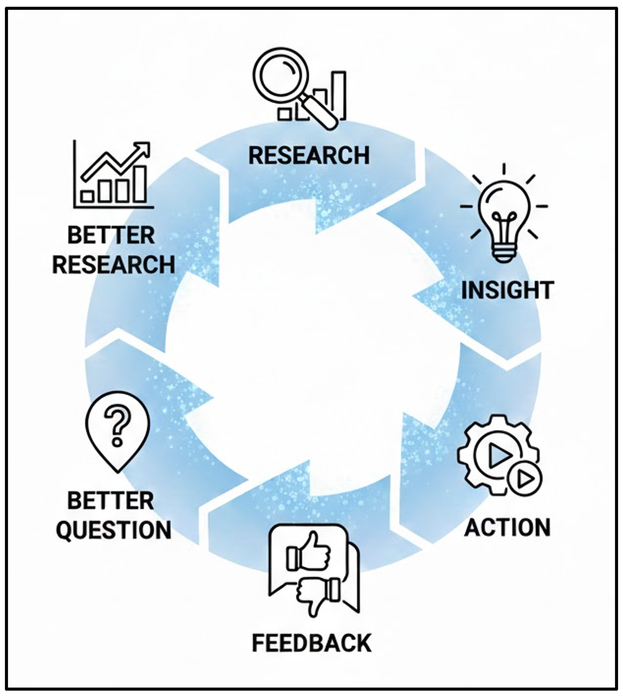
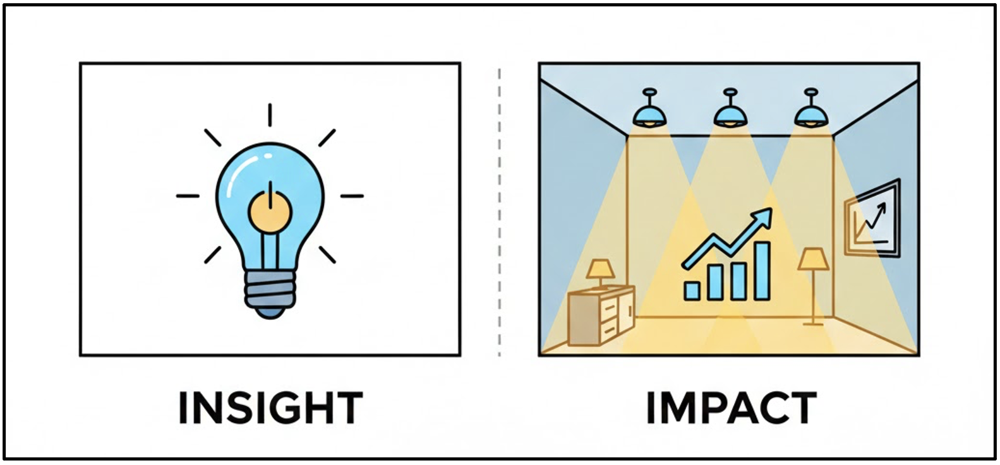

# Introduction

Producing an insight is not the end of research, it is the beginning of the next decision. In applied data work, value is created not by analysis alone, but by how insights are translated into action, evaluated through feedback, and refined over time. Research therefore functions as an iterative process rather than a linear pipeline, where each action generates new data, constraints, and questions.

This module focuses on the transition from understanding to impact. Learners examine how insights differ from outcomes, how feedback should be treated as structured evidence rather than judgement, and how the same finding must be framed differently for different audiences without compromising accuracy. The emphasis is on building a mindset that treats research as adaptive, communicative, and accountable to real-world change.

::: callout-outcomes

## 💡 Learning Outcomes

By the end of this module, learners will be able to:

-	Understand research as an iterative loop, not a one-way process.
-	Clearly distinguish between insight and impact.
-	Use feedback as structured input for improvement.
-	Adapt insights for different audiences without changing the truth.
:::

::: callout-questions

## ❓ Questions

-	Why doesn’t research actually end at action?
-	What makes an insight useful versus just interesting?
-	Why is feedback not a failure signal but a data source?
-	Why can the same insight sound completely different depending on the audience?
:::

## Structure & Agenda

1.	The Circle of Analysis (~20 min)
2.	Insight vs. Impact (~20 min)
3.	The Feedback Engine (~20 min)
4.	Audience Matters (~20 min)

# The Circle of Analysis

## What’s Next?

In traditional projects, you finish a task and move on. 

In Research, you finish a task and find three new problems. This is a feature, not a bug!

**The Spiral of Innovation**
You aren't just going in circles; you are moving "upward." Each loop makes the project more refined.

**The Action-to-Question Link:**
In research, "Action" often means building a prototype or testing a theory. The data you get back from that action becomes the starting point for your next question.

> 🌀 Insight is meaningful only when it connects back to the original question.

## Research is a Loop

::: {.columns}
::: {.column}

{fig-align="center" width=400px}
:::
::: {.column}

Every answer creates new uncertainty — and that’s a good thing.

Even success creates questions.
In research, certainty is temporary.

In reality, the process is an iterative loop where actions lead to feedback and new questions, fueling a cycle of continuous improvement.
:::
::: 

> 🔎 Think of research like building a prototype, not submitting homework. You’re never “finished”; you’re just at the next version.

## The Circle of Analysis

| Stage    | What Happens                       | Why It Matters            |
|----------|------------------------------------|---------------------------|
| Question | What are we trying to understand?  | Sets direction            |
| Analysis | What does the data say?            | Generates insight         |
| Insight  | What does it mean?                 | Adds interpretation       |
| Action   | What do we change or test?         | Creates impact            |
| Feedback | What worked / didn’t?              | Fuels the next loop       |

> 🎯 If your insight doesn’t loop back to your question, it’s just an observation — not an answer.

## Why This Matters

If you believe research ends at action:

-	You treat outcomes as final.
-	You defend decisions instead of improving them.
-	You stop learning once something is “launched”.

If you understand research as a loop:

-	You expect imperfection.
-	You design actions as tests, not conclusions.
-	You see progress as cumulative.

> 💯 This mindset is what separates analysis from innovation.

## A Simple, Realistic Scenario

::: {.columns}
::: {.column}

Let’s say:

-	You analyse survey data.
-	You find students are unproductive in the morning.
-	You take action: move classes later.

:::
::: {.column}

If you stop here, you’re assuming:

-	The timing was the real cause.
-	The solution works for everyone.
-	The problem is solved.

:::
::: {.column}

But if you loop:

-	Did productivity actually improve?
-	Did attendance change?
-	Did different student groups respond differently?

:::
:::

> ✅ Each answer generates a better next question.

---

::: callout-task

#### Activity: Insight Alignment Challenge

::: panel-tabset

##### Step 1: Individual Reflection (3 minutes)

Each student receives one action scenario.

-	Write 2 new questions this action creates.
-	Questions must start with:
   -	Did…
   -	For whom…
   -	Under what conditions…

##### Step 2: Pair Refinement (4 minutes)

Students pair up and:

-	Compare questions
-	Circle one question that:
   -	Was not obvious before the action
   -	Could realistically be tested with data

##### Step 3: Debrief (3 minutes)

Volunteers share:

-	The action
-	Their best follow-up question
:::
:::

# Insight Vs Impact

## Insight Is Not Impact

An insight is understanding.

**Impact is change.**

{fig-align="center" width=400px}
 
> 💡You can have a brilliant insight that changes absolutely nothing.

## What is the Difference?

This is one of the most important distinctions in applied data work.
An insight answers: “What does this data suggest?”

Impact answers: “So what actually changes because of this?”

You can have:

-	A correct insight
-	A statistically significant result
-	A beautifully designed chart
- …and still achieve zero impact.

❗ Insight without action is like diagnosis without treatment.

## Concrete Comparison

| Concrete Comparison | Concrete Comparison | Concrete Comparison | Concrete Comparison |
|---------------------|---------------------|---------------------|---------------------|
| Concrete Comparison | Concrete Comparison | Concrete Comparison | Concrete Comparison |
| Concrete Comparison | Concrete Comparison | Concrete Comparison | Concrete Comparison |
| Concrete Comparison | Concrete Comparison | Concrete Comparison | Concrete Comparison |
| Concrete Comparison | Concrete Comparison | Concrete Comparison | Concrete Comparison |

> 🌱 Over 70% of data science projects in organisations fail to create impact — not because the analysis is wrong, but because no decision was ever attached to the insight.

## High Impact vs Low Impact Actions

| Action Type    | Example                         | Impact Level |
|----------------|----------------------------------|--------------|
| Symbolic       | “Share findings in a report”     | Low          |
| Informational  | “Present at a meeting”           | Medium       |
| Structural     | “Change policy / run a pilot”    | High         |

> �  Impact usually involves cost, effort, or risk — which is why it’s harder.

---

::: callout-task

#### Task: Impact Mapping 

::: panel-tabset

##### Setup

Get into small groups (4–5 people).

Each group gets one insight.

##### Step 1: Individual Thinking (2 minutes)

Each student writes:

- One low-impact response
- One high-impact response

##### Step 2: Group Discussion (5 minutes)

Group consolidates answers into:
Action | Impact Level | Why

##### Step 3: Class Discussion (3 minutes)

- Which actions feel uncomfortable?
- Which ones require ownership or cost?
:::
:::

# The Feedback Engine

## What is Feedback?

In earlier modules, we talked about collecting data through:

-	surveys
-	logs
-	experiments
-	observations

> 🔄 Feedback is different. Feedback is data created by your action interacting with reality.

## Feedback Is Not Failure

Many people hear feedback as:

-	Criticism
-	Rejection
-	Proof something didn’t work

In research, feedback helps you in the following ways:

-	It reflects real constraints
-	It exposes assumptions you didn’t know you were making
-	It tells you what people actually do, not what you expected

> 📝 Unlike surveys or historical data, feedback comes from real-world interaction with your solution.

## Blindspot — What You Didn’t See Coming

A blindspot is feedback that reveals a factor you didn’t account for at all.

Blindspot feedback is useful because it:

-	Expands the problem definition
-	Prevents unrealistic decisions
-	Improves the next research question

> 🧐 Most failed products didn’t fail because the insight was wrong — they failed because the team never listened to early feedback signals.

## Blindspot Example

**Analysis Insight:** Exam performance is bad as students aren’t attending optional tutorials.

**Action:** We want to make all tutorials mandatory to improve performance.

**Feedback:** “This is too expensive.”

> � ️ The most dangerous thing is no feedback — not negative feedback.

## What Blindspot Feedback Reveals

This feedback is not saying:

-	The idea is bad
-	The insight is wrong

It’s saying:

-	Cost was not part of your analysis
-	Budget is a missing variable
-	The solution space is constrained

> 💬 The insight may still be correct — the action needs refinement.

## Constraints — What Limits Implementation
A constraint is feedback that highlights a practical limit on execution.
Constraints:

-	Push you toward scalable solutions
-	Force prioritisation
-	Separate ideal solutions from viable ones

> 💎 Each constraint refines the solution without discarding the insight.

## Constraint Example

Analysis Insight: Student engagement data shows that freshmen feel "lost in the crowd," leading to a spike in course withdrawals.

Action: Let’s introduce weekly one-to-one mentoring.
Feedback: “We don’t have staff for this.”

> 📕 In large organisations, staffing constraints are the #1 reason insights don’t turn into action — even when leadership agrees with the findings.

## What Constraints Reveal

This feedback is not rejecting the idea.

It’s saying:

-	The organisation’s capacity is finite
-	Resources are a bottleneck
-	The action may work in theory, but not in practice

> ⚙️ Constraints force realism.

## Extensions — Where Impact Can Grow

An extension is feedback that suggests additional applications of your work.
Extensions:

-	Increase ROI of research
-	Justify further investment
-	Turn local solutions into institutional ones

## Extension Example

**Analysis Insight:** First-year students are struggling to bridge the gap between theoretical lectures and practical application due to static tutorial structures.

**Action:** We redesigned tutorials for first-year students.

**Feedback:** “Could this apply to postgraduate courses too?”

> 📖 Many high-impact policies and platforms started as “extensions” — someone simply asked, “Could this work somewhere else too?”

## What Extension Reveals

Extensions signal:

-	The insight has broader relevance
-	The action may have untapped value
-	There is potential for scale or reuse

> 🚀 Extensions are often the earliest signs of high-impact research.

--- 

::: callout-task

#### Activity: “Red Pen” Rapid Fire 

::: panel-tabset

##### Step 1: Individual Action Proposal (3 minutes)

Each student writes:

-	One action based on this insight:

“Students are least productive in the morning.”
Action must be specific.

##### Step 2: Rapid Feedback Rounds (5 minutes)

Discuss 5–6 actions aloud.
Class responds only with:

-	One Blindspot
-	OR one Constraint
-	OR one Extension

No explanation needed.
:::
:::

# Audience Matters

## Translate Your Research

A common mistake:

*“If the data is correct, it should speak for itself.”*

Data never speaks for itself.

People listen selectively.

Different audiences care about:

-	Different risks
-	Different rewards
-	Different levels of detail

> 🗣️ You Don’t Report Research — You Translate It

## Same Insight, Different Priorities

A researcher might ask:

-	Is this method valid?

A manager asks:

-	What decision does this affect?

A teammate asks:

-	What do we do next?

A journalist asks:

-	Why should the public care?

>  🤝 Your job is not to change the insight — it’s to change the framing.

## The Translation Table

| Audience   | Cares Most About | Needs to Hear        |
|------------|------------------|----------------------|
| Peers      | Rigor            | How it was done      |
| Managers   | Outcomes         | What changes         |
| Teammates  | Execution        | What’s next          |
| Public     | Meaning          | Why it matters       |

> 🐾 Same data. Different audience. Different story.

##� Tailoring the Message

| Audience                     | Focus On                              | Tone & Format                                      |
|------------------------------|----------------------------------------|----------------------------------------------------|
| Leadership / Decision-makers | Actionable outcomes, ROI, trends       | Executive summary, visuals, concise takeaways       |
| Technical Teams              | Methodology, reliability, detail       | Reports, code appendices, technical visualisations  |
| Students / Community         | Relevance, human impact                | Narratives, infographics, relatable visuals         |

> 🎨 Effective storytelling adapts to who’s listening — not who’s speaking.

## Building an Impactful Narrative

Every insight presentation should:

1.	Start with the question ("What were we trying to understand?")
2.	Present the key finding ("What did we discover?")
3.	End with the action ("What can we do about it?")

> ✨ Numbers tell the “what.” Storytelling explains the “so what.”

---

::: callout-task

#### Activity: Audience Remix (10 min)

“Only 40% of students regularly use online discussion boards.”

::: panel-tabset

##### Step 1: Individual Rewrite (6 minutes)

Rewrite the insight for two audiences (not all three):

-	Dean
-	Faculty Member
-	Students

Each rewrite must include:

-	One sentence only
-	One implied action

##### Step 2: Share & Compare (4 minutes)

Compare:

-	What changed?
-	What stayed constant?
:::
:::

# Further Information

::: callout-keypoints

## 📌 Keypoints

*	Research does not end at action — every action creates feedback that fuels the next, better question.
*	Insight explains what is happening; impact is defined by what changes because of it.
*	Feedback is not a judgement of failure, but the highest-quality data generated by real-world use.
*	Different audiences need different translations of the same insight — clarity and focus determine whether data is acted upon.

🔹 **Overall Message:** Data work is not finished when the analysis is complete —
it is finished only when it changes a decision, improves a system, or informs the next question.

:::

::: callout-hints

## 🔦 Hints

📚 Take one insight from M7 and design a small action — then decide how you’d know if it worked.

:::

## Module Summary

This module frames research and analysis as an ongoing cycle in which questions, actions, and feedback continuously inform one another. Learners distinguish clearly between insight and impact, recognising that correct or significant findings do not automatically lead to change. Through practical examples, the module demonstrates how feedback reveals blindspots, constraints, and opportunities for extension, strengthening both the research question and the resulting actions.

The module also emphasises the importance of audience-aware communication. Learners develop the ability to translate the same insight for different stakeholders by adjusting focus, language, and format while preserving the underlying evidence. By the end of the module, learners are equipped to treat feedback as data, actions as tests, and communication as a core component of responsible, high-impact research practice.

## Additional Learning

The concepts in this module connect directly to practical data handling and exploration in Python.

| Submodule            | Python Connection                                                                 | Why It Matters                                                                 |
|----------------------|------------------------------------------------------------------------------------|--------------------------------------------------------------------------------|
| The Circle of Analysis | Version analyses and rerun models with new data slices (`df.query()`, parameterised notebooks) | Reinforces iteration and shows how new questions emerge from actions.           |
| Insight vs. Impact    | Build simple KPI summaries and decision dashboards (`groupby()`, aggregations)     | Connects insights directly to outcomes and measurable change.                   |
| The Feedback Engine   | Run follow-up analyses, A/B tests, or sensitivity checks (`scipy.stats`, resampling) | Treats feedback as structured data for refinement rather than anecdote.         |
| The Audience Pivot    | Export different visuals and summaries (`plt.savefig()`, multiple chart styles)    | Enables the same insight to be translated effectively for different stakeholders. |

> 📚 You can apply the same activities directly in Python to reinforce these concepts.