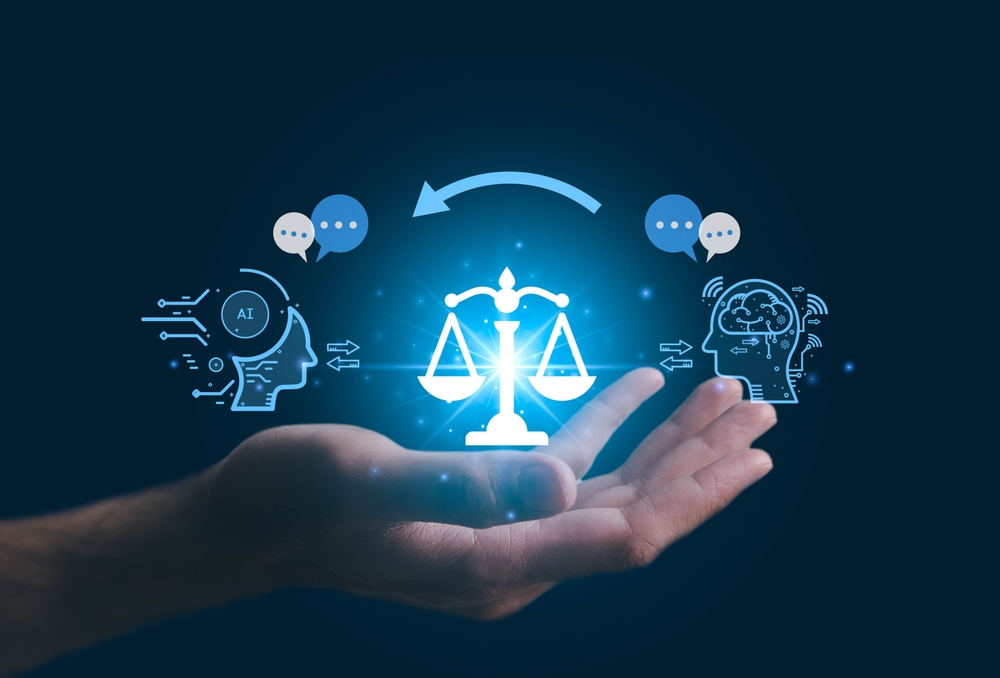

::: callout-outcomes

## 💡 Learning Outcomes

- Explain the technical shifts that made current AI tools usable across research.
- Identify where AI is reshaping the research lifecycle and how it changes pace, labour and judgement.
- Critically assess how AI affects evidence, authorship, accessibility and research culture.
- Apply governance, disclosure and data protection principles to AI-enabled research workflows.
:::

::: callout-questions

## ❓ Questions

1. Why has AI become so visible in research now rather than 10 or 20 years ago?
2. Which parts of the research lifecycle are most affected by AI?
3. How does AI change what counts as evidence, expertise and contribution in research?
4. What kinds of governance and judgement are needed as AI becomes embedded in research?
:::

## Structure & Agenda

1. **A Brief History of AI and Why It Matters for Research** - 10 minutes teaching followed by a 5 minute room scan.
2. **AI Across the Research Lifecycle** - 10 minutes teaching followed by a 5 minute lifecycle audit.
3. **AI, Knowledge Production, Evidence and Research Culture** - 10 minutes teaching followed by a 5 minute critique task.
4. **Trust, Governance and the Future of Research** - 10 minutes teaching followed by a 5 minute decision prompt.

> 🔧 This is a lecture-led alternative to the hands-on AI session, so the activities are short and discussion-focused.

# Note

Much of the current debate around AI in research is not really about whether the tools exist. It is about what kinds of research work they accelerate, what kinds of judgement they cannot replace, and what new risks they introduce into already busy research environments.

# A Brief History of AI and Why It Matters for Research

{fig-align="center" width="500px"}

## Why start with history?

AI appears to have arrived suddenly, but the current wave of research-focused AI is the result of several technical shifts: from rules, to machine learning, to deep learning, to transformer-based foundation models.

> History helps explain both the strengths and the limitations of current tools.

## From rules to learning

Early AI treated intelligence as something that could be expressed through explicit rules.

- Human reasoning was assumed to be decomposable
- Expert knowledge could be written down as if-then logic
- Computers would then apply those rules faster than people

This worked in narrow domains, but it struggled when data became messy, ambiguous or too large to encode by hand.

## The major shift in one slide

| Era | Dominant idea | Why researchers should care |
|---|---|---|
| Rule-based AI | Logic and hand-written rules | Useful for narrow expert systems, weak on uncertainty |
| Machine learning | Models learn from examples | Better pattern detection in real data |
| Deep learning | Large models learn richer features | Stronger performance in vision, speech and language |
| Transformers and foundation models | One architecture adapts across many tasks | Language, code and multimodal tools became widely usable |

## Why machine learning changed the trajectory

Machine learning became dominant once three conditions aligned:

- more digital data
- better statistical methods
- enough computing power to fit larger models

```{mermaid}
flowchart LR
    A["Rule-based AI"] --> B["Machine learning"]
    B --> C["Deep learning"]
    C --> D["Transformers"]
    D --> E["Foundation models"]
```

> The shift was not just technical. It changed the type of problems AI could address.

## Transformers changed the interface

The transformer architecture made it possible to model long-range relationships in language much more effectively than earlier sequence models.

- models could attend across an entire input
- training scaled more efficiently
- one model family could support many downstream tasks

Researchers no longer needed to build a specialist model from scratch to benefit from AI. In many cases, they could just start with prompting.

## Why AI became visible in research so quickly

The current wave spread fast because several things happened at once:

| What changed | Consequence for research |
|---|---|
| Chat-style interfaces | AI became accessible beyond specialist programmers |
| General-purpose models | The same tool could help with writing, coding, search and summarisation |
| Cloud delivery | Researchers could use powerful models without local infrastructure |
| Multimodal capability | Text, code, image and document workflows started to converge |

> Current AI matters in research because it reduces the cost of producing language, code and intermediate artefacts.

## History is useful because limits travel forward

Large language models are impressive, but they still generate outputs by modelling patterns in data rather than by establishing truth in the way researchers do.

- fluent text is not the same as evidence
- confident code is not the same as validated analysis
- plausible synthesis is not the same as a literature review

> The history matters because it reminds us that AI systems have evolved, but they have not become substitutes for research judgement.

---

::: callout-task

#### Task 1: Room scan - where is AI already changing research?

::: panel-tabset

##### Question

Use a phone or laptop to open the room scan and submit a response:

[Open the Ext3 room scan](https://ds-shiny-helper.azurewebsites.net/edsex3/?embed=true#shiny-tab-input)

Direct link: <https://ds-shiny-helper.azurewebsites.net/edsex3/?embed=true#shiny-tab-input>

Vote for the research stage where AI feels most visible right now and add one or two short keywords that describe the change.

##### Live results

<iframe
  src="https://ds-shiny-helper.azurewebsites.net/edsex3/?embed=true#shiny-tab-results"
  width="100%"
  height="850"
  frameborder="0"
  style="border:none;"
  title="Ext3 room scan results">
</iframe>

##### Debrief

- Which stage dominates in the room?
- Are people describing AI mostly as speed, support, pressure, access, risk or uncertainty?
- Does the pattern look the same across disciplines?
:::
:::

# AI Across the Research Lifecycle

{fig-align="center" width="400px"}

## AI does not sit in one research step

AI affects research unevenly, but it can now appear at almost every point in a project.

```{mermaid}
flowchart LR
    A["Question framing"] --> B["Literature discovery"]
    B --> C["Data collection and preparation"]
    C --> D["Analysis and modelling"]
    D --> E["Writing and dissemination"]
    E --> F["Feedback and revision"]
    F --> A
```

> The point is not that AI replaces the lifecycle. It compresses parts of it.

## Discovery and question framing

AI can support early-stage research by helping people orient quickly in unfamiliar terrain.

- suggest search terms and related concepts
- compare definitions across disciplines
- produce starting summaries of a topic area
- surface possible follow-up questions

The main risk is premature narrowing: researchers may accept the model's framing before engaging with the actual literature.

## Data collection and preparation

AI can support protocol drafting, survey wording, data cleaning scaffolds and metadata generation.

It can also help researchers think through:

- what variables may be missing
- what formats might be more reusable
- how to structure repetitive data work

The main constraint is that data handling rules do not disappear just because the tool feels conversational.

## Analysis, coding and interpretation

This is one of the areas where AI is already highly visible.

- generating boilerplate code
- explaining unfamiliar functions or packages
- suggesting diagnostics or visualisations
- offering alternative interpretations to probe

> The value lies in acceleration. The risk lies in accepting explanations or code that nobody in the team can justify.

## Writing, communication and dissemination

AI can reduce friction in the final stages of research:

- outlines and first drafts
- plain-language summaries
- policy or public-facing variants
- slide notes and presentation structure

This helps with accessibility and speed, but it also blurs contribution boundaries if drafting becomes substantive rather than editorial.

## The main impact is compression, not replacement

```{mermaid}
graph LR
  A["Question"] --> B["Evidence review"]
  B --> C["Analysis"]
  C --> D["Output"]
  A -. "AI-assisted shortcuts" .-> C
  B -. "AI-assisted drafting" .-> D
```

Compression can be beneficial, but it removes some of the natural pauses where reflection, discussion and methodological reconsideration usually happen.

## A balanced lifecycle view

| Research stage | Typical AI value | What still needs human judgement |
|---|---|---|
| Question and literature | Fast orientation | relevance, scope, source quality |
| Data and methods | Scaffolding and comparison | ethics, appropriateness, data handling |
| Analysis and code | Boilerplate, debugging, alternatives | validation, interpretation, robustness |
| Writing and dissemination | Structure and audience adaptation | argument, evidence, attribution |

> AI changes the pace of work, but it does not remove responsibility for research design or interpretation.

---

::: callout-task

#### Task 2: Lifecycle audit

::: panel-tabset

##### Exercise

Pick one stage of your own research workflow and discuss:

1. one place where AI could reduce friction
2. one place where AI could increase risk
3. one checkpoint you would add to keep the work defensible

##### Plenary

- Which stages look genuinely high value?
- Which stages look tempting but fragile?
- Where do people feel they need more guidance or infrastructure?
:::
:::

# AI, Knowledge Production, Evidence and Research Culture

{fig-align="center" width="500px"}

## When production gets cheaper, judgement gets more valuable

Generative AI lowers the cost of producing plausible text, code, summaries and visual drafts.

That changes the bottleneck in research:

- less time is spent producing first versions
- more time should be spent evaluating, comparing and rejecting weak outputs

> Researchers are increasingly asked to act as editors of reasoning rather than sole producers of every intermediate artefact.

## Fluency is not the same as evidence

One of the most important shifts is epistemic rather than technical.

| AI outputs can provide | Researchers still need to establish |
|---|---|
| plausible prose | truth and evidential support |
| coherent code | correctness and reproducibility |
| attractive summaries | completeness and balance |
| confident interpretation | defensible claims and uncertainty |

> If a statement cannot be mapped back to evidence, its fluency is irrelevant.

## AI changes roles inside research teams

```{mermaid}
flowchart LR
  A["Researcher prompt"] --> B["AI output"]
  B --> C["Draft, code, summary or suggestion"]
  C --> D["Verification and interpretation"]
  D --> E["Research output"]
  E --> F["Accountability remains human"]
```

This reshapes work in teams:

- junior researchers may produce more faster, but need stronger checking habits
- supervisors need clearer expectations around disclosure and review
- collaborations need to discuss where AI use is acceptable before problems arise

## Accessibility, inclusion and uneven advantage

AI can improve access in important ways:

- language support for non-native writers
- disciplinary translation across fields
- clearer first drafts for early-career researchers
- support with formatting and structure

But the benefits are uneven. Access depends on tool availability, cost, institutional provision and confidence using the tools well.

## Cultural pressures: speed, volume and sameness

AI can increase output volume without increasing thoughtfulness.

- more draft text can mean more noise
- faster writing can increase submission pressure
- repeated model styles can flatten disciplinary voice
- peer review may become harder as output volume rises

> Research culture is affected not only by what AI can do, but by the incentives around publication, funding and productivity.

## A useful cultural question

The real question is not "should researchers use AI?"

It is:

- which parts of scholarship benefit from acceleration
- which parts require friction, reflection and debate
- how do we stop convenience from defining good practice

---

::: callout-task

#### Task 3: Critique the claim

::: panel-tabset

##### Claim

Consider this statement:

> "AI has already made research more objective by reducing human bias in literature review, coding and academic writing."

##### Discussion

In pairs, identify:

- what sounds plausible
- what is too strong or undefined
- what evidence you would need before accepting the claim
- what kinds of bias AI might simply relocate rather than remove
:::
:::

# Trust, Governance and the Future of Research

{fig-align="center" width="400px"}

## Trust is built through process, not polish

Researchers should not trust AI because it sounds convincing. They should trust only those parts of a workflow that are transparent, documented and checked.

That means:

- knowing what the tool was asked to do
- knowing what sources or data it drew on
- knowing what was verified manually
- knowing where uncertainty remains

## Governance works at multiple levels

| Layer | Typical question |
|---|---|
| Institution | Is this tool approved and what data can I put into it? |
| Funder | Does this grant or assessment process allow AI use? |
| Publisher | What are the disclosure and authorship rules? |
| Law and policy | Are GDPR, confidentiality, contract or IP issues involved? |

> Governance is not a separate topic from research practice. It is how research practice stays defensible.

## Data and security boundaries still matter

```{mermaid}
flowchart LR
    A["Research material"] --> B{Sensitive, unpublished or identifiable?}
    B -->|Yes| C["Do not use a public AI service"]
    C --> D["Use a secure institutional route or remove AI from the workflow"]
    B -->|No| E["Proceed with caution"]
    E --> F["Check retention, disclosure and reproducibility requirements"]
```

If you would not email the material to an external collaborator without an agreement, you should not paste it into a public AI system.

## What good disclosure looks like

| Record | Why it matters |
|---|---|
| Tool and version | provenance and reproducibility |
| Prompt or workflow used | traceability of the process |
| What output was kept | clarity about contribution |
| What was checked manually | defensible accountability |
| What remains uncertain | honest reporting of limitations |

Good disclosure protects the researcher as much as it informs the audience.

## Where research may go next

Several trends are already visible:

- more agent-like workflows for repeated tasks
- more multimodal systems handling text, images and documents together
- more secure institutional deployments
- stronger expectations around documentation and auditability

The future of AI in research will depend as much on infrastructure and governance as on model capability.

## The future question is not "AI or no AI?"

It is:

1. Which parts of the workflow should be assisted?
2. Under what safeguards?
3. Who remains accountable for the final claim?

> The long-term impact of AI on research will be determined by collective norms, not only by model performance.

---

::: callout-task

#### Task 4: Quick decision prompt

::: panel-tabset

##### Exercise

Sort each scenario into one of three categories: `Use AI`, `Use only with safeguards`, or `Do not use a public AI tool`.

1. Summarising a public funder policy page for your own notes.
2. Uploading interview transcripts with identifiable quotations for thematic help.
3. Asking AI to improve the language of your abstract and recording that you did so.

##### Plenary

- Which scenario produced the most disagreement?
- Where did the decision depend on tool choice rather than task alone?
- What local guidance would you need before acting?
:::
:::

# Further Information

::: callout-keypoints

## 🔦 Key points

- AI affects research because it reduces the cost of producing language, code and intermediate artefacts.
- The biggest shift is not full automation but compression of time across the research lifecycle.
- As production gets cheaper, validation, attribution and judgement become more important.
- Trust depends on process: secure tools, clear boundaries, disclosure and verification.
- The future of research will be shaped by how AI is governed and embedded, not just by what models can do.
:::

::: callout-hints

## 📚 Additional Reading

- **UoN guidance on AI**: [University of Nottingham guidance](https://www.nottingham.ac.uk/studyingeffectively/studying/ai.aspx)
- **UKRI policy**: [Generative AI in application and assessment policy](https://www.ukri.org/publications/generative-artificial-intelligence-in-application-and-assessment-policy/)
- **Publisher policy**: [Nature Portfolio editorial policies - Artificial Intelligence](https://www.nature.com/nature-portfolio/editorial-policies/ai)
- **Publication ethics**: [COPE position - Authorship and AI tools](https://publicationethics.org/guidance/cope-position/authorship-and-ai-tools)
:::
