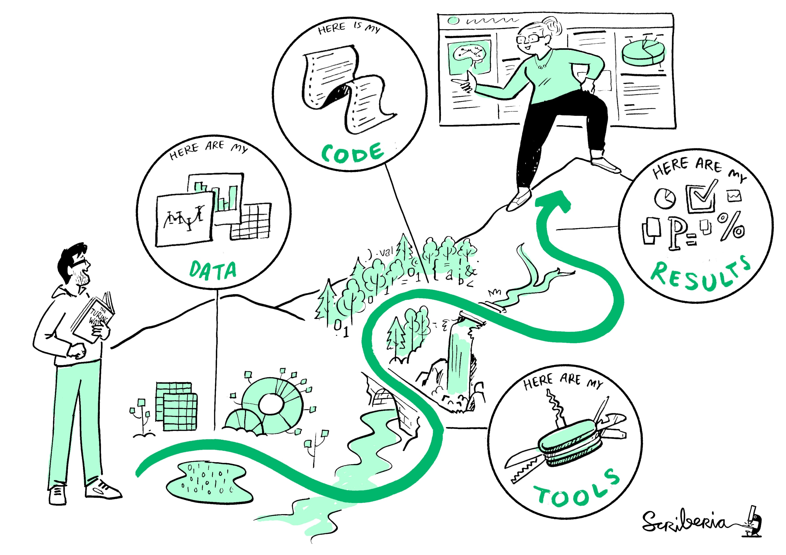

::: callout-outcomes

## 💡 Learning Outcomes

- Design stronger prompts for research tasks using context, constraints and output formats.
- Use AI to support discovery, reading, writing, code and analysis without outsourcing judgement.
- Validate AI outputs against primary sources, data and reproducible workflows.
- Identify when ad hoc prompting should become a documented workflow or a repeatable agent-like process.
:::

::: callout-questions

## ❓ Questions

1. What makes a prompt useful for research rather than generic chat?
2. Which research tasks benefit most from AI support?
3. How should researchers verify and document AI outputs?
4. When should AI use become a repeatable workflow rather than a one-off conversation?
:::

## Structure & Agenda

1. **Prompting and Framing Research Questions with AI** - 10 minutes teaching followed by a 5 minute prompt clinic.
2. **Using AI for Discovery, Reading and Writing Support** - 10 minutes teaching followed by a 5 minute summary stress test.
3. **Using AI for Data, Code and Analysis Support** - 10 minutes teaching followed by a 5 minute safe-or-risky prompt task.
4. **Validation, Documentation and Repeatable AI Workflows** - 10 minutes teaching followed by a 5 minute workflow sketch.

> 🔧 This is a lecture-led alternative to the original hands-on workshop, so the emphasis is on worked examples, critique and reusable patterns.

# Note

This session treats AI as a research assistant that needs supervision, not as an authority. The aim is not to maximise AI use. It is to make AI use more selective, more efficient and easier to defend.

# Prompting and Framing Research Questions with AI

{fig-align="center" width="500px"}

## Good AI use starts before the first prompt

The most common prompting mistake is treating AI as if it already knows the task, the audience and the quality threshold.

Before you prompt, decide:

- what you want the tool to do
- what sources or boundaries it should use
- what a useful output would look like
- what you will need to verify afterwards

## The anatomy of a strong research prompt

| Ingredient | Why it matters | Example |
|---|---|---|
| Task | tells the model what to do | "compare", "summarise", "draft", "debug" |
| Context | narrows the situation | "for a PhD literature review", "for a policy brief" |
| Evidence boundary | stops drift | "use only the attached paper" |
| Constraints | shapes usefulness | "6 bullet points", "plain English", "no invented citations" |
| Output format | reduces rewriting | table, checklist, outline, commented code |

> Better prompting is usually about better task definition, not clever phrasing.

## Weak prompt to stronger prompt

::: {.columns}
::: {.column}

**Weak**

> Summarise the AI policy.

:::
::: {.column}

**Stronger**

> Summarise the University of Nottingham guidance on generative AI for researchers in six bullet points. Use only the linked guidance page. Flag any area that remains ambiguous or context-dependent.

:::
:::

The stronger version defines the task, the source boundary, the audience and the expected output.

## Role prompting changes style, not truth

Asking AI to respond "as a researcher", "as a policy adviser" or "as a journalist" can be useful when you want to change tone, framing or depth.

But role prompting does **not** improve factual reliability by itself.

- useful for audience adaptation
- risky when style is mistaken for authority
- best used after the evidence boundary is clear

## A reusable pattern for research prompts

```{mermaid}
flowchart LR
    A["Task"] --> B["Context"]
    B --> C["Sources or boundaries"]
    C --> D["Output format"]
    D --> E["Checks: cite, verify, flag uncertainty"]
```

## A simple prompt template

Use a structure like this:

> "Help me with **[task]** for **[context/audience]**. Use **[source or boundary]**. Return the output as **[format]**. If something is uncertain, **[say so / ask a follow-up / flag it explicitly]**."

This will outperform most vague one-line prompts because it reduces guesswork.

## Start with the smallest useful task

Researchers often ask for too much in one prompt:

- read this topic
- find the literature
- compare the arguments
- write the review
- tell me the conclusion

That is usually where drift begins.

A better approach is to ask for the smallest useful intermediate step first.

For example:

- generate search terms
- compare two definitions
- rewrite notes into a table
- explain one error message

> Smaller tasks are easier to verify, easier to refine and easier to document.

## Good follow-up prompts do one thing

Once you get a first answer, the next prompt should usually narrow rather than widen.

Good follow-ups often ask the model to:

- clarify one ambiguous point
- restructure the same content into a new format
- identify assumptions or missing evidence
- generate a checklist for manual verification

Weak follow-ups often ask for a completely new task before the first one has been checked.

## A worked prompt chain

```{mermaid}
flowchart LR
    A["Define the task"] --> B["Get a first structured answer"]
    B --> C["Interrogate assumptions or gaps"]
    C --> D["Refine format for use"]
    D --> E["Verify against source or data"]
```

This is slower than a single magic prompt, but usually faster than recovering from a vague answer later.

## Prompting for uncertainty is a research skill

Many people ask AI to sound certain because certainty feels efficient.

In research work, better prompts often include instructions like:

- "flag anything uncertain"
- "distinguish evidence from inference"
- "list what would need checking"
- "do not invent citations or page numbers"

These instructions do not guarantee correctness, but they make the output easier to handle responsibly.

---

::: callout-task

#### Task 1: Prompt clinic

::: panel-tabset

##### Exercise

Take a prompt you have used before, or invent a weak one, and improve it by adding:

1. clearer task definition
2. source boundaries
3. output format
4. one explicit instruction for uncertainty

##### Plenary

- Which ingredient made the biggest difference?
- What part of the prompt protects against hallucination or drift?
- Where might a follow-up prompt still be needed?
:::
:::

# Using AI for Discovery, Reading and Writing Support

{fig-align="center" width="400px"}

## Use AI to orient, not to outsource scholarship

AI is often most useful early in a task when you need traction rather than a final answer.

Good uses include:

- generating search terms
- comparing concepts or policy positions
- drafting a structure for notes or a summary
- rewriting for a different audience

The key is that the researcher still does the reading, source checking and selection.

## Discovery and literature mapping

| Task | Useful AI support | What to watch for |
|---|---|---|
| Starting a topic | generate keywords and sub-topics | narrow or biased framing |
| Comparing debates | produce candidate themes | missing minority or critical perspectives |
| Planning reading | sequence papers or concepts | false confidence in coverage |
| Building notes | convert notes into tables or outlines | invented citations or claims |

> AI can accelerate orientation, but it cannot tell you what the field definitely says without verification.

## Reading and comparison

For reading support, AI is often best used with materials you already have in front of you.

- ask for a structured summary of an attached text
- ask for contrasts between two documents
- ask what questions the text leaves unanswered
- ask where the argument relies on strong assumptions

This keeps the task grounded in actual sources rather than in the model's memory.

## Drafting and communication

AI can be useful for:

- outlines and first-pass structure
- plain-language summaries
- alternative titles and headings
- speaker notes or slide summaries

It is much less defensible when people start relying on it for citations, unsupported claims or disciplinary judgement they cannot explain.

## A good rule for writing support

Let AI help with structure, phrasing and audience adaptation.

Keep control over:

- claims
- evidence
- citations
- argument

> Writing support is usually low risk until it becomes substantive contribution.

## A worked pattern: source first, summary second

```{mermaid}
flowchart LR
    A["Primary source or trusted document"] --> B["AI-assisted summary or comparison"]
    B --> C["Manual verification"]
    C --> D["Research notes or draft"]
```

This pattern is safer than asking an AI tool to generate a free-standing answer from memory.

## Three prompt patterns worth keeping

| Pattern | Example use | Why it works |
|---|---|---|
| compare | compare two policy documents by theme | produces structure, not just summary |
| transform | turn rough notes into a table or outline | keeps your source material central |
| critique | identify missing caveats or assumptions | encourages challenge rather than acceptance |

These are often more useful than asking for a polished answer straight away.

## What not to ask from model memory

Avoid prompts that depend entirely on the model remembering a domain perfectly.

Examples:

- "give me the definitive current policy"
- "list the five most important papers in my field"
- "quote the exact wording from that article"
- "tell me what this funder definitely permits"

Those may sound efficient, but they create exactly the kind of hidden risk that good research practice is supposed to reduce.

## A source-grounded reading workflow

1. Gather the actual paper, policy or document.
2. Ask AI to summarise or compare only that material.
3. Ask for uncertainties, assumptions or missing information.
4. Verify the answer against the source yourself.
5. Keep only the parts you can defend.

This is one of the most reliable ways to keep AI support useful without handing over scholarly judgement.

## AI is often best used as a second reader

Good second-reader style prompts include:

- "what assumptions is this argument relying on?"
- "what did this summary leave out?"
- "where is the author strongest or weakest?"
- "what would an informed critic ask next?"

That kind of use supports reading and thinking, rather than replacing it.

---

::: callout-task

#### Task 2: Summary stress test

::: panel-tabset

##### Example

Consider this AI-generated claim:

> "UKRI permits unrestricted use of generative AI in funding applications as long as applicants disclose it."

##### Discussion

Without deciding whether it is true, list what you would verify before repeating it:

- wording
- scope
- date
- whether it applies to all schemes or only some contexts
- whether there are restrictions beyond disclosure
:::
:::

# Using AI for Data, Code and Analysis Support

{fig-align="center" width="500px"}

## Where AI is genuinely useful for technical work

AI can be very effective for technical scaffolding:

- drafting boilerplate code
- explaining unfamiliar syntax
- converting code between languages
- suggesting ways to clean or reshape data
- generating starter visualisations

The value is highest when the output is easy to inspect and test.

## Ask for outputs you can inspect

| Ask for | Why it helps |
|---|---|
| commented code | easier to review and teach from |
| assumptions | exposes hidden choices |
| a toy example | lets you test logic safely |
| likely failure points | reveals fragile spots early |
| checks or tests | pushes validation into the workflow |

> If the model produces code that nobody in the room can read, it has not saved as much time as it seems.

## Quantitative and qualitative work both benefit differently

| Task | Useful AI support | What still needs human control |
|---|---|---|
| survey or tabular data | cleaning scaffolds, plotting, diagnostics | correctness, variable meaning, interpretation |
| statistical code | starter scripts, code translation, debugging | model choice, assumptions, robustness |
| qualitative work | coding frames, summary structures, memo prompts | context, nuance, ethics, representation |
| reproducible workflows | templates, documentation drafts | actual pipeline design and review |

## Sensitive data changes the rule set

Convenient prompting does not override governance.

- do not paste identifiable participant data into public AI tools
- do not upload unpublished or contract-restricted material without approval
- prefer secure institutional tools where available
- use synthetic or toy examples when you only need coding help

> Public chat tools are not a shortcut around data management or ethics requirements.

## Human-in-the-loop analysis workflow

```{mermaid}
flowchart LR
  A["Research question"] --> B["AI-assisted scaffold"]
  B --> C["Run on local or approved data"]
  C --> D["Inspect outputs and diagnostics"]
  D --> E["Revise prompt or code"]
  E --> F["Document what was used"]
```

This is a stronger pattern than copying an answer from a chat window directly into analysis.

## A stronger code-help prompt

Compare these two approaches.

**Weak**

> Fix my R code.

**Stronger**

> Explain why this R error occurs in plain English. Then suggest a corrected version using a toy dataset first. Add comments to the code and list two checks I should run before using it on the real data.

The stronger prompt makes inspection part of the output rather than an afterthought.

## Ask the model to reveal assumptions

Technical outputs often hide important choices.

Useful prompt additions include:

- "state any assumptions you are making about the data"
- "tell me what column types you expect"
- "show the edge cases that could break this"
- "suggest one diagnostic plot and one validation check"

If the model cannot explain its assumptions clearly, that is useful information in itself.

## Qualitative and mixed-methods work need special care

AI can support qualitative research, but the safest uses are usually around structure rather than interpretation.

Relatively safer uses:

- drafting an interview guide
- reorganising public notes into themes
- generating a codebook template
- producing memo prompts for the researcher

Higher-risk uses:

- inferring participant meaning without close reading
- collapsing nuance into over-clean themes
- processing identifiable or sensitive text in public tools

> In qualitative work, the main risk is not only error. It is flattening context and voice.

## A practical mixed-methods example

| Stage | Sensible AI role | Human responsibility |
|---|---|---|
| survey design | draft candidate question wording | ensure validity and ethics |
| interview planning | generate prompts or probes | tailor to participants and study design |
| coding support | propose category labels or memo prompts | interpret data and preserve nuance |
| reporting | convert notes into structure | defend findings and quotations |

This keeps AI at the level of scaffolding while the researcher retains interpretive control.

---

::: callout-task

#### Task 3: Safe prompt or risky prompt?

::: panel-tabset

##### Exercise

Classify each prompt as `generally safe`, `depends on safeguards`, or `risky in a public AI tool`.

1. "Write R code to clean a CSV with columns age, department and score. Use a toy dataset first."
2. "Here are 25 interview transcripts with names removed. Tell me what participants think."
3. "Explain why this Python error occurs and suggest a fix."

##### Plenary

- Which prompt is safest because the data are abstract rather than sensitive?
- Which prompt looks safe at first glance but still carries disclosure risk?
- What would make the middle case more defensible?
:::
:::

# Validation, Documentation and Repeatable AI Workflows

{fig-align="center" width="400px"}

## Validation is where research value is created

Without validation, AI mainly increases output volume.

With validation, it can reduce friction and support better iteration.

Researchers should verify:

- factual claims
- citations and quotations
- code behaviour
- analytical assumptions
- whether the output actually answers the task

## A practical validation checklist

| Output type | What to check |
|---|---|
| summary or explanation | source accuracy, missing caveats, date |
| citations | existence, wording, relevance |
| code | runs, edge cases, diagnostics, comments |
| interpretation | whether it follows from the data |
| visual or table | labels, scale, transformations, context |

> Validation should be designed into the workflow, not bolted on afterwards.

## Documenting AI use

| Record | Example |
|---|---|
| tool and version | Copilot, Claude, ChatGPT, local model |
| date and task | "2026-03-10, draft policy comparison" |
| prompt or template | stored in notes, appendix or project log |
| input material | public document, toy dataset, draft abstract |
| checks performed | manual source check, code execution, discussion with team |
| disclosure decision | methods note, acknowledgements, internal log |

This does not need to be bureaucratic. It just needs to be clear enough that you can explain what happened later.

## When a task should become a repeatable workflow

If you are doing the same low-risk task repeatedly, ad hoc prompting becomes inefficient.

Good candidates for a reusable workflow are tasks with:

- a stable input pattern
- a clear output structure
- public or approved source material
- an obvious validation step

## From prompt to workflow to agent

```{mermaid}
flowchart LR
  A["Ad hoc prompt"] --> B["Reusable prompt template"]
  B --> C["Checklist and validation step"]
  C --> D["Repeatable workflow"]
  D --> E["Agent or automation"]
```

## Agents are useful when the task is narrow

| Good agent candidates | Poor agent candidates |
|---|---|
| policy lookup from public websites | final interpretation of results |
| turning notes into a consistent template | authorship or disclosure decisions |
| converting a repeated admin task into a checklist | synthesis of sensitive qualitative data in a public tool |
| monitoring a public information source | any task where the evidence base is unclear and unreviewed |

> Automate the structure, not the responsibility.

## A simple logging habit that scales

You do not need a complex system to document AI use.

A lightweight note after each substantial use can include:

- date
- tool
- task
- prompt template or short description
- what input was used
- what was kept
- what was checked

That is often enough to support transparency later.

## Decision tree: should this become a workflow?

```{mermaid}
flowchart LR
    A["Repeated task"] --> B{Same input pattern each time?}
    B -->|No| C["Keep it ad hoc"]
    B -->|Yes| D{Output easy to verify?}
    D -->|No| C
    D -->|Yes| E{Low-risk material?}
    E -->|No| F["Use only with tighter safeguards"]
    E -->|Yes| G["Create a reusable workflow"]
```

This is helpful because not every recurring task deserves automation.

## A sample AI use note

```text
Date: 2026-03-23
Tool: ChatGPT
Task: Compared two public AI policy pages and drafted a 6-point table
Input: Public web text copied into prompt
Output kept: Table headings and 3 rewritten bullets
Checks: Manual comparison against source pages
Disclosure: Internal project log only
```

Short notes like this make later reporting much easier.

## When not to turn AI use into routine

Do not formalise a workflow if:

- the task depends on unstable judgement
- the evidence base changes too quickly to trust a template
- the input regularly includes sensitive or unpublished material
- nobody is available to review the outputs properly

In those cases, templating can create false confidence rather than real efficiency.

## A good end-state for research AI use

The goal is not constant AI use.

The goal is:

- selective use where it clearly helps
- stronger task definition before prompting
- visible validation after prompting
- better records for anything substantial

That is what makes AI support defensible in research settings.

---

::: callout-task

#### Task 4: Workflow sketch

::: panel-tabset

##### Exercise

Choose one repeated research task and sketch four steps:

1. input
2. AI step
3. validation step
4. record or disclosure step

Examples might include policy lookup, meeting note formatting, code explanation or first-pass document comparison.

##### Plenary

- Which tasks are worth templating?
- Which tasks should stay fully manual?
- Where would you place the validation checkpoint?
:::
:::

# Further Information

::: callout-keypoints

## 🔦 Key points

- Strong AI use in research starts with strong task definition.
- AI is often most useful for orientation, scaffolding and restructuring work.
- The highest-risk failures usually come from weak validation, not from the first prompt alone.
- Reusable workflows are valuable when the task is narrow, repeated and easy to check.
- Documentation turns AI use from an invisible habit into a defensible research practice.
:::

::: callout-hints

## 📚 Additional Reading

- **UoN guidance on AI**: [University of Nottingham guidance](https://www.nottingham.ac.uk/studyingeffectively/studying/ai.aspx)
- **UKRI policy**: [Generative AI in application and assessment policy](https://www.ukri.org/publications/generative-artificial-intelligence-in-application-and-assessment-policy/)
- **Publisher policy**: [Nature Portfolio editorial policies - Artificial Intelligence](https://www.nature.com/nature-portfolio/editorial-policies/ai)
- **Publication ethics**: [COPE position - Authorship and AI tools](https://publicationethics.org/guidance/cope-position/authorship-and-ai-tools)
:::
