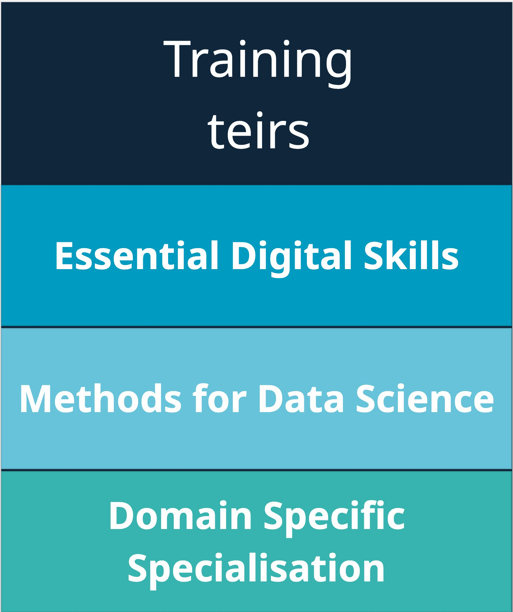
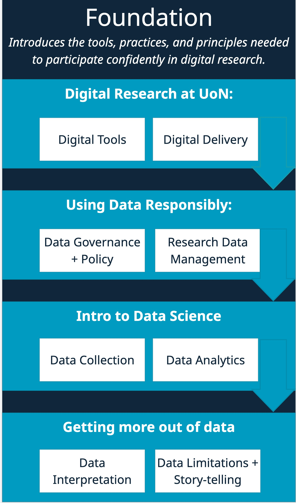
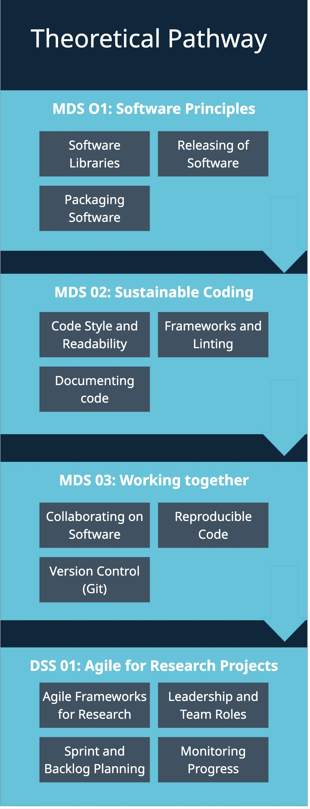
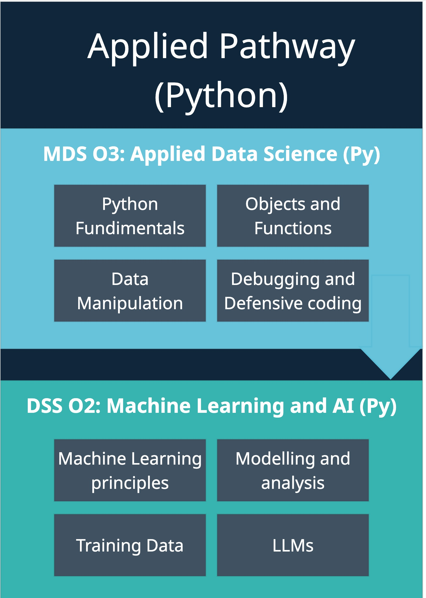
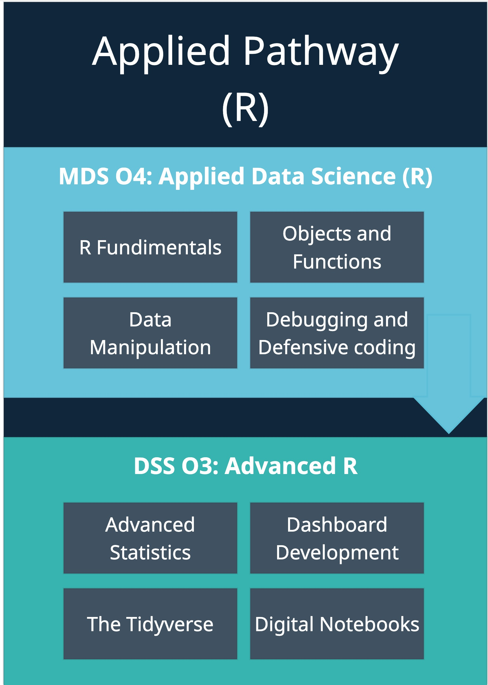
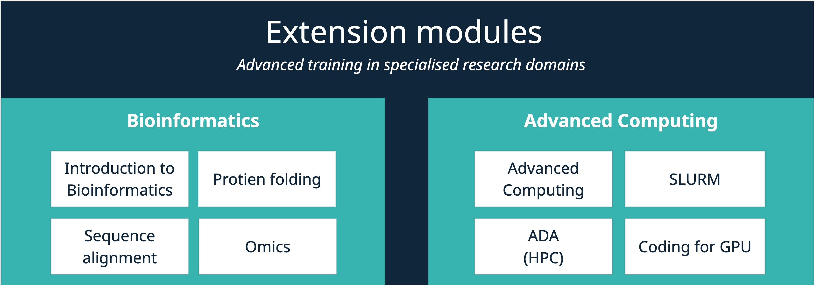

:::{#hero-heading}
The **Data Science & Digital Skills Programme (DS&DSP)** is a one-year, tiered in-person training pathway designed to equip researchers with the core digital competencies required for modern, reproducible, and data-intensive research. 
:::

# Programme Overview

::::: grid
::: g-col-3
{width="100%"}
:::

::: g-col-9
In a landscape where computational literacy, responsible data handling, and digital best practices are integral to research quality, the programme offers structured, progressive training to address skill gaps across disciplines.
:::
:::::

------------------------------------------------------------------------

## Compulsory Training: Essential Digital Skills

::::: grid
::: g-col-7
**Essential Digital Skills (EDS)** is the foundation tier of DS&DSP. This in-person training programme is designed to equip researchers with the fundamental digital competencies, institutional knowledge, and research practices required to operate effectively in the University of Nottingham’s modern, data-intensive research environment.

The course comprises 8 thematic modules delivered over four in-person training days, with each module structured to introduce key concepts and tools, followed by exercises and peer-led activities that consolidate learning in a practical, research-specific context.

Modules will be delivered through a blended format that combines short (10–15-minute) teaching segments with interactive activities such as case tasks, scenario-based discussions, matching exercises, and prompt testing. Group-based engagement will be used to encourage collaboration, reflection, and shared problem-solving, with a consistent research-focused framing to ensure relevance across disciplines.
:::

::: g-col-5
{width="100%"}
:::
:::::

:::::::::::: panel-tabset
## Theoretical Pathway

::::: grid
::: g-col-5

:::

::: g-col-7
The theoretical pathway
:::
:::::

## Applied Pathway – Python

::::: grid
::: g-col-5

:::

::: g-col-7
The Applied Pathway in python
:::
:::::

## Applied Pathway – R

::::: grid
::: g-col-5

:::

::: g-col-7
The Applied Pathway in R
:::
:::::
::::::::::::

## Standalone Modules

------------------------------------------------------------------------

::: panel-tabset
### Programme Materials

👉 [Access EDS programme](essential_digital_skills/index.html)

------------------------------------------------------------------------

### Structure

DS&DS spans three tiers, aligned with institutional priorities in open science and research integrity.

These are:

-   **Foundation** – *Essential Digital Skills* (Year 1, mandatory)
-   **Intermediate** – *Methods for Data Science* (Year 2+, optional)
-   **Advanced** – *Domain-Specific Specialisations* (tailored)

This progression builds confidence and research-ready capability at every stage.

------------------------------------------------------------------------

### Delivery

The programme is modular and primarily in-person:

-   **Year 1**: Core skills workshops (EDS)
-   **Year 2**: Optional intermediate/advanced modules
-   Cohort delivery initially for the BBSRC DTP (2025)

All materials are developed for reuse and open dissemination.
:::

## Curriculum & Outcomes

Participants will:

-   Manage data using FAIR principles
-   Build reproducible pipelines (Git, Quarto, Jupyter)
-   Analyse data with statistical and domain-relevant tools
-   Document and share research outputs openly
-   Operate within governance and policy frameworks

All materials are shared openly via GitHub, with linked workshops and exercises.

## Participants

-   Open to BBSRC doctoral researchers at Nottingham
-   Designed for those with some / no prior coding experience
-   Delivered in inclusive, discipline-agnostic format
-   Encourages peer-led learning and shared practice

Progression is supported via optional pathways following completion of the foundation modules.

## Contact

-   Programme Lead: *Dr. Thomas Giles*\
-   Email: **tom.giles\@nottingham.ac.uk**

For registration, accessibility, or module questions, please contact the DS&DS team directly.

------------------------------------------------------------------------