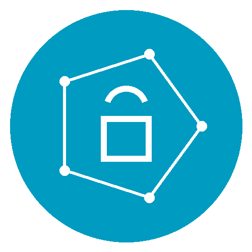

:::{#hero-heading}

:::

:::{.beige}
"Modern research projects routinely involve code, 
large data sets and complex computational workflows.  

However, many researchers have limited exposure to software engineering, 
digital infrastructure or best practices for managing data.  

The UoN Digital Skills programme addresses this gap by providing a structured training pathway 
aligned with open science and research integrity principles."
:::

::: {.two-col-grid}
::: {.item}

 

## Introduction

The UoN Digital Skills programme is a one-year, in-person training initiative that equips researchers with the essential digital competencies for modern, reproducible, and data-intensive research. This curriculum is built around clear navigation and intuitive organisation so that participants can easily locate resources and modules on the website.  All materials are mobile‑friendly and accessible, ensuring that learners can engage with content on different devices.  
:::

::: {.item}

 

:::
:::

::: {.beige}
 
"This initiative is structured to support learners at all levels of expertise, from those seeking to develop foundational digital literacy and confidence in using everyday technologies, to advanced researchers and professionals aiming to enhance their computational, analytical, and data-driven capabilities for research and innovation."
:::

::: {.dark}

<h2> The 5 principles of this initiative </h2>

::: {.five-col-grid}

::: {.item}
{.round-img width="120px"}
**Structured progression**  
 
The programme is organised into foundation, intermediate and advanced tiers, allowing participants to build their skills incrementally and revisit concepts as needed.

:::

::: {.item}
{.round-img width="120px"}
**Hands-on learning**  
 
Each session combines didactic lectures and collaborative exercises such as scenario-based tasks to reinforce understanding through practice.

:::

::: {.item}
{.round-img width="120px"}
**Open science focus**  
 
Modules emphasise FAIR (findable, accessible, interoperable and reusable) data principles, reproducible workflows and responsible data governance.

:::

::: {.item}
{.round-img width="120px"}
**Discipline-agnostic**  
 
Although developed for BBSRC doctoral researchers, the methods and tools apply across research domains, and later tiers offer optional domain-specific modules.

:::

::: {.item}
{.round-img width="120px"}
**Portfolio-building**  
 
Participants develop a digital portfolio of skills, improve their competencies and gain tools that they can be reused in their own research.

:::
:::
:::

{.full-width-image}

::: {.beige}

## By the end of the course, participents should be able to:

::: {.five-col-grid}

::: {.item}
**Design and conduct reproducible research** 
  
Develop transparent, well-documented workflows that ensure research processes can be verified, repeated, and built upon by others.
:::

::: {.item}
**Apply responsible data management principles** 
  
Manage data and metadata to ensure they are well-organised, accessible, interoperable, and reusable, with appropriate licensing and long-term stewardship.
:::

::: {.item}
**Employ rigorous analytical and coding practices** 
  
Implement robust statistical and computational methods, supported by clean, well-documented, and reusable code that enhances clarity and reproducibility.
:::

::: {.item}
**Communicate and collaborate effectively** 
  
Present results with precision and transparency, and engage in digital collaboration that promotes accountability and shared understanding.
:::

::: {.item}
**Embed ethics and domain awareness** 
  
Uphold legal and ethical standards, and tailor digital and analytical methods to the specific needs, data, and conventions of your research field.
:::

:::
:::

 

::: {.two-col-grid}
::: {.item}

## Training tiers

::: callout-EDS
##### Foundation 
Essential Digital Skills (*Oct - Jan; mandatory*).  Four half‑day sessions introduce the core tools, policies and principles required for computational research. The foundation tier serves as the entry point for all participants.  The goal is to familiarise researchers with the digital ecosystem at the University, introduce them to reproducible research tools and lay the groundwork for ethical data stewardship.  Participants learn by doing: small groups work through realistic research scenarios and reflect on how the methods apply to their own projects.
:::

 

::: callout-MDS
##### Intermediate
 Methods for Data Science (*Feb - Sep; optional*).  Follow up workshops run over one or two academic terms. This intermediate tier delves deeper into the conceptual and practical aspects of code based data science.  Participants can select one or more streams (Python, R or Software Engineering) that match their research needs and disciplinary background.  This teir is delivered as programming workshops that give participents the opportunities to apply the methods to both example data sets and their own projects.  
:::

 

::: callout-DSS
##### Advanced
Domain‑specific training (*year 2–3+; tailored*).  Beyond the core programme, Digital Skills seeks to offer a portfolio of advanced modules tailored to specific research domains.  These optional sessions are typically delivered in small cohorts and are taught by subject‑matter experts from across the University.  The advanced modules allow participants to consolidate the skills gained in earlier tiers and apply them to specialised problems. These will be delivered as short intensive modules (1-2 days) are scheduled throughout the year based on demand and availability of instructors.
:::
:::

::: {.item}

## Delivery

Initial delivery is targeted to BBSRC DTP students (2025 cohort), but the programme will be opened to other doctoral and early‑career researchers in subsequent years.  A continuous improvement process ensures that content is updated in response to participant feedback and advances in digital research methods. 

Sessions are delivered primarily in person to foster discussion and collaboration. Participants work in small cohorts, promoting peer learning and networking.  Cohorts are cross‑disciplinary to encourage exchange of ideas. 

Progression through the tiers ensures that participants build confidence gradually.  Assessment is formative and feedback is provided by instructors and peers.

All materials are released under permissive licences via GitHub, enabling reuse and adaptation by the wider research community.

## Access materials

All teaching materials are openly licensed and hosted in a version‑controlled repository.  Each module includes lecture notes, slide decks, example datasets, scripts and step‑by‑step exercises.  Participants are encouraged to clone or fork the repositories, complete the exercises and contribute improvements via pull requests.  The repositories include continuous integration workflows that test code for reproducibility and correctness.

## Contact
For general enquiries, registration or accessibility queries please contact the Digital Research Service administrative team via email at <digitalresearch@nottingham.ac.uk>.  You can also follow programme updates on social media using the links in the page header.  We welcome feedback on the curriculum and suggestions for new modules.

**Programme lead:** Dr Thomas Giles  
📧 <tom.giles@nottingham.ac.uk>

:::
:::

