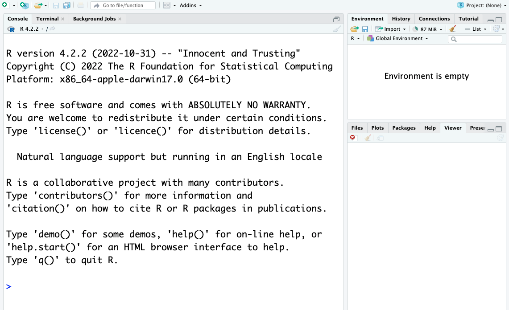
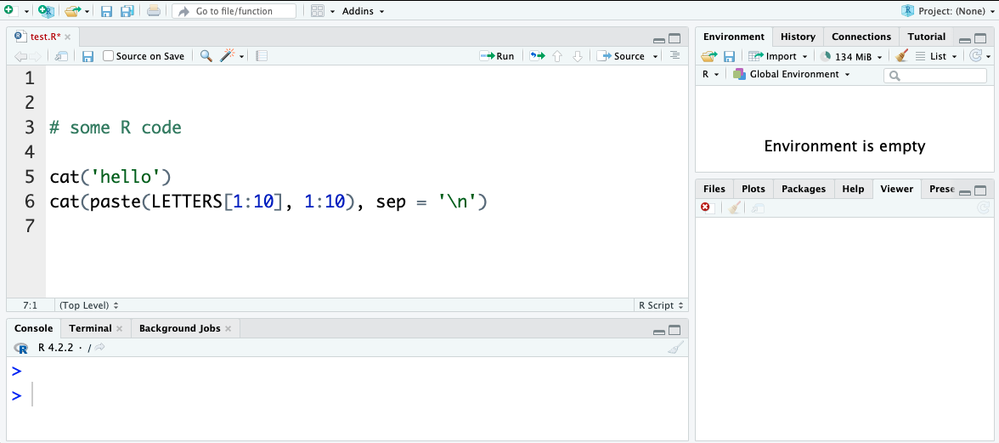
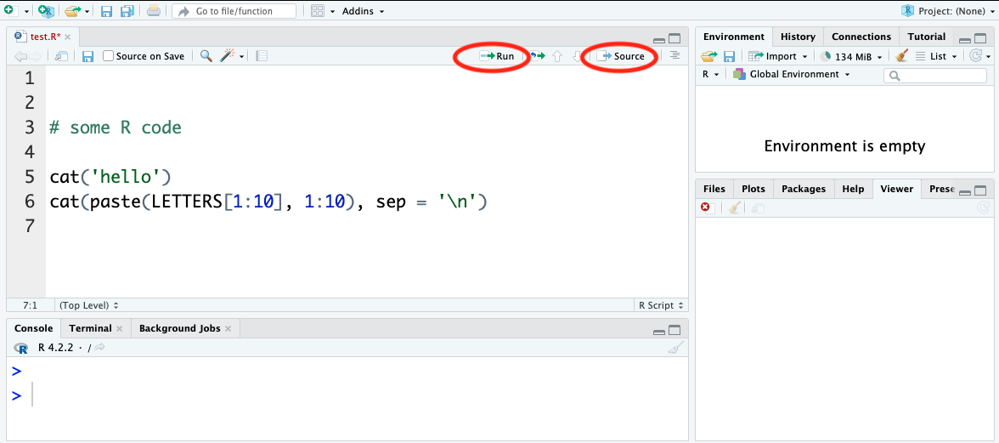
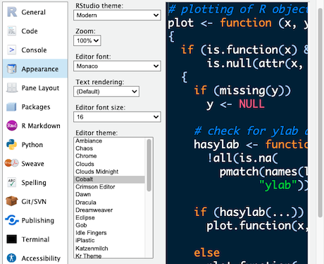
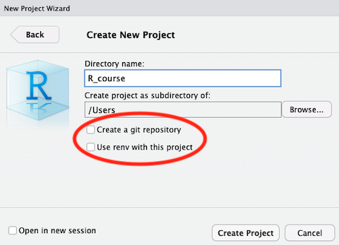

# Using RStudio
We’ll be using RStudio: a free, open source R Integrated Development Environment (IDE). It provides a built-in editor, works on all platforms (including on servers) and provides many advantages such as integration with version control and project management.

## Basic Layout

When you open RStudio for the first time, you will be greeted by three main panels:  

- The interactive R console/Terminal/... (entire left)
- Environment/History/Connections/... (tabbed in upper right)
- Files/Plots/Packages/Help/Viewer/... (tabbed in lower right). 

---



Opening/creating a File opens a 4th editor panel. 

# TASK: Create a new file for R coding
 
 File > New File > R script  Save the file as something like test.R in a suitable location e.g. R_course (there is a new directory option in the save file dialog)



  
# TASK: update file: 
 
Add a couple of lines of example code to the file, for instance you could use:      ```{r eval = FALSE}   cat('hello')   cat(paste(LETTERS[1:10], 1:10), sep = '\n')   ``` and save. (+ If you want information about any commands note them to use with the R help options later) 

## Note the Run and Source buttons above the editor pane**



**Run:** runs the particular code selected or the line where the cursor is resting. 

**Source:**  runs the whole file. 


# TASK:
  
Try using the **Run** and **Source** buttons and see how the code behaves when using Run with different text selections or cursor locations

# RStudio Themes

There are many ways to configure RStudio, including text size, layout and colour schemes. 



# TASK: 
 
Take a look at the RStudio Preferences/Settings Edit > Preferences...  Or depending on the RStudio version Tools > Global Options In particular look at the <strong>Appearance</strong> settings  Change the 'Editor theme:' to a dark theme (Cobalt is a good example).  Pick a theme to use or return to the default (Textmate) and go OK.

# Using R Packages (CRAN)
It is possible to add functions to R by writing them yourself, but a major reason for the popularity of R are the many freely available packages for a multitude of computational tasks. There are >21,000 packages available from **CRAN** alone (the Comprehensive R Archive Network). So for any particular task there is a high probability robust pre-existing code exists. 

## R has command driven functionality for managing packages/libraries: 

- You can see what packages are installed by typing `installed.packages()`
- You can install packages by typing `install.packages("package_name")`, where package_name is the package name, in quotes.
- You can update installed packages by typing `update.packages()`
- You can remove a package with `remove.packages("packagename")`
- You can make a package available for use with `library(package_name)` (typically placed at the top of your R script - note: quotes are optional here). 

## RStudio also allows package management via the GUI

Packages can be viewed, loaded, and detached in the Packages tab of the lower right panel in RStudio. Clicking on this tab will display all of the installed packages with a checkbox next to them. If the box next to a package name is checked, the package is loaded and if it is empty, the package is not loaded. Click an empty box to load that package and click a checked box to detach that package.
Packages can be installed and updated from the Package tab with the Install and Update buttons at the top of the tab. 

Or use Tools > install Packages…

# TASK: 
  
Install a package either from the console   `install.packages('gapminder')` Or via the RStudio menus   **Tools > Install Packages...**   enter 'gapminder' and click install


## Note: gapminder is a small package that provides some data that will be used later.**


If appropriate your trainer may ask you to install other packages like the dplyr package that we will be using  extensively

# Other Package sources

Packages can also be obtained from other sources such as:

- Github
- Package Archive files (.tar.gz/.zip)
- Bioconductor

Some specialist or very new packages may be obtained directly from their authors and require different installation processes e.g: from github using the devtools package  `devtools::install_github("DeveloperName/PackageName")`  <https://cran.r-project.org/web/packages/githubinstall/vignettes/githubinstall.html> 

Or if a suitable package archive file is provided, using `install.packages()` but with the archive file path (which can be a URL) and the `type = "source"` parameter.  

For those working in the areas of biological science the **Bioconductor** package repository may be important.  

It is a source of 2100+ packages of particular interest to bioscientists and bioinformaticians <https://www.bioconductor.org/packages>. 

Setting up Bioconductor packages requires the prior installation of a package called BiocManager which is then used to install the  specialist packages (<https://bioconductor.org/install/>). 

# Projects with RStudio

One powerful and useful aspect of RStudio is its project management functionality. Projects help keep related scripts, R configurations and data organised together and reduces conflicts and confusion between different sets of work. 

**If you are creating more than a few small scripts get into the habit of creating a Project for every collection of related scripts and data**

---

If you have already done some work before creating the project use:  

**File > New Project...  > Existing Directory > Create Project From Existing Directory**

---

Or if you are starting things from scratch use:

**File > New Project...  > New Directory > New Project > Create New Project** 




---

Note when creating a new project you are given the options to:

- Create a git repository
- Use renv with this project

These options provide powerful functionality for a project but we will not be covering them further in this introduction, however we recommend looking into their use especially if you end up working with complex or colaborative R coding.  

 # TASK: 
 
 Create a project using the existing Folder and test script saved earlier 

## HINT:

**File > New Project...  > Existing Directory > Create Project From Existing Directory** 

To open an existing R project in RStudio either use **File > Open Project** (or related menu options) or use the file browser to get to the directory where it was saved and open the .Rproj file (which should be associated with RStudio). This will open RStudio and start your R session in the project directory. All your data, plots and scripts will now be relative to the project directory and should be redisplayed in the state that the project was closed in. It is a good habit when using projects to use the File > Open/Close Project menu options as you work.  

RStudio projects have the added benefit of allowing you to open multiple projects at the same time each using its own project directory. This allows you to keep multiple projects open without them interfering with each other.

## Supplementary info: 

#### Code tidying

There are some built in functions for organising code text including:

- Code > Reindent Lines
- Code > Reformat Lines
- Code > Comment/Uncomment

#### Working Diectory

Using projects should keep you located in the appropriate directory for your work but if needed you can set your directory location using:  

Session > Set Working Directory > (several options)

The commands `setwd('directory_path')` works from the console also note the handy `getwd()` to display the current working directory can sometimes be helpful. 

#### Finding Help

There are several sources of documentation for R packages on line but RStudio also supplies R package documentation via the search in its Help tab. Whenever you use a new package it is a good idea to take at least a quick look at the description and available parameters.


The package help can also be found by entering `?package_name` in the console. 
 
# TASK:
 
look at help documentation for `paste` and `getwd` using the console

## Hint

```{r eval = FALSE}
?paste

?getwd

```


**Note: If a package is not currently loaded it will be suggested to try `??package_name` for a more extensive search**

# Cheat Sheets 

For overviews / command references for particular topics there are some very useful "cheat sheets" available from the help menu. 


**Help > Cheatsheets**

<https://posit.co/resources/cheatsheets/>


# TASK
 
Take a look at the RStudio IDE Cheat Sheet From the Help menu

## Hint

**Help > Cheatsheets > RStudio IDE Cheat Sheet** 

# Other Resources

There are many web resources available to help you use R successfully.
For general and specific questions about R, Google and Stackoverflow (<https://stackoverflow.com>) are your friends. Resources such as ChatGTP can be now used to generate or refine code, however in an academic context care should always be taken to understand thoroughly how any code actually works before use.
