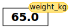

::: callout-note
This module has been adapted from <https://carpentries.org/>, which is freely available for reuse under the [creative commons licence](https://creativecommons.org/licenses/by/4.0/).

[Original author information](../AUTHORS.md)
:::

# Learning Objectives

::: callout-c1
-   Assign values to variables.
:::

:::: {.content-visible when-format="revealjs"}
::: notes
This is a note that you can only see in presenter view
:::
::::

# Questions

::: callout-c2
-   What basic data types can I work with in Python?

-   How can I create a new variable in Python?

-   How do I use a function?

-   Can I change the value associated with a variable after I create it?

-   How can I get help while learning to program?
:::

# Variables

Any Python interpreter can be used as a calculator:

```{python}
#| echo: true
3 + 5 * 4
```

This is great but not very interesting.

## Variable assignment

To do anything useful with data, we need to assign its value to a *variable*. In Python, we can [assign](../learners/reference.md#assign) a value to a [variable](../learners/reference.md#variable), using the equals sign `=`. For example, we can track the weight of a patient who weighs 60 kilograms by assigning the value `60` to a variable `weight_kg`:

```{python}
#| echo: true
weight_kg = 60
print(weight_kg)
```

From now on, whenever we use `weight_kg`, Python will substitute the value we assigned to it. In layperson's terms, **a variable is a name for a value**.

## Variable names In Python:

variable names:

-   can include letters, digits, and underscores
-   cannot start with a digit
-   are [case sensitive](../learners/reference.md#case-sensitive).

This means that, for example:

-   `weight0` is a valid variable name, whereas `0weight` is not
-   `weight` and `Weight` are different variables

# Types of data

Python knows various types of data. Three common ones are:

-   integer numbers
-   floating point numbers, and
-   strings.

In the example above, variable `weight_kg` has an integer value of `60`.

------------------------------------------------------------------------

If we want to more precisely track the weight of our patient, we can use a floating point value by executing:

```{python}
#| echo: true
weight_kg = 60.3
print(weight_kg)
```

------------------------------------------------------------------------

To create a string, we add single or double quotes around some text. To identify and track a patient throughout our study, we can assign each person a unique identifier by storing it in a string:

```{python}
#| echo: true
patient_id = '001'
print(patient_id)
```

## Using Variables in Python

Once we have data stored with variable names, we can make use of it in calculations. We may want to store our patient's weight in pounds as well as kilograms:

```{python}
#| echo: true
weight_lb = 2.2 * weight_kg
print(weight_lb)
```

We might decide to add a prefix to our patient identifier:

```{python}
#| echo: true
patient_id = 'inflam_' + patient_id
print(patient_id)
```

# Built-in Python functions

To carry out common tasks with data and variables in Python, the language provides us with several built-in [functions](../learners/reference.md#function). To display information to the screen, we use the `print` function:

```{python}
#| echo: true
print(weight_lb)
print(patient_id)
```

## Parentheses

When we want to make use of a function, referred to as calling the function, we follow its name by parentheses. The parentheses are important: if you leave them off, the function doesn't actually run! Sometimes you will include values or variables inside the parentheses for the function to use. In the case of `print`, we use the parentheses to tell the function what value we want to display. We will learn more about how functions work and how to create our own in later episodes.

## Combining outputs using "print"

We can display multiple things at once using only one `print` call:

```{python}
#| echo: true
print(patient_id, 'weight in kilograms:', weight_kg)
```

# Nested Functions

We can also call a function inside of another [function call](../learners/reference.md#function-call). For example, Python has a built-in function called `type` that tells you a value's data type:

```{python}
#| echo: true
print(type(60.3))
print(type(patient_id))
```

## Nested Print

Moreover, we can do arithmetic with variables right inside the `print` function:

```{python}
#| echo: true
print('weight in pounds:', 2.2 * weight_kg)
```

Note: The above command, however, did not change the value of `weight_kg`:

```{python}
#| echo: true
print(weight_kg)
```

# Updating variables

To change the value of the `weight_kg` variable, we have to **assign** `weight_kg` a new value using the equals `=` sign:

```{python}
#| echo: true
weight_kg = 65.0
print('weight in kilograms is now:', weight_kg)
```

# Getting Help

Use the built-in function `help` to get help for a function. Every built-in function has extensive [documentation that can also be found online](https://docs.python.org/3/library/index.html).

## Help Example

```{python}
#| echo: true
help(print)
```

This help message (the function's "docstring") includes a usage statement, a list of parameters accepted by the function, and their default values if they have them.

# Error messages

It is normal to encounter error messages while programming, whether you are learning for the first time or have been programming for many years. [We will discuss error messages in more detail later](./09-errors.md). For now, let's explore how people use them to get more help when they are stuck with their Python code.

# Task 1

::: panel-tabset
## Question

Search the internet: paste the last line of your error message or the word "python" and a short description of what you want to do into your favourite search engine and you will usually find several examples where other people have encountered the same problem and came looking for help.

## Hints

[StackOverflow](https://stackoverflow.com/questions) can be particularly helpful for this: answers to questions are presented as a ranked thread ordered according to how useful other users found them to be.

**Take care:** copying and pasting code written by somebody else is risky unless you understand exactly what it is doing!

## Alternative approach

Ask somebody "in the real world".

If you have a colleague or friend with more expertise in Python than you have, show them the problem you are having and ask them for help.

[We will discuss more debugging strategies in greater depth later in the lesson](./11-debugging.md).
:::

# Variables as Sticky Notes

A variable in Python is analogous to a sticky note with a name written on it: assigning a value to a variable is like putting that sticky note on a particular value.

{alt="Value of 65.0 with weight_kg label stuck on it"}

------------------------------------------------------------------------

Using this analogy, we can investigate how assigning a value to one variable does **not** change values of other, seemingly related, variables. For example, let's store the subject's weight in pounds in its own variable:

```{python}
#| echo: true
# There are 2.2 pounds per kilogram
weight_lb = 2.2 * weight_kg
print('weight in kilograms:', weight_kg, 'and in pounds:', weight_lb)
```

# Commenting

Everything in a line of code following the '\#' symbol is a [comment](../learners/reference.md#comment) that is ignored by Python. Comments allow programmers to leave explanatory notes for other programmers or their future selves.

# Variable Dependancies

{alt="Value of 65.0 with weight_kg label stuck on it, and value of 143.0 with weight_lb label stuck on it"}

Similar to above, the expression `2.2 * weight_kg` is evaluated to `143.0`, and then this value is assigned to the variable `weight_lb` (i.e. the sticky note `weight_lb` is placed on `143.0`). At this point, each variable is "stuck" to completely distinct and unrelated values.

------------------------------------------------------------------------

Let's now change `weight_kg`:

```{python}
#| echo: true
weight_kg = 100.0
print('weight in kilograms is now:', weight_kg, 'and weight in pounds is still:', weight_lb)
```

{alt="Value of 100.0 with label weight_kg stuck on it, and value of 143.0 with label weight_lbstuck on it"}

Since `weight_lb` doesn't "remember" where its value comes from, it is not updated when we change `weight_kg`.

# Task 2: Check Your Understanding

::: panel-tabset
## Question

What values do the variables `mass` and `age` have after each of the following statements? Test your answer by executing the lines.

```{python}
#| echo: true
mass = 47.5
age = 122
mass = mass * 2.0
age = age - 20
```

## Solution

```{python}
#| echo: true
mass = 47.5
print(mass)
age = 122
print(age)
mass = mass * 2.0
print(mass)
age = age - 20
print(age)
```
:::

# Task 3: Sorting Out References

::: panel-tabset
## Question

Python allows you to assign multiple values to multiple variables in one line by separating the variables and values with commas. What does the following program print out?

```{python}
#| echo: true
first, second = 'Grace', 'Hopper'
third, fourth = second, first

```

## Solution

```{python}
#| echo: true
print(third, fourth)
```
:::

# Task 4: Seeing Data Types

::: panel-tabset
## Question

What are the data types of the following variables?

```{python}
#| echo: true
planet = 'Earth'
apples = 5
distance = 10.5
```

## Solution

```{python}
#| echo: true
print(type(planet))
print(type(apples))
print(type(distance))
```
:::

# keypoints

::: callout-c1
-   Basic data types in Python include integers, strings, and floating-point numbers.
-   Variables are created on demand whenever a value is assigned to them.
-   Built-in functions are always available to use.
-   Error messages provide information about what has gone wrong with your program and where.
:::

# hints

::: callout-c2
-   Use `variable = value` to assign a value to a variable in order to record it in memory.
-   Use `print(something)` to display the value of `something`.
-   Use `# some kind of explanation` to add comments to programs.
-   Use `help(thing)` to view help for something.
:::
