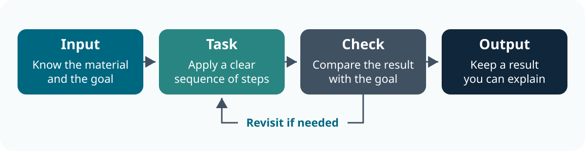

<!--
AUTHORING GUIDE — read before creating or substantially editing an episode.

Purpose and scope
- This is a scaffold for researcher-facing digital skills, data, coding and AI
  lessons. Adapt the examples to the discipline, task and learner starting point.
- For an existing episode, use the relevant patterns without replacing unrelated
  material, changing analytical assumptions or breaking embedded activities.
- Replace all MODULE TITLE, Topic and square-bracket authoring prompts before
  publishing. Keep implementation notes in comments or instructor guidance.

Lesson design
- Start with a research task and a useful output, then choose the tools to teach.
- Use 3–5 observable learning outcomes. Connect each outcome to a task or check.
- Use 10 minutes teaching per topic and five minutes per activity as the default;
  respect the user's timings and the needs of an established course.
- Keep the metadata teaching/exercise totals equal to the agenda. State breaks
  separately. Count the room report and debrief inside the activity time.
- Repeat or adapt the two topic blocks below. Do not add sections to fill space.
- When retaining filenames through a course restructure, module-number may set
  the displayed session number. Use module-hidden: true only for compatibility
  pages that remain published at an old URL but are not another course session.

HTML and slides
- In an episode, inherit the course's episodes/_metadata.yml and site theme.
  Do not paste a new theme, filter list or build configuration into every file.
- Use # for topic sections and ## for individual slides or task headings.
  A ## slide should make one main point; tables and examples should fit on it.
- Use the established callout-outcomes, callout-questions, callout-task,
  callout-keypoints and callout-hints classes. Keep fenced containers balanced.
- Use panel-tabset headings for task instructions and debriefs. These debriefs
  support teaching; tabs are not a way to hide answers in an assessment.
- Keep prose in British English. Explain unfamiliar terms and units.

Figures
- Give substantive topics a useful figure where a process, relationship or
  comparison is clearer visually. Do not add an image simply to decorate a slide.
- Prefer editable SVG for diagrams that match the existing figure system.
  Use the site's navy, teal and slate palette, readable labels and a viewBox.
- Give SVGs a title and description. Use fig-alt for alternative text in Quarto;
  the text in Markdown image brackets becomes the visible figure caption.
  Keep captions brief and make alt text describe the relationship. Explain the
  relationship in the surrounding prose too; do not rely on colour alone.
- Store episode-specific figures in its fig/ directory with descriptive names.
- The working example below lives in resources/fig/episode-workflow.svg. When
  copying this template into episodes/, copy the figure into that episode's fig/
  directory too, or replace the reference with a real, appropriate local asset.
- Use responsive percentage widths. Check readability in HTML and Revealjs;
  avoid diagrams with many small labels or text-heavy figures beside long tables.
- Use photographs, screenshots or generated raster assets only where they help
  the teaching task. Verify permissions, attribution and any sensitive content.

Activities and evidence
- Specify the goal, working arrangement, input, timed steps and output to keep.
- Include a direct room interaction: a vote, paired comparison, brief report or
  shared demonstration. State what the instructor asks and hears back.
- Provide a useful fallback for missing accounts, integrations or software.
- Label fictional data and invented outputs. Do not imply that a model was run
  or a study conducted when the example is authored for teaching.
- Distinguish source evidence, interpretation, assumptions and uncertainty.
- Give the debrief a reasoned answer and a check learners can reuse later.

Verification before publishing
- Check metadata, agenda and activity sums; inspect every figure and local link.
- Preserve existing Shiny endpoints, element IDs, scripts and other integrations.
- Verify current software, institutional and policy claims against primary sources.
- Render both HTML and Revealjs where the episode supports both. Review the
  figures and activity slides for readability; report any render limitations.
- Keep generated output out of Git. Update relevant setup, course-overview and
  instructor pages if prerequisites, coverage or delivery requirements change.
-->

::: callout-outcomes
## 💡 Learning Outcomes

- Choose [an appropriate tool or approach] for [a real research task].
- Produce [a useful artefact] using [a defined workflow].
- Check [the output] against [a source, requirement or known example].
- Explain [a decision or limitation] to a collaborator.
:::

::: callout-questions
## ❓ Questions

1. What are we trying to achieve, and what would a useful result look like?
2. Which tools and steps suit the task, material and people involved?
3. How will we check the result and explain what still needs attention?
:::

## Structure & Agenda

| Block | Teaching | Activity | What learners keep |
|---|---:|---:|---|
| Topic 1: [understand and try the workflow] | 10 min | 5 min | [First attempt and a recorded decision] |
| Topic 2: [check and improve the result] | 10 min | 5 min | [Checked output and next step] |
| **Total** | **20 min** | **10 min** | **30 min overall** |

> 🔧 Each activity includes pair work, a brief room response and a debrief. No break is included in this example agenda; add breaks explicitly when extending the lesson.

## Starting Point and Preparation

- **Starting point:** [what learners already know; explain whether coding is needed].
- **Tools and access:** [the software, accounts or integrations actually required].
- **Materials:** [a real local file, public source or clearly labelled fictional example].
- **Working arrangement:** pairs; one person operates and one checks, then swap.
- **Access fallback:** use a shared screen or instructor demonstration and record the decisions and checks.

Keep setup requirements short here and put detailed installation guidance in the course's learner setup page.

# Topic 1: [Understand and Try the Workflow]

## Begin with a Research Task

**Situation:** [describe a plausible research or professional-services task in two or three sentences].

**Goal:** [state what the learner or team needs to achieve].

**Constraint:** [name the relevant access, data, collaboration or time constraint].

**Room check:** ask learners to turn to a neighbour and name one comparable task from their own work. Take two brief examples from the room.

## Make the Workflow Visible

{fig-alt="Identify the input, carry out a task, check the result and retain an output. If the check fails, revisit the task before sharing the output." fig-align="center" width="90%"}

For this task, name **what goes in**, **what changes**, **how it is checked** and **what you keep**. Replace the general diagram with the actual workflow when that makes the relationship clearer.

> 🧭 [One practical principle learners can apply to their own work.]

## Choose an Approach

| Option | Useful when | What to check before using it |
|---|---|---|
| [Approach or tool A] | [A task or context it suits] | [Access, compatibility or source requirement] |
| [Approach or tool B] | [A different relevant context] | [A material limitation or maintenance need] |

Give a reason for the choice. Do not imply that a tool is suitable for every dataset, discipline or team.

## Work Through One Example

| Stage | What happens in the example |
|---|---|
| **Input** | [A small example learners can inspect] |
| **Action** | [The exact change or decision being demonstrated] |
| **Check** | [A visible comparison with the source or expected result] |
| **Output** | [The result and any unresolved question] |

Explain why the step is appropriate, not just which button to press. Show one likely mistake and how to recognise it.

**Room prediction:** pause before revealing the result. Ask learners to vote between two plausible outcomes, then explain the evidence that settles the question.

## Task 1: [Try the Workflow] (5 min)

::: callout-task

**Goal:** [make one focused decision or produce one small output].

**Input:** [name or link the actual example]. Work in pairs and use a practice copy.

::: panel-tabset

##### Do the Task

1. **1 min:** inspect the input and agree what success would look like.
2. **1 min:** choose the approach and record one reason for the choice.
3. **2 min:** try the demonstrated step; the partner checks the result against [a named source or requirement].
4. **1 min:** join the room debrief. Two pairs report one decision; the rest of the room compares it with their own.

**Keep:** [the actual output] and one sentence explaining your decision.

**If access fails:** inspect the instructor's example and record the proposed action and check. Note the access issue for follow-up.

##### Debrief

- **Ask the room:** “[A specific question that exposes the reasoning behind the choice.]”
- **Expected reasoning:** [state a defensible approach and why it suits the example].
- **Acceptable alternatives:** [explain which other approaches work and under what conditions].
- **Common mistake:** [name the mistake and the check that reveals it].
- **Transfer:** [one small action learners can take in their own project].
:::
:::

# Topic 2: [Check and Improve the Result]

## Inspect the Output

[Show a small result or artefact from Topic 1. Include enough context for learners to judge it.]

Ask:

- Does it answer the original question?
- Can we trace it to the input and explain what changed?
- What is missing, uncertain or still unchecked?

> 🔎 Fluent prose, tidy formatting or successful execution alone does not establish correctness.

## Compare a Weak and Stronger Example

| Weak example | Stronger example | Why the change matters |
|---|---|---|
| [An ambiguous instruction, unsupported claim or unclear output] | [A specific, checked revision] | [Explain the difference in reasoning] |
| [A missing source, role or validation step] | [The missing detail made explicit] | [Explain what another researcher can now verify] |

Label invented values or outputs as fictional. Preserve row identity, units, assumptions and scientific meaning when the example contains data.

## Plan for Collaboration and Reuse

Before another person uses the result, identify:

1. **Location:** where the authoritative version lives.
2. **Responsibility:** who checks, reviews or maintains it.
3. **Context:** which source, method, version and limitations need recording.
4. **Next step:** what can proceed and what needs further advice.

**Room question:** “What would a new collaborator misunderstand without this context?”

## Task 2: [Check and Improve the Output] (5 min)

::: callout-task

**Goal:** [identify and correct one meaningful weakness].

**Input:** [the Topic 1 output or a prepared example]. Swap the operator and checker roles.

::: panel-tabset

##### Do the Task

1. **1 min:** compare the output with [the original source, agreed requirement or known result].
2. **2 min:** make one justified improvement and record what you changed.
3. **1 min:** identify one limitation or question that remains unresolved.
4. **1 min:** vote by show of hands for [keep, revise or seek advice]. Two pairs explain their votes.

**Keep:** a checked output and a brief note: **what changed; how it was checked; what remains unresolved**.

**If the tool is unavailable:** annotate the prepared example and explain the same decision without making a live edit.

##### Debrief

- **Ask the room:** “[Which check changed your judgement, and why?]”
- **Expected correction:** [give the correction and connect it to the source evidence].
- **Limits:** [explain what this check establishes and what it cannot establish].
- **Next step:** [a realistic follow-up, resource or support route].

Do not treat all differences as errors. Distinguish a data-processing mistake from an analytical assumption or an acceptable alternative workflow.
:::
:::

<!--
OPTIONAL CODE PATTERNS

Use executable examples only when they serve the learning outcome. Replace the
small examples below with the lesson's actual task. These are non-executing syntax
examples inside an authoring comment, so the generic template does not require R
or Python to render. For a live chunk, use an executable {r} or {python} fence and
the course's existing engine conventions, then verify the result. Do not silently
replace working Python/R, Pyodide or WebR exercises.

```r
# Keep units explicit and use a small, inspectable example.
session_minutes <- c(10, 5, 10, 5)
total_minutes <- sum(session_minutes)
print(total_minutes)
```

```python
# Keep units explicit and use a small, inspectable example.
session_minutes = [10, 5, 10, 5]
total_minutes = sum(session_minutes)
print(total_minutes)
```

For either example, ask learners to predict the result before running it. Then
compare the output with the agenda rather than treating execution as the check.

OPTIONAL AI PATTERN

Use a short, task-specific addition where it is relevant. Draw principles from
courses/responsible_use_of_generative_ai/ rather than duplicating the full course:
task, context, source boundary, output format, human verification, permitted inputs
and a record of the contribution. Use public or fictional material for practice.
An authored AI-style output must be labelled as invented. Check current local,
publisher and funder requirements before making a specific policy claim.
-->

# Further Information

::: callout-keypoints

## 📚 Key Points

- [The first practical principle demonstrated in the episode.]
- [The check that makes the result trustworthy within its stated limits.]
- [The collaboration or documentation habit learners should reuse.]

:::

::: callout-hints

## 🔦 Hints

- [A useful shortcut that preserves the checking step.]
- [A common failure and a sensible troubleshooting action.]
- [Where to find support when the question exceeds the lesson's scope.]
:::

## Module Summary

[Explain what learners can now do, name the outputs they produced and identify the next useful step. Keep this to one short paragraph.]

**Next-week action:** choose one improvement from this lesson, apply it to a small real task and retain the check or decision you made.

## Additional Learning

| Resource | Use it when |
|---|---|
| [A relevant existing course or episode — add a real relative link] | [The learner needs a structured next step] |
| [Official tool or institutional guidance — add a verified link] | [The learner needs current instructions or requirements] |
| [A named support route — add a real contact or guidance link] | [The task requires specialist advice] |

Use specific primary sources and explain their relevance. Check that all local targets exist and that external guidance still supports the associated claim.
