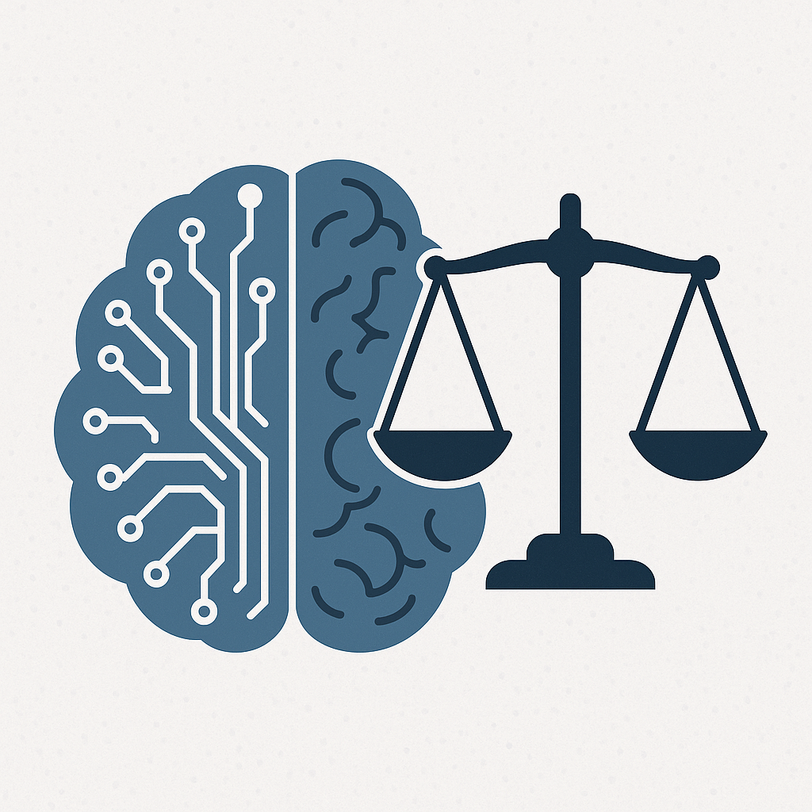
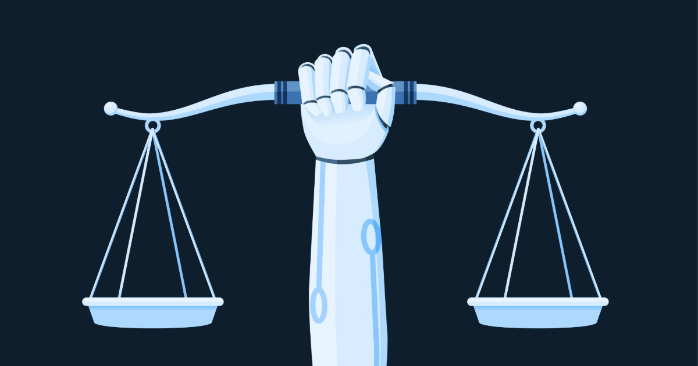

::: {.content-visible when-format="revealjs"}

<!-- Hidden by default -->


:::

::: callout-outcomes

## 💡 Learning Outcomes

- Recognise how AI and generative AI are defined and how they are applied in research, including literature search, data analysis and coding assistance.
- Identify opportunities and risks associated with using AI in research, such as efficiency, creativity, bias, hallucinations, copyright and reproducibility.
- Apply ethical principles; transparency, accountability, fairness, privacy and human oversight, when integrating AI into your workflow.
- Interpret institutional on AI authorship, disclosure and data security.
- Incorporate data security and governance considerations when using AI tools and anticipate future directions for responsible AI use.
:::

::: callout-questions

## ❓ Questions 

1. What opportunities can AI offer for research?
2. What are the main risks and challenges in using AI for research?
3. Which ethical principles should guide your use of AI in research?
4. How can frameworks and policies help govern the responsible use of AI?
:::

## Structure & Agenda

1. **Foundations and Context** – 10 teaching followed by a 5 minute poll.  
2. **Opportunities and Risks** – 10 minutes teaching followed by a 5 minute case demonstration and critique.  
3. **Ethics, Governance and Good Practice** – 10 minutes teaching followed by a 5 prompt.   
4. **AI, Data Security and Future Directions** – 10 minutes teaching followed by a 5 minute confidence poll.  

> 🔧 Four activities provide opportunities for reflection, critique and discussion.

# Note

AI was used (but not harmed) in the generation of these training materials! 

---

::: callout-task

#### Temperate Check

::: panel-tabset

##### Question

How many of you you already used Generative AI in your research? (show of hands)

:::
:::

# Foundations and Context

{fig-align="center" width="500px"}

## A Brief Origin Story: The Beginnings of AI (~1950)

- Artificial Intelligence (AI) emerged in the 1950s 
- Initial ideas were around whether machines could replicate human thought. 

> Alan Turing argued that intelligence might be understood through behaviour rather than internal processes, leading to the famous question: *Can machines think?*

## Expansion of Rule-Based AI (1960–1970)

**Early AI focused on symbolic reasoning.**  
Intelligence was treated as a problem of **logic, rules, and formal symbols**.

- Human reasoning was assumed to be **explicit and decomposable**
- Knowledge could be encoded as **if–then rules**
- Computers would outperform humans by applying rules **faster and more consistently**
 
> *If reasoning can be fully specified, it can be automated.*

## Growth of Structured Knowledge Systems

**Large, structured knowledge bases emerged.**  
Expert knowledge was represented using **rule sets, semantic networks, and frames**.

- Emphasis on capturing **specialist reasoning explicitly**
- Knowledge engineered directly into the system
- Reasoning executed by deterministic rule application

**Expert systems** became prominent as a way to formalise human expertise.

> 🧠 *Early AI treated thinking as rule-following, not pattern-learning.*

## The First AI Winter (1970–1980)

**Expert systems struggled to scale.**  
Human expertise had to be encoded manually, often as **thousands of explicit rules** for diagnosis, recommendation, or classification.

- Rule sets became increasingly **large and brittle**
- **Contradictions and edge cases** multiplied
- Maintaining internal consistency became impractical
- System performance degraded as complexity increased

>🧠 At the same time, early research into **neural networks stalled** following early mathematical criticism, accelerating the loss of confidence and funding.

## The Emergence of Machine Learning (1980–1995)

in the 80s ML emerged when researchers realised that instead of telling computers *how* to solve problems, they could let them *learn* from examples. 

**Three conditions enabled this transition:**

- **Data was being generated at scale** in science, finance, and the internet.  
- **Statistical methods improved** (e.g., Bayesian modelling, maximum likelihood).
- **Computers became fast enough** to fit models to real datasets.

> ML became the dominant paradigm because it could adapt to messy, uncertain, real-world problems.

## Core Machine Learning Approaches

 ML is based on three main approaches:

| Approach | What It Does | Typical Use Cases | Examples |
|---------|---------------|-------------------|-----------|
| **Supervised Learning** | Learns from labelled examples to predict outcomes | classification, regression | regression, random forests, SVMs |
| **Unsupervised Learning** | Finds structure in unlabelled data | clustering, dimensionality reduction | k-means, PCA, topic modelling |
| **Reinforcement Learning** | Learns actions through trial-and-error with rewards | control, optimisation, agents | Q-learning, policy gradients |

## Statistical AI → Deep Learning (1995–2010)

- In the mid 90s, research shifted toward data-driven methods, with probabilistic graphical models and support vector machines (smvs) becoming standard in scientific and industrial settings.  

- A landmark moment came in 1997 when IBM’s *Deep Blue* defeated Garry Kasparov, demonstrating the power of specialised computation and statistical optimisation. 

> 🧠 Deep learning transformed AI performance across multiple domains by learning rich features automatically.

## Deep learning → Natural Language Processing (NLP) (2000s–2016)

In the early 2000s Natural Language Processing (NLP) emerged as a field of AI that focuses on understanding and generating human language. It focused on tasks such as translation, sentiment analysis, summarisation and question answering.

```{mermaid}

graph LR
    D["Input data"]
    I["Input layer"]
    H["Hidden layer"]
    H1["Hidden layer"]
    H2["Hidden layer"]

    O["Output layer"]
    R["Output data"]

    I -->|Feed forward| O
    O -->|back-propagation| I
    D --> I
    I --> H
    H --> O
    I --> H1
    H1 --> O
    I --> H2
    H2 --> O
    O --> R
```

> Language is challenging because meaning depends on context and relationships across sentences. 

## A field ready for change (2014-2016)

Various deep learning models attempted to address the NLP problem, but these had their limitations:

- They were slow because they processed text step by step
- They had difficulty capturing long-range relationships (i.e. semantic meaning)
- They were hard to scale to large datasets

> 🔁 Researchers needed models that could look at text in larger blocks (or all at once).

## Transformers: a breakthrough architecture (2017-2020)

Transformers introduced something called self-attention, this essentially allowed models to **attend to all elements of an input simultaneously**. learning contextual relationships across the entire sequence.

> 🚀 This unlocked large-scale training and dramatically improved performance across language, vision and multimodal tasks.

## Example

```{mermaid}

sequenceDiagram
    participant U as Prompt
    participant M as LLM
    U->>M: Provide prompt
    M->>M: Compute attention
    M->>U: Output token
    loop Generation
        M->>M: Update context
        M->>U: Emit next token
    end
```

## The cogs behind Generative AI

By predicting the most likely next token from prior context, transformers learn statistical patterns that can be reused across tasks, enabling flexible inference beyond simple memorisation.

> ✨ Given a large enough training set, this allows them to generate responses the appear thougtful. 

## Transformers →  Foundation Models (2020)

**Scaling laws reshape AI research**  
Transformers trained through self-supervision on very large large datasets have emerged as the most common general-purpose models capable of adaptation across diverse tasks.

| Property | Description |
|---------|-------------|
| Scale | Trained on trillions of tokens |
| Generality | Perform across domains |
| Transferability | Effective adaptation with small datasets |

> 🧠 What we think of as AI now are essentially just massive transformer based models.

## From Scale to Generality (2020–present)

- **2020**: **GPT-3** (~175B parameters)  
  First truly large-scale autoregressive model demonstrating broad, task-agnostic capabilities.
- **2021**: **PaLM** (~540B parameters)  
  Empirical validation of scaling laws, with notable gains in multilingual performance and reasoning.
- **2023**: **GPT-4**, **Claude**, **Gemini** (parameter counts undisclosed but likely Trillion-scale)  
  Shift toward multimodality, alignment, safety, and system-level optimisation rather than raw scale alone.
- **2024–2025**: **Mixture-of-Experts and hybrid systems**  
  Trillion-scale *effective* capacity via sparse activation, retrieval-augmented generation, and domain-specialised models.

> 🚀 *Foundation models marked a transition from task-specific AI systems to general-purpose computational platforms.*

## Summary

AI began with rules but moved toward learning. Deep learning enabled rich representations, and sequence models advanced language processing. Transformers removed key bottlenecks, allowing the creation of foundation models and LLMs.

Big shift now is on optimisation as running large models is expensive! 

> 🌐 Modern generative AI is the result of many incremental breakthroughs.

---

::: callout-task

#### Poll: Which AI tools have you used?

::: panel-tabset

##### Question

Fill in the following questionaire: 

::: {.content-visible when-format="revealjs"}

<!-- Hidden by default -->


:::

##### Results

<iframe
  src="https://ds-shiny-helper.azurewebsites.net/edsex1/?embed=true#shiny-tab-q1_results"
  width="100%"
  height="500"
  frameborder="0"
  style="border:none;"
  title="Q1">
</iframe> 
:::
:::

# 1. Opportunities

{fig-align="center" width="400px"}

## AI as a structural shift in research practice

Generative AI represents a structural change in research by **compressing intellectual labour** associated with drafting, synthesis, translation, and technical scaffolding.  

Rather than replacing expertise, it reallocates researcher effort from **production** to **evaluation, verification, and judgement**.

> The key transformation is therefore epistemic rather than technical: researchers are increasingly positioned as *editors of reasoning* rather than sole producers of intermediate artefacts.

## Compression of the research lifecycle

AI-enabled workflows can collapse traditionally sequential stages of research, reducing temporal distance between ideation, analysis, and dissemination.

```{mermaid}

graph LR
  A["Question framing"] --> B["Evidence synthesis"]
  B --> C["Analysis & modelling"]
  C --> D["Dissemination"]
  A -. "AI-assisted shortcuts" .-> C
  B -. "AI-assisted drafting" .-> D

```

> This compression increases throughput but reduces natural pauses for critical reflection, peer discussion, and methodological reconsideration. Opportunities therefore emerge only when deliberate checkpoints are reintroduced.

## Where genuine opportunities arise

Opportunities from AI in research are best understood as **capacity multipliers**

Common high‑value gains include:

- rapid orientation in unfamiliar or interdisciplinary literatures  
- broader exploration of methodological or analytical alternatives  
- reduced time spent on repetitive technical boilerplate (e.g. code scaffolds, formatting)  
- improved accessibility and clarity of written communication  
- faster iteration during early exploratory phases  

> These benefits are particularly significant in environments characterised by limited time, high cognitive load, or interdisciplinary translation.

## Expansion of exploratory space

AI can increase the *breadth* of exploration by lowering the cost of asking “what if?” questions, it can:

- Recomend alternative methods
- Perform sensitivity analyses  
- Reframe research questions  
- Offer alternative explanatory narratives  

> This can improve robustness *if* exploration is paired with explicit selection criteria and validation.

## A simple research risk matrix

| Scenario | Typical risk level | Why |
|---|---|---|
| summarising a public guidance page for personal notes | low | public source, easy to verify |
| generating boilerplate code against toy data | low to medium | technical errors still possible |
| comparing unpublished drafts across collaborators | medium | confidentiality and attribution issues |
| analysing identifiable participant material in a public tool | high | ethics, governance and disclosure failure |
| asking AI to produce findings or conclusions from your data | high | interpretation and accountability risk |

The point is not to ban AI in difficult areas. It is to match the tool, safeguards and review burden to the stakes.

## Accessibility and inclusion

When used carefully, AI can also support:

- clearer expression for non‑native speakers  
- improved readability for diverse audiences  
- translation across disciplinary vocabularies  
- structured drafting for early‑career researchers  

> These gains offer both social and pedagogical impact, not merely technical.

---

::: callout-task

#### Task: risk relocation audit (5 minutes)

**Plenary Discussion:**

For each research stages State how AI could reduce effort at that stage. Can you also identify potential **risks** of the approach? 

  - Hypothesis generation 
  - analysis and interpretation
  - dissemination.  

:::

# Ethics, Governance and Academic Integrity

{fig-align="center" width="400px"}

## The condition for opportunity: retained ownership

AI‑enabled capacity is valuable only when the researcher retains ownership of:

- assumptions  
- analytical choices  
- interpretation  
- uncertainty  

> Where ownership is ceded, opportunity are rapidly converted into risks. 

## Capacity gain requires explicit control mechanisms

Effective use of AI in research therefore requires intentionally designed safeguards:

- Define the research question and assumptions before using AI
- treat AI outputs as hypotheses, not evidence
- verify all claims against primary sources
- map key claims directly to results

> Opportunity only scales with *control*. Speed without control does not create research value.

## Why governance is now a research necessity

Generative AI makes it easier for substantive contributions to be produced rapidly and invisibly: 

```{mermaid}

flowchart LR
  A["AI-assisted contribution"] 
  B["Research output"]
  C["Claim"]
  C1["method"]
  C2["interpretation"]
  D["Researcher accountability"]

  A --> B --> C --> D
  B --> C1 --> D
  B --> C2 --> D
```

> This strains established norms around **authorship, contribution, provenance, and accountability**.

## False authorship: the institutional framing

Most universities, including the University of Nottingham, explicitly treats unpermitted or unacknowledged AI assistance as **false authorship**, regardless of intent.

This includes AI contribution to:

- text and argumentation
- code and analysis outputs
- images, figures, or other generated artefacts

> It is your responsibility to disclose the use of AI in reasearch.  

## Permission is contextual, not assumed

AI acceptability varies by:

- assessment instructions
- discipline norms
- collaboration agreements
- funder/publisher expectations

> The governance principle: **permission must be explicit**; ambiguity is risk.

## Accountability: what must remain human

The researcher must be able to:

1. justify key assumptions
2. reproduce results
3. defend claims against evidence
4. describe limitations and uncertainty

> AI can assist, but as a tool, cannot carry responsibility for the quality of research.

## Transparency and traceability as research norms

Traceability aligns with established research integrity practices.

| What must be transparent | Why it matters |
|---|---|
| Tool(s) and version(s) | provenance and reproducibility |
| Where AI influenced decisions | auditability of reasoning |
| What was verified (and how) | defensible claims |
| What was not verified | honest uncertainty |

## Contribution boundaries: editing vs substantive generation

A recurring problem is distinguishing *language editing* (clarity, structure) from *substantive contribution* (ideas, methods, claims, interpretation)

```{mermaid}

flowchart TB
  A[Surface editing] --> A1[grammar, clarity]
  B[Structural shaping] --> B1[outline, framing]
  C[Substantive contribution] --> C1[ideas, claims, methods]
  D[Credentialed output] --> D1[assessment/publication]

  style A stroke-width:3px
  style B stroke-width:3px
  style C stroke-width:3px
  style D stroke-width:3px
```

## Integrity risks that look “benign”

Research-relevant risks often arise from normal workflow choices:

- Accepting a polished paragraph without mapping claims to results
- Adopting analytic code without validation
- Using a summary that narrows the literature space prematurely

> Failing to disclose material AI contribution where required may seem minor, but can have significant ethical and governance implication. 

## What good disclosure achieves

Disclosure is not a punishment; it enables:

- clearer attribution of intellectual work
- defensible scholarship
- auditability and reproducibility
- trust within teams and with audiences

> You make a claim? Was AI involved? If Yes, keep an audit of how its involved and disclose it! 

---

::: callout-task

#### Task: Worked example for direct critique (AI-assisted, method-agnostic, 5-minute discussion)

The Following Method was produced using AI:

***“Data will be analysed using to identify informative variables. Variables meeting a predefined relevance threshold will be retained. Cases showing minimal contribution will be excluded and the the top 25 highest-ranked variables will be taken forward for interpretation and reporting.”***

1. What would count as substantive contributions in this artefact?
2. What would need to be disclosed as AI materially contributed?
:::


# Data Security and the Research Threat

{fig-align="center" width="400px"}

## Why AI materially changes research data risk

Many AI tools operate outside institutional infrastructure and governance controls.  
This transforms routine academic actions (summarising notes, refining code, drafting interpretation) into potential **boundary-crossing events** that may bypass established safeguards.

```{mermaid}

flowchart TB
  B["Routine academic task"]
  C["External AI service"]
  D["Loss of control"]

  B --> C
  C --> D

  D --> E["Unclear retention"]
  D --> F["Jurisdictional uncertainty"]
  D --> G["Secondary use risk"]

  style C stroke-width:3px
  style D stroke-width:3px
```

> The dominant risk is not malicious intent but **loss of visibility and control** once material leaves institutional systems.

## What “data” means in AI-mediated research

In AI-assisted workflows, “data” includes any material that encodes research context, insight, or trajectory, not only formal datasets:

- unpublished results, figures, and intermediate tables  
- qualitative notes, transcripts, annotations, and field diaries  
- grant drafts, reviewer responses, and collaboration documents  
- code containing credentials, endpoints, or infrastructure details  
- metadata that reveals study design, populations, or timing  

> Much of this material is *informally handled* but *formally sensitive*.

## High-risk material: common categories

| Category | Examples | Why high risk |
|---|---|---|
| Personal / sensitive | clinical, genetic, geolocation | legal and ethical obligations |
| Qualitative text | interviews, free text, notes | re-identification risk |
| Unpublished work | manuscripts, result tables | premature disclosure |
| IP / commercial | methods, pipelines, agreements | loss of competitive advantage |
| Security material | tokens, keys, internal URLs | direct compromise |

> Risk frequently arises from **aggregation**, not single items.

## De-identification is not a sufficient safeguard

Removing explicit identifiers does not eliminate disclosure risk.  
Residual risk persists through rare attribute combinations, contextual cues in narrative text, small-n summaries, or linkage with external information.

> The practical implication is operational rather than theoretical:  
*“Anonymised” does not mean “safe to upload.”*

## AI systems as unregulated collaborators

A useful governance analogy is to treat external AI services as collaborators who have:

- no contract  
- no ethics approval  
- no data-sharing agreement  
- no enforceable deletion or confidentiality guarantees  

> This framing clarifies why **minimum necessary disclosure** is a defensible default.

## Jurisdiction, retention, and opacity

From a research governance perspective, unresolved questions include:

1. where prompts and uploads are processed and stored  
2. how long material is retained  
3. whether content is reused for model improvement  
4. whether third parties (plugins, analytics, telemetry) have access  

> Uncertainty itself constitutes a risk factor when handling sensitive research material.

## Behavioural drift as a security threat

Risk is not only technical; it is behavioural.  
Convenience can normalise incremental risk-taking without explicit decision points.

```{mermaid}

flowchart LR
    A["Normal research task"] --> B["Convenient AI use"] --> C["Reduced deliberation"] --> D["Normalised exposure"] --> E["Elevated risk"]
  style E stroke-width:3px
```

> This form of “quiet drift” is harder to detect than discrete policy violations.

## Practical implication for researchers

A simple operational test:

> *Would I be permitted to email this material to an external collaborator without a formal agreement?*

If not, it should not be shared with an external AI service. Check with your organisation directly if there are local / secure versions of these tools avalible for you to use. 


# Further Information

::: callout-keypoints

## 🔦 Key points

AI supports research via literature search, coding, analysis and translation, but outputs may be biased, incorrect or insecure.

- Key opportunities: efficiency, creativity, hypothesis generation and reduced repetitive workload.

- Main risks: hallucinations, bias, plagiarism, copyright/IP issues, data breaches and loss of critical skills.

- Ethical use requires transparency, accountability, fairness, privacy, and disclosure—AI is never an author.

> Use secure, approved tools; avoid sensitive data sharing; follow institutional, funder and publisher policies.
:::

::: callout-hints

## 📚 Additional Reading

- **University guidance on AI:** [UoN guidance](https://www.nottingham.ac.uk/studyingeffectively/studying/ai.aspx) summarises definitions, permitted uses and academic integrity expectations.  
- **Publisher policies:** [Nature editorial](https://www.nature.com/articles/d41586-023-00191-1) explains why LLMs cannot be credited as authors and when to document AI use.  
- **Living guidelines:** The European Research Area’s living guidelines on generative AI provide best‑practice recommendations [Swedish Research Council news](https://www.vr.se/english/just-now/news/news-archive/2024-04-09-new-guidelines-for-using-ai-in-europe.html).  
- **Microsoft responsible AI:** [AzureMentor blog](https://azurementor.wordpress.com/2024/03/08/the-6-microsoft-responsible-ai-principles-explained/) explains the six pillars of Microsoft’s responsible AI framework.  
- **Generative AI ethics:** [TechTarget article](https://www.techtarget.com/searchenterpriseai/tip/Generative-AI-ethics-8-biggest-concerns) lists ethical concerns and risks of generative AI.    
:::