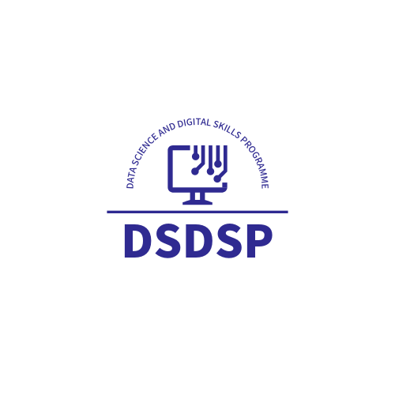

# Essential digital skills {background="#43464B"}

<

------------------------------------------------------------------------

# Module Introduction

## What is DSDSP?

-   Structured training programme for digital skills
-   Emphasis on reproducible, collaborative, policy-aligned research

::: callout-note
**Activity:** *“What’s one digital skill or tool you want to develop this year?”*
:::

::: notes
Welcome the group.

Introduce yourself!

Introduce the DSDSP programme
:::

------------------------------------------------------------------------

# What to Expect from this course

## Core Components:

-   Esential Digital Skills (All students)
-   Applied or theoretical programming (optional) 
-   Advanced training in domain specific skills (optional) 

**Activity:** *“What training do you think you need for your research needs?”*

::: notes
Welcome the group.

Introduce yourself!

Introduce the DSDSP programme
::: 

------------------------------------------------------------------------

# Institutional Systems

## Microsoft 365 Tools

-   **Word/Excel**: Templates, track changes
-   **Teams**: Collaboration and meetings
-   **OneDrive**: Sync and share research files

## University Platforms

-   **UniCore**: HR, project finances
-   **RIS**: Research profile and outputs

::: callout-tip
**Activity:** Pair Matching Match example tasks to the appropriate system (UniCore, Teams, OneDrive, RIS).
:::

------------------------------------------------------------------------

# Research Identity

## Persistent Profiles

-   **ORCID**: Universal researcher ID
-   **Scopus/Google Scholar**: Track citations

## Importance

-   Ensures attribution
-   Enhances discoverability

::: callout-note
**Activity:** Self-audit Update ORCID and RIS profiles.
:::

------------------------------------------------------------------------

# Tools for Coding

## Types of Tools

-   **IDEs**: VS Code, RStudio
-   **Statistical environments**: R, Python
-   **Version control**: Git/GitHub
-   **Package managers**: pip, conda, renv
-   **Databases**: SQL, MongoDB

::: callout-tip
**Activity:** Prompt Testing Try: *“Summarise this abstract”* in ChatGPT and critique the output.
:::

------------------------------------------------------------------------

# Linked Training

## Complementary Resources

-   Microsoft 365 training
-   RIS: Worktribe guidance
-   Intro to GitHub, VS Code, Jupyter

## Mandatory (if applicable)

-   Info Compliance (PGTA)
-   Digital Accessibility core training

[Microsoft 365 Resources](https://support.microsoft.com/en-us/training)

[UniCore Training](https://universityofnottingham.ac.uk/unicore)

[GitHub & VS Code Workshop](https://github.com/UoNtraining/workshops)

------------------------------------------------------------------------

# Summary

-   Understand institutional platforms and tools
-   Maintain research identity
-   Adopt coding best practices
-   Explore linked training

*Thank you – move on to Module 2: Data Governance & Policy*