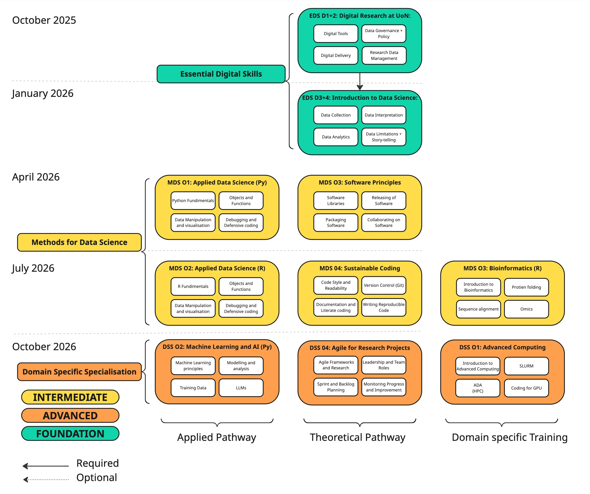

:::{.column-body}
<
:::

## About

The **Data Science & Digital Skills Programme (DS&DS)** is a tiered, in‑person training pathway at the University of Nottingham designed to build core digital competencies, data literacy, and research software skills for modern, reproducible, data-intensive research. It supports doctoral researchers in progressing from foundational fluency to domain-specific expertise.

<

::: {.panel-tabset}

### Programme Materials

**Essential Digital Skills (EDS)** is the foundation tier of DS&DS. It establishes baseline competence in:

- **Computational Environment & Tools**
- **Reproducible Workflows**
- **Research Data Management**
- **Collaboration & Open Scholarship**

👉 [Access EDS programme](essential_digital_skills/index.html)

---

### Structure

DS&DS spans three tiers, aligned with institutional priorities in open science and research integrity.

These are:

- **Foundation** – *Essential Digital Skills* (Year 1, mandatory)
- **Intermediate** – *Methods for Data Science* (Year 2+, optional)
- **Advanced** – *Domain-Specific Specialisations* (tailored)

This progression builds confidence and research-ready capability at every stage.

---

### Delivery

The programme is modular and primarily in-person:

- **Year 1**: Core skills workshops (EDS)
- **Year 2**: Optional intermediate/advanced modules
- Cohort delivery initially for the BBSRC DTP (2025)

All materials are developed for reuse and open dissemination.

:::

## Curriculum & Outcomes

Participants will:

- Manage data using FAIR principles
- Build reproducible pipelines (Git, Quarto, Jupyter)
- Analyse data with statistical and domain-relevant tools
- Document and share research outputs openly
- Operate within governance and policy frameworks

All materials are shared openly via GitHub, with linked workshops and exercises.

## Participants

- Open to BBSRC doctoral researchers at Nottingham
- Designed for those with some / no prior coding experience
- Delivered in inclusive, discipline-agnostic format
- Encourages peer-led learning and shared practice

Progression is supported via optional pathways following completion of the foundation modules.

## Contact

- Programme Lead: *Dr. Thomas Giles*  
- Email: **tom.giles@nottingham.ac.uk**  

For registration, accessibility, or module questions, please contact the DS&DS team directly.

---
